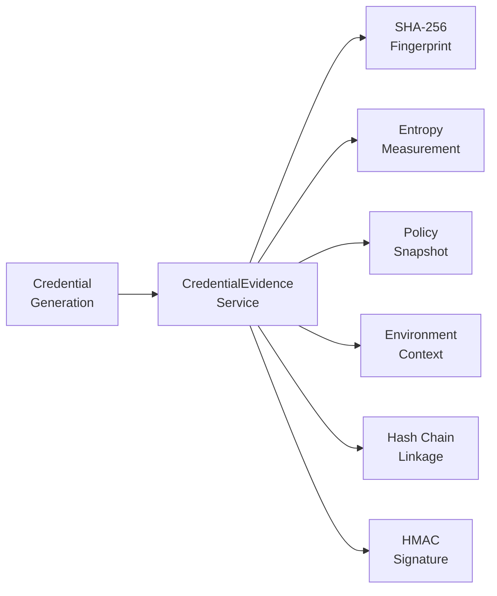

# DATACENDIA API DOCUMENTATION
**Version:** 5.0  
**Base URL:** `http://localhost:3001/api/v1`  
**Last Updated:** April 15, 2026

---

## WHAT THIS IS

This document explains how to use the Datacendia API. The API lets you:
- Create AI-powered deliberations with the AI Council
- Manage decisions, workflows, and governance
- Access enterprise connectors and integrations
- Monitor platform health and security
- Enforce compliance across 73+ frameworks
- Manage credential evidence and cryptographic proofs
- Operate sovereign/air-gapped deployments
- Generate forensic-grade audit packages

**Authentication:** Most endpoints require a JWT token obtained from `/auth/login`

---

## QUICK START

### 1. Login
```bash
POST /api/v1/auth/login
Content-Type: application/json

{
  "email": "your-email@company.com",
  "password": "your-password"
}

Response:
{
  "success": true,
  "data": {
    "accessToken": "eyJhbGc...",
    "refreshToken": "eyJhbGc...",
    "user": { "id": "...", "email": "..." }
  }
}
```

### 2. Use Token in Requests
```bash
GET /api/v1/auth/me
Authorization: Bearer eyJhbGc...
```

---

## CORE ENDPOINTS

### Authentication

| Method | Endpoint | Description | Auth Required |
|--------|----------|-------------|---------------|
| POST | `/auth/login` | Login with email/password | No |
| POST | `/auth/refresh` | Refresh access token | No |
| GET | `/auth/me` | Get current user | Yes |
| POST | `/auth/logout` | Logout | Yes |

### Council & Deliberations

| Method | Endpoint | Description | Auth Required |
|--------|----------|-------------|---------------|
| GET | `/council/agents` | List all AI agents | Yes |
| POST | `/council/deliberate` | Start new deliberation | Yes |
| GET | `/deliberations` | List deliberations | Yes |
| GET | `/deliberations/:id` | Get specific deliberation | Yes |
| POST | `/deliberations/:id/start` | Start pending deliberation | Yes |

### Decisions

| Method | Endpoint | Description | Auth Required |
|--------|----------|-------------|---------------|
| GET | `/decisions` | List all decisions | Yes |
| POST | `/decisions` | Create new decision | Yes |
| GET | `/decisions/:id` | Get specific decision | Yes |
| PUT | `/decisions/:id` | Update decision | Yes |
| POST | `/decisions/:id/sign` | Sign decision | Yes |

### Enterprise Connectors

| Method | Endpoint | Description | Auth Required |
|--------|----------|-------------|---------------|
| GET | `/enterprise-connectors/list` | List available connectors | Yes |
| GET | `/enterprise-connectors/:id` | Get connector details | Yes |
| POST | `/enterprise-connectors/:id/oauth/authorize` | Get OAuth URL | Yes |
| POST | `/enterprise-connectors/:id/oauth/callback` | Handle OAuth callback | Yes |
| POST | `/enterprise-connectors/:id/connect` | Connect to service | Yes |
| POST | `/enterprise-connectors/:id/fetch` | Fetch data | Yes |

### Health & Monitoring

| Method | Endpoint | Description | Auth Required |
|--------|----------|-------------|---------------|
| GET | `/health` | System health status | No |
| GET | `/metrics` | Prometheus metrics | No |
| GET | `/i18n/languages` | List supported languages | No |
| GET | `/integrations` | List available integrations | No |

---

## ENTERPRISE PLATINUM ENDPOINTS (New - February 2026)

### AI Constitutional Court (`/constitutional-court`)

| Method | Endpoint | Description | Auth Required |
|--------|----------|-------------|---------------|
| GET | `/constitutional-court/health` | Service health | No |
| GET | `/constitutional-court/principles` | List constitutional principles | Yes |
| POST | `/constitutional-court/disputes` | File a new dispute | Yes |
| GET | `/constitutional-court/disputes/:id` | Get dispute details | Yes |
| POST | `/constitutional-court/disputes/:id/schedule-hearing` | Schedule hearing | Yes |
| POST | `/constitutional-court/disputes/:id/deliberate` | Run deliberation | Yes |
| POST | `/constitutional-court/disputes/:id/opinion` | Draft opinion | Yes |
| POST | `/constitutional-court/disputes/:id/resolve` | Resolve dispute | Yes |
| POST | `/constitutional-court/disputes/:id/appeal` | File appeal | Yes |
| GET | `/constitutional-court/precedents/search` | Search precedent database | Yes |

### Regulatory Sandbox (`/regulatory-sandbox`)

| Method | Endpoint | Description | Auth Required |
|--------|----------|-------------|---------------|
| GET | `/regulatory-sandbox/health` | Service health | No |
| GET | `/regulatory-sandbox/regulations` | List proposed regulations | Yes |
| GET | `/regulatory-sandbox/regulations/:id` | Get regulation details | Yes |
| POST | `/regulatory-sandbox/tests` | Create compliance test | Yes |
| POST | `/regulatory-sandbox/tests/:id/run` | Run test against system | Yes |
| GET | `/regulatory-sandbox/timeline` | Get regulatory timeline | Yes |

### Zero-Knowledge Proofs (`/zkp`)

| Method | Endpoint | Description | Auth Required |
|--------|----------|-------------|---------------|
| GET | `/zkp/health` | Service health | No |
| GET | `/zkp/proof-types` | List available proof types | Yes |
| POST | `/zkp/proofs/request` | Request new proof | Yes |
| POST | `/zkp/proofs/:id/generate` | Generate proof | Yes |
| POST | `/zkp/proofs/:id/verify` | Verify proof | Yes |
| POST | `/zkp/proofs/:id/revoke` | Revoke proof | Yes |
| GET | `/zkp/certificates` | List certificates | Yes |

### AI Insurance (`/ai-insurance`)

| Method | Endpoint | Description | Auth Required |
|--------|----------|-------------|---------------|
| GET | `/ai-insurance/health` | Service health | No |
| GET | `/ai-insurance/coverage-types` | List coverage types | Yes |
| POST | `/ai-insurance/quotes` | Request insurance quote | Yes |
| POST | `/ai-insurance/policies` | Bind new policy | Yes |
| GET | `/ai-insurance/policies/:id` | Get policy details | Yes |
| POST | `/ai-insurance/policies/:id/cover-decision` | Cover specific decision | Yes |
| POST | `/ai-insurance/claims` | File claim | Yes |
| GET | `/ai-insurance/claims/:id` | Get claim status | Yes |
| GET | `/ai-insurance/certificates/:id/verify` | Verify coverage certificate | Yes |

### Post-Quantum Cryptography (`/post-quantum`)

| Method | Endpoint | Description | Auth Required |
|--------|----------|-------------|---------------|
| GET | `/post-quantum/health` | Service health | No |
| GET | `/post-quantum/algorithms` | List supported algorithms | Yes |
| GET | `/post-quantum/recommend/:useCase` | Get algorithm recommendation | Yes |
| POST | `/post-quantum/keys` | Generate key pair | Yes |
| GET | `/post-quantum/keys` | List keys | Yes |
| POST | `/post-quantum/keys/:id/rotate` | Rotate key | Yes |
| POST | `/post-quantum/sign` | Sign data | Yes |
| POST | `/post-quantum/verify` | Verify signature | Yes |

### Carbon-Aware Scheduling (`/carbon-aware`)

| Method | Endpoint | Description | Auth Required |
|--------|----------|-------------|---------------|
| GET | `/carbon-aware/health` | Service health | No |
| GET | `/carbon-aware/intensity` | Get all region intensities | Yes |
| GET | `/carbon-aware/intensity/:region` | Get region intensity | Yes |
| POST | `/carbon-aware/workloads` | Submit workload | Yes |
| POST | `/carbon-aware/workloads/:id/schedule` | Schedule with optimization | Yes |
| POST | `/carbon-aware/workloads/:id/execute` | Execute workload | Yes |
| GET | `/carbon-aware/budget/:orgId` | Get carbon budget | Yes |
| GET | `/carbon-aware/report/:orgId` | Generate carbon report | Yes |

### Continuous Compliance Monitor (`/compliance-monitor`)

| Method | Endpoint | Description | Auth Required |
|--------|----------|-------------|---------------|
| GET | `/compliance-monitor/health` | Service health | No |
| GET | `/compliance-monitor/frameworks` | List supported frameworks | Yes |
| POST | `/compliance-monitor/initialize` | Initialize framework controls | Yes |
| POST | `/compliance-monitor/scan` | Run compliance scan | Yes |
| GET | `/compliance-monitor/controls/:orgId/:framework` | Get controls | Yes |
| GET | `/compliance-monitor/drifts` | Get recent drifts | Yes |
| GET | `/compliance-monitor/alerts/:orgId` | Get alerts | Yes |
| POST | `/compliance-monitor/alerts/:id/acknowledge` | Acknowledge alert | Yes |
| POST | `/compliance-monitor/alerts/:id/resolve` | Resolve alert | Yes |

### Cross-Jurisdiction Engine (`/cross-jurisdiction`)

| Method | Endpoint | Description | Auth Required |
|--------|----------|-------------|---------------|
| GET | `/cross-jurisdiction/health` | Service health | No |
| GET | `/cross-jurisdiction/jurisdictions` | List all jurisdictions | Yes |
| GET | `/cross-jurisdiction/jurisdictions/:id` | Get jurisdiction profile | Yes |
| POST | `/cross-jurisdiction/assess-transfer` | Assess cross-border transfer | Yes |
| POST | `/cross-jurisdiction/compliance-matrix` | Generate compliance matrix | Yes |
| POST | `/cross-jurisdiction/detect-conflicts` | Detect regulatory conflicts | Yes |
| POST | `/cross-jurisdiction/data-residency` | Get data residency rules | Yes |

### Sovereign Architecture (`/sovereign-arch`) — 11 Patterns

| Prefix | Service | Key Endpoints |
|--------|---------|---------------|
| `/sovereign-arch/diode` | Data Diode | `POST /ingest`, `GET /quarantine`, `POST /release` |
| `/sovereign-arch/rlhf` | Local RLHF | `POST /feedback`, `POST /dataset/generate`, `POST /train` |
| `/sovereign-arch/dna` | Decision DNA | `POST /export`, `GET /packets`, `GET /packets/:id` |
| `/sovereign-arch/shadow` | Shadow Council | `POST /sessions`, `GET /sessions/:id`, `POST /sessions/:id/deliberate` |
| `/sovereign-arch/replay` | Deterministic Replay | `POST /capture`, `POST /replay`, `GET /states` |
| `/sovereign-arch/qr` | QR Air-Gap Bridge | `POST /encode`, `POST /decode`, `GET /sequences` |
| `/sovereign-arch/canary` | Canary Tripwires | `POST /deploy`, `GET /tripwires`, `GET /alerts` |
| `/sovereign-arch/tpm` | TPM Attestation | `POST /sign`, `POST /verify`, `GET /keys` |
| `/sovereign-arch/timelock` | Time-Lock | `POST /lock`, `POST /unlock`, `GET /locks` |
| `/sovereign-arch/mesh` | Federated Mesh | `POST /submit`, `POST /aggregate`, `GET /nodes` |
| `/sovereign-arch/portable` | Portable Instance | `POST /generate`, `GET /configs` |

### CendiaCascade™ — Butterfly Effect (`/cascade`)

| Method | Endpoint | Description | Auth Required |
|--------|----------|-------------|---------------|
| GET | `/cascade/status` | Service health + graph stats | No |
| POST | `/cascade/analyze` | Analyze a proposed change | Yes |
| GET | `/cascade/reports/:id` | Get report details | Yes |
| GET | `/cascade/reports/:id/export/executive` | Boardroom-ready export | Yes |
| GET | `/cascade/reports/:id/explain/:nodeId` | Explainability per consequence | Yes |
| POST | `/cascade/reports/:id/validate-constraints` | Policy no-go line check | Yes |
| GET | `/cascade/reports/:id/governance` | Audit trail & approval status | Yes |
| GET | `/cascade/reports/:id/timeline` | Timeline visualization | Yes |
| GET | `/cascade/reports/:id/evidence` | Evidence bundle | Yes |
| POST | `/cascade/graph/load` | Load organization graph | Yes |
| POST | `/cascade/demo/load-sample` | Load sample graph | Yes |

### CendiaLens™ — AI Interpretability (`/lens`)

| Method | Endpoint | Description | Auth Required |
|--------|----------|-------------|---------------|
| GET | `/lens/health` | Service health | No |
| POST | `/lens/analyze` | Run interpretability analysis | Yes |
| GET | `/lens/analysis/:id` | Get specific analysis | Yes |
| GET | `/lens/analyses` | List recent analyses | Yes |
| GET | `/lens/analysis/:id/visualization` | Export for visualization | Yes |
| POST | `/lens/compare` | Compare two analyses | Yes |

### Defense & National Security (`/defense`)

| Method | Endpoint | Description | Auth Required |
|--------|----------|-------------|---------------|
| GET | `/defense/agents` | List defense agents (24 total) | Yes |
| GET | `/defense/council-modes` | List council modes (35 total) | Yes |
| POST | `/defense/deliberate` | Run defense deliberation | Yes |
| GET | `/defense/compliance` | Compliance status (FedRAMP/CMMC/ITAR) | Yes |

### Sports/Football Vertical (`/sports`)

| Method | Endpoint | Description | Auth Required |
|--------|----------|-------------|---------------|
| GET | `/sports/agents` | List sports agents (10 total) | Yes |
| GET | `/sports/agents/:agentId` | Get specific agent | Yes |
| GET | `/sports/agents/workflow/:workflow` | Get agents for workflow | Yes |
| POST | `/sports/agents/:agentId/prompt` | Generate agent prompt | Yes |
| GET | `/sports/workflows` | List workflows (8 total) | Yes |
| GET | `/sports/knowledge/status` | Knowledge base status | Yes |
| POST | `/sports/knowledge/query` | Query sports knowledge base | Yes |
| GET | `/sports/knowledge/provenance` | Citation provenance | Yes |

### Visualization (`/visualization`)

| Method | Endpoint | Description | Auth Required |
|--------|----------|-------------|---------------|
| GET | `/visualization/deliberation/:id` | Live deliberation graph | Yes |
| GET | `/visualization/replay/:id` | Decision replay timeline | Yes |

### Adversarial Red Team (`/adversarial-redteam`)

| Method | Endpoint | Description | Auth Required |
|--------|----------|-------------|---------------|
| POST | `/adversarial-redteam/sessions` | Start red team session | Yes |
| GET | `/adversarial-redteam/sessions/:id` | Get session results | Yes |
| GET | `/adversarial-redteam/perspectives` | List 8 attack perspectives | Yes |

### Regulator's Receipt (`/regulators-receipt`)

| Method | Endpoint | Description | Auth Required |
|--------|----------|-------------|---------------|
| POST | `/regulators-receipt/generate` | Generate forensic-grade, independently verifiable receipt | Yes |
| GET | `/regulators-receipt/:id` | Get receipt details | Yes |
| GET | `/regulators-receipt/:id/verify` | Verify Merkle tree integrity | Yes |

### CendiaVault — Sovereign Storage (`/sovereign/vault`)

| Method | Endpoint | Description | Auth Required |
|--------|----------|-------------|---------------|
| POST | `/sovereign/vault/upload` | Upload file to vault (multipart) | Yes |
| GET | `/sovereign/vault/download` | Download file from vault | Yes |
| GET | `/sovereign/vault/list` | List vault files | Yes |
| DELETE | `/sovereign/vault/delete` | Delete vault file | Yes |
| GET | `/sovereign/vault/health` | Vault health check | No |

### Credential Evidence (`/credential-evidence`) — NEW Apr 2026

Proof-at-creation records for every generated credential. SOC 2, HIPAA, NIST compliance.



| Method | Endpoint | Description | Auth Required |
|--------|----------|-------------|---------------|
| GET | `/credential-evidence/health` | Service health | No |
| GET | `/credential-evidence/policies` | List all 15 credential type policies | No |
| GET | `/credential-evidence/policies/:type` | Get policy for specific type | No |
| GET | `/credential-evidence/records` | Query evidence records (filter by type, userId) | Yes |
| GET | `/credential-evidence/verify-chain` | Verify hash chain integrity | Yes |
| GET | `/credential-evidence/stats` | Compliance dashboard stats | Yes |
| GET | `/credential-evidence/export` | Full audit package for external auditors | Yes |

### Multi-Factor Authentication (`/mfa`)

| Method | Endpoint | Description | Auth Required |
|--------|----------|-------------|---------------|
| GET | `/mfa/setup` | Initialize MFA — generate TOTP secret + QR code | Yes |
| POST | `/mfa/enable` | Verify code and enable MFA | Yes |
| POST | `/mfa/verify` | Verify MFA code during login | No (temp token) |
| POST | `/mfa/verify-backup` | Verify using backup code | No (temp token) |
| DELETE | `/mfa/disable` | Disable MFA | Yes |
| POST | `/mfa/regenerate-backup` | Generate new backup codes | Yes |

### Hardware Security Module (`/hsm`)

| Method | Endpoint | Description | Auth Required |
|--------|----------|-------------|---------------|
| GET | `/hsm/health` | Service health | No |
| GET | `/hsm/status` | HSM adapter status | No |
| POST | `/hsm/initialize` | Initialize HSM adapter | Yes |
| POST | `/hsm/keys` | Generate key (RSA-2048/4096, AES-256, EC-P256/P384) | Yes |
| GET | `/hsm/keys` | List all keys | Yes |
| GET | `/hsm/keys/:keyId` | Get key details | Yes |
| POST | `/hsm/sign` | Sign data with HSM key | Yes |
| POST | `/hsm/verify` | Verify signature | Yes |
| POST | `/hsm/wrap` | Wrap key with wrapping key | Yes |
| POST | `/hsm/random` | Generate random bytes | Yes |

### CendiaApotheosis™ — Self-Improvement (`/apotheosis`)

| Method | Endpoint | Description | Auth Required |
|--------|----------|-------------|---------------|
| GET | `/apotheosis/status` | Service status | No |
| GET | `/apotheosis/score` | Organization Apotheosis Score | Yes |
| GET | `/apotheosis/latest-run` | Latest run results | Yes |
| GET | `/apotheosis/run-history` | Historical runs | Yes |
| GET | `/apotheosis/escalations` | Pending escalations | Yes |
| POST | `/apotheosis/escalations/:id/respond` | Respond to escalation | Yes |
| GET | `/apotheosis/banned-patterns` | Banned decision patterns | Yes |
| GET | `/apotheosis/upskill-assignments` | Upskill assignments | Yes |
| GET | `/apotheosis/config` | Configuration | Yes |
| PUT | `/apotheosis/config` | Update configuration | Yes |
| POST | `/apotheosis/trigger-run` | Trigger manual run | Yes |

### CendiaDissent™ — Protected Dissent (`/dissent`)

| Method | Endpoint | Description | Auth Required |
|--------|----------|-------------|---------------|
| GET | `/dissent/health` | Service health | No |
| POST | `/dissent` | File a new dissent | Yes |
| POST | `/dissent/file` | File dissent (alternate) | Yes |
| GET | `/dissent` | List all dissents | Yes |
| GET | `/dissent/active` | Active dissents requiring response | Yes |
| GET | `/dissent/:id` | Get dissent by ID | Yes |
| POST | `/dissent/:id/respond` | Respond to dissent | Yes |
| GET | `/dissent/profile/:userId` | Dissenter accuracy profile | Yes |
| GET | `/dissent/metrics/organization` | Organization-wide metrics | Yes |
| GET | `/dissent/retaliation-flags` | Get retaliation flags | Yes |
| POST | `/dissent/:id/report-retaliation` | Report retaliation | Yes |
| POST | `/dissent/:id/verify-outcome` | Verify dissent outcome | Yes |
| GET | `/dissent/check-block/:decisionId` | Check blocking dissents | Yes |
| GET | `/dissent/config` | Configuration | Yes |
| PUT | `/dissent/config` | Update configuration | Yes |

### Wedge Products (`/wedge`)

| Method | Endpoint | Description | Auth Required |
|--------|----------|-------------|---------------|
| POST | `/wedge/shadow-scan` | Run Shadow AI scan | Yes |
| POST | `/wedge/shadow-scan/ingest` | Ingest scan event | Yes |
| GET | `/wedge/shadow-scan/:id` | Get scan results | Yes |
| POST | `/wedge/governance-report` | Generate governance report | Yes |
| GET | `/wedge/governance-report/:id` | Get report | Yes |
| POST | `/wedge/incident-forensics` | Submit AI incident | Yes |
| GET | `/wedge/incident-forensics/:id` | Get forensics report | Yes |

### Platinum Compliance (`/compliance-platinum`)

11 extended compliance services accessible through a unified route. Each service exposes:

| Method | Endpoint | Description | Auth Required |
|--------|----------|-------------|---------------|
| GET | `/compliance-platinum/health` | Service health | No |
| GET | `/compliance-platinum/services` | List available compliance services | Yes |
| GET | `/compliance-platinum/:service/frameworks` | Get frameworks for service | Yes |
| POST | `/compliance-platinum/:service/assess` | Run compliance assessment | Yes |
| GET | `/compliance-platinum/:service/status/:orgId` | Get compliance status | Yes |
| POST | `/compliance-platinum/:service/remediation` | Generate remediation plan | Yes |

Services: `ai-specific`, `international-privacy`, `financial`, `healthcare-extended`, `government-defense`, `anti-corruption`, `esg`, `eu-digital`, `communications`, `insurance`, `standards`

### Sovereign Security (`/sovereign-security`)

| Method | Endpoint | Description | Auth Required |
|--------|----------|-------------|---------------|
| GET | `/sovereign-security/health` | Service health | No |
| POST | `/sovereign-security/classify` | Classify data sensitivity | Yes |
| POST | `/sovereign-security/encrypt` | Encrypt data with sovereign keys | Yes |
| POST | `/sovereign-security/decrypt` | Decrypt sovereign data | Yes |
| GET | `/sovereign-security/keys` | List sovereign keys | Yes |
| POST | `/sovereign-security/keys/rotate` | Rotate sovereign keys | Yes |
| GET | `/sovereign-security/audit-log` | Sovereign audit log | Yes |

### Key Management Service (`/kms`)

| Method | Endpoint | Description | Auth Required |
|--------|----------|-------------|---------------|
| GET | `/kms/health` | Service health | No |
| POST | `/kms/keys` | Create encryption key | Yes |
| GET | `/kms/keys` | List keys | Yes |
| GET | `/kms/keys/:id` | Get key details | Yes |
| POST | `/kms/keys/:id/rotate` | Rotate key | Yes |
| DELETE | `/kms/keys/:id` | Delete key | Yes |
| POST | `/kms/encrypt` | Encrypt data | Yes |
| POST | `/kms/decrypt` | Decrypt data | Yes |
| POST | `/kms/rewrap` | Re-wrap data key with new MEK | Yes |
| GET | `/kms/audit-log` | Key usage audit log | Yes |

---

## CACHING

All GET requests to `/api/v1/*` are cached via Redis with automatic invalidation:

| Route Pattern | Cache TTL | Notes |
|---------------|-----------|-------|
| `/i18n/*`, `/integrations`, `/config/*` | 300s | Static configuration |
| `/agents/*`, `/users/*` | 60s | Moderate refresh |
| `/council/*`, `/deliberations/*` | 30s | Near real-time |
| `/health/*`, `/auth/*`, `/generate/*` | N/A | Never cached |

POST/PUT/PATCH/DELETE requests automatically invalidate related cache entries.

---

## EXAMPLE: CREATE A DELIBERATION

```javascript
// 1. Login
const loginRes = await fetch('http://localhost:3001/api/v1/auth/login', {
  method: 'POST',
  headers: { 'Content-Type': 'application/json' },
  body: JSON.stringify({
    email: 'your-email@company.com',
    password: 'your-password'
  })
});
const { accessToken } = (await loginRes.json()).data;

// 2. Create deliberation
const deliberationRes = await fetch('http://localhost:3001/api/v1/council/deliberate', {
  method: 'POST',
  headers: {
    'Authorization': `Bearer ${accessToken}`,
    'Content-Type': 'application/json'
  },
  body: JSON.stringify({
    question: 'Should we expand to the European market?',
    agents: ['cfo', 'coo', 'risk', 'cmo'],
    mode: 'war-room'
  })
});

const deliberation = await deliberationRes.json();
console.log('Deliberation created:', deliberation.data.id);
```

---

## RESPONSE FORMAT

All API responses follow this standard format:

### Success Response
```json
{
  "success": true,
  "data": { ... }
}
```

### Error Response
```json
{
  "success": false,
  "error": {
    "code": "ERROR_CODE",
    "message": "Human-readable error message"
  }
}
```

---

## ERROR CODES

| Code | HTTP Status | Meaning |
|------|-------------|---------|
| `UNAUTHORIZED` | 401 | Missing or invalid auth token |
| `FORBIDDEN` | 403 | Insufficient permissions |
| `NOT_FOUND` | 404 | Resource not found |
| `VALIDATION_ERROR` | 400 | Invalid request data |
| `RATE_LIMITED` | 429 | Too many requests |
| `INTERNAL_ERROR` | 500 | Server error |

---

## RATE LIMITS

- **Development:** 1,000 requests per minute
- **Production:** 100 requests per minute

Rate limit headers:
- `X-RateLimit-Limit` - Total requests allowed
- `X-RateLimit-Remaining` - Requests remaining
- `X-RateLimit-Reset` - When limit resets

---

## PAGINATION

Endpoints that return lists support pagination:

```bash
GET /api/v1/decisions?page=1&limit=20

Response:
{
  "success": true,
  "data": [...],
  "meta": {
    "page": 1,
    "limit": 20,
    "total": 150,
    "totalPages": 8
  }
}
```

---

## WEBSOCKET REAL-TIME UPDATES

Connect to WebSocket for real-time updates:

```javascript
import { io } from 'socket.io-client';

const socket = io('http://localhost:3001');

// Join deliberation room
socket.emit('join-deliberation', deliberationId);

// Listen for updates
socket.on('deliberation-update', (update) => {
  console.log('Agent response:', update.message);
});

// Listen for completion
socket.on('deliberation-complete', (summary) => {
  console.log('Deliberation complete:', summary);
});
```

---

## FULL API REFERENCE

For complete API documentation with all endpoints, request/response schemas, and examples:

**Swagger UI:** http://localhost:3001/api/docs (when backend is running)

---

*This is a simplified guide covering the most commonly used endpoints. For full technical details including all 130+ route modules, see the Swagger documentation.*  
*Updated April 15, 2026 — Audit-verified against codebase*
