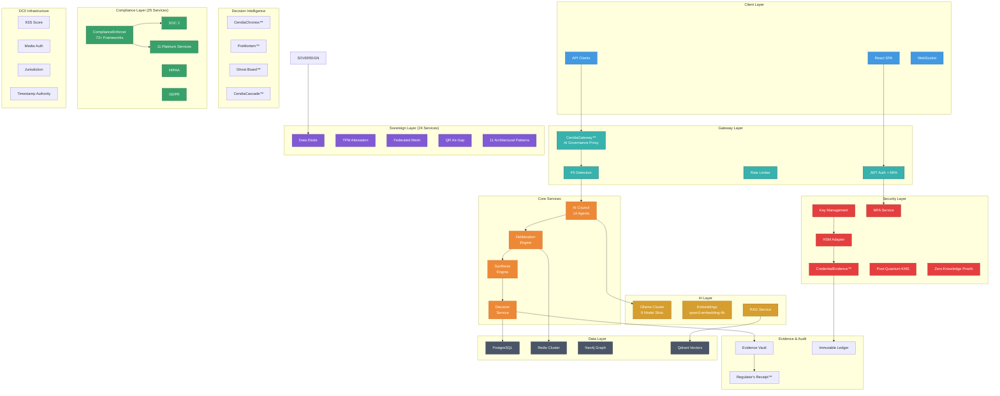
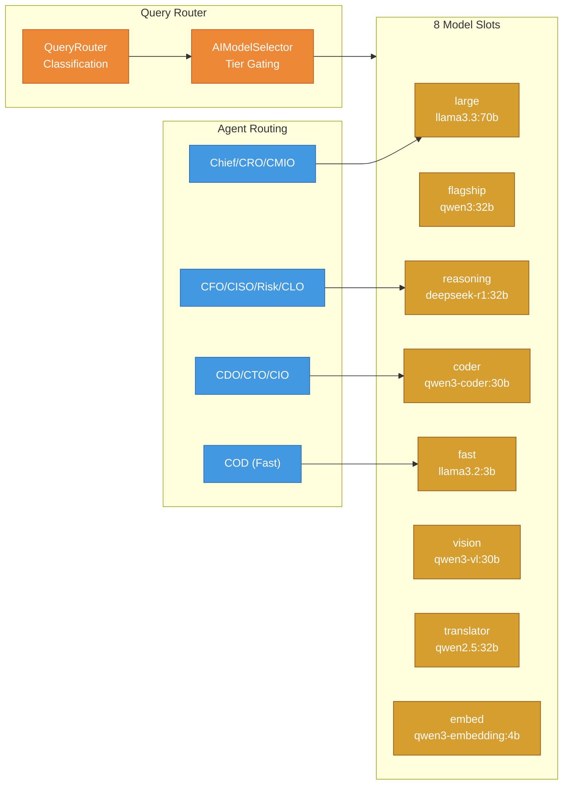
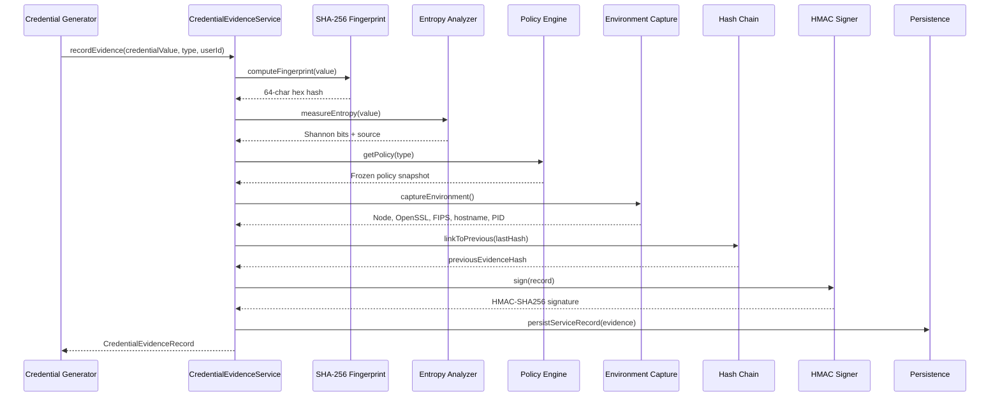
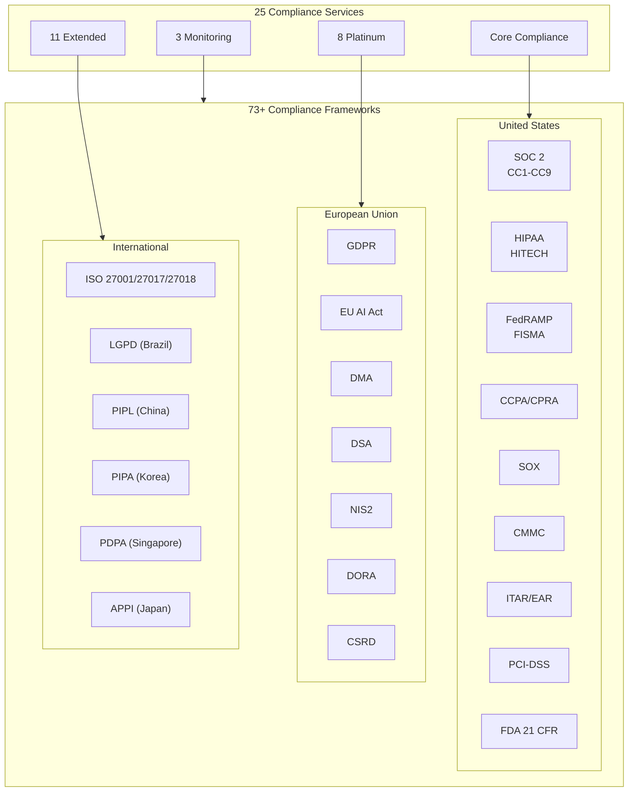
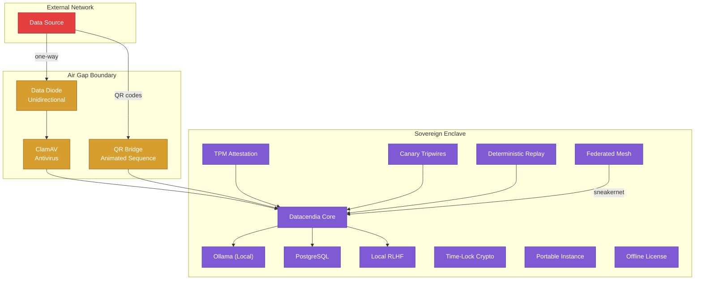
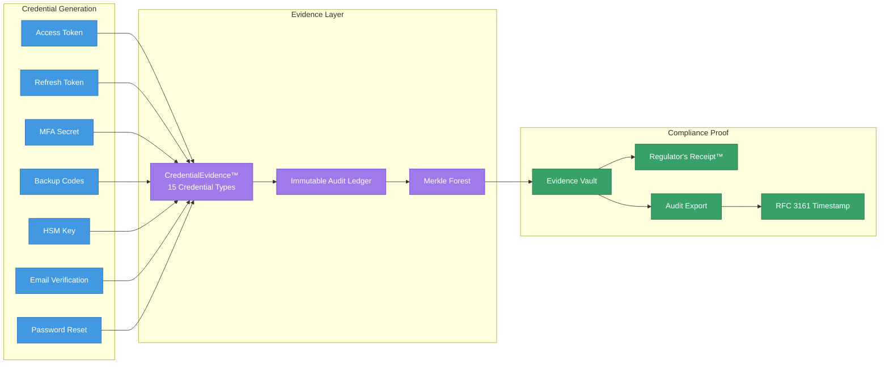
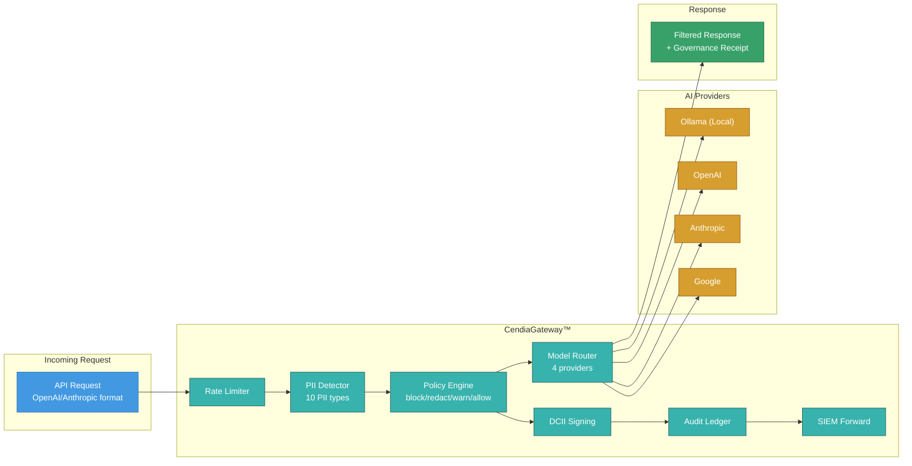

# Datacendia Architecture Diagrams

## Deployment Options Overview

Datacendia supports three primary deployment architectures to meet diverse enterprise requirements:

| Deployment | Best For | Data Residency | Internet Required | Compliance |
|------------|----------|----------------|-------------------|------------|
| **Private Cloud** | Most enterprises | Customer's cloud tenant | Yes (outbound only) | SOC 2, GDPR, HIPAA |
| **On-Premises** | Regulated industries | Customer's data center | Optional | FedRAMP, ITAR, PCI-DSS |
| **Air-Gapped** | Defense, Intelligence | Isolated network | No | IL4/IL5, CJIS, Secret |

---

## 1. Private Cloud Deployment

**Target:** Enterprise customers using AWS, Azure, or GCP  
**Use Case:** Financial services, healthcare, SaaS companies

```
┌─────────────────────────────────────────────────────────────────────────────┐
│                        CUSTOMER'S CLOUD TENANT (VPC)                        │
│  ┌───────────────────────────────────────────────────────────────────────┐  │
│  │                         KUBERNETES CLUSTER (EKS/AKS/GKE)              │  │
│  │  ┌─────────────────────────────────────────────────────────────────┐  │  │
│  │  │                      INGRESS / LOAD BALANCER                    │  │  │
│  │  │                    (ALB / NGINX / Istio Gateway)                │  │  │
│  │  └─────────────────────────────────────────────────────────────────┘  │  │
│  │                                   │                                    │  │
│  │         ┌─────────────────────────┼─────────────────────────┐          │  │
│  │         ▼                         ▼                         ▼          │  │
│  │  ┌─────────────┐          ┌─────────────┐          ┌─────────────┐     │  │
│  │  │  FRONTEND   │          │   BACKEND   │          │  WEBSOCKET  │     │  │
│  │  │   (React)   │◄────────►│  (Node.js)  │◄────────►│   SERVER    │     │  │
│  │  │   3 pods    │          │   5 pods    │          │   3 pods    │     │  │
│  │  └─────────────┘          └──────┬──────┘          └─────────────┘     │  │
│  │                                  │                                      │  │
│  │         ┌────────────────────────┼────────────────────────┐            │  │
│  │         ▼                        ▼                        ▼            │  │
│  │  ┌─────────────┐          ┌─────────────┐          ┌─────────────┐     │  │
│  │  │   OLLAMA    │          │    REDIS    │          │   DRUID     │     │  │
│  │  │  LLM Pods   │          │   CLUSTER   │          │  (Chronos)  │     │  │
│  │  │  GPU nodes  │          │   3 nodes   │          │   3 nodes   │     │  │
│  │  └─────────────┘          └─────────────┘          └─────────────┘     │  │
│  │                                                                         │  │
│  └─────────────────────────────────────────────────────────────────────────┘  │
│                                      │                                        │
│  ┌───────────────────────────────────┼───────────────────────────────────┐   │
│  │                    MANAGED DATA SERVICES                               │   │
│  │  ┌─────────────┐   ┌─────────────┐   ┌─────────────┐   ┌───────────┐  │   │
│  │  │ POSTGRESQL  │   │    NEO4J    │   │    MINIO    │   │  SECRETS  │  │   │
│  │  │    (RDS)    │   │   (Graph)   │   │ (S3/Blob)   │   │  MANAGER  │  │   │
│  │  │  Multi-AZ   │   │  3 replicas │   │  encrypted  │   │(Vault/KMS)│  │   │
│  │  └─────────────┘   └─────────────┘   └─────────────┘   └───────────┘  │   │
│  └───────────────────────────────────────────────────────────────────────┘   │
│                                                                               │
│  ┌───────────────────────────────────────────────────────────────────────┐   │
│  │                         SECURITY & MONITORING                          │   │
│  │  ┌──────────┐  ┌──────────┐  ┌──────────┐  ┌──────────┐  ┌──────────┐ │   │
│  │  │   WAF    │  │ CloudTrl │  │Prometheus│  │ Grafana  │  │  SIEM    │ │   │
│  │  │(Shield)  │  │ (Audit)  │  │ +Alertmgr│  │Dashboard │  │ Export   │ │   │
│  │  └──────────┘  └──────────┘  └──────────┘  └──────────┘  └──────────┘ │   │
│  └───────────────────────────────────────────────────────────────────────┘   │
└─────────────────────────────────────────────────────────────────────────────┘
                                      │
                                      │ TLS 1.3 Only
                                      ▼
                        ┌─────────────────────────┐
                        │     ENTERPRISE USERS    │
                        │   (SSO / SAML / OIDC)   │
                        └─────────────────────────┘
```

### Private Cloud Components

| Component | Service | Scaling | Purpose |
|-----------|---------|---------|---------|
| Frontend | React SPA | 3+ pods, HPA | User interface |
| Backend | Node.js API | 5+ pods, HPA | Business logic, API |
| Ollama | GPU pods | 2-10 pods | Local LLM inference |
| PostgreSQL | RDS/CloudSQL | Multi-AZ | Primary database |
| Neo4j | Managed/Self | 3 replicas | Knowledge graph |
| Redis | ElastiCache | Cluster mode | Caching, sessions |
| Druid | Self-managed | 3+ nodes | Time-series (Chronos) |
| MinIO/S3 | Object storage | Auto | Document storage |

### Network Requirements

```
OUTBOUND (Optional):
├── Ollama model downloads (ollama.com) - initial setup only
├── Telemetry (optional, can be disabled)
└── Software updates (can use private registry)

INBOUND:
├── HTTPS (443) - User access via load balancer
└── WSS (443) - WebSocket for real-time updates
```

---

## 2. On-Premises Deployment

**Target:** Banks, healthcare systems, government contractors  
**Use Case:** Strict data residency, regulatory compliance

```
┌─────────────────────────────────────────────────────────────────────────────┐
│                      CUSTOMER DATA CENTER / COLO                            │
│                                                                             │
│  ┌───────────────────────────────────────────────────────────────────────┐  │
│  │                         DMZ / PERIMETER NETWORK                        │  │
│  │  ┌──────────────┐    ┌──────────────┐    ┌──────────────┐             │  │
│  │  │   FIREWALL   │───►│  REVERSE     │───►│    WAF /     │             │  │
│  │  │  (Palo Alto) │    │  PROXY       │    │   IDS/IPS    │             │  │
│  │  └──────────────┘    │  (F5/HAProxy)│    │  (Snort)     │             │  │
│  │                      └──────────────┘    └──────────────┘             │  │
│  └───────────────────────────────────────────────────────────────────────┘  │
│                                      │                                      │
│                                      ▼                                      │
│  ┌───────────────────────────────────────────────────────────────────────┐  │
│  │                    APPLICATION NETWORK (VLAN 100)                      │  │
│  │                                                                        │  │
│  │  ┌─────────────────────────────────────────────────────────────────┐  │  │
│  │  │                 KUBERNETES CLUSTER (RKE2/OpenShift)              │  │  │
│  │  │                                                                   │  │  │
│  │  │   ┌───────────┐  ┌───────────┐  ┌───────────┐  ┌───────────┐    │  │  │
│  │  │   │  MASTER   │  │  MASTER   │  │  MASTER   │  │  WORKER   │    │  │  │
│  │  │   │  NODE 1   │  │  NODE 2   │  │  NODE 3   │  │  POOL     │    │  │  │
│  │  │   │           │  │           │  │           │  │ (10 nodes)│    │  │  │
│  │  │   └───────────┘  └───────────┘  └───────────┘  └───────────┘    │  │  │
│  │  │                                                                   │  │  │
│  │  │   ┌───────────────────────────────────────────────────────────┐  │  │  │
│  │  │   │                    GPU NODE POOL                          │  │  │  │
│  │  │   │  ┌─────────┐  ┌─────────┐  ┌─────────┐  ┌─────────┐      │  │  │  │
│  │  │   │  │ NVIDIA  │  │ NVIDIA  │  │ NVIDIA  │  │ NVIDIA  │      │  │  │  │
│  │  │   │  │ A100/H100│  │ A100/H100│  │ A100/H100│  │ A100/H100│      │  │  │  │
│  │  │   │  │ Ollama  │  │ Ollama  │  │ Ollama  │  │ Ollama  │      │  │  │  │
│  │  │   │  └─────────┘  └─────────┘  └─────────┘  └─────────┘      │  │  │  │
│  │  │   └───────────────────────────────────────────────────────────┘  │  │  │
│  │  └─────────────────────────────────────────────────────────────────┘  │  │
│  │                                                                        │  │
│  └───────────────────────────────────────────────────────────────────────┘  │
│                                      │                                      │
│                                      ▼                                      │
│  ┌───────────────────────────────────────────────────────────────────────┐  │
│  │                     DATABASE NETWORK (VLAN 200)                        │  │
│  │                                                                        │  │
│  │  ┌─────────────┐  ┌─────────────┐  ┌─────────────┐  ┌─────────────┐   │  │
│  │  │ POSTGRESQL  │  │    NEO4J    │  │   REDIS     │  │   DRUID     │   │  │
│  │  │  CLUSTER    │  │  CLUSTER    │  │  SENTINEL   │  │  CLUSTER    │   │  │
│  │  │             │  │             │  │             │  │             │   │  │
│  │  │ Primary +   │  │ 3 Core +    │  │ 3 Sentinel  │  │ Coordinator │   │  │
│  │  │ 2 Replicas  │  │ 2 Read      │  │ 3 Redis     │  │ + Brokers   │   │  │
│  │  └─────────────┘  └─────────────┘  └─────────────┘  └─────────────┘   │  │
│  │                                                                        │  │
│  └───────────────────────────────────────────────────────────────────────┘  │
│                                      │                                      │
│                                      ▼                                      │
│  ┌───────────────────────────────────────────────────────────────────────┐  │
│  │                     STORAGE NETWORK (VLAN 300)                         │  │
│  │                                                                        │  │
│  │  ┌─────────────────────────────┐  ┌─────────────────────────────┐     │  │
│  │  │         SAN / NAS           │  │        BACKUP SYSTEM        │     │  │
│  │  │   (NetApp / Pure / Dell)    │  │      (Veeam / Commvault)    │     │  │
│  │  │                             │  │                             │     │  │
│  │  │  - PostgreSQL data          │  │  - Daily snapshots          │     │  │
│  │  │  - Neo4j data               │  │  - 30-day retention         │     │  │
│  │  │  - MinIO buckets            │  │  - Offsite replication      │     │  │
│  │  │  - Druid segments           │  │  - Encrypted backups        │     │  │
│  │  └─────────────────────────────┘  └─────────────────────────────┘     │  │
│  │                                                                        │  │
│  └───────────────────────────────────────────────────────────────────────┘  │
│                                                                             │
│  ┌───────────────────────────────────────────────────────────────────────┐  │
│  │                    MANAGEMENT NETWORK (VLAN 400)                       │  │
│  │                                                                        │  │
│  │  ┌──────────┐  ┌──────────┐  ┌──────────┐  ┌──────────┐  ┌──────────┐│  │
│  │  │ Ansible  │  │ Vault    │  │Prometheus│  │ Grafana  │  │  SIEM    ││  │
│  │  │ Tower    │  │ (Secrets)│  │ +Thanos  │  │ Loki     │  │ (Splunk) ││  │
│  │  └──────────┘  └──────────┘  └──────────┘  └──────────┘  └──────────┘│  │
│  │                                                                        │  │
│  └───────────────────────────────────────────────────────────────────────┘  │
└─────────────────────────────────────────────────────────────────────────────┘
                                      │
                         Enterprise Network (SSO/AD)
                                      │
                        ┌─────────────────────────┐
                        │   CORPORATE USERS       │
                        │  (Active Directory)     │
                        └─────────────────────────┘
```

### On-Premises Hardware Requirements

| Component | Minimum | Recommended | High Availability |
|-----------|---------|-------------|-------------------|
| **K8s Masters** | 3x (4 CPU, 16GB) | 3x (8 CPU, 32GB) | 5x across zones |
| **K8s Workers** | 5x (8 CPU, 32GB) | 10x (16 CPU, 64GB) | 15x across racks |
| **GPU Nodes** | 2x NVIDIA A100 | 4x NVIDIA A100 | 6x with failover |
| **PostgreSQL** | 3x (8 CPU, 64GB) | 3x (16 CPU, 128GB) | Patroni cluster |
| **Neo4j** | 3x (8 CPU, 64GB) | 5x (16 CPU, 128GB) | Causal cluster |
| **Storage** | 10TB SSD | 50TB NVMe | Replicated SAN |

### Network Segmentation

```
VLAN 100 - Application Tier
├── Kubernetes nodes
├── Load balancers
└── Application pods

VLAN 200 - Database Tier
├── PostgreSQL cluster
├── Neo4j cluster
├── Redis cluster
└── Druid cluster

VLAN 300 - Storage Tier
├── SAN/NAS systems
├── Backup infrastructure
└── Object storage (MinIO)

VLAN 400 - Management Tier
├── Monitoring (Prometheus/Grafana)
├── Secrets management (Vault)
├── Configuration management (Ansible)
└── Log aggregation (SIEM)
```

---

## 3. Air-Gapped Deployment

**Target:** Defense, intelligence agencies, classified environments  
**Use Case:** IL4/IL5, Secret/Top Secret, CJIS compliance

```
┌─────────────────────────────────────────────────────────────────────────────┐
│                     AIR-GAPPED SECURE FACILITY (SCIF)                       │
│                                                                             │
│  ══════════════════════════════════════════════════════════════════════════ │
│  ║                    PHYSICAL SECURITY BOUNDARY                          ║ │
│  ║                   (Faraday Cage / TEMPEST Shielded)                    ║ │
│  ══════════════════════════════════════════════════════════════════════════ │
│                                                                             │
│  ┌───────────────────────────────────────────────────────────────────────┐  │
│  │                    DATA DIODE / UNIDIRECTIONAL GATEWAY                 │  │
│  │  ┌──────────────────────────────────────────────────────────────────┐ │  │
│  │  │  IMPORT ONLY (No data exfiltration possible)                     │ │  │
│  │  │  ┌────────────┐    ┌────────────┐    ┌────────────┐              │ │  │
│  │  │  │  MEDIA     │───►│  MALWARE   │───►│  CONTENT   │───►[IMPORT] │ │  │
│  │  │  │  SCANNER   │    │  ANALYSIS  │    │  FILTER    │              │ │  │
│  │  │  │ (Kiosk)    │    │ (Sandbox)  │    │ (DLP)      │              │ │  │
│  │  │  └────────────┘    └────────────┘    └────────────┘              │ │  │
│  │  └──────────────────────────────────────────────────────────────────┘ │  │
│  └───────────────────────────────────────────────────────────────────────┘  │
│                                      │                                      │
│                                      ▼                                      │
│  ┌───────────────────────────────────────────────────────────────────────┐  │
│  │                       SECURE COMPUTE ENCLAVE                           │  │
│  │                                                                        │  │
│  │  ┌─────────────────────────────────────────────────────────────────┐  │  │
│  │  │           HARDENED KUBERNETES (RKE2 FIPS / OpenShift)            │  │  │
│  │  │                                                                   │  │  │
│  │  │   ┌─────────────────────────────────────────────────────────┐    │  │  │
│  │  │   │              DATACENDIA APPLICATION STACK                │    │  │  │
│  │  │   │                                                          │    │  │  │
│  │  │   │  ┌──────────┐  ┌──────────┐  ┌──────────┐  ┌──────────┐ │    │  │  │
│  │  │   │  │ FRONTEND │  │ BACKEND  │  │ WEBSOCKET│  │  WORKER  │ │    │  │  │
│  │  │   │  │ (React)  │  │(Node.js) │  │  SERVER  │  │  QUEUE   │ │    │  │  │
│  │  │   │  └──────────┘  └──────────┘  └──────────┘  └──────────┘ │    │  │  │
│  │  │   │                                                          │    │  │  │
│  │  │   │  ┌──────────────────────────────────────────────────┐   │    │  │  │
│  │  │   │  │              LOCAL LLM INFERENCE                  │   │    │  │  │
│  │  │   │  │  ┌────────────────────────────────────────────┐  │   │    │  │  │
│  │  │   │  │  │              OLLAMA CLUSTER                 │  │   │    │  │  │
│  │  │   │  │  │                                             │  │   │    │  │  │
│  │  │   │  │  │  ┌─────────┐  ┌─────────┐  ┌─────────┐     │  │   │    │  │  │
│  │  │   │  │  │  │ LLAMA   │  │ MISTRAL │  │ CUSTOM  │     │  │   │    │  │  │
│  │  │   │  │  │  │ 3.2 70B │  │ 7B      │  │ FINE-   │     │  │   │    │  │  │
│  │  │   │  │  │  │         │  │         │  │ TUNED   │     │  │   │    │  │  │
│  │  │   │  │  │  └─────────┘  └─────────┘  └─────────┘     │  │   │    │  │  │
│  │  │   │  │  │     ▲            ▲            ▲            │  │   │    │  │  │
│  │  │   │  │  │     └────────────┴────────────┘            │  │   │    │  │  │
│  │  │   │  │  │              NO EXTERNAL CALLS             │  │   │    │  │  │
│  │  │   │  │  │          (100% Local Inference)            │  │   │    │  │  │
│  │  │   │  │  └────────────────────────────────────────────┘  │   │    │  │  │
│  │  │   │  │                                                   │   │    │  │  │
│  │  │   │  │  GPU: NVIDIA A100/H100 (FIPS 140-2 validated)    │   │    │  │  │
│  │  │   │  └──────────────────────────────────────────────────┘   │    │  │  │
│  │  │   └──────────────────────────────────────────────────────────┘    │  │  │
│  │  │                                                                   │  │  │
│  │  └─────────────────────────────────────────────────────────────────┘  │  │
│  │                                                                        │  │
│  │  ┌─────────────────────────────────────────────────────────────────┐  │  │
│  │  │                    LOCAL DATA STORES                             │  │  │
│  │  │  ┌───────────┐  ┌───────────┐  ┌───────────┐  ┌───────────┐    │  │  │
│  │  │  │PostgreSQL │  │   Neo4j   │  │   Redis   │  │   MinIO   │    │  │  │
│  │  │  │  (FIPS)   │  │(Encrypted)│  │ (In-mem)  │  │(Encrypted)│    │  │  │
│  │  │  │           │  │           │  │           │  │           │    │  │  │
│  │  │  │ AES-256   │  │ AES-256   │  │ TLS 1.3   │  │ AES-256   │    │  │  │
│  │  │  │ at-rest   │  │ at-rest   │  │ in-transit│  │ at-rest   │    │  │  │
│  │  │  └───────────┘  └───────────┘  └───────────┘  └───────────┘    │  │  │
│  │  └─────────────────────────────────────────────────────────────────┘  │  │
│  │                                                                        │  │
│  └───────────────────────────────────────────────────────────────────────┘  │
│                                                                             │
│  ┌───────────────────────────────────────────────────────────────────────┐  │
│  │                    SECURITY & COMPLIANCE                               │  │
│  │  ┌───────────┐  ┌───────────┐  ┌───────────┐  ┌───────────┐          │  │
│  │  │   HSM     │  │  STIG     │  │  AUDIT    │  │   LOCAL   │          │  │
│  │  │ (Key Mgmt)│  │ Hardened  │  │   LOGS    │  │   SIEM    │          │  │
│  │  │ FIPS 140-3│  │  Images   │  │ (Tamper-  │  │ (Offline) │          │  │
│  │  │           │  │           │  │  proof)   │  │           │          │  │
│  │  └───────────┘  └───────────┘  └───────────┘  └───────────┘          │  │
│  └───────────────────────────────────────────────────────────────────────┘  │
│                                                                             │
│  ══════════════════════════════════════════════════════════════════════════ │
│  ║                    NO NETWORK CONNECTIVITY                             ║ │
│  ║              (Physically isolated from all networks)                   ║ │
│  ══════════════════════════════════════════════════════════════════════════ │
│                                                                             │
│                        ┌─────────────────────────┐                          │
│                        │   CLASSIFIED USERS      │                          │
│                        │   (CAC/PIV Required)    │                          │
│                        │   (Need-to-Know Basis)  │                          │
│                        └─────────────────────────┘                          │
└─────────────────────────────────────────────────────────────────────────────┘
```

### Air-Gapped Security Controls

| Control | Implementation | Compliance |
|---------|----------------|------------|
| **Data Import** | Data diode, sneakernet with scanning | IL4/IL5 |
| **Encryption at Rest** | AES-256, FIPS 140-2/3 validated | CJIS, DoD |
| **Encryption in Transit** | TLS 1.3, mTLS between services | FedRAMP High |
| **Key Management** | HSM (Thales Luna, AWS CloudHSM GovCloud) | PCI-DSS |
| **Access Control** | CAC/PIV, MFA, RBAC | NIST 800-53 |
| **Audit Logging** | Tamper-proof, signed logs | SOX, FISMA |
| **LLM Inference** | 100% local, no API calls | Data sovereignty |

### Software Supply Chain

```
AIR-GAPPED SOFTWARE DELIVERY:

1. SECURE BUILD PIPELINE (Internet-connected, separate facility)
   ├── Source code review
   ├── SAST/DAST scanning
   ├── Container image building
   ├── SBOM generation
   └── Digital signing

2. SECURE TRANSFER
   ├── Burn to encrypted media (USB/DVD)
   ├── Two-person integrity check
   ├── Physical courier (cleared personnel)
   └── Chain of custody documentation

3. IMPORT PROCESS
   ├── Media scanning (malware, exfiltration)
   ├── Signature verification
   ├── SBOM validation
   └── Import to local registry

4. LOCAL REGISTRY
   ├── Harbor (air-gapped)
   ├── Signed images only
   └── Vulnerability scanning (offline DB)
```

---

## Deployment Comparison Matrix

| Feature | Private Cloud | On-Premises | Air-Gapped |
|---------|---------------|-------------|------------|
| **Setup Time** | 1-2 days | 2-4 weeks | 4-8 weeks |
| **Maintenance** | Managed | Customer IT | Customer IT + Cleared |
| **Updates** | Automatic | Scheduled | Manual import |
| **LLM Models** | Download on demand | Pre-loaded | Sneakernet |
| **Cost** | $$ | $$$ | $$$$ |
| **Compliance** | SOC 2, HIPAA | + PCI-DSS | + IL4/IL5, CJIS |
| **Internet** | Required | Optional | None |
| **GPU** | Cloud GPUs | On-prem GPUs | On-prem GPUs |

---

## Data Flow Diagrams

### Deliberation Data Flow

```
┌─────────────────────────────────────────────────────────────────────────┐
│                         DELIBERATION DATA FLOW                          │
└─────────────────────────────────────────────────────────────────────────┘

  USER                                                              STORAGE
    │                                                                  │
    │ 1. Submit Question                                               │
    ▼                                                                  │
┌─────────┐    2. Authenticate    ┌─────────┐    3. Log Request   ┌─────────┐
│ BROWSER │───────────────────────►│   API   │────────────────────►│  AUDIT  │
│         │◄───────────────────────│ GATEWAY │◄────────────────────│   LOG   │
└─────────┘    11. Stream Response └────┬────┘                     └─────────┘
                                        │
                    4. Route to Backend │
                                        ▼
                                  ┌───────────┐
                                  │  BACKEND  │
                                  │  SERVER   │
                                  └─────┬─────┘
                                        │
           ┌────────────────────────────┼────────────────────────────┐
           │                            │                            │
           ▼                            ▼                            ▼
     ┌───────────┐              ┌───────────┐              ┌───────────┐
     │   CACHE   │              │  QUEUE    │              │  GRAPH    │
     │  (Redis)  │              │ (Worker)  │              │  (Neo4j)  │
     │           │              │           │              │           │
     │ Check if  │              │ Enqueue   │              │ Fetch     │
     │ cached    │              │ AI work   │              │ context   │
     └───────────┘              └─────┬─────┘              └───────────┘
                                      │
                         5. Distribute to Agents
                                      │
           ┌──────────────────────────┼──────────────────────────┐
           ▼                          ▼                          ▼
     ┌───────────┐            ┌───────────┐            ┌───────────┐
     │  AGENT 1  │            │  AGENT 2  │            │  AGENT N  │
     │   (CFO)   │            │  (COO)    │            │  (CISO)   │
     └─────┬─────┘            └─────┬─────┘            └─────┬─────┘
           │                        │                        │
           │    6. LLM Inference    │                        │
           ▼                        ▼                        ▼
     ┌─────────────────────────────────────────────────────────────┐
     │                      OLLAMA CLUSTER                          │
     │  ┌─────────────┐  ┌─────────────┐  ┌─────────────┐          │
     │  │   GPU 1     │  │   GPU 2     │  │   GPU N     │          │
     │  │  LLAMA 3.2  │  │  LLAMA 3.2  │  │  LLAMA 3.2  │          │
     │  └─────────────┘  └─────────────┘  └─────────────┘          │
     └─────────────────────────────────────────────────────────────┘
           │                        │                        │
           │    7. Agent Responses  │                        │
           ▼                        ▼                        ▼
     ┌─────────────────────────────────────────────────────────────┐
     │                   8. CROSS-EXAMINATION                       │
     │         Agents challenge each other's conclusions            │
     └─────────────────────────────────────────────────────────────┘
                                      │
                         9. Synthesis │
                                      ▼
                              ┌───────────┐
                              │ SYNTHESIS │
                              │  ENGINE   │
                              │           │
                              │ Aggregate │
                              │ + Score   │
                              └─────┬─────┘
                                    │
                    10. Store Result│
                                    ▼
                              ┌───────────┐
                              │PostgreSQL │
                              │           │
                              │ Decision  │
                              │ Record    │
                              └───────────┘
```

---

## Service Architecture Diagrams

> **Last updated:** April 15, 2026 — full codebase audit

### Complete Platform Architecture



### AI Model Routing Architecture



### Credential Evidence Flow



### Compliance Framework Coverage



### Sovereign Architecture — Air-Gap Deployment



### Evidence & Audit Pipeline



### Gateway Data Flow



### Domain Router Architecture

```mermaid
graph TB
    subgraph Router["API v1 Router"]
        AUTH2["auth.domain"]
        COUNCIL2["council.domain"]
        DATA["data.domain"]
        DEMO["demo.domain"]
        ENT["enterprise.domain"]
        GOV2["governance.domain"]
        INTEL["intelligence.domain"]
        LEGAL2["legal.domain"]
        PLAT3["platform.domain"]
        SEC["security.domain"]
        SIM["simulation.domain"]
        SOV2["sovereign.domain"]
        VERT["verticals.domain"]
        WORK["workflows.domain"]
    end

    AUTH2 --> A1["auth, sso"]
    COUNCIL2 --> C1["council, deliberations, decisions"]
    SEC --> S1["mfa, hsm, kms, zkp, post-quantum,<br/>credential-evidence, sentry,<br/>adversarial-redteam, redteam,<br/>security-services"]
    SOV2 --> SV1["sovereign, sovereign-arch,<br/>sovereign-security, sovereign-organs"]
    GOV2 --> G1["compliance, compliance-monitor,<br/>compliance-platinum, constitutional-court,<br/>cross-jurisdiction, regulatory-sandbox"]
    ENT --> E1["enterprise, apotheosis, dissent,<br/>cascade, echo, gnosis, collapse"]
    VERT --> V1["verticals, sports, defense,<br/>vertical-agents, vertical-config"]
    PLAT3 --> P1["health, metrics, settings,<br/>notifications, uploads, scheduler"]
```



---

## Next Steps

For detailed implementation guides, see:
- [DEPLOYMENT.md](./DEPLOYMENT.md) - Step-by-step deployment instructions
- [docker-compose.smb.yml](../deploy/docker-compose.smb.yml) - SMB Docker bundle
- [terraform/aws/main.tf](../infrastructure/terraform/aws/main.tf) - AWS Terraform
- [helm/datacendia/values.yaml](../helm/datacendia/values.yaml) - Kubernetes Helm chart

---

*Updated April 15, 2026 — Audit-verified against codebase*
