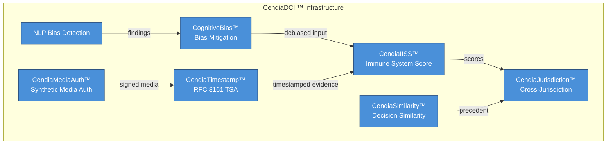
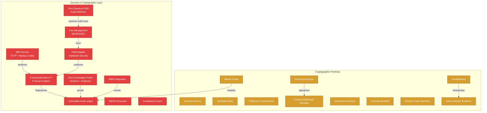
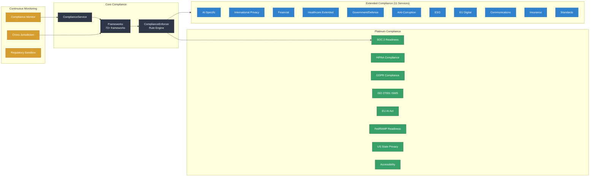
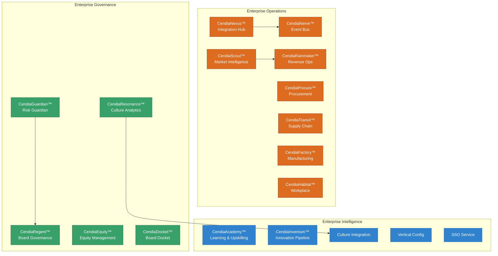
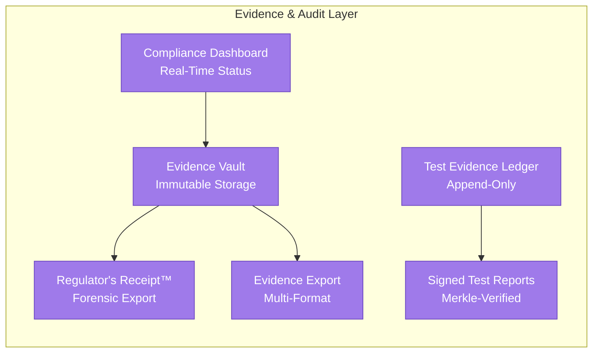
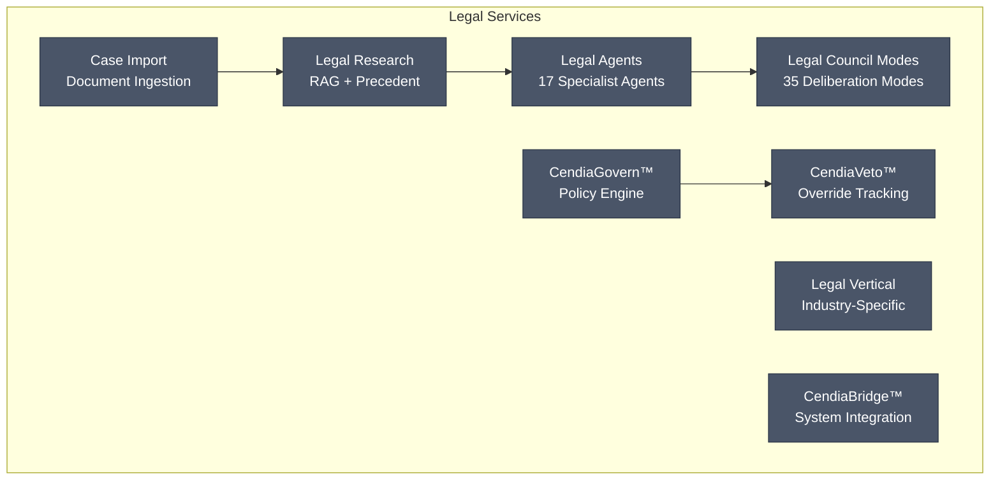
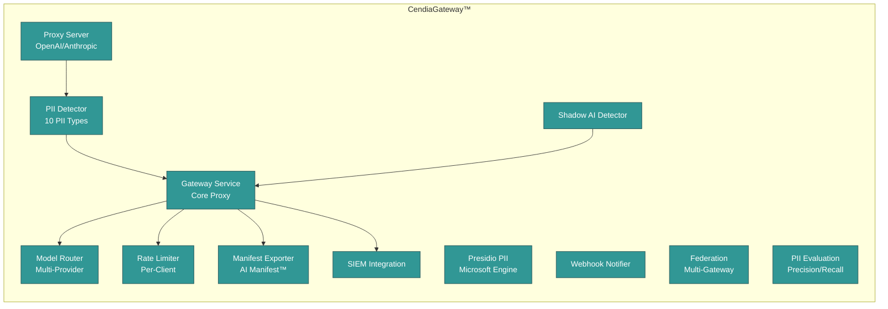
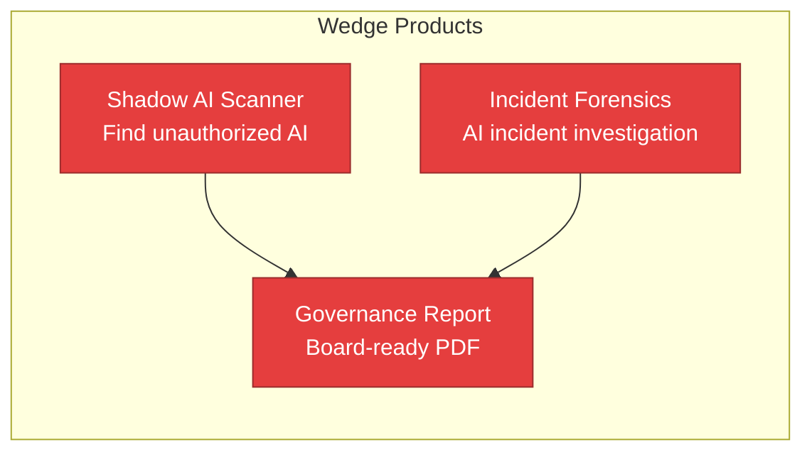

# DATACENDIA COMPLETE SERVICE MATRIX
## Cortex Platform, Pillars, Enterprise Suite & Decision Intelligence

**Version:** Enterprise Platinum v6.0  
**Generated:** April 15, 2026  
**Last Audit:** April 15, 2026 — full codebase inventory reconciliation

---

# TABLE OF CONTENTS

1. [The Cortex Platform](#1-the-cortex-platform)
2. [The 8 Pillars](#2-the-8-pillars)
3. [Decision Intelligence Suite](#3-decision-intelligence-suite)
4. [Enterprise Suite](#4-enterprise-suite)
5. [CendiaDCII™ — Decision Crisis Immunization Infrastructure](#5-cendiadcii--decision-crisis-immunization-infrastructure)
6. [AI Council Services](#6-ai-council-services)
7. [Security & Cryptographic Services](#7-security--cryptographic-services)
8. [Compliance Services](#8-compliance-services)
9. [Sovereign Architecture](#9-sovereign-architecture)
10. [Enterprise Operations Services](#10-enterprise-operations-services)
11. [Evidence & Audit Services](#11-evidence--audit-services)
12. [Legal Services](#12-legal-services)
13. [Gateway & AI Proxy](#13-gateway--ai-proxy)
14. [Wedge Products](#14-wedge-products)
15. [Industry Packages](#15-industry-packages)
16. [R&D / Experimental Services](#16-rd--experimental-services)
17. [Platform Statistics](#17-platform-statistics)

---

# 1. THE CORTEX PLATFORM

**Cortex** is the central intelligence hub that orchestrates all Datacendia services.

| Component | Purpose | Status | Price |
|-----------|---------|--------|-------|
| **Cortex Core** | Central orchestration & routing | Production | Included |
| **Cortex API Gateway** | Unified API access point | Production | Included |
| **Cortex WebSocket Hub** | Real-time streaming & events | Production | Included |
| **Cortex Auth** | Authentication & authorization | Production | Included |

---

# 2. THE 8 PILLARS

The foundational data layers that power all Datacendia intelligence.

| Pillar | Icon | Purpose | AI Agents | Price | Package | Industries | R&D |
|--------|------|---------|-----------|-------|---------|------------|-----|
| **The Helm** | 🎯 | Command & Control - Single source of truth for organizational KPIs, metrics dashboards, real-time alerts | Chief, CFO, COO, CRO | Included | Core | All | No |
| **The Lineage** | 🔗 | Data Provenance - Track data origins, transformations, quality scoring, dependency mapping | CDO, CISO, Risk | Included | Core | All | No |
| **The Predict** | 🔮 | ML Forecasting - Prediction models, scenario analysis, feature importance, AI-powered insights | CFO, Risk, CDO, CAIO | $149/mo add-on | Core+ | Finance, Operations | No |
| **The Flow** | 🌊 | Workflow Automation - Business process automation, approvals, execution tracking, scheduling | COO, Chief | Included | Core | All | No |
| **The Health** | 💓 | System Health - Platform monitoring, diagnostics, uptime tracking, component health scores | All (monitoring) | Included | Core | All | No |
| **The Guard** | 🛡️ | Security Posture - Compliance frameworks (SOC2, GDPR, HIPAA, ISO27001, PCI), threat detection, audit trails | CISO, CLO, Risk | Included | Core | All | No |
| **The Ethics** | ⚖️ | AI Governance - Ethical principles, bias detection, human oversight, responsible AI guardrails | CAIO, Chief, Ethics Board | Included | Core | All | No |
| **The Agents** | 🤖 | AI Agent Management - Configure, monitor, and orchestrate the AI Council (The Pantheon) | CAIO, Chief | Included | Core | All | No |

---

# 3. DECISION INTELLIGENCE SUITE

Advanced decision-making tools powered by AI Council.

| Service | Icon | Purpose | AI Agents | Price | Package | Industries | Pillars | R&D |
|---------|------|---------|-----------|-------|---------|------------|---------|-----|
| **CendiaChronos™** | ⏰ | Enterprise Time Machine - Navigate historical data, playback business states, court-ready exports, ERP integration | CDO, CFO, Risk, CLO | $199/mo | Decision Intel | All | Helm, Lineage, Predict | No |
| **CendiaProvenance™** | 🧬 | Full lifecycle decision tracking - Decision tree visualization, replay engine, outcome linking, metadata capture | Chief, All Council | $249/mo | Decision Intel | All | Helm, Lineage, Flow | No |
| **CendiaPreMortem™** | 💀 | Failure mode analysis BEFORE deciding - Risk calculation, AI-generated mitigations, live user intervention | Risk, CISO, CLO, CFO | $149/mo | Decision Intel | All | Predict, Guard, Ethics | No |
| **Ghost Board™** | 👻 | AI-powered board meeting simulation - Virtual board members, tough question prep, transcript export | Chief, CFO, CLO, Risk, CIO | $299/mo | Decision Intel | Enterprise | Agents, Ethics, Predict | No |
| **Decision Debt Tracker** | 📊 | Track stuck decisions and their costs - Debt metrics, delay cost calculator, priority ranking | COO, CFO, Chief | $99/mo | Decision Intel | All | Helm, Flow | No |
| **Live Demo Mode** | 🎬 | Connect to real data instantly - Data connections, real-time preview, demo configuration | CDO, All | $79/mo | Decision Intel | All | Lineage, Health | No |
| **Regulatory Absorb™** | 📜 | Instant compliance learning - Framework library (GDPR, SOX, HIPAA), compliance scoring, regulation updates | CISO, CLO, Risk | $199/mo | Decision Intel | Finance, Healthcare, Legal | Guard, Ethics | No |
| **What-If Scenarios** | 🔄 | Scenario planning and simulation - Multiple futures modeling, sensitivity analysis | CFO, Risk, Chief | $179/mo | Decision Intel | Finance, Strategy | Predict, Helm | Beta |
| **Consensus Builder** | 🤝 | Multi-stakeholder alignment tool - Voting, conflict resolution, agreement tracking | Chief, All Council | $129/mo | Decision Intel | Enterprise | Ethics, Flow | Beta |

---

# 4. ENTERPRISE SUITE

Enterprise-grade capabilities for large organizations.

| Service | Icon | Purpose | AI Agents | Price | Package | Industries | Pillars | R&D |
|---------|------|---------|-----------|-------|---------|------------|---------|-----|
| **CendiaSovereign™** | 🏛️ | Data Sovereignty - Data residency control, multi-region support, E2E encryption, classification, data flow visualization | CDO, CISO | $399/mo | Enterprise | Finance, Healthcare, Government | Guard, Lineage | No |
| **CendiaPersonaForge™** | 🎭 | Persona Management - Create custom AI personas, persona templates, performance analytics, behavior customization | CAIO, Chief | $249/mo | Enterprise | All | Agents, Ethics | No |
| **CendiaMesh™** | 🕸️ | Integration Mesh - Connect all enterprise systems, visual integration map, API management, throughput monitoring | CDO, COO, CTO | $349/mo | Enterprise | Enterprise | Flow, Health, Lineage | No |
| **CendiaGovern™** | ⚖️ | Enterprise Governance - Policy management, RBAC, approval workflows, compliance dashboard | CISO, CLO, Chief | $299/mo | Enterprise | All | Guard, Ethics, Flow | No |
| **CendiaVoice™** | 🎙️ | Voice Interface - Voice commands, real-time transcription, natural language commands, voice analytics | All Agents (voice) | $199/mo | Enterprise | All | Helm, Agents | No |
| **CendiaAutopilot™** | ✈️ | Autonomous Decisions - AI-powered autonomous decision making, automation rules, human-in-the-loop, confidence scoring | All Agents (auto) | $499/mo | Enterprise | Enterprise | Flow, Ethics, Agents | No |
| **CendiaGenomics™** | 🧬 | Organizational DNA - Org structure mapping, skill matrices, culture analytics, team dynamics analysis | COO, HR, Chief | $299/mo | Enterprise | Enterprise | Helm, Flow | No |
| **CendiaDefenseStack™** | 🔐 | Security Command Center - Threat dashboard, security KPIs, incident response, vulnerability scanning | CISO, Risk, CDO | $449/mo | Enterprise | All | Guard, Health | No |
| **CendiaOmniTranslate™** | 🌍 | Universal Translation - 50+ language support, real-time translation, localized AI responses | All Agents (i18n) | $149/mo | Enterprise | Global | All Pillars | No |
| **CendiaVeto™** | 🚫 | Proposal Veto System - AI-analyzed objections, veto tracking, override controls, escalation paths | All Council | $199/mo | Enterprise | Enterprise | Ethics, Guard | No |
| **CendiaUnion™** | 🤝 | Multi-Council Decisions - Unified decisions across multiple councils, federation, conflict resolution | All Agents (multi) | $349/mo | Enterprise | Enterprise | Agents, Flow | No |
| **CendiaLedger™** | 📒 | Immutable Audit Trail - Blockchain-style decision logging, tamper-proof records, compliance exports | All Agents (audit) | $299/mo | Enterprise | Finance, Healthcare | Guard, Lineage | No |
| **CendiaCollapse™** | ⚠️ | Policy Red-Team Mode - 18 adversarial agents across 7 failure domains, Trust Delta calculation, Failure Envelopes | 18 Collapse Agents | $399/mo | Sovereign | Government, Enterprise | Ethics, Guard | No |
| **CendiaResponsibility™** | 👤 | Human Accountability Layer - Explicit liability transfer, TPM-signed accountability records, delegation chains | All Agents (audit) | $249/mo | Enterprise | All | Ethics, Guard, Lineage | No |
| **CendiaNexus™** | 🔌 | Advanced Integrations - Salesforce, SAP, Oracle, Workday, custom API connectors | CDO, COO | $399/mo | Enterprise | Enterprise | Flow, Lineage | No |
| **CendiaInsight360™** | 📊 | Executive Intelligence - C-suite dashboards, board reports, investor materials | Chief, CFO, All | $349/mo | Enterprise | Enterprise | Helm, Predict | Beta |
| **CendiaSentinel™** | 👁️ | Proactive Monitoring - Anomaly detection, predictive alerts, business health scores | Risk, CDO, CISO | $279/mo | Enterprise | All | Health, Predict | Beta |
| **CendiaOrchestrate™** | ⚙️ | Service Orchestration Workflow Builder - Visual drag-and-drop of 60+ platform services into reusable workflows, persistent save/load, run simulation, step configuration | All Agents (orchestration) | $299/mo | Enterprise | All | Flow, Agents, Helm | No |

---

# 5. CendiaDCII™ — DECISION CRISIS IMMUNIZATION INFRASTRUCTURE

The category-defining governance infrastructure. Measures, proves, and immunizes organizations against institutional crises.

| Service | Backend Service | Description | Status | Tests |
|---------|-----------------|-------------|--------|-------|
| **CendiaIISS™** | `IISSService.ts` | Institutional Immune System Score — 0–1000 scale, 5 certification bands, industry benchmarking | DB + Cache | 15/15 |
| **CendiaMediaAuth™** | `SyntheticMediaAuthService.ts` | C2PA content provenance signing, deepfake detection (pixel/audio/metadata) | DB + Cache | 10/10 |
| **CendiaJurisdiction™** | `CrossJurisdictionConflictService.ts` | Multi-framework evaluation, GDPR vs PIPL conflict detection | DB + Cache | 10/10 |
| **CendiaTimestamp™** | `TimestampAuthorityService.ts` | RFC 3161 TSA, batch timestamping, blockchain anchoring | DB + Cache | 10/10 |
| **CendiaSimilarity™** | `DecisionSimilarityService.ts` | TF-IDF semantic search, outcome-aware recommendations | DB + Cache | 7/7 |
| **CognitiveBias™** | `CognitiveBiasMitigationService.ts` | Adversarial challenge, rubber-stamp detection | DB + Cache | — |
| **NLP Bias Detection** | `NLPBiasDetectionService.ts` | Natural language bias scanning in documents | DB + Cache | — |

### DCII Primitives

| # | Primitive | Description | Status |
|---|-----------|-------------|--------|
| 1 | Discovery-Time Proof | Cryptographic timestamps proving when knowledge became actionable | Implemented |
| 2 | Deliberation Capture | Multi-agent, multi-perspective decision process recording | Implemented |
| 3 | Override Accountability | Non-suppressible tracking of recommendation overrides | Implemented |
| 4 | Continuity Memory | Personnel-independent institutional knowledge preservation | Implemented |
| 5 | Drift Detection | Continuous compliance degradation monitoring | Implemented |
| 6 | Cognitive Bias Mitigation | Adversarial challenge of assumptions and rubber-stamp detection | Implemented |
| 7 | Quantum-Resistant Integrity | Post-quantum cryptographic protection of evidence | Implemented |
| 8 | Synthetic Media Authentication | Content provenance signing and deepfake detection | Implemented |
| 9 | Cross-Jurisdiction Compliance | Multi-jurisdiction conflict detection and resolution | Implemented |

### Architecture

- All DCII services use **write-through cache** pattern: in-memory Maps for fast reads + PostgreSQL via Prisma for persistence
- Prisma schema: `backend/prisma/schema/dcii.prisma` (15 models), `backend/prisma/schema/gateway.prisma` (3 models) — 50+ indexes
- **`devAuth` middleware** on all DCII API routes (JWT in production, bypass in development)
- Graceful degradation: services fall back to in-memory demo data if DB unavailable

---

# 6. AI COUNCIL SERVICES

The AI Agent ecosystem powering all intelligence.

## 6.1 Core Council (FREE - Included)

| Agent | Code | Purpose | AI Model | Primary Pillars | Industries |
|-------|------|---------|----------|-----------------|------------|
| **Chief Strategy Agent** | `chief` | Strategic synthesis, executive coordination, decision orchestration | llama3.3:70b | Helm, Ethics, Agents | All |
| **Financial Intelligence (CFO)** | `cfo` | Financial analysis, ROI, cash flow, budget forecasting | llama3.3:70b | Helm, Predict | All |
| **Operations Intelligence (COO)** | `coo` | Process efficiency, resource allocation, supply chain | llama3.2:3b | Flow, Health | All |
| **Security & Compliance (CISO)** | `ciso` | Security assessment, compliance monitoring, threat analysis | qwq:32b | Guard, Ethics | All |
| **Market Intelligence (CMO)** | `cmo` | Market analysis, customer insights, competitive intelligence | llama3.3:70b | Predict, Helm | Retail, SaaS |
| **Revenue Intelligence (CRO)** | `cro` | Revenue optimization, sales performance, pricing strategy | llama3.3:70b | Helm, Predict | SaaS, Sales |
| **Data Quality (CDO)** | `cdo` | Data governance, lineage, quality, master data management | qwen2.5-coder:32b | Lineage, Health | All |
| **Risk Assessment** | `risk` | Enterprise risk, impact analysis, scenario planning | qwq:32b | Guard, Predict | All |
| **Legal Intelligence (CLO)** | `clo` | Legal risk, contracts, regulatory compliance | qwq:32b | Guard, Ethics | All |
| **Product Strategy (CPO)** | `cpo` | Product roadmap, user research, feature prioritization | llama3.3:70b | Predict, Flow | Tech |
| **AI Strategy (CAIO)** | `caio` | AI governance, ethical AI, model governance | qwq:32b | Ethics, Agents | Tech |
| **Sustainability (CSO)** | `cso` | ESG metrics, carbon footprint, sustainability reporting | llama3.3:70b | Ethics, Helm | All |
| **Investment Intelligence (CIO)** | `cio` | Capital allocation, portfolio management, valuation | llama3.3:70b | Predict, Helm | Finance |
| **Communications (CCO)** | `cco` | Corporate messaging, PR strategy, crisis communications | llama3.2:3b | Ethics, Helm | All |

## 6.2 Premium Agent Packs

| Pack | Price | Agents Included | Industries | Pillars | R&D |
|------|-------|-----------------|------------|---------|-----|
| **Audit Excellence Pack** | $299/mo | External Auditor, Internal Auditor | All | Guard, Ethics, Lineage | No |
| **Healthcare Industry Pack** | $399/mo | CMIO, Patient Safety Officer, Healthcare Compliance, Clinical Ops Director | Healthcare | Health, Guard, Ethics | No |
| **Finance Industry Pack** | $399/mo | Quantitative Analyst, Portfolio Manager, Credit Risk Officer, Treasury Analyst | Finance | Helm, Predict, Guard | No |
| **Legal Industry Pack** | $399/mo | Contract Specialist, IP Counsel, Litigation Expert, Regulatory Affairs | Legal | Guard, Ethics, Lineage | No |
| **Manufacturing Pack** | $399/mo | Quality Engineer, Supply Chain Analyst, Safety Officer, Plant Manager | Manufacturing | Flow, Health, Guard | **R&D** |
| **Retail Pack** | $399/mo | Merchandising Analyst, Store Operations, Customer Experience, Inventory Planner | Retail | Flow, Predict, Helm | **R&D** |

---

# 7. SECURITY & CRYPTOGRAPHIC SERVICES

Comprehensive security infrastructure from credential evidence to post-quantum cryptography.

### Security Services (`services/security/`)

| Service | File | Description | API Route |
|---------|------|-------------|-----------|
| **CredentialEvidenceService** | `CredentialEvidenceService.ts` | Proof-at-creation for every credential — SHA-256 fingerprint, entropy measurement, policy snapshot, hash chain, HMAC signature. SOC 2 CC6.1/CC6.7, HIPAA §164.312(d), NIST SP 800-63B | `/credential-evidence/*` |
| **HSM Adapter** | `HSMAdapter.ts` | Hardware Security Module — PKCS#11 (SoftHSM2, Thales Luna, AWS CloudHSM), software fallback, RSA/AES/EC key generation | `/hsm/*` |
| **MFA Service** | `MFAService.ts` | TOTP (RFC 6238), 10 backup codes, AES-256-CBC encrypted at rest | `/mfa/*` |
| **Key Management** | `KeyManagementService.ts` | AES-256-GCM key hierarchy (MEK → DEK), key rotation, key wrapping | `/kms/*` |
| **Post-Quantum KMS** | `PostQuantumKMSService.ts` | Kyber-1024, Dilithium-5, SPHINCS+, Falcon-1024 — NIST PQC Round 3 | `/post-quantum/*` |
| **Zero-Knowledge Proofs** | `ZeroKnowledgeProofService.ts` | Groth16 circuits + Pedersen commitments, proof generation & verification | `/zkp/*` |
| **Immutable Audit Ledger** | `ImmutableAuditLedger.ts` | Append-only Merkle tree audit log, tamper detection | — |
| **SIEM Integration** | `SIEMIntegration.ts` | Splunk, Elastic, Sentinel, QRadar event forwarding | — |
| **SBOM Generator** | `SBOMGenerator.ts` | CycloneDX/SPDX software bill of materials | — |
| **Compliance Export** | `ComplianceExportService.ts` | SOC 2, HIPAA, ISO 27001 evidence package generation | — |

### Cryptographic Primitives (`services/crypto/`)

| Service | File | Description |
|---------|------|-------------|
| **Merkle Forest** | `MerkleForestService.ts` | Multi-tree integrity verification |
| **Dual Signing Keys** | `DualSigningKeyService.ts` | Online/offline signing key pairs |
| **Decision Escrow** | `DecisionEscrowService.ts` | Time-locked decision escrow |
| **Verifiable Delay** | `VerifiableDelayService.ts` | VDF-based provable computation delay |
| **Pedersen ZKP** | `PedersenZKPService.ts` | Pedersen commitment-based zero-knowledge proofs |
| **Content-Addressed Receipts** | `ContentAddressedReceiptService.ts` | CID-based tamper-proof receipts |
| **CendiaStamp** | `CendiaStampService.ts` | Platform-native cryptographic timestamps |
| **Anonymous Dissent** | `AnonymousDissentService.ts` | ZKP-protected anonymous dissent filing |
| **Anomaly Sentinel** | `AnomalySentinelService.ts` | Cryptographic anomaly detection in audit chains |
| **Decision Gate RedTeam** | `DecisionGateRedTeamService.ts` | Adversarial red-team gate for decision pipelines |
| **Self-Contained Evidence** | `SelfContainedEvidenceService.ts` | Standalone verifiable evidence bundles |

---

# 8. COMPLIANCE SERVICES

25 compliance services covering 73+ regulatory frameworks across all major jurisdictions.

### Core Compliance (`services/compliance/`)

| Service | File | Frameworks Covered |
|---------|------|--------------------|
| **ComplianceService** | `ComplianceService.ts` | Master compliance orchestrator |
| **ComplianceEnforcer** | `ComplianceEnforcer.ts` | Rule engine for all 73+ frameworks |
| **Framework Metadata** | `frameworks.ts` | Complete framework definitions (111 KB) |

### Platinum Compliance Services

| Service | File | API Route | Key Frameworks |
|---------|------|-----------|----------------|
| **SOC 2 Readiness** | `SOC2ReadinessService.ts` | `/compliance/*` | SOC 2 Type I/II (CC1-CC9) |
| **HIPAA Compliance** | `HIPAAComplianceService.ts` | `/compliance/*` | HIPAA, HITECH |
| **GDPR Compliance** | `GDPRComplianceService.ts` | `/compliance/*` | GDPR, ePrivacy |
| **ISO 27001 ISMS** | `ISO27001ISMSService.ts` | `/compliance/*` | ISO 27001, 27017, 27018 |
| **EU AI Act** | `EUAIActService.ts` | `/compliance/*` | EU AI Act |
| **FedRAMP Readiness** | `FedRAMPReadinessService.ts` | `/compliance/*` | FedRAMP, FISMA |
| **US State Privacy** | `USStatePrivacyEngine.ts` | `/compliance/*` | CCPA, CPRA, VCDPA, CPA, CTDPA |
| **Accessibility** | `AccessibilityComplianceService.ts` | `/compliance/*` | ADA, WCAG 2.1, Section 508 |

### Extended Compliance Services (11 services)

| Service | File | API Route | Key Frameworks |
|---------|------|-----------|----------------|
| **AI-Specific** | `AISpecificComplianceService.ts` | `/compliance-platinum/*` | EU AI Act, NIST AI RMF, Canada AIDA, China AI Regs |
| **International Privacy** | `InternationalPrivacyService.ts` | `/compliance-platinum/*` | LGPD, PIPL, PIPA, PDPA, APPI, Privacy Act 1988 |
| **Financial** | `FinancialComplianceService.ts` | `/compliance-platinum/*` | SOX, PCI-DSS, DORA, Basel III, MiFID II, GLBA |
| **Healthcare Extended** | `HealthcareExtendedService.ts` | `/compliance-platinum/*` | FDA 21 CFR Part 11, MHRA, MDR, GxP |
| **Government/Defense** | `GovernmentDefenseService.ts` | `/compliance-platinum/*` | FedRAMP, CMMC, ITAR, EAR, NIST 800-171 |
| **Anti-Corruption** | `AntiCorruptionService.ts` | `/compliance-platinum/*` | FCPA, UK Bribery Act, OECD Anti-Bribery |
| **ESG** | `ESGComplianceService.ts` | `/compliance-platinum/*` | GRI, SASB, TCFD, EU CSRD, EU Taxonomy |
| **EU Digital** | `EUDigitalRegulationService.ts` | `/compliance-platinum/*` | DMA, DSA, Data Act, NIS2 |
| **Communications** | `CommunicationsComplianceService.ts` | `/compliance-platinum/*` | FCC, Ofcom, EECC |
| **Insurance** | `InsuranceComplianceService.ts` | `/compliance-platinum/*` | Solvency II, NAIC, IDD |
| **Standards** | `StandardsComplianceService.ts` | `/compliance-platinum/*` | ISO 9001, ISO 14001, ISO 45001, CMMI |

### Continuous Monitoring

| Service | File | API Route |
|---------|------|-----------|
| **Compliance Monitor** | `ContinuousComplianceMonitorService.ts` | `/compliance-monitor/*` |
| **Cross-Jurisdiction Engine** | `CrossJurisdictionEngineService.ts` | `/cross-jurisdiction/*` |
| **Regulatory Sandbox** | `RegulatorySandboxService.ts` | `/regulatory-sandbox/*` |

---

# 9. SOVEREIGN ARCHITECTURE

24 sovereign services for air-gapped, on-premises, and classified deployments.

```mermaid
graph TB
    subgraph Arch["11 Architectural Patterns"]
        DD["Data Diode<br/>Unidirectional Ingest"]
        RLHF["Local RLHF<br/>Zero-Cloud Training"]
        DNA["Decision DNA<br/>Audit Export"]
        SC["Shadow Council<br/>Sandbox Deliberation"]
        DR["Deterministic Replay<br/>Bit-Perfect Repro"]
        QR["QR Air-Gap Bridge<br/>Animated QR Transfer"]
        CT["Canary Tripwires<br/>Exfiltration Detection"]
        TPM["TPM Attestation<br/>Hardware Signing"]
        TL["Time-Lock<br/>RSA Time-Lock Puzzles"]
        FM["Federated Mesh<br/>Sneakernet Learning"]
        PI["Portable Instance<br/>USB Boot Config"]
    end

    subgraph Extended["Extended Sovereign"]
        BB["CendiaBlackBox™"]
        GL["CendiaGlass™"]
        KY["CendiaKey™"]
        LG["CendiaLegacy™"]
        MR["CendiaMirage™"]
        MI["CendiaMirror™"]
        OR["CendiaOracle™"]
        VT["CendiaVault™"]
        WI["CendiaWitness™"]
        EM["Encrypted Mesh"]
        OL["Offline License"]
        SM["Sovereign Mode"]
        CA["ClamAV Integration"]
    end

    DD --> CT
    SC --> DR
    TPM --> DNA
    TL --> DD
    FM --> EM
    QR --> DD

    classDef arch fill:#805ad5,stroke:#553c9a,color:#fff
    classDef ext fill:#4c51bf,stroke:#3c366b,color:#fff
    class DD,RLHF,DNA,SC,DR,QR,CT,TPM,TL,FM,PI arch
    class BB,GL,KY,LG,MR,MI,OR,VT,WI,EM,OL,SM,CA ext
```

### Architectural Patterns (`/api/v1/sovereign-arch/*`)

| Service | File | API Prefix | Description |
|---------|------|------------|-------------|
| **Data Diode** | `DataDiodeService.ts` | `/diode/*` | Unidirectional data ingest with quarantine, scanning, signature verification |
| **Local RLHF** | `LocalRLHFService.ts` | `/rlhf/*` | Zero-cloud RLHF, feedback collection, LoRA training scripts |
| **Decision DNA** | `DecisionDNAService.ts` | `/dna/*` | One-click audit artifact export (PDF+JSON bundles, Merkle tree) |
| **Shadow Council** | `ShadowCouncilService.ts` | `/shadow/*` | Sandbox parallel deliberation without ledger |
| **Deterministic Replay** | `DeterministicReplayService.ts` | `/replay/*` | Bit-perfect reproducibility with pinned seeds |
| **QR Air-Gap Bridge** | `QRAirGapBridgeService.ts` | `/qr/*` | Animated QR code sequences for zero-media transfer |
| **Canary Tripwires** | `CanaryTripwireService.ts` | `/canary/*` | Honeypot records for exfiltration detection |
| **TPM Attestation** | `TPMAttestationService.ts` | `/tpm/*` | Hardware-signed decisions (software fallback) |
| **Time-Lock** | `TimeLockService.ts` | `/timelock/*` | Cryptographic time-lock for embargoed decisions |
| **Federated Mesh** | `FederatedMeshService.ts` | `/mesh/*` | Multi-site learning via sneakernet + differential privacy |
| **Portable Instance** | `PortableInstanceService.ts` | `/portable/*` | Bootable USB deployment configuration |

### Extended Sovereign Services

| Service | File | Description |
|---------|------|-------------|
| **CendiaBlackBox™** | `CendiaBlackBoxService.ts` | Flight-recorder-style sealed decision logging |
| **CendiaGlass™** | `CendiaGlassService.ts` | Transparency-mode decision auditing |
| **CendiaKey™** | `CendiaKeyService.ts` | Sovereign key management and ceremony |
| **CendiaLegacy™** | `CendiaLegacyService.ts` | Legacy system bridging and migration |
| **CendiaMirage™** | `CendiaMirageService.ts` | Decoy infrastructure for threat detection |
| **CendiaMirror™** | `CendiaMirrorService.ts` | Multi-site state replication |
| **CendiaOracle™** | `CendiaOracleService.ts` | Sovereign data oracle for verified external data |
| **CendiaVault™** | `CendiaVaultService.ts` | Encrypted sovereign file storage |
| **CendiaWitness™** | `CendiaWitnessService.ts` | Multi-party witness for high-stakes decisions |
| **Encrypted Mesh** | `EncryptedMeshService.ts` | E2E encrypted inter-node communication |
| **Offline License** | `OfflineLicenseService.ts` | Air-gapped license validation |
| **Sovereign Mode** | `SovereignModeService.ts` | Toggle all-local operation mode |
| **ClamAV Integration** | `ClamAVIntegration.ts` | Antivirus scanning for data diode ingest |

---

# 10. ENTERPRISE OPERATIONS SERVICES

18 enterprise services for departmental operations, integration, and governance.

| Service | File | Description |
|---------|------|-------------|
| **CendiaNexus™** | `CendiaNexusService.ts` | Enterprise integration hub (Salesforce, SAP, Oracle, Workday) |
| **CendiaNerve™** | `CendiaNerveService.ts` | Real-time event bus and notification routing |
| **CendiaScout™** | `CendiaScoutService.ts` | Market intelligence and competitive analysis |
| **CendiaRainmaker™** | `CendiaRainmakerService.ts` | Revenue operations and pipeline management |
| **CendiaProcure™** | `CendiaProcureService.ts` | Procurement governance and vendor risk |
| **CendiaTransit™** | `CendiaTransitService.ts` | Supply chain management and logistics |
| **CendiaFactory™** | `CendiaFactoryService.ts` | Manufacturing operations intelligence |
| **CendiaHabitat™** | `CendiaHabitatService.ts` | Workplace management and facilities |
| **CendiaRegent™** | `CendiaRegentService.ts` | Board governance and fiduciary oversight |
| **CendiaEquity™** | `CendiaEquityService.ts` | Equity management, cap table, compensation |
| **CendiaDocket™** | `CendiaDocketService.ts` | Board docket and meeting management |
| **CendiaGuardian™** | `CendiaGuardianService.ts` | Enterprise risk guardian and monitoring |
| **CendiaResonance™** | `CendiaResonanceService.ts` | Culture analytics and organizational health |
| **CendiaAcademy™** | `CendiaAcademyService.ts` | Learning management and AI upskilling |
| **CendiaInventum™** | `CendiaInventumService.ts` | Innovation pipeline and ideation management |
| **Culture Integration** | `CultureIntegrationService.ts` | Organizational culture analytics |
| **Vertical Config** | `VerticalConfigService.ts` | Industry vertical configuration engine |
| **SSO Service** | `SSOService.ts` | SAML 2.0, OIDC, CAC/PIV authentication |

---

# 11. EVIDENCE & AUDIT SERVICES

7 evidence services for forensic-grade audit packages and compliance proof.

| Service | File | API Route | Description |
|---------|------|-----------|-------------|
| **Evidence Vault** | `EvidenceVaultService.ts` | `/evidence/*` | Immutable evidence storage with Merkle integrity |
| **Regulator's Receipt™** | `RegulatorsReceiptService.ts` | `/regulators-receipt/*` | Forensic-grade receipt (HTML/PDF/JSON) with Merkle trees |
| **Evidence Export** | `EvidenceExportService.ts` | `/evidence-vault/*` | Multi-format evidence export (PDF, JSON, CSV) |
| **Compliance Dashboard** | `ComplianceDashboardService.ts` | — | Real-time compliance status aggregation |
| **Signed Test Reports** | `SignedTestReportService.ts` | — | Cryptographically signed test result reports |
| **Test Evidence Ledger** | `TestEvidenceLedgerService.ts` | — | Append-only ledger of test execution evidence |

---

# 12. LEGAL SERVICES

8 legal services covering litigation, research, governance, and multi-jurisdiction compliance.

| Service | File | API Route | Description |
|---------|------|-----------|-------------|
| **Legal Research** | `LegalResearchService.ts` | `/legal-research/*` | RAG-powered legal research with citation provenance |
| **Legal Vertical** | `LegalVerticalService.ts` | `/legal-services/*` | Industry-specific legal intelligence |
| **Legal Agents** | `LegalAgents.ts` | `/legal/*` | 17 specialist legal AI agents |
| **Legal Council Modes** | `LegalCouncilModes.ts` | `/legal/*` | 35 deliberation modes for legal scenarios |
| **Case Import** | `CaseImportService.ts` | `/legal/*` | Document ingestion and case management |
| **CendiaBridge™** | `CendiaBridgeService.ts` | — | Legal system integration (Westlaw, LexisNexis) |
| **CendiaGovern™** | `CendiaGovernService.ts` | `/govern/*` | Policy management and enforcement |
| **CendiaVeto™** | `CendiaVetoService.ts` | `/veto/*` | Decision override tracking and accountability |

---

# 13. GATEWAY & AI PROXY

CendiaGateway™ — AI Governance Gateway with multi-provider proxying and policy enforcement.

| Service | File | Description |
|---------|------|-------------|
| **Gateway Service** | `CendiaGatewayService.ts` | Core proxy — policy enforcement, DCII signing, audit ledger |
| **PII Detector** | `PIIDetector.ts` | 10 PII types (SSN, credit card, email, phone, IP, DOB, medical, bank, passport, DL) |
| **Presidio PII** | `PresidioPIIService.ts` | Microsoft Presidio integration for advanced PII detection |
| **Model Router** | `ModelRouter.ts` | Multi-provider routing (OpenAI, Anthropic, Google, Ollama) |
| **Rate Limiter** | `RateLimiter.ts` | Per-client/per-model rate limiting |
| **Webhook Notifier** | `WebhookNotifier.ts` | Policy violation webhook notifications |
| **Federation** | `GatewayFederationService.ts` | Multi-gateway federation and routing |
| **Proxy Server** | `GatewayProxyServer.ts` | OpenAI/Anthropic-compatible endpoints |
| **Manifest Exporter** | `ManifestExporter.ts` | AI Manifest™ cryptographic compliance artifact |
| **Shadow AI Detector** | `ShadowAIDetector.ts` | Unauthorized AI usage detection |
| **SIEM Integration** | `SIEMIntegration.ts` | Gateway event forwarding to SIEM |
| **PII Evaluation** | `PIIEvaluationMetrics.ts` | Precision/recall measurement for PII detection |

---

# 14. WEDGE PRODUCTS

Entry-point products for enterprise adoption.

| Service | File | API Route | Description |
|---------|------|-----------|-------------|
| **Shadow AI Scanner** | `ShadowAIScannerService.ts` | `/wedge/*` | Discover unauthorized AI tool usage across the org |
| **Governance Report** | `GovernanceReportService.ts` | `/wedge/*` | Board-ready governance report generation |
| **Incident Forensics** | `IncidentForensicsService.ts` | `/wedge/*` | AI incident investigation and root cause analysis |

---

# 15. INDUSTRY PACKAGES

Pre-configured bundles optimized for specific industries.

| Package | Price | Includes | AI Agents | Pillars | Target Industries |
|---------|-------|----------|-----------|---------|-------------------|
| **Healthcare Complete** | $1,299/mo | Healthcare Pack + Regulatory Absorb + CendiaSovereign + CendiaLedger | 4 Healthcare + Core Council | Health, Guard, Ethics, Lineage | Hospitals, Clinics, Pharma |
| **Financial Services Complete** | $1,299/mo | Finance Pack + Chronos + CendiaLedger + Ghost Board | 4 Finance + Core Council | Helm, Predict, Guard, Lineage | Banks, Investment, Insurance |
| **Legal Enterprise** | $999/mo | Legal Pack + Decision DNA + Regulatory Absorb | 4 Legal + Core Council | Guard, Ethics, Lineage | Law Firms, Corporate Legal |
| **Government & Public Sector** | $1,499/mo | CendiaSovereign + CendiaGovern + Audit Pack + CendiaLedger | Audit Pack + Core Council | Guard, Ethics, Lineage, Flow | Government, Public Sector |
| **Manufacturing Excellence** | $999/mo | Manufacturing Pack + CendiaMesh + Flow Automation | 4 Manufacturing + Core Council | Flow, Health, Guard | Manufacturing, Industrial |

---

# 16. R&D / EXPERIMENTAL SERVICES

| Service | Purpose | Status |
|---------|---------|--------|
| **CendiaQuantum™** | Quantum-inspired optimization for complex decisions | 🔬 R&D |
| **CendiaSynapse™** | Neural decision networks - Learning from past decisions | 🔬 R&D |
| **CendiaEmpath™** | Emotional intelligence layer for stakeholder analysis | 🔬 R&D |
| **CendiaProphet™** | Long-term strategic forecasting (5-10 year horizon) | 🔬 R&D |
| **CendiaCollective™** | Swarm intelligence for distributed decision making | 🔬 R&D |

---

# 17. PLATFORM STATISTICS

| Metric | Count |
|--------|-------|
| **Total Backend Services** | 160+ |
| **Security Services** | 10 + 11 crypto primitives |
| **Compliance Services** | 25 (73+ frameworks) |
| **Sovereign Services** | 24 (11 architectural patterns + 13 extended) |
| **Enterprise Operations** | 18 |
| **Evidence & Audit** | 7 |
| **Legal Services** | 8 |
| **Gateway Services** | 12 |
| **Wedge Products** | 3 |
| **DCII Services** | 7 |
| **AI Agents (Core)** | 14 |
| **AI Agents (Premium)** | 16+ |
| **Pillars** | 8 |
| **DCII Primitives** | 9 |
| **Industry Verticals** | 26 |
| **Supported Languages** | 100+ (20 UI localizations) |
| **Compliance Frameworks** | 73+ |
| **Supported Jurisdictions** | 17 |
| **API Domain Routers** | 14 |
| **Route Modules** | 130+ |

### Service → Pillar Matrix

| Service | Helm | Lineage | Predict | Flow | Health | Guard | Ethics | Agents |
|---------|:----:|:-------:|:-------:|:----:|:------:|:-----:|:------:|:------:|
| **Chronos** | ✅ | ✅ | ✅ | | | | | |
| **Decision DNA** | ✅ | ✅ | | ✅ | | | | |
| **Pre-Mortem** | | | ✅ | | | ✅ | ✅ | |
| **Ghost Board** | | | ✅ | | | | ✅ | ✅ |
| **Sovereign** | | ✅ | | | | ✅ | | |
| **PersonaForge** | | | | | | | ✅ | ✅ |
| **Mesh** | | ✅ | | ✅ | ✅ | | | |
| **Govern** | | | | ✅ | | ✅ | ✅ | |
| **Autopilot** | | | | ✅ | | | ✅ | ✅ |
| **DefenseStack** | | | | | ✅ | ✅ | | |
| **Veto** | | | | | | ✅ | ✅ | |
| **Union** | | | | ✅ | | | | ✅ |
| **Ledger** | | ✅ | | | | ✅ | | |
| **CredentialEvidence** | | ✅ | | | | ✅ | | |
| **Gateway** | | ✅ | | | ✅ | ✅ | ✅ | |
| **Compliance** | | | | | | ✅ | ✅ | |
| **Apotheosis** | | | | | ✅ | ✅ | ✅ | ✅ |
| **Dissent** | | | | | | | ✅ | |

---

*Complete Service Matrix for Datacendia Enterprise Platinum Platform*  
*Updated April 15, 2026 — Audit-verified against codebase*
