# DATACENDIA PLATFORM ARCHITECTURE
## Complete Enterprise Platform Inventory

**Version:** Enterprise Platinum Sovereign v6.0  
**Classification:** Investor & Enterprise Ready  
**Generated:** April 15, 2026  
**Last Audit:** April 15, 2026 — full codebase inventory reconciliation

---

# EXECUTIVE SUMMARY

**Datacendia** is not a tool — it is an **Operating System for Enterprise Intelligence**.

| Metric | Value |
|--------|-------|
| **Total Backend Services** | 160+ |
| **Platform Layers** | 8 |
| **AI Agents (Core)** | 14 |
| **AI Agents (Premium)** | 16+ |
| **Pillars** | 8 |
| **Security Services** | 10 + 11 crypto primitives |
| **Compliance Services** | 25 (73+ frameworks) |
| **Sovereign Services** | 24 |
| **Enterprise Ops Services** | 18 |
| **Evidence & Audit** | 7 |
| **DCII Services** | 7 |
| **Gateway Services** | 12 |
| **Legal Services** | 8 |
| **Wedge Products** | 3 |
| **Industry Verticals** | 26 |
| **API Domain Routers** | 14 |
| **Supported Languages** | 100+ (20 UI localizations) |

---

# PLATFORM ARCHITECTURE OVERVIEW

```mermaid
graph TB
    subgraph L8["LAYER 8: SOVEREIGN DEPLOYMENT (24 Services)"]
        L8S["Data Diode | RLHF | Shadow Council | TPM | TimeLock | QR AirGap<br/>Canary | Replay | Mesh | Portable | BlackBox | Glass | Key<br/>Legacy | Mirage | Mirror | Oracle | Vault | Witness | ClamAV"]
    end

    subgraph L7["LAYER 7: SECURITY & CRYPTOGRAPHIC (21 Services)"]
        L7S["CredentialEvidence | HSM | MFA | KMS | Post-Quantum | ZKP<br/>Audit Ledger | SIEM | SBOM | Merkle Forest | Dual Signing<br/>Decision Escrow | Verifiable Delay | Pedersen | CendiaStamp"]
    end

    subgraph L6["LAYER 6: COMPLIANCE & EVIDENCE (32 Services)"]
        L6S["25 Compliance Services (73+ frameworks) | Evidence Vault<br/>Regulator's Receipt | Compliance Dashboard | Signed Reports<br/>Test Evidence Ledger | Evidence Export"]
    end

    subgraph L5["LAYER 5: ENTERPRISE OPS & INTELLIGENCE (18 Services)"]
        L5S["Nexus | Nerve | Scout | Rainmaker | Procure | Transit<br/>Factory | Habitat | Regent | Equity | Docket | Guardian<br/>Resonance | Academy | Inventum | Culture | Vertical | SSO"]
    end

    subgraph L4["LAYER 4: DCII + GATEWAY + LEGAL + WEDGE (30 Services)"]
        L4S["DCII: IISS | MediaAuth | Jurisdiction | Timestamp | Similarity | CogBias | NLP<br/>Gateway: Proxy | PII | Router | Federation | SIEM | Shadow AI<br/>Legal: Research | Agents | Council | Govern | Veto | Bridge | Import<br/>Wedge: Shadow Scanner | Governance Report | Incident Forensics"]
    end

    subgraph L3["LAYER 3: AI COUNCIL (14 Core + 16 Premium Agents)"]
        L3S["Chief | CFO | COO | CISO | CMO | CRO | CDO | Risk<br/>CLO | CPO | CAIO | CSO | CIO | CCO<br/>+ Audit, Healthcare, Finance, Legal, Manufacturing, Retail Packs"]
    end

    subgraph L2["LAYER 2: THE 8 PILLARS"]
        L2S["Helm | Lineage | Predict | Flow | Health | Guard | Ethics | Agents"]
    end

    subgraph L1["LAYER 1: DatacendiaOS CORE RUNTIME"]
        L1S["Cortex Gateway | Ollama (8 Model Slots) | Event Bus<br/>Auth + MFA | Telemetry | Redis | PostgreSQL | Neo4j | Qdrant"]
    end

    L8 --> L7
    L7 --> L6
    L6 --> L5
    L5 --> L4
    L4 --> L3
    L3 --> L2
    L2 --> L1

    classDef sov fill:#805ad5,stroke:#553c9a,color:#fff
    classDef sec fill:#e53e3e,stroke:#9b2c2c,color:#fff
    classDef comp fill:#38a169,stroke:#276749,color:#fff
    classDef ent fill:#dd6b20,stroke:#9c4221,color:#fff
    classDef dcii fill:#319795,stroke:#234e52,color:#fff
    classDef council fill:#4299e1,stroke:#2b6cb0,color:#fff
    classDef pillar fill:#d69e2e,stroke:#975a16,color:#fff
    classDef core fill:#4a5568,stroke:#2d3748,color:#fff

    class L8 sov
    class L7 sec
    class L6 comp
    class L5 ent
    class L4 dcii
    class L3 council
    class L2 pillar
    class L1 core
```



---

# LAYER 1: DatacendiaOS™ CORE RUNTIME

**The foundational operating system layer included in ALL paid plans.**

| Component | Purpose | Technology | Status |
|-----------|---------|------------|--------|
| **Cortex API Gateway** | Unified API routing, rate limiting, authentication | Express + Redis | Production |
| **Agent Runtime** | LLM orchestration, model routing, prompt management | Ollama + Custom | Production |
| **Event Bus** | Real-time event streaming, pub/sub | WebSocket + Redis | Production |
| **Auth Core** | JWT, OAuth2, SAML, SSO integration | Passport.js | Production |
| **Telemetry Engine** | OpenTelemetry, metrics, distributed tracing | OTEL + Prometheus | Production |
| **Cache Layer** | High-performance caching, session management | Redis Cluster | Production |
| **Data Layer** | PostgreSQL, connection pooling, migrations | Prisma + PgBouncer | Production |
| **Graph Engine** | Knowledge graph, relationship mapping | Neo4j | Production |
| **Queue System** | Background jobs, workflow execution | Bull + Redis | Production |
| **Secret Vault** | Encryption, key management, secure storage | AES-256-GCM | Production |

**Pricing:** Included in all paid plans

---

# LAYER 2: THE 8 PILLARS (DatacendiaOS Core)

**The foundational data layers that power ALL intelligence.**

| Pillar | Icon | Purpose | AI Agents | Industries | Pricing |
|--------|------|---------|-----------|------------|---------|
| **The Helm** | 🎯 | Command & Control — KPI dashboards, real-time metrics, organizational truth | Chief, CFO, COO, CRO | All | Included |
| **The Lineage** | 🔗 | Data Provenance — Origins, transformations, quality scoring, dependency mapping | CDO, CISO, Risk | All | Included |
| **The Predict** | 🔮 | ML Forecasting — Models, scenarios, feature importance, AI insights | CFO, Risk, CDO, CAIO | All | Included |
| **The Flow** | 🌊 | Workflow Automation — Process automation, approvals, scheduling | COO, Chief | All | Included |
| **The Health** | 💓 | System Health — Monitoring, diagnostics, uptime, component scores | All Agents | All | Included |
| **The Guard** | 🛡️ | Security Posture — SOC2, GDPR, HIPAA, ISO27001, PCI, threat detection | CISO, CLO, Risk | All | Included |
| **The Ethics** | ⚖️ | AI Governance — Principles, bias detection, human oversight, guardrails | CAIO, Chief, Ethics | All | Included |
| **The Agents** | 🤖 | Agent Management — Configure, monitor, orchestrate The Pantheon | CAIO, Chief | All | Included |

**Pricing:** All 8 Pillars included in DatacendiaOS Core (all paid plans)

---

# LAYER 3: INTERNAL PLATFORM SERVICES

**Enterprise-grade internal services for governance, reliability, and orchestration.**

## 3.1 Internal Governance Services

| Service | Purpose | Used By | Pillars | Status |
|---------|---------|---------|---------|--------|
| **CendiaArbiter™** | Internal decision arbitration — Conflict resolution between agents, consensus enforcement | All Agents | Ethics, Agents | Production |
| **CendiaRegistry™** | Service registry — Agent discovery, capability mapping, version control | Platform | Agents, Health | Production |
| **CendiaPolicyEngine™** | Policy enforcement — RBAC, ABAC, governance rules execution | Platform | Guard, Ethics | Production |

## 3.2 Internal Continuous Deployment

| Service | Purpose | Used By | Pillars | Status |
|---------|---------|---------|---------|--------|
| **CendiaContinuum™** | Continuous deployment pipeline — Zero-downtime updates, canary releases, rollback | DevOps | Flow, Health | Production |
| **CendiaForge™** | Build system — Agent compilation, model packaging, artifact management | DevOps | Agents, Flow | Production |
| **CendiaCanary™** | Canary deployment — Progressive rollouts, feature flags, A/B testing | DevOps | Health, Flow | Production |

## 3.3 Internal Ledger & Audit

| Service | Purpose | Used By | Pillars | Status |
|---------|---------|---------|---------|--------|
| **CendiaLedgerCore™** | Immutable audit ledger — Blockchain-style logging, tamper-proof records | Compliance | Guard, Lineage | Production |
| **CendiaAuditStream™** | Real-time audit streaming — Event capture, compliance feeds | Compliance | Guard, Ethics | Production |
| **CendiaForensics™** | Decision forensics — Root cause analysis, decision replay | Compliance | Lineage, Guard | Production |

## 3.4 Internal Reliability & Monitoring

| Service | Purpose | Used By | Pillars | Status |
|---------|---------|---------|---------|--------|
| **CendiaOpsGuard™** | Platform reliability — SLA enforcement, circuit breakers, failover | SRE | Health, Guard | Production |
| **CendiaSentinelCore™** | Anomaly detection — Pattern recognition, predictive alerts | SRE | Health, Predict | Production |
| **CendiaHeartbeat™** | Health probing — Liveness, readiness, deep health checks | SRE | Health | Production |

## 3.5 Internal Agent-to-Agent Orchestration

| Service | Purpose | Used By | Pillars | Status |
|---------|---------|---------|---------|--------|
| **CendiaCourier™** | Agent messaging — Inter-agent communication, message routing, delivery guarantees | All Agents | Agents, Flow | Production |
| **CendiaSynapse™** | Neural orchestration — Agent chaining, decision graphs, parallel execution | All Agents | Agents, Predict | Production |
| **CendiaConsensus™** | Consensus protocol — Multi-agent agreement, voting, quorum | All Agents | Ethics, Agents | Production |

**Pricing:** All internal services included in Enterprise plans

---

# LAYER 4: AI COUNCIL (THE PANTHEON)

## 4.1 Core Council Agents (Included)

| Agent | Code | Role | AI Model (Slot) | Pillars |
|-------|------|------|-----------------|---------|
| **Chief Strategy Agent** | `chief` | Strategic synthesis, orchestration | llama3.3:70b (`large`) | Helm, Ethics, Agents |
| **Financial Intelligence** | `cfo` | Financial analysis, ROI, forecasting | deepseek-r1:32b (`reasoning`) | Helm, Predict |
| **Operations Intelligence** | `coo` | Process efficiency, supply chain | llama3.2:3b (`fast`) | Flow, Health |
| **Security & Compliance** | `ciso` | Security, compliance, threat analysis | deepseek-r1:32b (`reasoning`) | Guard, Ethics |
| **Market Intelligence** | `cmo` | Market analysis, customer insights | qwen3:32b (`flagship`) | Predict, Helm |
| **Revenue Intelligence** | `cro` | Revenue optimization, pricing | llama3.3:70b (`large`) | Helm, Predict |
| **Data Quality** | `cdo` | Data governance, lineage, quality | qwen3-coder:30b (`coder`) | Lineage, Health |
| **Risk Assessment** | `risk` | Enterprise risk, scenario planning | deepseek-r1:32b (`reasoning`) | Guard, Predict |
| **Legal Intelligence** | `clo` | Legal risk, contracts, regulatory | deepseek-r1:32b (`reasoning`) | Guard, Ethics |
| **Product Strategy** | `cpo` | Product roadmap, user research | qwen3:32b (`flagship`) | Predict, Flow |
| **AI Strategy** | `caio` | AI governance, ethical AI | deepseek-r1:32b (`reasoning`) | Ethics, Agents |
| **Sustainability** | `cso` | ESG, carbon footprint | qwen3:32b (`flagship`) | Ethics, Helm |
| **Investment Intelligence** | `cio` | Capital allocation, portfolio | qwen3-coder:30b (`coder`) | Predict, Helm |
| **Communications** | `cco` | Corporate messaging, PR | llama3.2:3b (`fast`) | Ethics, Helm |

## 4.2 Premium Agent Packs

| Pack | Agents | Price | Industries |
|------|--------|-------|------------|
| **Audit Excellence** | External Auditor, Internal Auditor | $299/mo | All |
| **Healthcare** | CMIO, PSO, HCO, COD | $399/mo | Healthcare |
| **Finance** | Quant, PM, Credit Risk, Treasury | $399/mo | Finance |
| **Legal** | Contracts, IP, Litigation, Regulatory | $399/mo | Legal |
| **Manufacturing** | Quality, Supply Chain, Safety, Plant Ops | $399/mo | Manufacturing |
| **Retail** | Merchandising, Store Ops, CX, Inventory | $399/mo | Retail |

---

# LAYER 5: ENTERPRISE & DECISION INTELLIGENCE SUITES

## 5.1 Decision Intelligence Suite

| Service | Icon | Purpose | Price | Pillars |
|---------|------|---------|-------|---------|
| **CendiaChronos™** | ⏰ | Enterprise Time Machine | $199/mo | Helm, Lineage, Predict |
| **Decision DNA** | 🧬 | Decision lifecycle tracking | $249/mo | Helm, Lineage, Flow |
| **Pre-Mortem Analysis** | 💀 | Failure mode analysis | $149/mo | Predict, Guard, Ethics |
| **Ghost Board™** | 👻 | Board meeting simulation | $299/mo | Agents, Ethics, Predict |
| **Decision Debt** | 📊 | Stuck decision tracking | $99/mo | Helm, Flow |
| **Live Demo Mode** | 🎬 | Real data connections | $79/mo | Lineage, Health |
| **Regulatory Absorb™** | 📜 | Compliance learning | $199/mo | Guard, Ethics |
| **What-If Scenarios** | 🔄 | Scenario planning | $179/mo | Predict, Helm |
| **Consensus Builder** | 🤝 | Stakeholder alignment | $129/mo | Ethics, Flow |

## 5.2 Enterprise Suite

| Service | Icon | Purpose | Price | Pillars |
|---------|------|---------|-------|---------|
| **CendiaSovereign™** | 🏛️ | Data sovereignty | $399/mo | Guard, Lineage |
| **CendiaPersonaForge™** | 🎭 | Persona management | $249/mo | Agents, Ethics |
| **CendiaMesh™** | 🕸️ | Integration mesh | $349/mo | Flow, Health, Lineage |
| **CendiaGovern™** | ⚖️ | Enterprise governance | $299/mo | Guard, Ethics, Flow |
| **CendiaVoice™** | 🎙️ | Voice interface | $199/mo | Helm, Agents |
| **CendiaAutopilot™** | ✈️ | Autonomous decisions | $499/mo | Flow, Ethics, Agents |
| **CendiaGenomics™** | 🧬 | Organizational DNA | $299/mo | Helm, Flow |
| **CendiaDefenseStack™** | 🔐 | Security command | $449/mo | Guard, Health |
| **CendiaOmniTranslate™** | 🌍 | Universal translation | $149/mo | All Pillars |
| **CendiaVeto™** | 🚫 | Veto system | $199/mo | Ethics, Guard |
| **CendiaUnion™** | 🤝 | Multi-council decisions | $349/mo | Agents, Flow |
| **CendiaLedger™** | 📒 | Immutable audit trail | $299/mo | Guard, Lineage |
| **CendiaNexus™** | 🔌 | Advanced integrations | $399/mo | Flow, Lineage |
| **CendiaInsight360™** | 📊 | Executive intelligence | $349/mo | Helm, Predict |

---

# LAYER 6: SOVEREIGN INTELLIGENCE ADD-ONS

**Premium capabilities for maximum enterprise control.**

| Service | Icon | Purpose | Price | Pillars | Deployment |
|---------|------|---------|-------|---------|------------|
| **CendiaContinuum™** | ♾️ | Continuous intelligence — Real-time learning, model updates, knowledge accumulation | $599/mo | All Pillars | Cloud/On-Prem |
| **CendiaCrucible™** | 🔥 | Stress testing — Decision stress tests, chaos engineering for choices | $499/mo | Predict, Guard | Cloud/On-Prem |
| **CendiaFounderNode™** | 🌟 | Founder-grade AI — Exclusive CEO-level strategic advisor with memory | $999/mo | All Pillars | Dedicated |
| **CendiaCourier™ Enterprise** | 📨 | Enterprise messaging — Guaranteed delivery, encryption, multi-tenant | $399/mo | Agents, Flow | Cloud/On-Prem |
| **CendiaCouncil™ Private** | 👥 | Private council — Dedicated AI council instance, custom training | $1,499/mo | All Pillars | Air-Gapped |
| **CendiaVault™** | 🔐 | Decision vault — Cold storage, 100-year retention, legal hold | $299/mo | Guard, Lineage | On-Prem |
| **CendiaMirror™** | 🪞 | Real-time replication — Multi-region sync, disaster recovery | $599/mo | All Pillars | Multi-Region |
| **CendiaOraculum™** | 🔮 | Strategic foresight — 10-year horizon planning, macro trends | $799/mo | Predict, Helm | Dedicated |

---

# ENTERPRISE PACKAGES

## Standard Packages

| Package | Price | Includes |
|---------|-------|----------|
| **Starter** | $199/mo | DatacendiaOS Core + 2 Decision Intel tools |
| **Professional** | $699/mo | DatacendiaOS Core + Full Decision Intel + 1 Industry Pack |
| **Business** | $1,499/mo | DatacendiaOS Core + Enterprise Suite + 2 Industry Packs |

## Enterprise Sovereign Packages

| Package | Price | Includes | Deployment |
|---------|-------|----------|------------|
| **Enterprise Sovereign™** | $2,499/mo | All Pillars + All Premium Agents + All Enterprise Suite + All Audit | Cloud |
| **Enterprise Sovereign+ ™** | $4,999/mo | Sovereign + All Sovereign Add-ons + Priority Support | Cloud/Hybrid |
| **Enterprise Air-Gap™** | $9,999/mo | Complete Platform + Air-Gapped Deployment + Dedicated Support | On-Premises |
| **Enterprise Unlimited™** | $14,999/mo | Everything + Unlimited Users + Custom Agents + SLA 99.99% | Any |

## Industry Sovereign Packages

| Package | Price | Includes |
|---------|-------|----------|
| **Healthcare Sovereign** | $3,999/mo | Sovereign + Healthcare Pack + HIPAA Compliance Suite |
| **Finance Sovereign** | $3,999/mo | Sovereign + Finance Pack + SOX/Basel Compliance Suite |
| **Government Sovereign** | $5,999/mo | Air-Gap + FedRAMP + Classified Data Handling |
| **Defense Sovereign** | Custom | Air-Gap + IL5/IL6 + Dedicated Secure Enclave |

---

# COMPLETE SERVICE COUNT

| Layer | Category | Count | Included | Paid Add-on |
|-------|----------|-------|----------|-------------|
| **Layer 1** | DatacendiaOS Runtime | 10 | ✅ All | - |
| **Layer 2** | The 8 Pillars | 8 | ✅ All | - |
| **Layer 3** | AI Council (Core) | 14 | ✅ All | - |
| **Layer 3** | AI Council (Premium) | 16 | - | ✅ $299-399/mo |
| **Layer 4** | DCII Services | 7 | ✅ Enterprise | - |
| **Layer 4** | Gateway Services | 12 | ✅ All | - |
| **Layer 4** | Legal Services | 8 | - | ✅ Enterprise |
| **Layer 4** | Wedge Products | 3 | ✅ Partial | ✅ Enterprise |
| **Layer 5** | Enterprise Ops | 18 | - | ✅ Enterprise |
| **Layer 5** | Decision Intelligence | 9 | - | ✅ $79-299/mo |
| **Layer 5** | Enterprise Suite | 14 | - | ✅ $149-499/mo |
| **Layer 6** | Compliance Services | 25 | ✅ Partial | ✅ Enterprise |
| **Layer 6** | Evidence & Audit | 7 | - | ✅ Enterprise |
| **Layer 7** | Security Services | 10 | ✅ Partial | ✅ Enterprise |
| **Layer 7** | Crypto Primitives | 11 | ✅ Enterprise | - |
| **Layer 8** | Sovereign (Arch Patterns) | 11 | - | ✅ Sovereign |
| **Layer 8** | Sovereign (Extended) | 13 | - | ✅ Sovereign |
| **Packages** | Enterprise Sovereign | 4 | - | ✅ $2,499-14,999/mo |
| **Packages** | Industry Sovereign | 4 | - | ✅ $3,999-Custom |
| | **TOTAL** | **160+** | **~50** | **~110** |

---

# COMPLIANCE & CERTIFICATIONS

| Framework | Status | Applies To | Compliance Service |
|-----------|--------|------------|--------------------|
| **SOC 2 Type II** | 🟡 Architecture Aligned | All Services | `SOC2ReadinessService.ts` |
| **GDPR** | ✅ Design-Compliant | All Services | `GDPRComplianceService.ts` |
| **HIPAA** | 🟡 Architecture Aligned | Healthcare | `HIPAAComplianceService.ts` |
| **ISO 27001** | 🟡 Architecture Aligned | All Services | `ISO27001ISMSService.ts` |
| **EU AI Act** | ✅ Design-Compliant | All AI Services | `EUAIActService.ts` |
| **FedRAMP** | 🟡 Architecture Aligned | Government | `FedRAMPReadinessService.ts` |
| **PCI-DSS** | 🟡 Architecture Aligned | Finance | `FinancialComplianceService.ts` |
| **CCPA/CPRA** | ✅ Design-Compliant | US Operations | `USStatePrivacyEngine.ts` |
| **DORA** | 🟡 Architecture Aligned | EU Finance | `FinancialComplianceService.ts` |
| **NIST AI RMF** | ✅ Design-Compliant | All AI Services | `AISpecificComplianceService.ts` |
| **CMMC** | 🟡 Architecture Aligned | Defense | `GovernmentDefenseService.ts` |
| **LGPD/PIPL/PIPA** | ✅ Design-Compliant | International | `InternationalPrivacyService.ts` |

> **73+ total frameworks** covered across 25 compliance services. See `COMPLETE_SERVICE_MATRIX.md` for full details.

---

# PLATFORM DIFFERENTIATORS

| Differentiator | Description |
|----------------|-------------|
| **DatacendiaOS™** | Only enterprise AI platform with a true operating system architecture |
| **The Pantheon** | 14 core + 16 premium AI agents as a unified executive council |
| **8 Pillars** | Foundational data layers ensuring complete intelligence coverage |
| **DCII™** | Decision Crisis Immunization Infrastructure — category-defining governance |
| **CredentialEvidence™** | Proof-at-creation for every credential (SHA-256, entropy, hash chain, HMAC) |
| **73+ Frameworks** | 25 compliance services covering every major regulatory jurisdiction |
| **Air-Gap Ready** | 24 sovereign services, 11 architectural patterns for classified environments |
| **CendiaGateway™** | AI Governance proxy with PII detection, policy enforcement, audit signing |
| **Apotheosis + Dissent** | Self-improvement via red-teaming + protected dissent with retaliation tracking |
| **8 Model Slots** | Multi-model architecture (70b/32b/30b/3b) with agent-specific routing |
| **Decision DNA** | Complete lifecycle tracking from inception to outcome |
| **Evidence Pipeline** | Regulator’s Receipt™, Merkle forest, RFC 3161 timestamps, immutable ledger |

---

# THE FIVE RINGS OF SOVEREIGNTY - COMPLIANCE FRAMEWORK

**Datacendia implements the most comprehensive compliance system in enterprise AI.**

```
                    ┌─────────────────────────────────────────────┐
                    │         THE SOVEREIGN ENTERPRISE            │
                    │                                             │
                    │     RING 5 — INDUSTRY REGULATION            │
                    │     (Banking, Healthcare, Gov, Defense)     │
                    │                                             │
                    │       RING 4 — GOVERNANCE & AUDIT           │
                    │       (COSO, COBIT, ITIL, SOX, ISO 9001)    │
                    │                                             │
                    │         RING 3 — PRIVACY & DATA             │
                    │    (GDPR, CCPA, HIPAA, ISO 27701, PCI-DSS)  │
                    │                                             │
                    │         RING 2 — CYBERSECURITY              │
                    │   (NIST 800-53, Zero Trust, MITRE, SOC 2)   │
                    │                                             │
                    │         RING 1 — ETHICAL AI                 │
                    │    (NIST AI RMF, UNESCO, OECD, ISO 42001)   │
                    │                                             │
                    │     ┌─────────────────────────────────┐     │
                    │     │      8 DATACENDIA PILLARS       │     │
                    │     │ Helm│Lineage│Predict│Flow│Health│     │
                    │     │     Guard│Ethics│Agents         │     │
                    │     └─────────────────────────────────┘     │
                    │                                             │
                    └─────────────────────────────────────────────┘
```

## Compliance Frameworks by Pillar

| Pillar | Ring 1: Ethical AI | Ring 2: Cyber | Ring 3: Privacy | Ring 4: Governance | Ring 5: Industry |
|--------|-------------------|---------------|-----------------|-------------------|------------------|
| **Helm** | NIST AI RMF, OECD, ISO 42001 | SOC 2, Zero Trust | GDPR, ISO 27701 | COSO, COBIT, SOX | Basel III, IFRS 9 |
| **Lineage** | UNESCO, OECD | NIST 800-53, MITRE, ISO 27001 | GDPR, CCPA, HIPAA, PCI-DSS | SOX | HIPAA, PCI-DSS, FedRAMP |
| **Predict** | OECD, ISO 42001, EU AI Act | NIST AI RMF | GDPR, HIPAA | COSO, SR 11-7 | Basel IV, IFRS 9, SR 11-7 |
| **Flow** | ISO 42001 | Zero Trust, SOC 2, NIST 800-53 | ISO 27701, GDPR | ITIL, COBIT | GxP, FedRAMP, NERC-CIP |
| **Health** | ISO 42001 | NIST 800-137, MITRE, CIS | HIPAA, GDPR | ISO 20000, ISO 9001, ITIL | NERC-CIP |
| **Guard** | EU AI Act | NIST 800-53, MITRE, Zero Trust, ISO 27001, SOC 2, CMMC, CIS | GDPR, ISO 27701, HIPAA, PCI-DSS | SOC 2, COBIT | CJIS, CMMC, FedRAMP |
| **Ethics** | NIST AI RMF, OECD, UNESCO, ISO 42001, EU AI Act | NIST 800-53 | GDPR | COSO | GxP, CJIS |
| **Agents** | OECD, UNESCO, ISO 42001, EU AI Act, NIST AI RMF | NIST AI RMF, Zero Trust | GDPR | ISO 42001 | SR 11-7 |

## Compliance Bundle Export

Single-click generation of complete compliance documentation:

```
📁 compliance_bundle.zip
│
├── 📁 ethical/
│   ├── nist_rmf_report.json
│   ├── oecd_fairness_metrics.json
│   ├── iso42001_checklist.yaml
│   └── eu_ai_act_classification.json
│
├── 📁 cyber/
│   ├── nist_80053_mappings.json
│   ├── soc2_audit_logs.csv
│   ├── mitre_attack_matrix.json
│   └── zero_trust_assessment.json
│
├── 📁 privacy/
│   ├── gdpr_dpia.json
│   ├── ccpa_report.json
│   ├── iso27701_controls.json
│   └── hipaa_mappings.json
│
├── 📁 governance/
│   ├── cobit_mapping.json
│   ├── coso_risk_map.json
│   ├── itil_service_maps.json
│   └── sox_controls.json
│
├── 📁 industry/
│   ├── basel_iii_simulations.json
│   ├── fedramp_controls.json
│   └── industry_summary.json
│
└── 📁 signature/
    ├── merkle_proof.txt
    └── hash_of_bundle.sha256
```

## Total Framework Coverage

| Domain | Frameworks | Total Controls |
|--------|-----------|----------------|
| **Ethical AI** | 5 (NIST AI RMF, OECD, UNESCO, ISO 42001, EU AI Act) | 345 |
| **Cybersecurity** | 8 (NIST 800-53, SOC 2, ISO 27001, MITRE, Zero Trust, CMMC, NIST 800-137, CIS) | 1,887 |
| **Privacy** | 12 (GDPR, CCPA, HIPAA, ISO 27701, PCI-DSS, LGPD, PIPL, PIPA, PDPA, APPI, Privacy Act, ePrivacy) | 742 |
| **Governance** | 6 (COSO, COBIT, ITIL, SOX, ISO 9001, ISO 20000) | 262 |
| **Financial** | 6 (SOX, DORA, Basel III, MiFID II, GLBA, Solvency II) | 580 |
| **AI-Specific** | 5 (EU AI Act, NIST AI RMF, Canada AIDA, China AI Regs, ISO 42001) | 290 |
| **Digital/Comms** | 5 (DMA, DSA, Data Act, NIS2, FCC) | 215 |
| **Industry** | 12 (FedRAMP, GxP, NERC-CIP, CJIS, CMMC, ITAR, FDA 21 CFR, MHRA, MDR, FCPA, UK Bribery, ESG) | 1,195 |
| **TOTAL** | **73+ Frameworks** | **5,500+ Controls** |

---

*Datacendia: The Operating System for Enterprise Intelligence*  
*Updated April 15, 2026 — Audit-verified against codebase*
