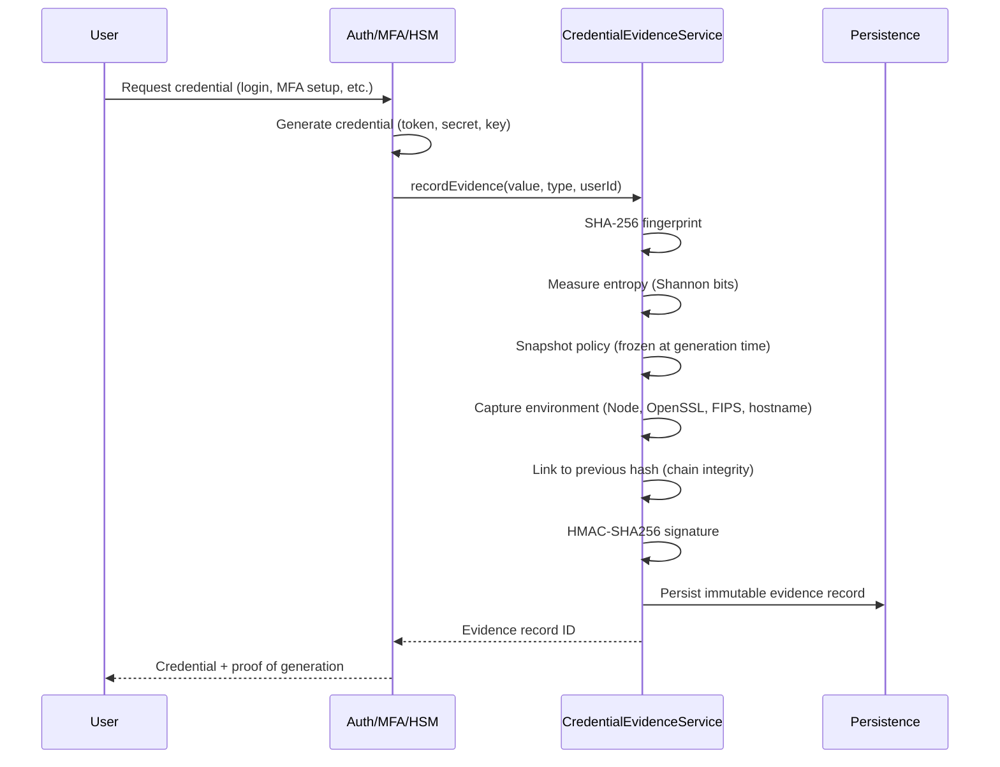
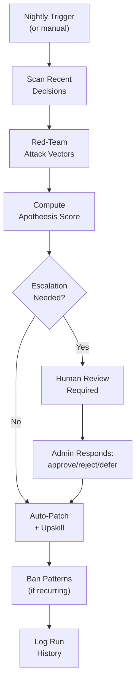
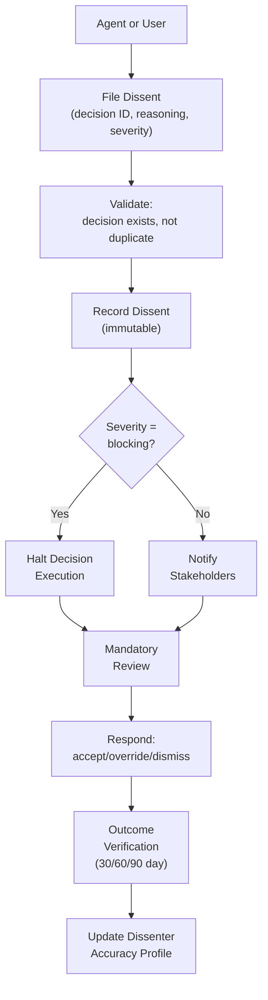
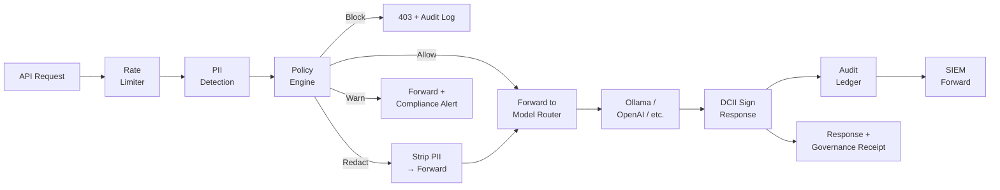
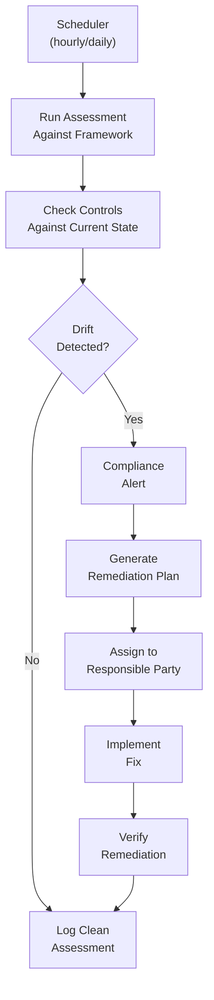

# Datacendia Enterprise Workflows

## Complete Process Documentation for Enterprise Operations

---

**Last Updated:** April 15, 2026 — Audit-verified against codebase

# Table of Contents

1. [User Onboarding](#1-user-onboarding-workflows)
2. [Council Deliberation](#2-council-deliberation-workflows)
3. [Crisis Management](#3-crisis-management-workflows)
4. [Compliance & Audit](#4-compliance--audit-workflows)
5. [Data Integration](#5-data-integration-workflows)
6. [Agent Management](#6-agent-management-workflows)
7. [Decision Approval](#7-decision-approval-workflows)
8. [Reporting & Analytics](#8-reporting--analytics-workflows)
9. [Credential Evidence](#9-credential-evidence-workflows) — NEW
10. [CendiaApotheosis™](#10-cendiaApotheosis-self-improvement-workflows) — NEW
11. [CendiaDissent™](#11-cendiadissent-protected-dissent-workflows) — NEW
12. [CendiaGateway™](#12-cendiagateway-ai-governance-workflows) — NEW
13. [Sovereign Deployment](#13-sovereign-deployment-workflows) — NEW
14. [Compliance Monitoring](#14-compliance-workflows) — NEW

See also: [WORKFLOWS_EXTENDED.md](./WORKFLOWS_EXTENDED.md) for additional workflows.

---

# 1. User Onboarding Workflows

## 1.1 New Employee Onboarding

```
START → HR Trigger → Auto-Provision Account → Role Mapping → Onboarding Wizard → Training → Verification → END

ROLE MAPPING (by department):
├── Finance      → CFO Agent access
├── Operations   → COO Agent access  
├── Security     → CISO Agent access
├── Executive    → All Agents + Veto authority
└── Analyst      → Read + Deliberate only
```

## 1.2 New Organization Setup

```
PHASE 1: TENANT PROVISIONING (30 min)
├── Create tenant (name, slug, tier, region)
├── Provision infrastructure (DB, storage, API keys)
└── Configure SSO (SAML/OIDC)

PHASE 2: DATA INTEGRATION (60 min)
├── Connect data sources (ERP, CRM, warehouse)
├── Schema mapping
└── Knowledge graph seeding

PHASE 3: AGENT CONFIGURATION (45 min)
├── Select default agents
├── Configure personas
└── Create custom agents (optional)

PHASE 4: USER SETUP (30 min)
├── Bulk user import
├── Configure teams
└── Admin training

PHASE 5: VALIDATION (15 min)
├── Test deliberation
├── Security verification
└── Handoff to Customer Success
```

---

# 2. Council Deliberation Workflows

## 2.1 Standard Deliberation Flow

```
USER QUESTION
     │
     ▼
┌─────────────────────────────────────────────────────────────┐
│ 1. QUERY ANALYSIS                                           │
│    • Intent detection, entity extraction                    │
│    • Context gathering, agent selection                     │
└─────────────────────────────────────────────────────────────┘
     │
     ▼
┌─────────────────────────────────────────────────────────────┐
│ 2. PARALLEL AGENT ANALYSIS                                  │
│    CFO: Financial    COO: Operational    CMO: Market        │
│    CISO: Security    Risk: Assessment    Chief: Strategy    │
└─────────────────────────────────────────────────────────────┘
     │
     ▼
┌─────────────────────────────────────────────────────────────┐
│ 3. CROSS-EXAMINATION                                        │
│    Agents challenge each other's conclusions                │
│    Rebuttals strengthen or modify positions                 │
└─────────────────────────────────────────────────────────────┘
     │
     ▼
┌─────────────────────────────────────────────────────────────┐
│ 4. SYNTHESIS                                                │
│    • Unified recommendation with confidence score           │
│    • Key risks and next actions                             │
│    • Decision logged with full audit trail                  │
└─────────────────────────────────────────────────────────────┘
```

## 2.2 Governed Deliberation (Approval Required)

```
DELIBERATION COMPLETE
     │
     ▼
GOVERNANCE CHECK: Is decision >$100K, cross-dept, or compliance-related?
     │
     ├── NO  → Auto-approved, log and proceed
     │
     └── YES → APPROVAL WORKFLOW
               │
               ├── Level 1 (<$100K): Department Head, SLA 4 hours
               ├── Level 2 ($100K-$1M): VP/Director, SLA 24 hours
               └── Level 3 (>$1M): C-Suite/Board, SLA 72 hours
               │
               └── APPROVER OPTIONS:
                   • APPROVE → Proceed to next level or execute
                   • REJECT → Return with feedback
                   • REQUEST CHANGES → Re-deliberate with guidance
                   • ESCALATE → Next level approver
                   • VETO → Decision blocked (audit logged)
```

## 2.3 Emergency Deliberation (War Room)

```
CRISIS TRIGGER → WAR ROOM ACTIVATION → RAPID INTAKE
     │
     ▼
PARALLEL EMERGENCY ANALYSIS (5 min/agent limit)
     │
     ▼
OPTIONS GENERATION (3-4 options with pros/cons)
     │
     ▼
LIVE DECISION SESSION (stakeholders + executive decision maker)
     │
     ▼
DECISION → Assign owner, set timeline, allocate resources
     │
     ▼
EXECUTION TRACKING (15-min check-ins, status dashboard)
     │
     ▼
POST-MORTEM (within 72 hours)
```

---

# 3. Crisis Management Workflows

## 3.1 Security Incident Response

```
DETECTION (SIEM, user report, scan, third-party)
     │
     ▼
TRIAGE (15 min max)
├── P1: Active breach → Incident Commander assigned
├── P2: Confirmed vulnerability → Security Lead
├── P3: Suspicious activity → Standard review
└── P4: False positive → Log and close
     │
     ▼ (P1/P2)
CONTAINMENT (First 60 min)
├── Isolate affected systems
├── Revoke compromised credentials
├── Block malicious IPs/domains
├── Preserve evidence
└── Snapshot systems
     │
     ▼
COUNCIL WAR ROOM (CISO + Risk + CMO)
└── Response strategy + communication plan
     │
     ▼
ERADICATION → RECOVERY → NOTIFICATION → POST-INCIDENT
```

## 3.2 PR Crisis Response

```
ALERT → ASSESS SEVERITY (Reach, Credibility, Velocity, Influencers)
     │
     ├── Score >7 = Crisis
     │
     ▼
COUNCIL EMERGENCY DELIBERATION (CMO + Risk + Ethics)
└── Core message, spokesperson, channel strategy, timeline
     │
     ▼
HOLDING STATEMENT (within 60 min)
     │
     ▼
FULL RESPONSE (within 4 hours)
     │
     ▼
STAKEHOLDER OUTREACH (Employees → Customers → Partners → Investors)
     │
     ▼
MONITORING & ADJUSTMENT → RESOLUTION
```

---

# 4. Compliance & Audit Workflows

## 4.1 Audit Preparation Timeline

```
T-90 DAYS: PLANNING
├── Audit scope confirmation
├── Team assignment
└── Timeline creation

T-60 DAYS: READINESS ASSESSMENT
├── Council Deliberation: "What's our risk and remediation priority?"
├── Gap analysis by control domain
├── Risk-ranked remediation list
└── Projected finding count

T-45 DAYS: REMEDIATION
├── Critical gaps addressed
├── Evidence gathering begins
└── Weekly status meetings

T-14 DAYS: MOCK AUDIT
├── Internal walkthrough
├── Finding simulation
└── Final remediation sprint

T-7 DAYS: FINAL PREP
├── Evidence package complete
├── Team briefing
└── Logistics confirmed

AUDIT WEEK: EXECUTION
├── Daily standups
├── Real-time Council queries for auditor questions
└── Finding response

POST-AUDIT: CLOSEOUT
├── Exit meeting
├── Management response
└── Lessons learned
```

## 4.2 Policy Change Workflow

```
TRIGGER (new regulation, audit finding, business change)
     │
     ▼
IMPACT ASSESSMENT → COUNCIL DELIBERATION (Risk + Ethics + COO)
     │
     ▼
DRAFT POLICY → STAKEHOLDER REVIEW → APPROVAL
     │
     ▼
COMMUNICATION → TRAINING → EFFECTIVENESS MONITORING
```

---

# 5. Data Integration Workflows

## 5.1 New Data Source Connection

```
REQUEST → REQUIREMENTS GATHERING → SECURITY REVIEW
     │
     ▼
CONNECTOR CONFIGURATION
├── Databases: PostgreSQL, MySQL, SQL Server, MongoDB, Oracle
├── SaaS: Salesforce, HubSpot, SAP, NetSuite, Workday
├── Warehouses: Snowflake, BigQuery, Redshift, Databricks
├── Files: CSV/Excel, Google Sheets, S3/GCS
├── APIs: REST, GraphQL, Webhooks
└── Streaming: Kafka, Kinesis, Pub/Sub
     │
     ▼
SCHEMA MAPPING (source fields → Datacendia models)
     │
     ▼
INITIAL SYNC → SCHEDULE CONFIGURATION → MONITORING SETUP → VALIDATION
```

---

# 6. Agent Management Workflows

## 6.1 Custom Agent Creation

```
REQUEST → REQUIREMENTS DEFINITION
     │
     ▼
PERSONA CONFIGURATION
├── Name, avatar, color
├── Expertise domains
├── Industry context
└── Personality traits (conservative vs aggressive)
     │
     ▼
KNOWLEDGE CONFIGURATION
├── Data sources
├── Context window
└── Region/industry focus
     │
     ▼
BEHAVIOR TUNING
├── Response style
├── Challenge threshold
└── Confidence calibration
     │
     ▼
TESTING → APPROVAL → DEPLOYMENT → MONITORING
```

## 6.2 Agent Performance Review (Monthly/Quarterly)

```
METRICS COLLECTION (per agent)
├── Deliberations participated
├── Avg response time
├── Challenges given/received
├── User feedback scores
└── Synthesis influence rate
     │
     ▼
FEEDBACK ANALYSIS → CALIBRATION DELIBERATION
     │
     ▼
TUNING RECOMMENDATIONS → IMPLEMENTATION → A/B TEST → CONFIRM
```

---

# 7. Decision Approval Workflows

## 7.1 Multi-Level Approval Chain

```
DECISION SUBMITTED
     │
     ▼
APPROVAL ROUTING (rules engine)
├── Dollar threshold → Determines level
├── Cross-department → Adds relevant executives
└── Category (M&A, compliance) → Adds specialists
     │
     ▼
APPROVAL CHAIN (parallel + sequential)
├── Level 1: Department Head (SLA: 4 hrs)
├── Level 2: VP/Director (SLA: 24 hrs)  
├── Level 3: C-Suite/Board (SLA: 72 hrs)
└── Parallel: Legal, CTO (if applicable)
     │
     ▼
SLA ESCALATION
├── 50% elapsed → Reminder
├── 75% elapsed → Urgent reminder + manager CC
├── 100% elapsed → Auto-escalate to next level
└── 150% elapsed → Executive alert + compliance flag
```

## 7.2 Veto Process

```
VETO EXERCISED BY EXECUTIVE
     │
     ▼
VETO LOGGED (full audit trail)
├── Decision ID
├── Veto authority
├── Timestamp
├── Reason (required)
└── Supporting evidence
     │
     ▼
NOTIFICATIONS
├── Submitter notified
├── All approvers notified
├── Audit committee notified (if >$500K)
└── Board notified (if >$1M)
     │
     ▼
DECISION BLOCKED (cannot be resubmitted without modification)
```

---

# 8. Reporting & Analytics Workflows

## 8.1 Executive Dashboard Generation

```
SCHEDULE TRIGGER (daily/weekly/monthly)
     │
     ▼
DATA AGGREGATION
├── Deliberation metrics
├── Decision outcomes
├── Agent performance
├── User engagement
└── ROI tracking
     │
     ▼
COUNCIL SUMMARY GENERATION
├── Key decisions this period
├── Emerging themes
├── Risk highlights
└── Recommended focus areas
     │
     ▼
DISTRIBUTION (email, Slack, dashboard)
```

## 8.2 ROI Calculation Workflow

```
DECISION OUTCOME RECORDED
     │
     ▼
BASELINE COMPARISON
├── What was decided
├── What was the alternative (without Council)
├── Estimated time saved
└── Estimated cost avoided
     │
     ▼
OUTCOME TRACKING (30/60/90 days)
├── Was recommendation followed?
├── Actual results vs predicted
├── Variance analysis
└── Confidence calibration update
     │
     ▼
ROI CALCULATION
├── Time savings × hourly rate
├── Better decisions (measured outcomes)
├── Risk avoided (estimated exposure)
└── Total value delivered
```

---

# 9. Credential Evidence Workflows

## 9.1 Credential Generation with Proof-at-Creation



## 9.2 Compliance Audit Export

```
AUDITOR REQUEST → AUTHENTICATE (admin role required)
     │
     ▼
EXPORT AUDIT PACKAGE
├── All evidence records (filtered by date range)
├── Hash chain verification result
├── Policy snapshots at each generation time
├── Environment context for each credential
├── Chain integrity proof (predecessor linkage)
└── HMAC signatures for tamper detection
     │
     ▼
AUDITOR RECEIVES: JSON bundle with Merkle-style proof
```

---

# 10. CendiaApotheosis™ Self-Improvement Workflows

## 10.1 Nightly Red-Team Cycle



## 10.2 Escalation Response

```
ESCALATION CREATED (severity > threshold)
     │
     ▼
NOTIFICATION → Admin dashboard + email
     │
     ▼
ADMIN REVIEWS:
├── View attack vector details
├── View affected decisions
├── View proposed remediation
└── Decide: APPROVE / REJECT / DEFER
     │
     ▼
IF APPROVE → Auto-apply patch + update banned patterns
IF REJECT  → Log reasoning, no action
IF DEFER   → Re-queue for next cycle
```

---

# 11. CendiaDissent™ Protected Dissent Workflows

## 11.1 Filing a Dissent



## 11.2 Retaliation Detection

```
DISSENT FILED → BASELINE CAPTURED (dissenter's metrics, access, assignments)
     │
     ▼
MONITORING (continuous for 90 days)
├── Access pattern changes
├── Assignment changes
├── Performance review anomalies
└── Communication exclusion patterns
     │
     ▼
FLAG DETECTED? → RETALIATION ALERT
├── Alert compliance officer
├── Log evidence
├── Freeze affected actions
└── Mandatory investigation (SLA: 48 hours)
```

---

# 12. CendiaGateway™ AI Governance Workflows

## 12.1 Request Processing Pipeline



---

# 13. Sovereign Deployment Workflows

## 13.1 Air-Gap Data Ingest (Data Diode)

```
EXTERNAL DATA SOURCE
     │
     ▼ (one-way only)
DATA DIODE
├── Accept formats: GRIB, CSV, JSON, XML, binary
├── Quarantine all incoming data
├── ClamAV antivirus scan
├── Signature verification (if signed)
└── Hash integrity check
     │
     ▼
ADMITTED TO SOVEREIGN ENCLAVE
├── Schema validation
├── Insert into operational database
└── Audit log entry (source, timestamp, hash)
```

## 13.2 QR Air-Gap Bridge Transfer

```
SENDER (connected network)
     │
     ▼
ENCODE DATA → Fragment into QR sequences
├── Max payload per frame: configurable
├── Reed-Solomon error correction
├── Sequence numbering + checksums
└── Display animated QR sequence
     │
     ▼ (camera / optical gap)
RECEIVER (air-gapped network)
├── Decode QR frames
├── Reassemble payload
├── Verify checksums
└── Import into sovereign enclave
```

## 13.3 Federated Mesh Learning

```
SITE A                    SITE B                    SITE C
  │                         │                         │
  ▼                         ▼                         ▼
Local Training          Local Training          Local Training
  │                         │                         │
  ▼                         ▼                         ▼
Differential Privacy    Differential Privacy    Differential Privacy
Noise Injection         Noise Injection         Noise Injection
  │                         │                         │
  └────────── Sneakernet (USB/Tape) ──────────────────┘
                            │
                            ▼
                    Aggregate Gradients
                    (no raw data shared)
                            │
                            ▼
                    Updated Global Model
                    Distributed back to sites
```

---

# 14. Compliance Workflows

## 14.1 Continuous Compliance Monitoring



## 14.2 Regulator's Receipt™ Generation

```
DECISION FINALIZED
     │
     ▼
EVIDENCE COLLECTION
├── Decision record (full deliberation)
├── Agent analyses (all participants)
├── Compliance mappings (applicable frameworks)
├── Risk assessment scores
└── Approval chain (who approved, when)
     │
     ▼
RECEIPT GENERATION
├── Merkle tree of all evidence
├── RFC 3161 timestamp
├── Digital signature (HSM-backed)
└── Jurisdiction-specific formatting
     │
     ▼
RECEIPT DELIVERED
├── Stored in Evidence Vault (immutable)
├── Available for regulator download
└── Cross-referenced in audit ledger
```

---

## Quick Reference: Workflow Triggers

| Workflow | Trigger | SLA |
|----------|---------|-----|
| User Onboarding | HR record created | 30 min |
| Standard Deliberation | User submits question | 5 min |
| Governed Deliberation | High-stakes question | 4-72 hrs |
| Emergency (War Room) | Crisis detected | 30 min |
| Security Incident | SIEM alert | 15 min triage |
| PR Crisis | Social listening alert | 60 min |
| Audit Prep | T-90 days | 90 days |
| Policy Change | Regulation/finding | 2-4 weeks |
| Data Integration | Business request | 1-5 days |
| Custom Agent | Business need | 1 hour |
| Approval Chain | Decision submitted | 4-72 hrs |
| Veto | Executive action | Immediate |
| Credential Evidence | Credential generated | Immediate (sync) |
| Apotheosis Red-Team | Nightly cron / manual | 24 hrs |
| Apotheosis Escalation | Severity > threshold | 4 hrs |
| Dissent Filing | Agent/user action | Immediate |
| Retaliation Detection | Continuous monitoring | 48 hrs investigation |
| Gateway PII Scan | Every API request | Real-time |
| Data Diode Ingest | External data push | 5 min scan |
| QR Air-Gap Transfer | Manual initiation | Per-session |
| Compliance Monitoring | Hourly/daily schedule | Per framework |
| Regulator's Receipt | Decision finalized | Immediate |

---

See [WORKFLOWS_EXTENDED.md](./WORKFLOWS_EXTENDED.md) for additional workflows including:
- Vendor Evaluation
- Budget Planning
- M&A Due Diligence
- Product Launch
- Customer Escalation
- Change Management
- Capacity Planning
- Contract Review
- Board Meeting Prep
- Quarterly Business Review

---

*Updated April 15, 2026 — Audit-verified against codebase*
