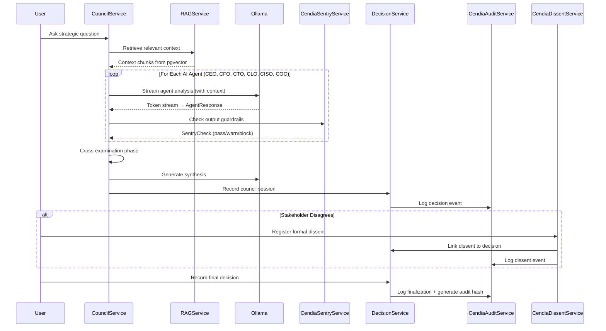
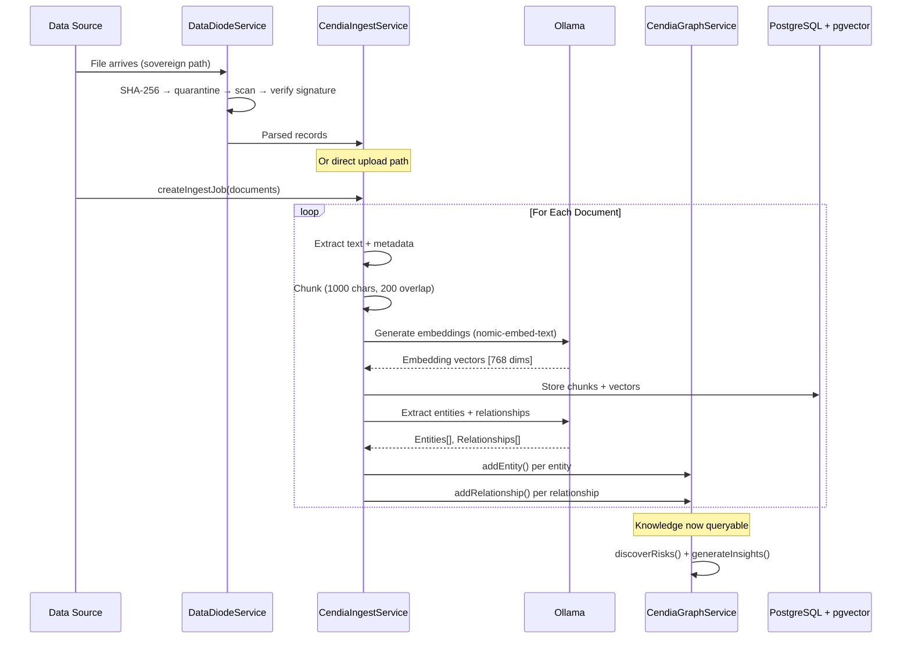
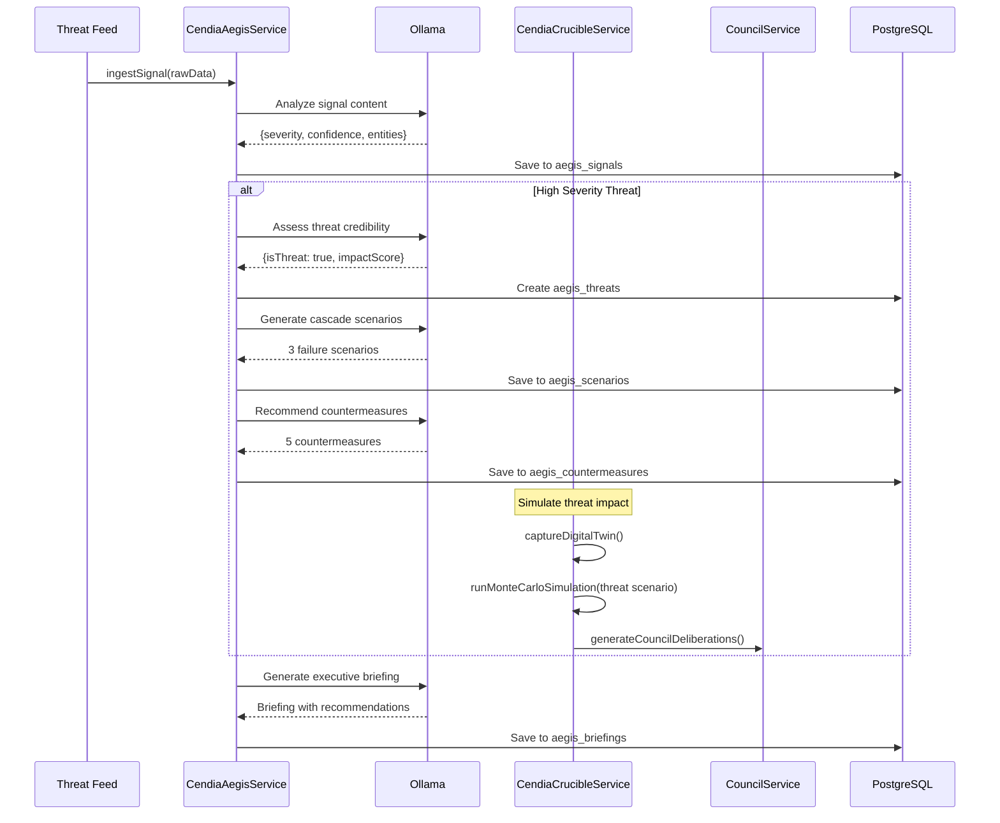

# Datacendia Platform — Service Architecture Overview

> **Purpose:** Master diagram showing how all platform services interact and depend on each other.

## Full Platform Service Map

```mermaid
flowchart TB
    subgraph "User Layer"
        UI["Frontend (React + TanStack Router)"]
        WS["WebSocket Client"]
    end

    subgraph "Core Decision Engine"
        CS["CouncilService<br/>AI Deliberation Engine"]
        DS["DecisionService<br/>Decision Black Box"]
        DL["DeliberationService<br/>Legacy Deliberation"]
    end

    subgraph "AI & LLM Layer"
        LLM["EnhancedLLMService<br/>RAG + Caching + Routing + Ensemble"]
        OL["Ollama<br/>(qwen2.5, qwq, llama3.2, nomic-embed-text)"]
        RAG["RAGService<br/>Vector Retrieval"]
    end

    subgraph "Security & Compliance"
        AE["CendiaAegisService<br/>Threat Intelligence"]
        SE["CendiaSentryService<br/>AI Guardrails"]
        PA["CendiaPanopticonService<br/>Global Regulation Engine"]
        AU["CendiaAuditService<br/>Tamper-Proof Audit Trail"]
    end

    subgraph "Simulation & Testing"
        CR["CendiaCrucibleService<br/>Monte Carlo Simulation"]
        RT["EnterpriseRedTeamService<br/>Red Team Attacks"]
        RS["RuntimeSecurityService<br/>Runtime Monitoring"]
        SB["SBOMService<br/>Supply Chain Analysis"]
    end

    subgraph "Data & Knowledge"
        IG["CendiaIngestService<br/>Vectorization Pipeline"]
        GR["CendiaGraphService<br/>Knowledge Graph"]
        DD["DataDiodeService<br/>Sovereign Ingest"]
        FM["FederatedMeshService<br/>Multi-Org Federation"]
    end

    subgraph "Strategic Services"
        DI["CendiaDissentService<br/>Formal Disagreement"]
        LG["LogicGateService<br/>Parallel Processing"]
    end

    subgraph "Storage Layer"
        PG["PostgreSQL + pgvector"]
        CH["ClickHouse (Analytics)"]
        DR["Druid (Events)"]
        MN["MinIO (Object Storage)"]
        VS["VectorService (Embeddings)"]
    end

    %% User → Core
    UI -->|"REST API"| CS
    UI -->|"REST API"| DS
    WS -->|"Real-time Stream"| CS

    %% Core → AI
    CS -->|"Stream LLM Calls"| OL
    CS -->|"Retrieve Context"| RAG
    DL -->|"Generate Analysis"| LLM
    LLM -->|"Model Inference"| OL
    LLM -->|"Vector Search"| RAG
    RAG -->|"Cosine Similarity"| PG

    %% Core → Decision
    CS -->|"Record Sessions"| DS
    DI -->|"Register Dissent"| DS

    %% Security flows
    CS -->|"Check Output"| SE
    SE -->|"Log Issues"| AU
    AE -->|"Analyze Signals"| LLM
    PA -->|"Parse Regulations"| LLM
    CR -->|"Generate Scenarios"| LLM

    %% Data flows
    DD -->|"Parsed Records"| IG
    IG -->|"Entities + Relations"| GR
    IG -->|"Embeddings"| OL
    IG -->|"Store Vectors"| PG

    %% Parallel processing
    LG -->|"Executes"| CS
    LG -->|"Executes"| CR
    LG -->|"Executes"| AE

    %% Storage
    CS -->|"Persist"| PG
    DS -->|"Persist"| PG
    AE -->|"Persist"| PG
    PA -->|"Persist"| PG
    CR -->|"Persist"| PG
    AU -->|"Persist"| PG
    CS -->|"Analytics"| DR

    style CS fill:#6366f1,color:#fff
    style LLM fill:#3b82f6,color:#fff
    style AE fill:#ef4444,color:#fff
    style SE fill:#f59e0b,color:#fff
    style CR fill:#8b5cf6,color:#fff
    style GR fill:#10b981,color:#fff
    style PG fill:#6b7280,color:#fff
```

## Data Flow: Question → Decision

## Data Flow: Document → Knowledge

## Data Flow: Threat → Response

## Service Dependency Matrix

| Service | Depends On | Depended On By |
|---------|-----------|----------------|
| **CouncilService** | Ollama, RAGService, LegalToolExecutor, CouncilDecisionPacketService | DecisionService, Frontend |
| **DecisionService** | Prisma | CouncilService, DissentService, Frontend |
| **EnhancedLLMService** | Ollama, pgvector, Redis | AegisService, CrucibleService, PanopticonService, IngestService |
| **CendiaAegisService** | EnhancedLLMService, Prisma | Dashboard, Executive Briefings |
| **CendiaSentryService** | CendiaAuditService | CouncilService, Any AI Output |
| **CendiaCrucibleService** | EnhancedLLMService, Prisma | Threat Response, Strategy Planning |
| **CendiaPanopticonService** | EnhancedLLMService, Prisma | Compliance Dashboard |
| **CendiaIngestService** | Ollama, CendiaGraphService | DataDiodeService, Document Upload |
| **CendiaGraphService** | Prisma, Ollama | CendiaIngestService, Risk Analysis, Search |
| **DataDiodeService** | File System, Crypto | CendiaIngestService |
| **CendiaDissentService** | Prisma, Chronos | DecisionService |
| **LogicGateService** | (none — general purpose) | CouncilService, CrucibleService, AegisService |
| **CendiaAuditService** | Crypto (hash chain) | CendiaSentryService, All Services |
