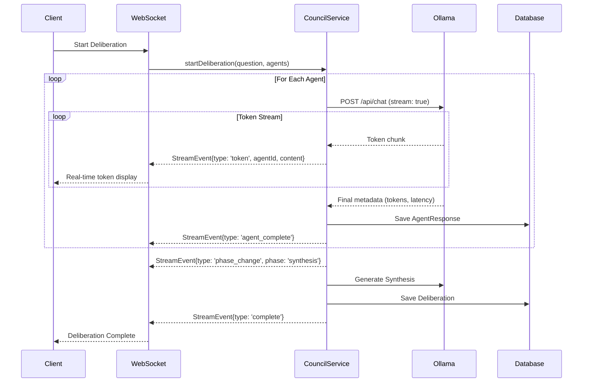

# Council Deliberation Workflow

> **Service:** `CouncilService` (`backend/src/services/council/CouncilService.ts`)
> **Purpose:** Enterprise AI deliberation engine with real-time streaming, cross-examination, memory, and persistence.

## Deliberation Lifecycle

```mermaid
flowchart TD
    A[User Submits Question] --> B[Create Deliberation Session]
    B --> C[Load Participating Agents from DB]
    C --> D{RAG Enabled?}
    D -->|Yes| E[RAGService: Retrieve Relevant Context]
    D -->|No| F[Build Agent Prompts]
    E --> F

    F --> G["Phase 1: Initial Analysis"]
    G --> H[Stream Ollama Response per Agent]
    H --> I[Collect AgentResponse with Confidence]
    I --> J[Save to deliberation_messages Table]
    J --> K{Cross-Examination Enabled?}

    K -->|Yes| L["Phase 2: Cross-Examination"]
    L --> M[Select Challenger & Target Agents]
    M --> N[Challenger Reviews Target Response]
    N --> O[Generate Challenge via LLM]
    O --> P[Target Generates Rebuttal via LLM]
    P --> Q[Record CrossExaminationThread]
    Q --> R{More Pairs to Examine?}
    R -->|Yes| M
    R -->|No| S["Phase 3: Synthesis"]

    K -->|No| S

    S --> T[Aggregate All Responses + Challenges]
    T --> U[LLM Generates Unified Synthesis]
    U --> V[Calculate Confidence Score]
    V --> W{Ethics Check Enabled?}

    W -->|Yes| X["Phase 4: Ethics Check"]
    X --> Y[ComplianceGuard Validates Output]
    Y --> Z{Passed?}
    Z -->|Yes| AA[Mark Deliberation COMPLETED]
    Z -->|No| AB[Flag Ethical Concerns]
    AB --> AA

    W -->|No| AA

    AA --> AC[Save to Prisma: deliberations Table]
    AC --> AD[Stream to DruidEventStream]
    AD --> AE[Record ChronosEvent on Timeline]
    AE --> AF[Emit WebSocket Events to Client]
    AF --> AG[Return Deliberation Result]

    style A fill:#6366f1,color:#fff
    style G fill:#3b82f6,color:#fff
    style L fill:#f59e0b,color:#fff
    style S fill:#10b981,color:#fff
    style X fill:#ef4444,color:#fff
    style AG fill:#6366f1,color:#fff
```

## Streaming Architecture

## Key Code References

- **Entry Point:** `CouncilService.startDeliberation()` — orchestrates all phases
- **Streaming:** `streamOllamaWithMetrics()` — streams from Ollama with real token metrics
- **Legal Tools:** `LegalToolExecutor` — parses and executes tool calls from agent responses
- **Decision Packets:** `CouncilDecisionPacketService` — traces all tool calls and decisions
- **RAG Context:** `RAGService.retrieve()` — retrieves relevant document chunks before agent prompts
- **Persistence:** Prisma `deliberations` + `deliberation_messages` tables
- **Analytics:** `DruidEventStream.logDecision()` + `ChronosEventBus.recordChronosEvent()`
