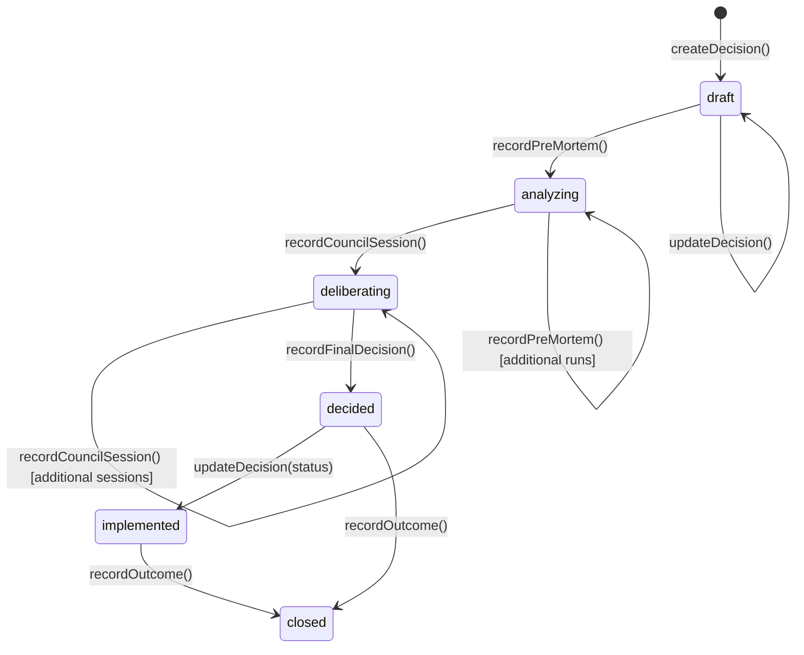
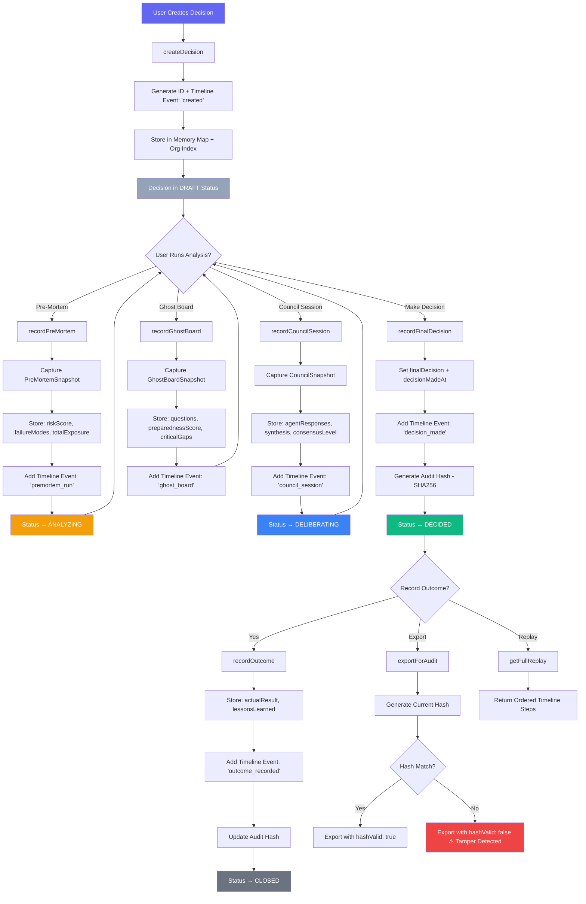
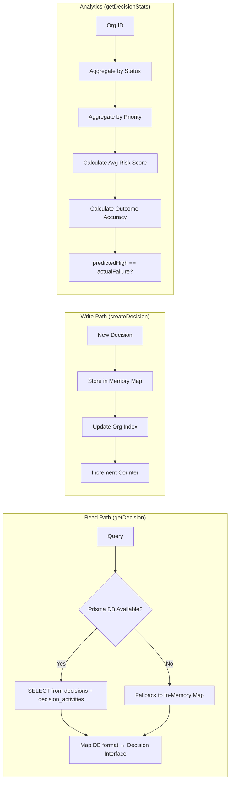

# Decision Lifecycle Workflow

> **Service:** `DecisionService` (`backend/src/services/DecisionService.ts`)
> **Purpose:** Full lifecycle tracking, replay, and audit trail for all decisions — the "Black Box Flight Recorder" for enterprise decisions.

## Decision State Machine

## Full Decision Flow

## Data Persistence Strategy

## Key Code References

- **CRUD:** `createDecision()`, `getDecision()`, `getDecisions()`, `updateDecision()`
- **Analysis Recording:** `recordPreMortem()`, `recordCouncilSession()`, `recordGhostBoard()`
- **Finalization:** `recordFinalDecision()` — generates tamper-detection audit hash
- **Outcome:** `recordOutcome()` — closes the loop with actual results + lessons learned
- **Replay:** `getFullReplay()` — returns every event in chronological order
- **Audit Export:** `exportForAudit()` — validates hash integrity for tamper detection
- **DB Tables:** `decisions`, `decision_activities` (Prisma)
