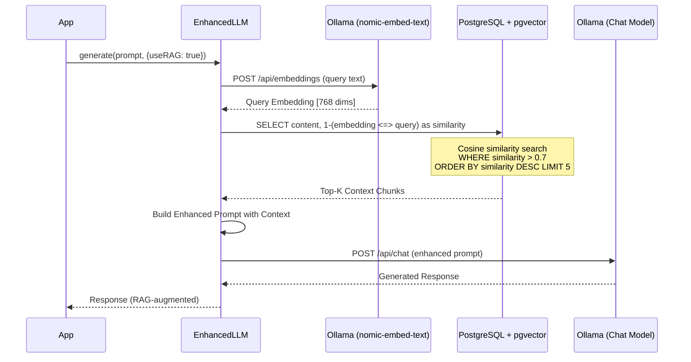
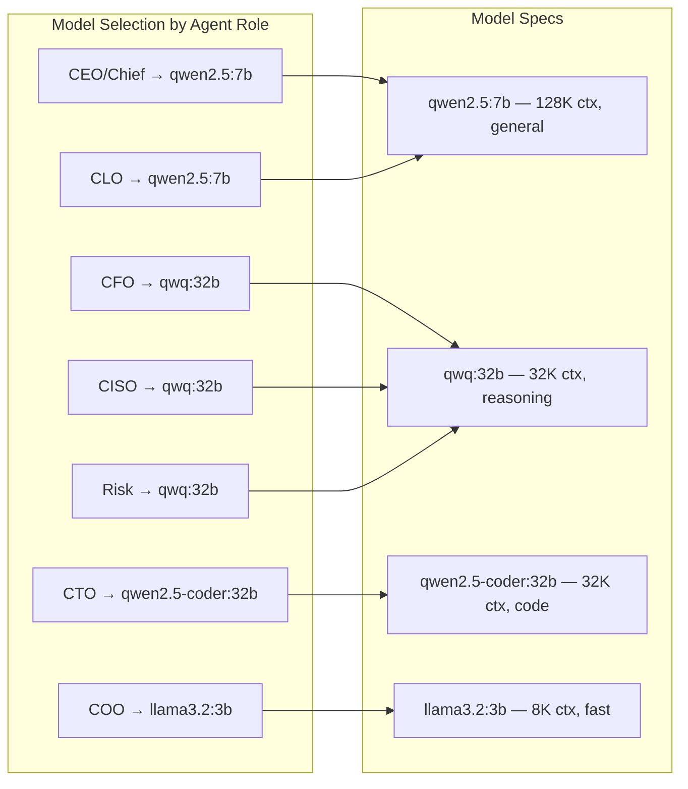

# Enhanced LLM Service Workflow

> **Service:** `EnhancedLLMService` (`backend/src/services/EnhancedLLMService.ts`)
> **Purpose:** Advanced LLM capabilities — RAG, caching, smart model routing, Chain of Thought, and ensemble generation.

## Main Generation Pipeline

```mermaid
flowchart TD
    A[generate&#40;prompt, options&#41;] --> B{"Step 1: Cache Check"}
    B -->|Cache Hit| C[Return Cached Response]
    B -->|Cache Miss| D["Step 2: classifyQuery&#40;&#41;"]

    D --> E{"Query Type Detection"}
    E -->|Code patterns| F["type: coding → qwen2.5-coder:32b"]
    E -->|Math patterns| G["type: reasoning → qwq:32b"]
    E -->|Financial patterns| H["type: analysis → qwq:32b"]
    E -->|Legal patterns| I["type: reasoning → qwen2.5:7b"]
    E -->|Short simple| J["type: simple → llama3.2:3b"]
    E -->|Default| K["type: factual → qwen2.5:7b"]

    F & G & H & I & J & K --> L["Step 3: selectOptimalModel&#40;&#41;"]
    L --> M{Agent Specified?}
    M -->|Yes| N[Use AGENT_MODEL_PREFERENCES map]
    M -->|No| O[Use Classification suggestion]
    N --> P{Model Available?}
    O --> P
    P -->|Yes| Q[Selected Model]
    P -->|No| R[Fallback to defaultModel]
    Q & R --> S{"Step 4: RAG Enabled?"}

    S -->|Yes| T[generateEmbedding&#40;query&#41;]
    T --> U["pgvector: cosine similarity search"]
    U --> V[Retrieve Top-K Context Chunks]
    V --> W[Prepend Context to Prompt]
    S -->|No| X[Use Original Prompt]

    W & X --> Y{"Step 5: Chain of Thought?"}
    Y -->|Yes| Z[Wrap with CoT Template]
    Y -->|No| AA[Keep Prompt As-Is]

    Z & AA --> AB{"Step 6: Ensemble?"}
    AB -->|Yes| AC[generateEnsemble&#40;&#41;]
    AB -->|No| AD[generateRaw&#40;&#41;]

    AC --> AE[Return Combined Response]
    AD --> AF[Return Single Response]

    AE & AF --> AG["Step 7: Cache Response"]
    AG --> AH[Return Final Response]

    style A fill:#6366f1,color:#fff
    style B fill:#f59e0b,color:#fff
    style D fill:#3b82f6,color:#fff
    style L fill:#10b981,color:#fff
    style S fill:#8b5cf6,color:#fff
    style AB fill:#ef4444,color:#fff
    style AH fill:#6366f1,color:#fff
```

## Ensemble Generation

```mermaid
flowchart TD
    A[generateEnsemble&#40;prompt, models, strategy&#41;] --> B[Filter Available Models]
    B --> C["Promise.all: Generate from All Models in Parallel"]

    C --> D[Model 1 Response]
    C --> E[Model 2 Response]
    C --> F[Model N Response]

    D & E & F --> G[estimateResponseConfidence per response]
    G --> H[Filter Out Failed Responses]

    H --> I{Strategy?}
    I -->|vote| J[combineByVoting: Pick Highest Confidence]
    I -->|best| K[Select Single Best Response]
    I -->|blend| L[synthesizeResponses via LLM]

    L --> M["qwen2.5:7b Synthesizes All Expert Responses"]
    M --> N[Unified Answer with Agreement/Disagreement Notes]

    J & K & N --> O[calculateAgreement: Word Overlap Jaccard]
    O --> P["Return EnsembleResult{responses, finalResponse, agreement}"]

    style A fill:#6366f1,color:#fff
    style C fill:#3b82f6,color:#fff
    style I fill:#f59e0b,color:#fff
    style P fill:#10b981,color:#fff
```

## RAG Pipeline

## Model Configuration Map

## Key Code References

- **Entry Point:** `generate()` — 7-step enhanced pipeline
- **Agent-Specific:** `generateForAgent()` — auto-selects CoT + ensemble based on complexity
- **Query Classification:** `classifyQuery()` — heuristic pattern matching for domain detection
- **Model Routing:** `selectOptimalModel()` — agent preferences → classification → default
- **RAG:** `retrieveContext()` + `generateEmbedding()` — pgvector cosine similarity
- **Caching:** Redis via `cache.get/set` with SHA-256 key generation
- **CoT Templates:** `reasoning`, `financial`, `technical`, `risk`, `legal`
- **Ensemble Strategies:** `vote` (highest confidence), `best` (single best), `blend` (LLM synthesis)
