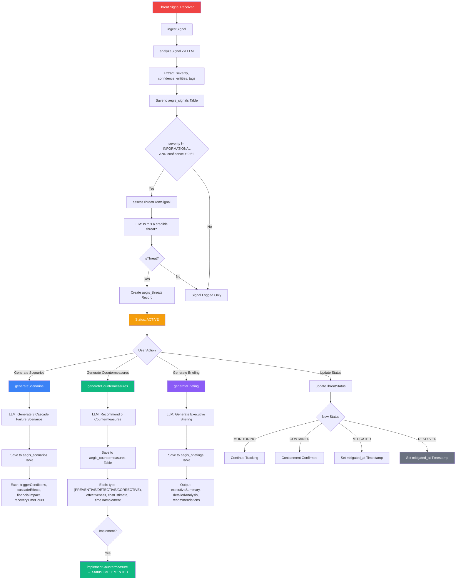
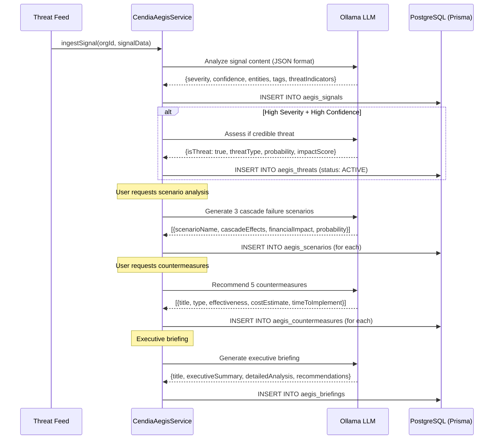
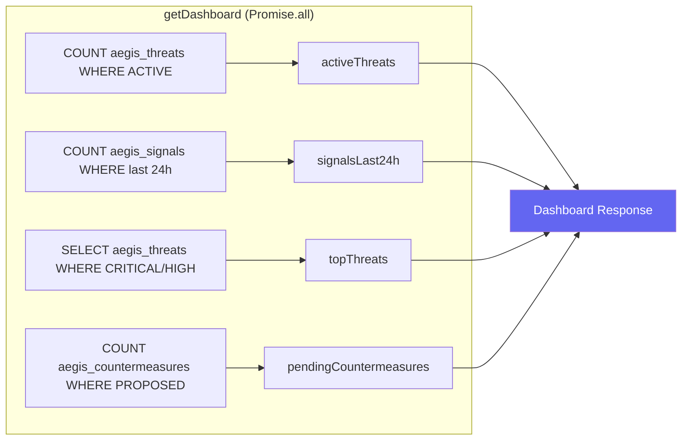

# CendiaAegis Threat Intelligence Workflow

> **Service:** `CendiaAegisService` (`backend/src/services/CendiaAegisService.ts`)
> **Purpose:** Real-time threat detection, containment, and resilience modeling — strategic defense intelligence.

## Signal-to-Briefing Pipeline

## Threat Assessment Sequence

## Dashboard Data Flow

## Key Code References

- **Signal Ingestion:** `ingestSignal()` — LLM-analyzed signal processing with auto-threat detection
- **Threat Assessment:** `assessThreatFromSignal()` — automatic credibility evaluation
- **Cascade Scenarios:** `generateScenarios()` — LLM-generated failure chain analysis
- **Countermeasures:** `generateCountermeasures()` — 5 typed countermeasures (PREVENTIVE/DETECTIVE/CORRECTIVE/DETERRENT/RECOVERY)
- **Briefings:** `generateBriefing()` — executive-ready intelligence reports
- **DB Tables:** `aegis_signals`, `aegis_threats`, `aegis_scenarios`, `aegis_countermeasures`, `aegis_briefings`
- **Threat Feeds:** 7 simulated sources (CISA, Reuters, Supply Chain Monitor, etc.)
