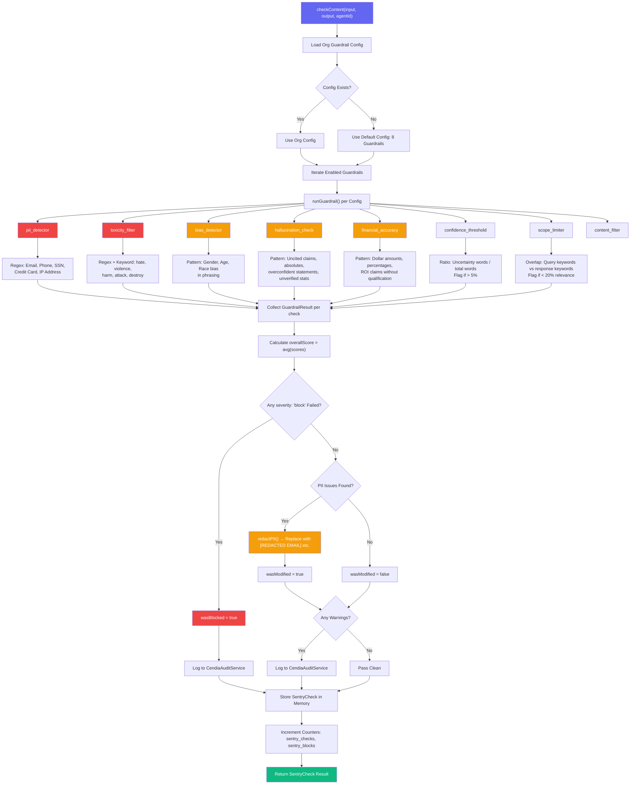
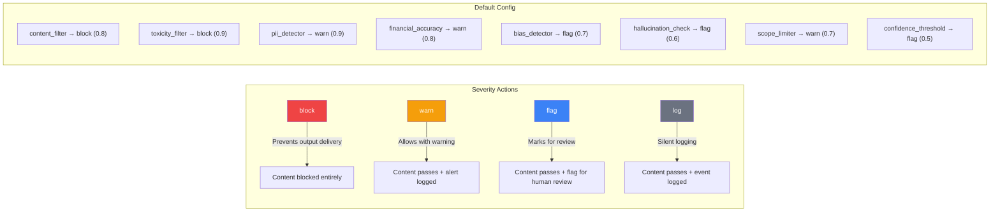
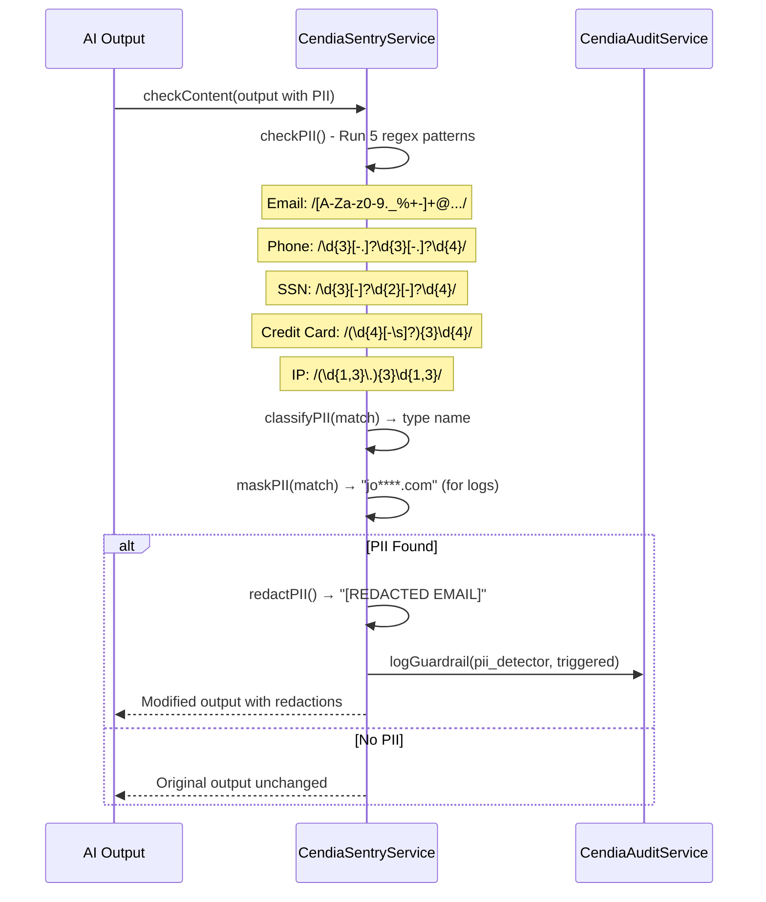

# CendiaSentry AI Guardrails Workflow

> **Service:** `CendiaSentryService` (`backend/src/services/CendiaSentryService.ts`)
> **Purpose:** AI output monitoring, guardrails, bias detection, hallucination prevention — the enforcement mechanism for CendiaEthics.

## Content Check Pipeline

## Guardrail Severity Levels

## PII Detection & Redaction

## Key Code References

- **Main Entry:** `checkContent()` — runs all enabled guardrails, returns `SentryCheck`
- **Guardrail Dispatch:** `runGuardrail()` — switch/case routing to individual checkers
- **PII:** `checkPII()` → `classifyPII()` → `maskPII()` → `redactPII()`
- **Toxicity:** `checkToxicity()` — regex patterns + keyword heuristics with context awareness
- **Bias:** `checkBias()` — gender, age bias pattern detection
- **Hallucination:** `checkHallucination()` — uncited claims, absolute statements, unverified stats
- **Financial:** `checkFinancialAccuracy()` — unrealistic claims, unqualified figures
- **Confidence:** `checkConfidence()` — uncertainty word ratio analysis
- **Scope:** `checkScope()` — query/response keyword overlap relevance scoring
- **Audit Integration:** Logged to `CendiaAuditService.logGuardrail()` on block/warn
- **Statistics:** `getStatistics()` — passRate, blockRate, issuesByType, averageScore
