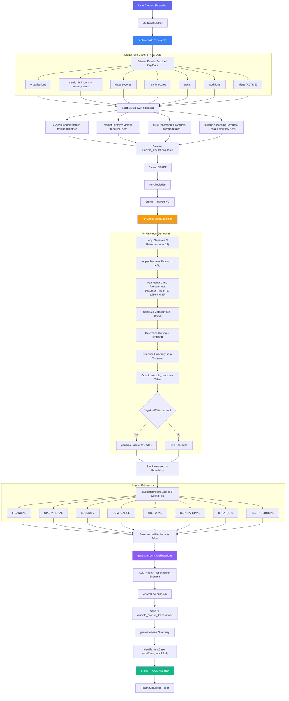
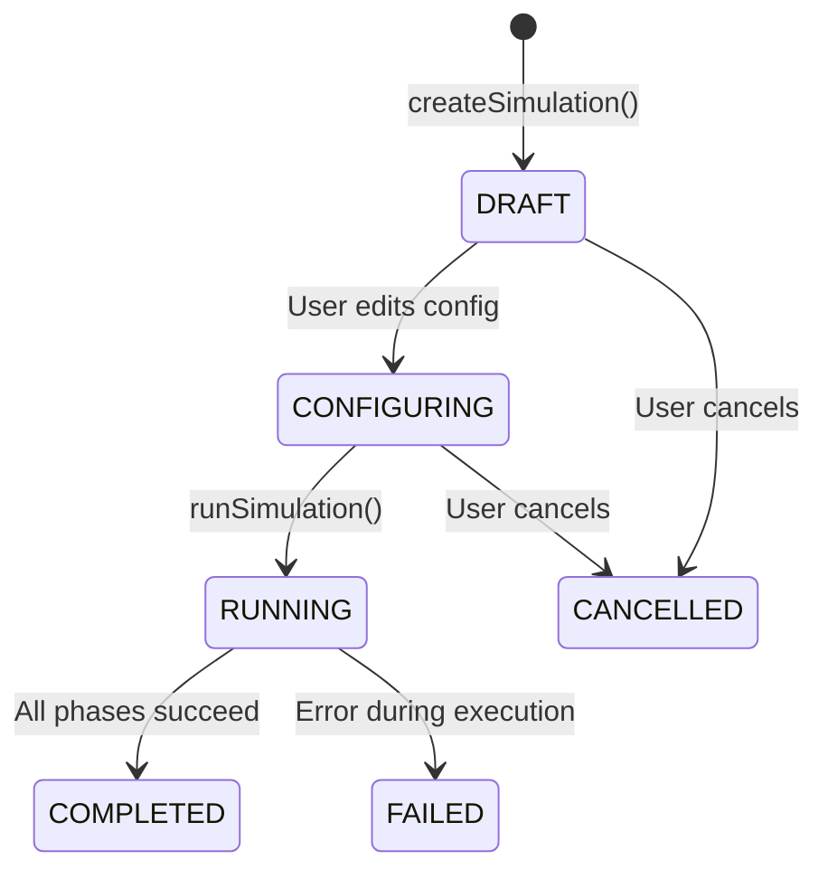
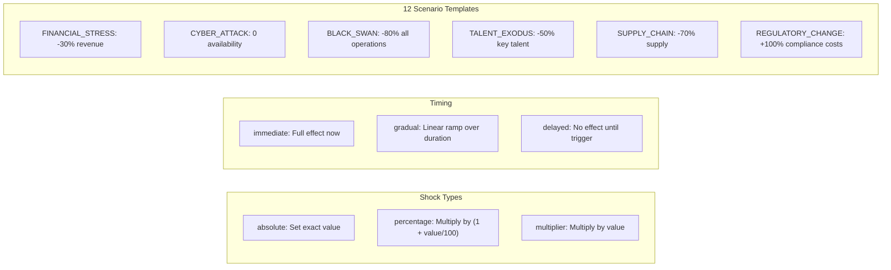

# CendiaCrucible Simulation Workflow

> **Service:** `CendiaCrucibleService` (`backend/src/services/CendiaCrucibleService.ts`)
> **Purpose:** Synthetic multiverse simulation engine — high-fidelity mathematical twin of the enterprise for stress testing, Monte Carlo prediction, and failure cascade mapping.

## Simulation Execution Pipeline

## Simulation State Machine

## Shock Application Logic

## Key Code References

- **Creation:** `createSimulation()` — captures real digital twin from all DB tables
- **Digital Twin:** `captureDigitalTwin()` — 7 parallel Prisma queries for real org data
- **Monte Carlo:** `runMonteCarloSimulation()` → `generateUniverse()` per iteration
- **Shock Math:** `applyShock()` — absolute/percentage/multiplier with Gaussian noise
- **Cascades:** `generateFailureCascades()` — for negative/catastrophic outcomes
- **Impacts:** `calculateImpacts()` — across 8 enterprise impact categories
- **Council AI:** `generateCouncilDeliberations()` — LLM-powered agent analysis of scenario
- **Summary:** `generateResultSummary()` — bestCase, worstCase, mostLikely identification
- **Templates:** 12 pre-built scenario templates (FINANCIAL_STRESS through CUSTOM)
- **DB Tables:** `crucible_simulations`, `crucible_universes`, `crucible_impacts`, `crucible_council_deliberations`
