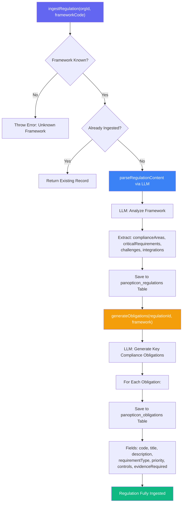
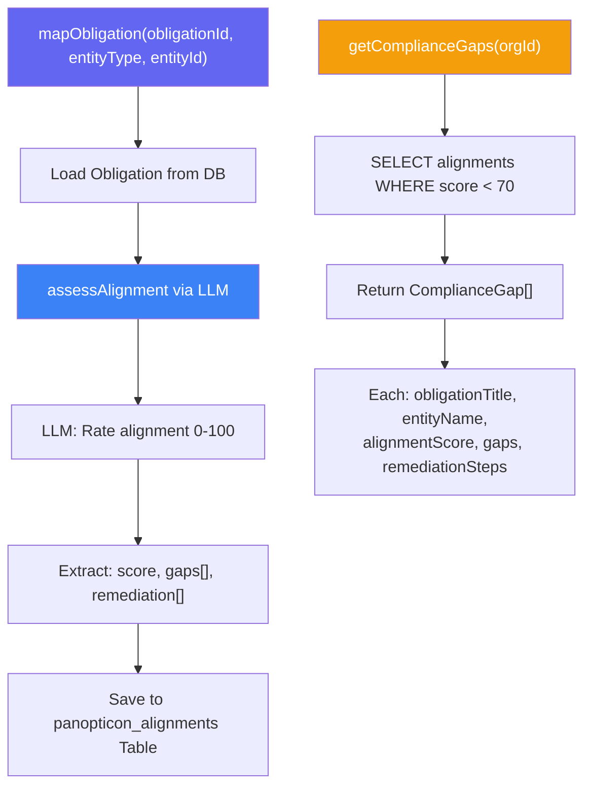
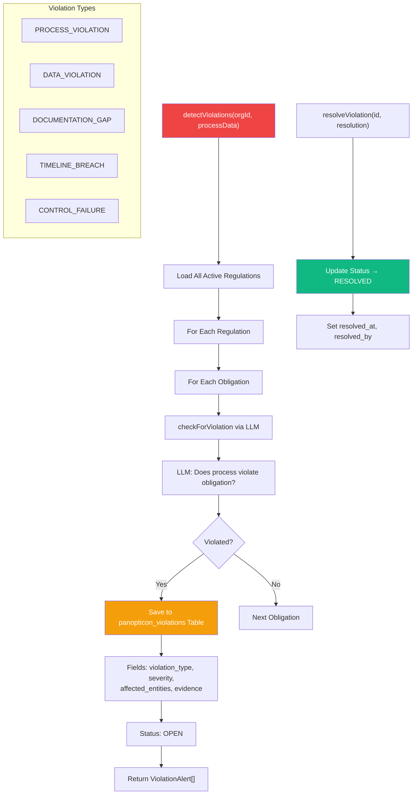
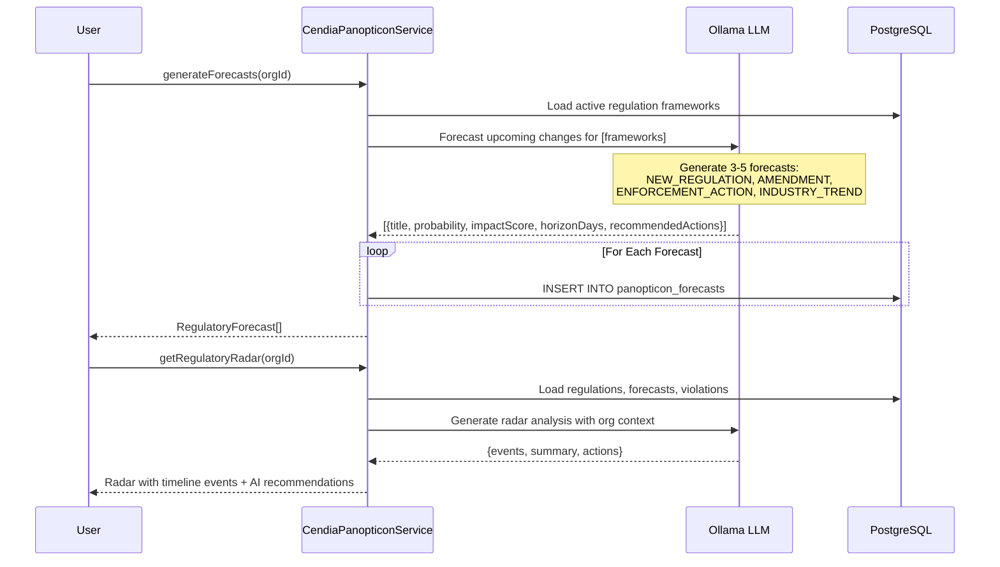
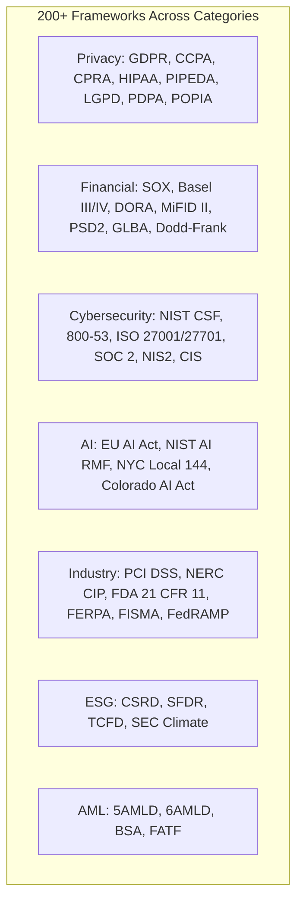

# CendiaPanopticon Compliance Workflow

> **Service:** `CendiaPanopticonService` (`backend/src/services/CendiaPanopticonService.ts`)
> **Purpose:** Global regulation engine — parse, map, align, detect violations, and forecast regulatory changes across 200+ frameworks and 50+ jurisdictions.

## Regulation Ingestion Pipeline

## Compliance Alignment & Gap Analysis

## Violation Detection Flow

## Regulatory Forecasting

## Framework Coverage

## Key Code References

- **Ingestion:** `ingestRegulation()` → `parseRegulationContent()` → `generateObligations()`
- **Alignment:** `mapObligation()` → `assessAlignment()` via LLM — score 0-100 with gaps
- **Gap Analysis:** `getComplianceGaps()` — all alignments scoring below 70
- **Violation Detection:** `detectViolations()` → `checkForViolation()` per obligation via LLM
- **Resolution:** `resolveViolation()` — tracks resolver and timestamp
- **Forecasting:** `generateForecasts()` — LLM-powered regulatory trend prediction
- **Radar:** `getRegulatoryRadar()` — timeline events with AI summary and recommended actions
- **DB Tables:** `panopticon_regulations`, `panopticon_obligations`, `panopticon_alignments`, `panopticon_violations`, `panopticon_forecasts`
- **Frameworks:** 200+ in `REGULATORY_FRAMEWORKS` constant (40+ explicitly defined)
