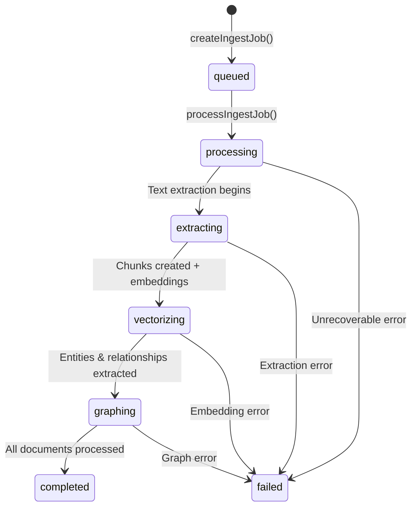
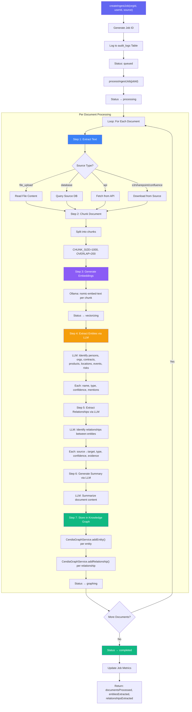
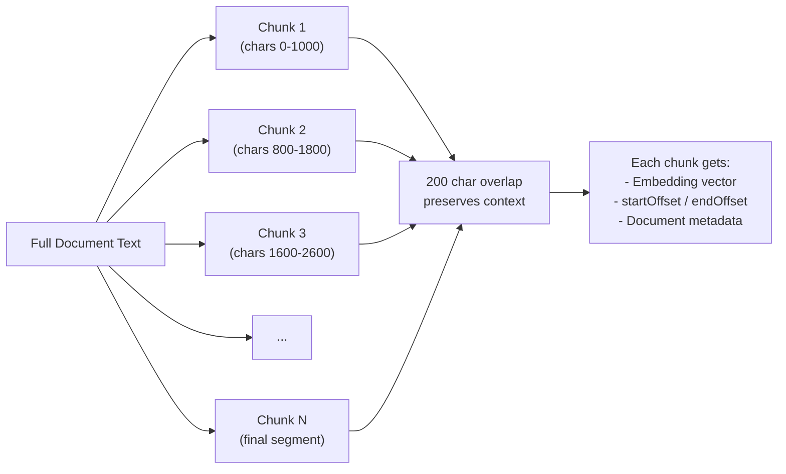
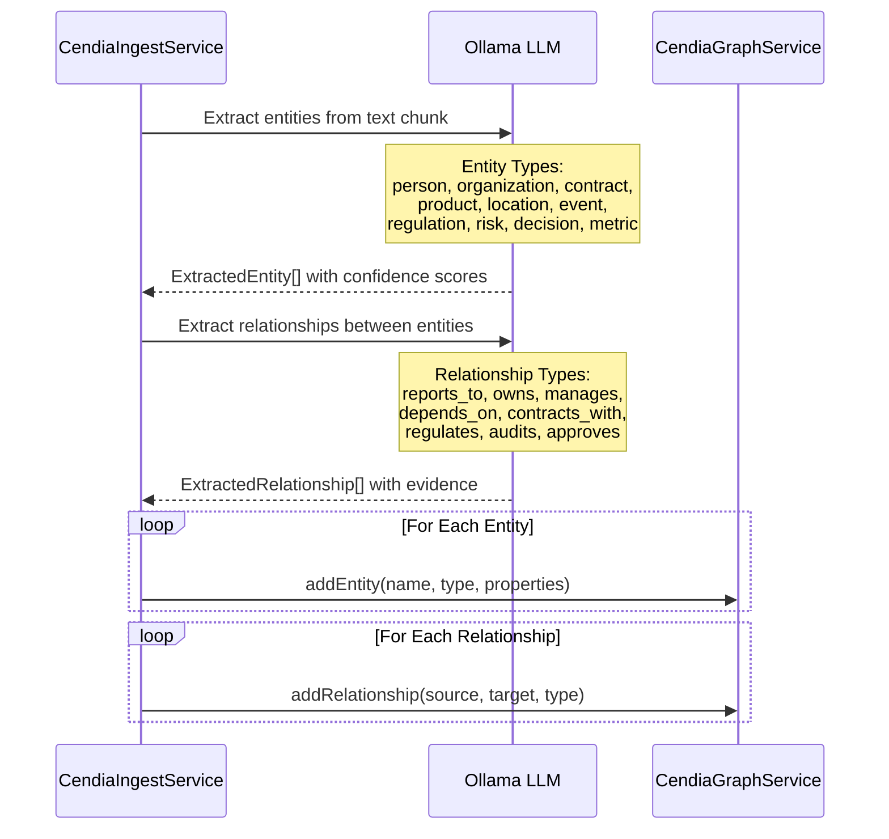

# CendiaIngest Data Pipeline Workflow

> **Service:** `CendiaIngestService` (`backend/src/services/strategic/CendiaIngestService.ts`)
> **Purpose:** Document processing and knowledge extraction — the vectorization pipeline that onboards data into the knowledge graph.

## Ingest Job Lifecycle

## Full Processing Pipeline

## Document Chunking Strategy

## Entity & Relationship Extraction

## Key Code References

- **Job Creation:** `createIngestJob()` — creates job with audit log entry
- **Processing:** `processIngestJob()` — orchestrates the full pipeline
- **Chunking:** `CHUNK_SIZE=1000`, `CHUNK_OVERLAP=200` — sliding window
- **Embeddings:** Ollama `nomic-embed-text` model for vector generation
- **Entity Extraction:** LLM-powered NER with 15 entity types
- **Relationship Extraction:** LLM-powered relation detection with 19 relationship types
- **Graph Storage:** `CendiaGraphService.addEntity()` + `addRelationship()`
- **Source Types:** `file_upload`, `database`, `api`, `s3`, `sharepoint`, `confluence`
- **Metrics:** `getMetrics()` — totalJobs, completedJobs, avgProcessingTimeMs
