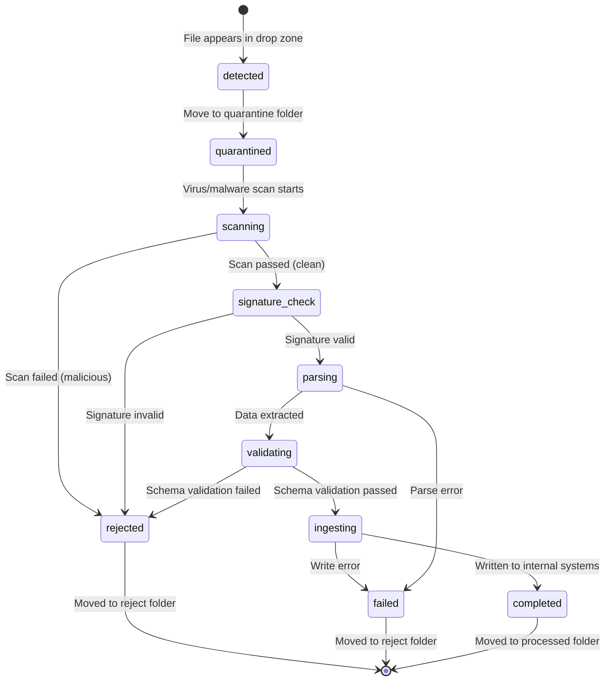
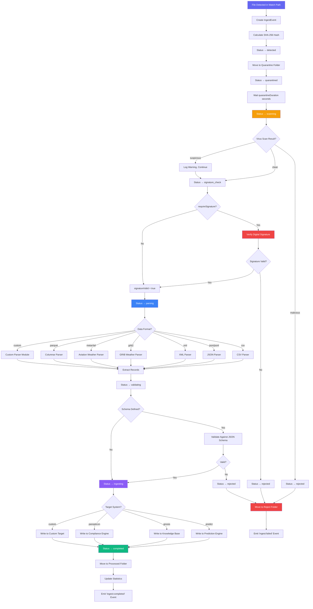
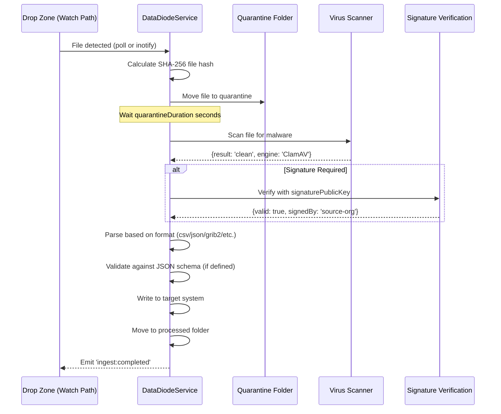
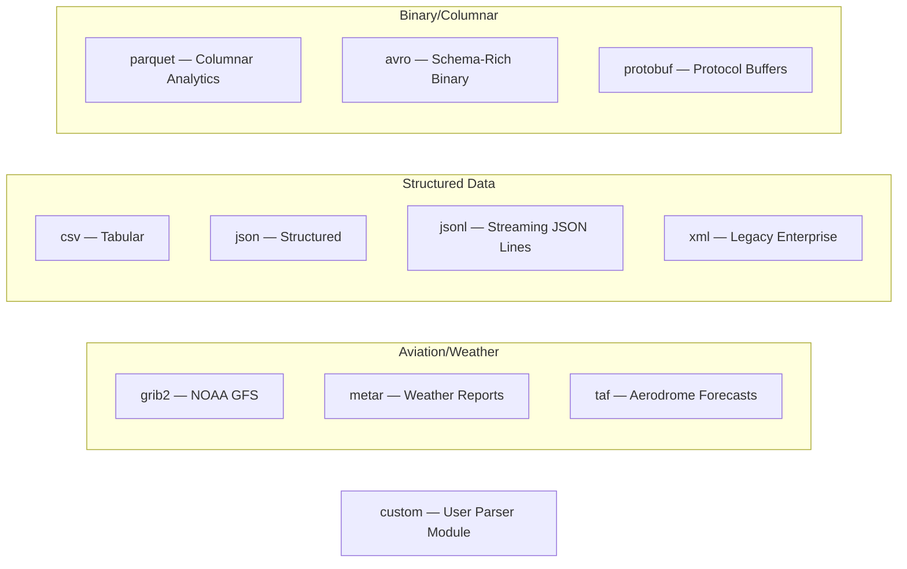

# CendiaDataDiode Sovereign Ingest Workflow

> **Service:** `DataDiodeService` (`backend/src/services/sovereign/DataDiodeService.ts`)
> **Purpose:** Unidirectional sovereign data ingest for air-gapped environments — data flows in, never out. Supports GRIB, CSV, JSON, XML, Parquet with signature verification and virus scanning.

## Ingest Event Lifecycle

## Full Processing Pipeline

## Security Chain

## Supported Data Formats

## Key Code References

- **File Detection:** Poll-based or inotify watch on `IngestSource.watchPath`
- **Security Chain:** SHA-256 hash → quarantine → virus scan → signature verification
- **Parsers:** Format-specific parsers for 11 data formats
- **Validation:** JSON Schema validation when `IngestSource.schema` is defined
- **Target Systems:** `predict`, `gnosis`, `panopticon`, `custom`
- **Concurrency:** `maxConcurrent` per source, tracked via `processing` Set
- **Events:** EventEmitter — `ingest:completed`, `ingest:failed`
- **Error Handling:** `getErrorMessage()` + `getErrorStack()` for type-safe error capture
- **File Management:** detected → quarantine → processed/rejected folders
