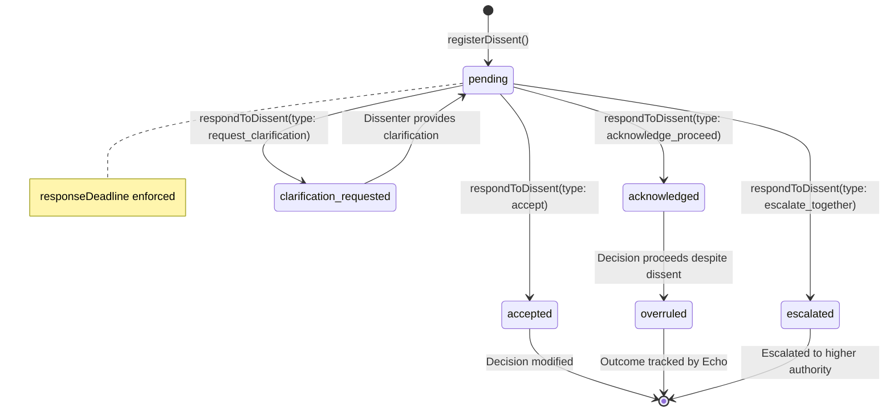
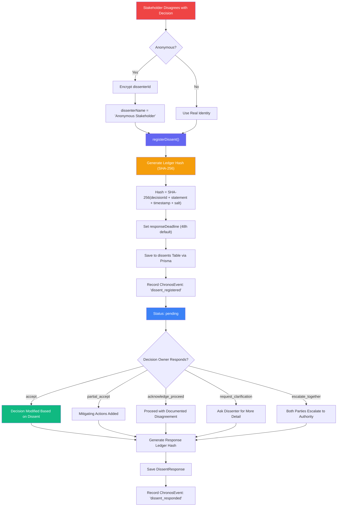
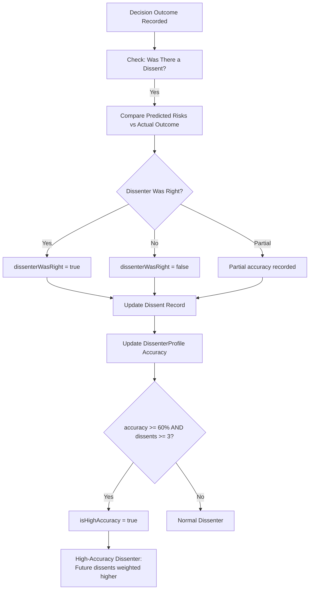
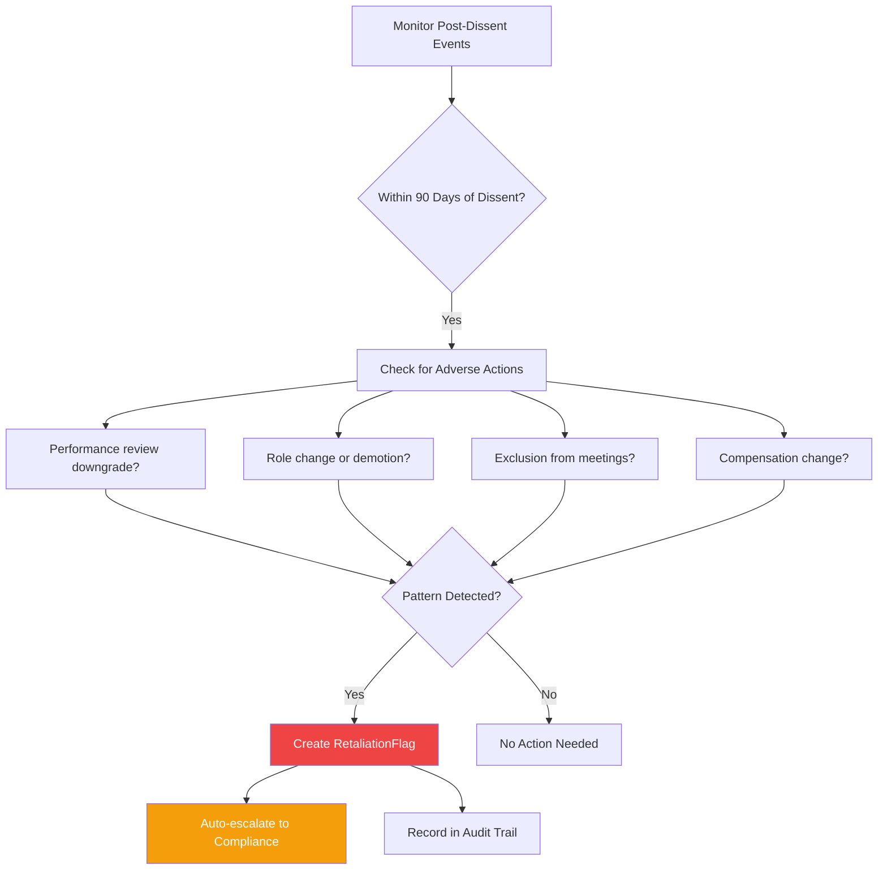
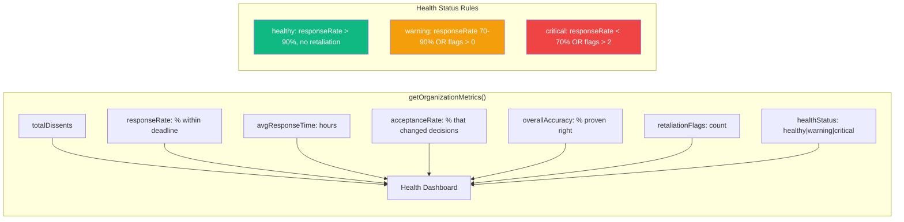

# CendiaDissent Service Workflow

> **Service:** `CendiaDissentService` (`backend/src/services/CendiaDissentService.ts`)
> **Purpose:** The right to formally, safely, and immutably disagree — ensures no one can ever say "nobody objected" when someone did. Provides protected, ledger-hashed dissent recording with retaliation detection.

## Dissent Lifecycle

## Dissent Registration Flow

## Outcome Verification (Echo Integration)

## Retaliation Detection

## Organization Dissent Health Metrics

## Key Code References

- **Registration:** `registerDissent()` — creates ledger-hashed immutable dissent record
- **Response:** `respondToDissent()` — 5 response types with their own ledger hash
- **Immutability:** SHA-256 hash chain — `decisionId + statement + timestamp + salt`
- **Anonymity:** Encrypted `dissenterId` when `isAnonymous = true`
- **Outcome Tracking:** Echo integration verifies if dissenter was right
- **Accuracy Profiles:** `DissenterProfile` tracks accuracy across all dissents
- **High-Accuracy Flag:** 60%+ accuracy with 3+ dissents = elevated weight
- **Retaliation Detection:** Monitors adverse actions within 90 days of dissent
- **Chronos Integration:** All events recorded on universal timeline
- **DB Tables:** `dissents`, `dissent_responses` (Prisma)
- **Dissent Types:** `factual`, `risk`, `ethical`, `process`, `strategic`, `resource`, `other`
- **Severities:** `advisory`, `formal_objection`, `blocking`
