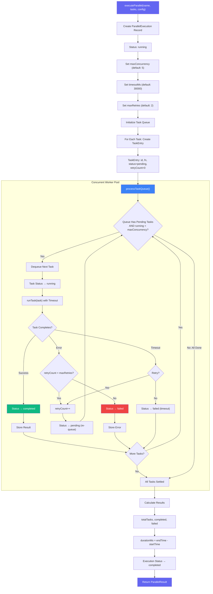
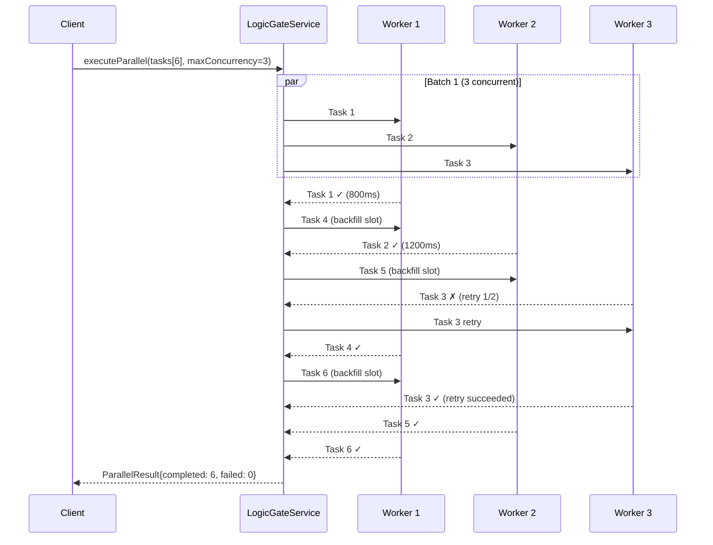
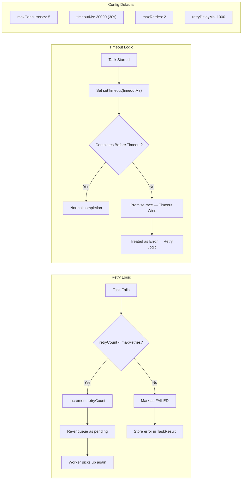
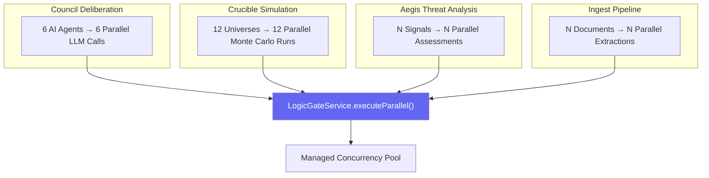

# LogicGate Parallel Processing Workflow

> **Service:** `LogicGateService` (`backend/src/services/strategic/LogicGateService.ts`)
> **Purpose:** Parallel processing architecture for concurrent agent execution and burst compute — manages task queues with configurable concurrency, timeouts, and retry logic.

## Parallel Execution Flow

## Concurrency Model

## Timeout & Retry Strategy

## Burst Compute Use Cases

## Key Code References

- **Entry Point:** `executeParallel()` — creates execution and processes queue
- **Queue Processing:** `processTaskQueue()` — backfill-on-completion concurrency model
- **Task Execution:** `runTask()` — runs function with timeout via `Promise.race`
- **Retry:** Automatic re-queue on failure until `maxRetries` exhausted
- **Tracking:** `getExecution()`, `getActiveExecutions()` — inspect running/completed jobs
- **Metrics:** `totalTasks`, `completed`, `failed`, `durationMs` per execution
- **Config Defaults:** `maxConcurrency=5`, `timeoutMs=30000`, `maxRetries=2`
