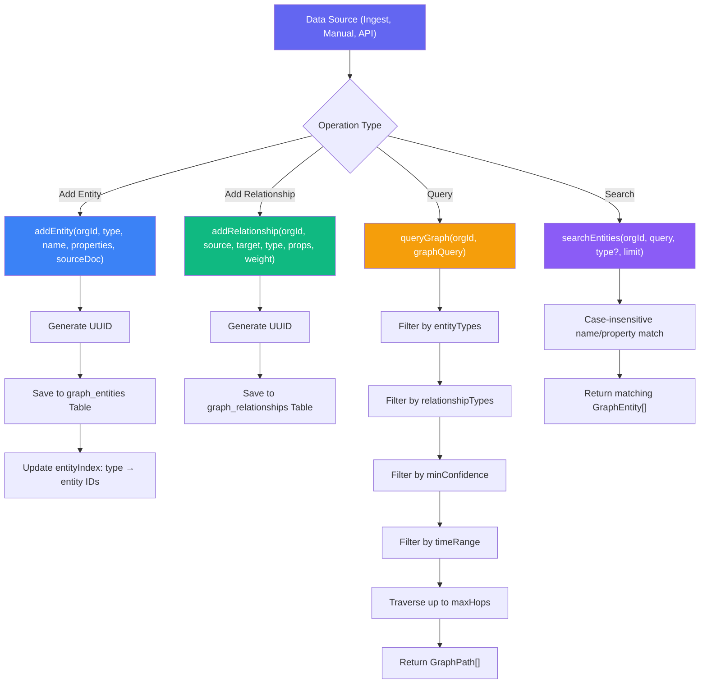
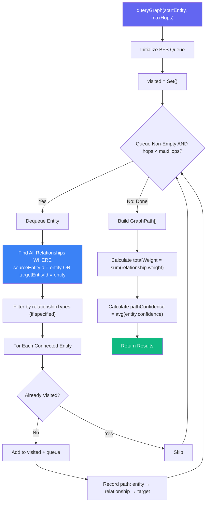
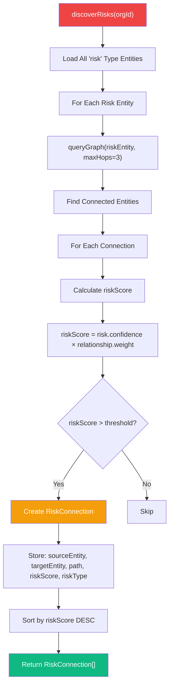
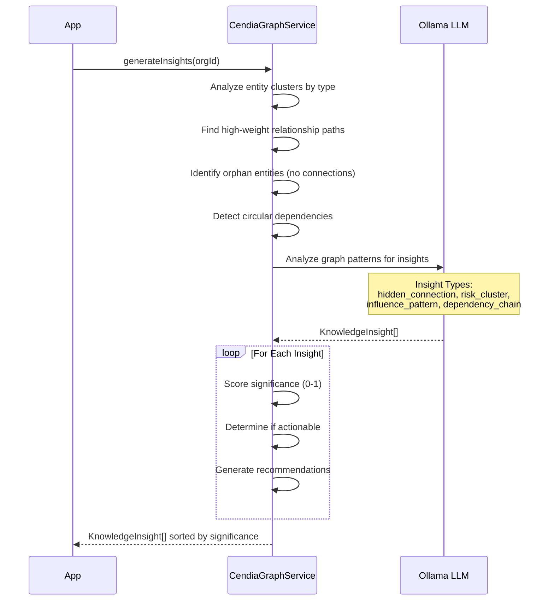
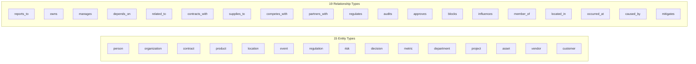

# CendiaGraph Knowledge Graph Workflow

> **Service:** `CendiaGraphService` (`backend/src/services/strategic/CendiaGraphService.ts`)
> **Purpose:** The Institutional Brain — turns messy documents into a queryable knowledge graph of entities and relationships with LLM-powered insight discovery.

## Entity & Relationship Management

## Graph Traversal (BFS)

## Risk Discovery Pipeline

## Insight Generation

## Entity Type Taxonomy

## Key Code References

- **Entity CRUD:** `addEntity()`, `getEntity()`, `updateEntity()`, `deleteEntity()`
- **Relationship CRUD:** `addRelationship()`, `getRelationship()`
- **Search:** `searchEntities()` — case-insensitive name/property matching
- **Traversal:** `queryGraph()` — BFS with maxHops, type filters, confidence threshold
- **Risk Discovery:** `discoverRisks()` — finds risk entities and traces impact paths
- **Insights:** `generateInsights()` — LLM-powered pattern recognition across graph
- **Statistics:** `getGraphStatistics()` — entity/relationship counts by type, avg confidence
- **Indexing:** In-memory `entityIndex` map: `type → Set<entityId>` for fast type lookups
- **DB Tables:** `graph_entities`, `graph_relationships` (Prisma)
