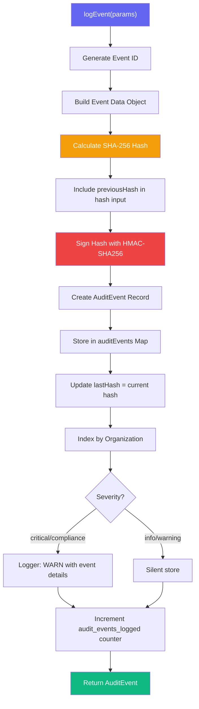
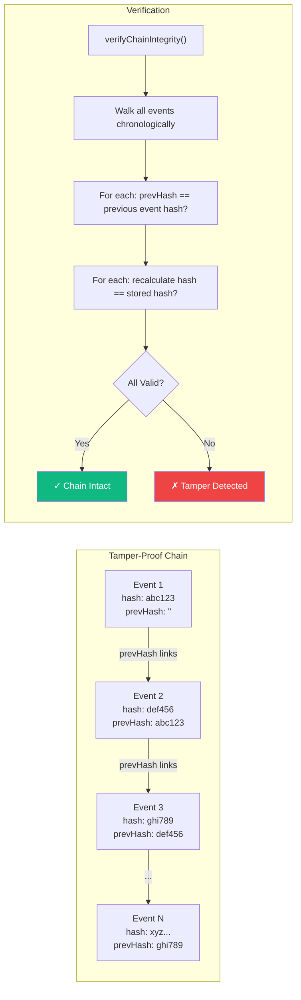
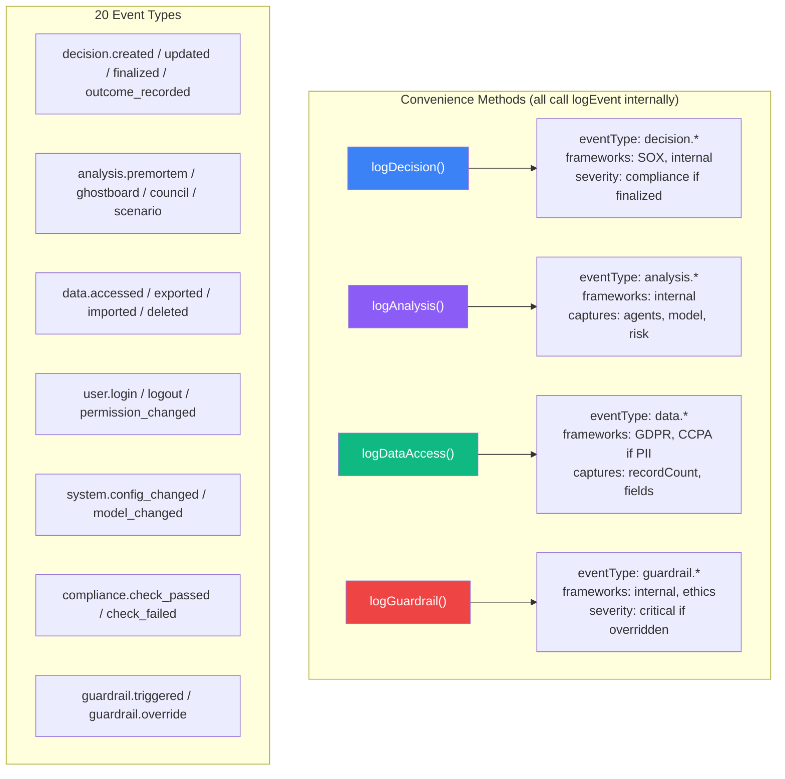
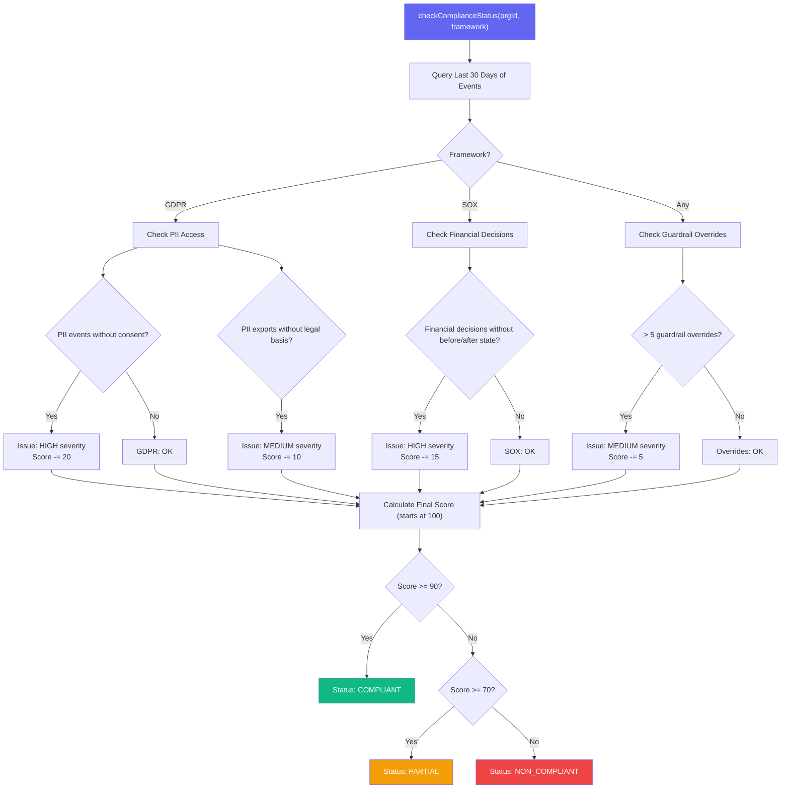
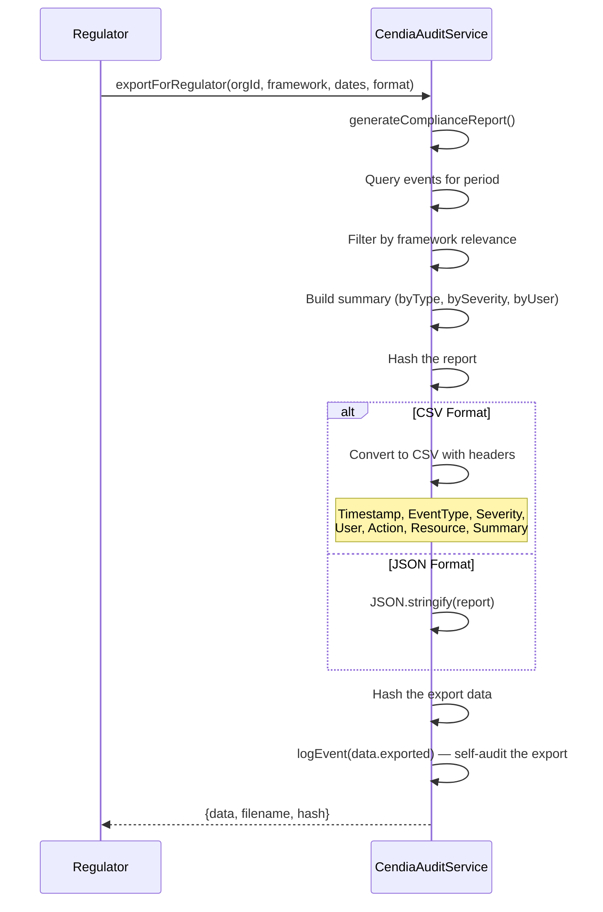
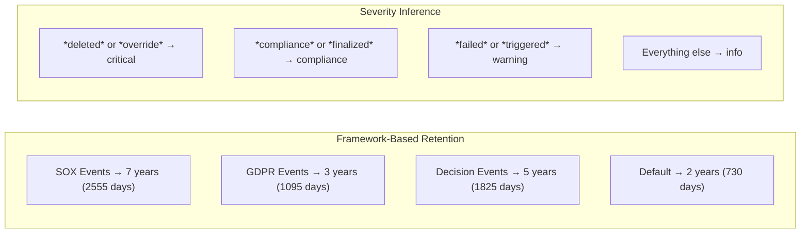

# CendiaAudit Compliance Logging Workflow

> **Service:** `CendiaAuditService` (`backend/src/services/CendiaAuditService.ts`)
> **Purpose:** Enterprise compliance, decision trails, and regulatory audit logging with GDPR/SOX/HIPAA compliant tamper-proof hash chains.

## Event Logging Pipeline

## Hash Chain Integrity

## Specialized Event Loggers

## Compliance Status Check

## Regulatory Export

## Retention Periods

## Key Code References

- **Core Logging:** `logEvent()` — hash chain with HMAC signature
- **Specialized:** `logDecision()`, `logAnalysis()`, `logDataAccess()`, `logGuardrail()`
- **Querying:** `queryEvents()` — 10 filter dimensions, paginated
- **Reports:** `generateComplianceReport()` — aggregated compliance analysis
- **Compliance Check:** `checkComplianceStatus()` — framework-specific scoring (GDPR, SOX)
- **Verification:** `verifyChainIntegrity()` — walks full chain, `verifyEvent()` — single event
- **Export:** `exportForRegulator()` — JSON or CSV with self-audited export logging
- **Hash:** SHA-256 (truncated to 16 hex chars)
- **Signature:** HMAC-SHA256 with `AUDIT_SIGNING_KEY` (truncated to 32 hex chars)
- **Retention:** SOX=7yr, GDPR=3yr, decisions=5yr, default=2yr
