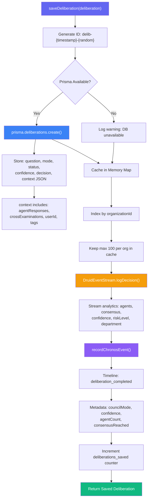
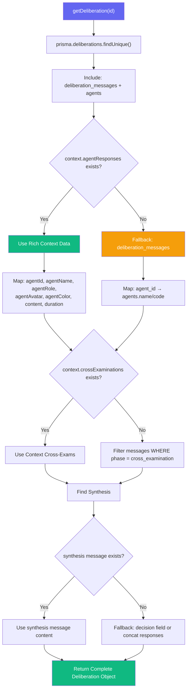
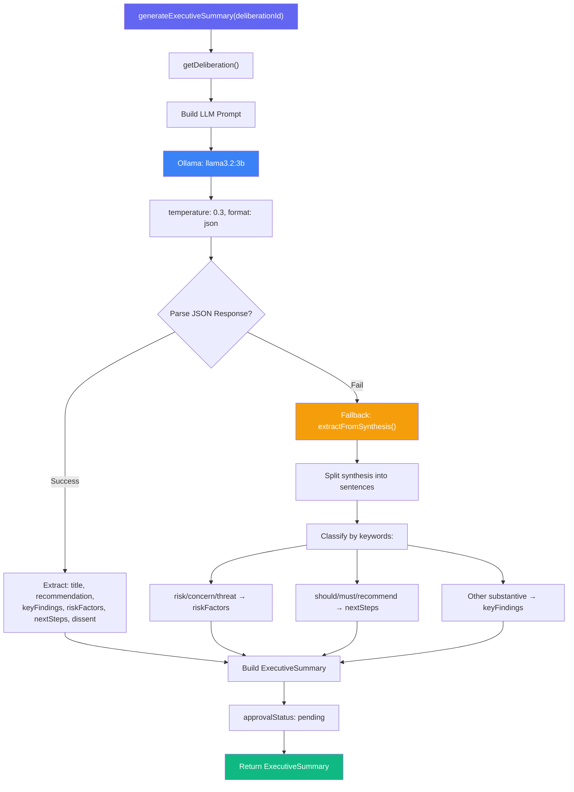
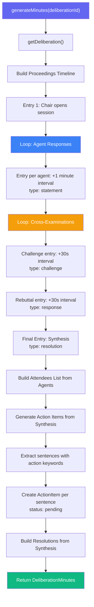
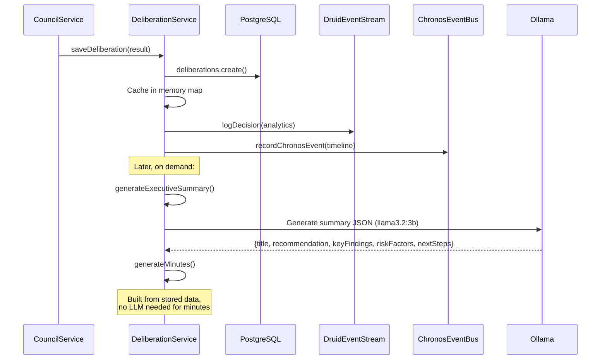

# Deliberation Service (Persistence Layer) Workflow

> **Service:** `DeliberationService` (`backend/src/services/DeliberationService.ts`)
> **Purpose:** Persistent storage, executive summaries, and formal minutes for Council deliberations — the persistence and post-processing layer that sits behind CouncilService.

## Save Deliberation Pipeline

## Retrieval Strategy

## Executive Summary Generation

## Minutes Generation

## Integration Points

## Key Code References

- **Save:** `saveDeliberation()` — DB + cache + Druid analytics + Chronos timeline
- **Get:** `getDeliberation()` — DB-first with dual fallback (context JSON vs messages)
- **List:** `getDeliberations()` — Prisma query with status/org filters + pagination
- **Executive Summary:** `generateExecutiveSummary()` — LLM-generated with sentence extraction fallback
- **Minutes:** `generateMinutes()` — structured proceedings from agent responses and cross-examinations
- **Analytics:** `DruidEventStream.logDecision()` — streams to Druid for CendiaChronos
- **Timeline:** `recordChronosEvent()` — records on universal timeline
- **DB Tables:** `deliberations`, `deliberation_messages`, `agents`
- **Cache:** In-memory Map with max 100 entries per org
- **LLM Model:** `llama3.2:3b` for executive summaries (fast, lightweight)
