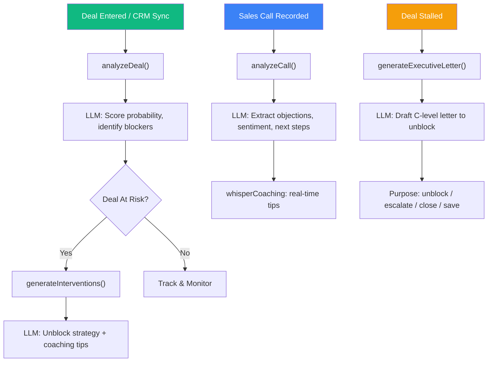
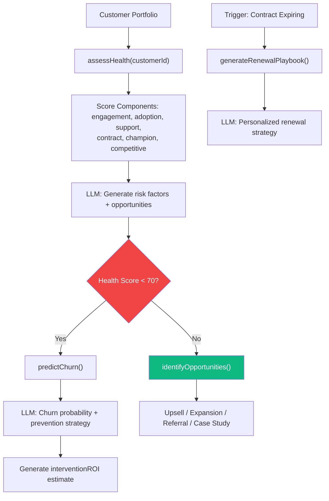
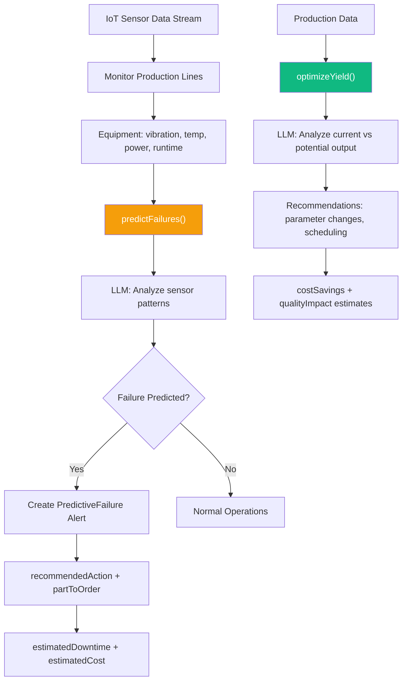
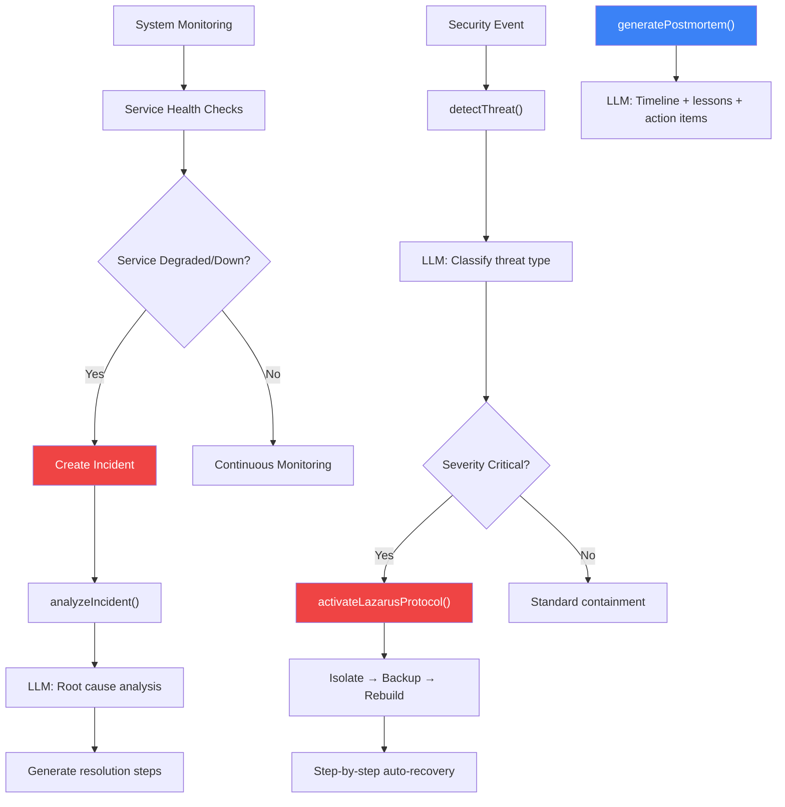
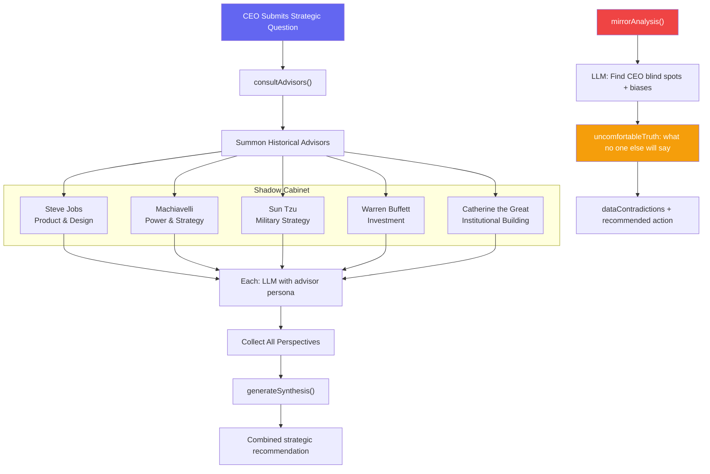
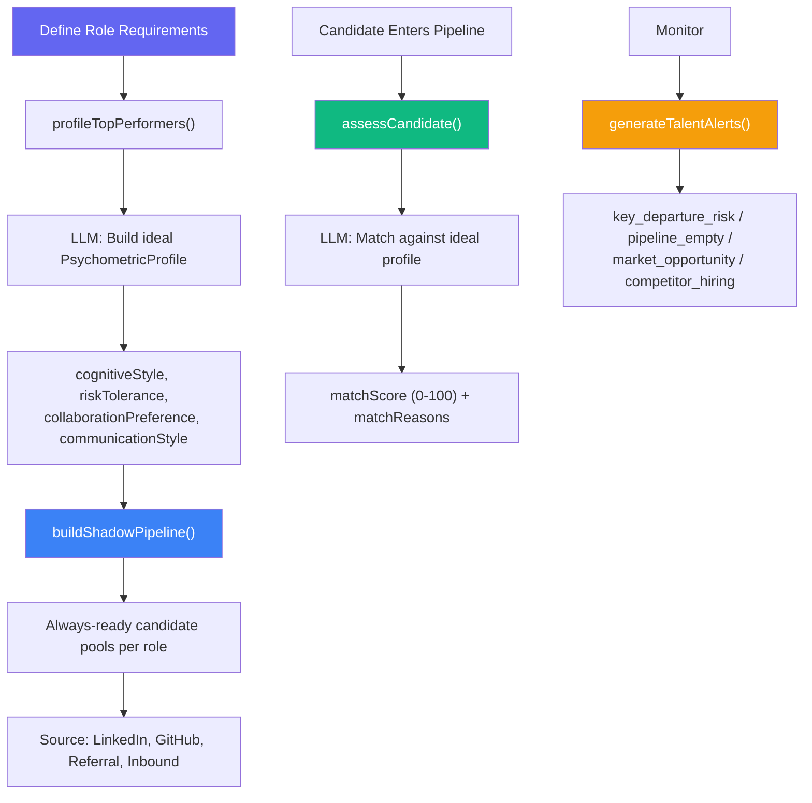
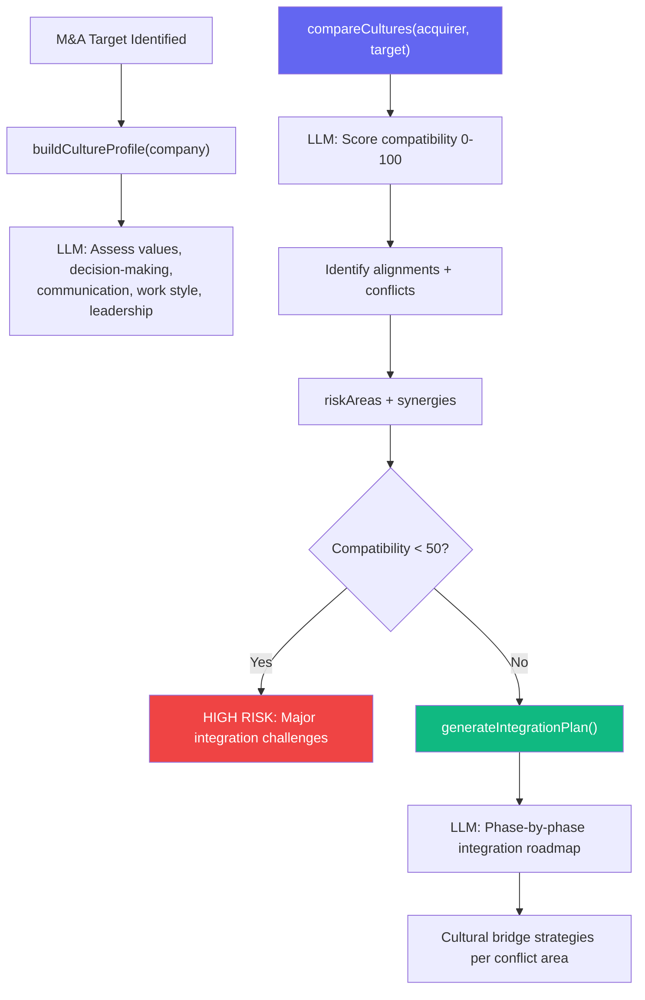
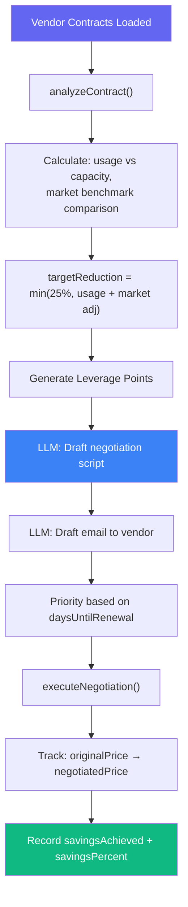
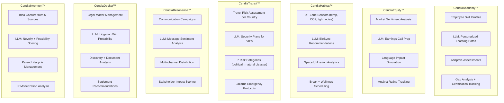

# Enterprise Services Suite Workflows

> **Directory:** `backend/src/services/enterprise/`
> **Purpose:** 15 vertical enterprise intelligence modules — each a standalone AI-powered domain engine that plugs into the core platform.

## Enterprise Suite Overview

```mermaid
flowchart TB
    subgraph "Enterprise Intelligence Suite"
        direction TB
        subgraph "Revenue & Growth"
            RAIN["CendiaRainmaker™<br/>Sales & Deal Intelligence"]
            GUARD["CendiaGuardian™<br/>Customer Success & Retention"]
            EQUITY["CendiaEquity™<br/>Investor Relations"]
        end

        subgraph "Operations"
            FACTORY["CendiaFactory™<br/>Manufacturing & Production"]
            NERVE["CendiaNerve™<br/>IT Ops & Infrastructure"]
            PROCURE["CendiaProcure™<br/>Procurement & Sourcing"]
            TRANSIT["CendiaTransit™<br/>Travel & Executive Security"]
            HABITAT["CendiaHabitat™<br/>Facilities & Real Estate"]
        end

        subgraph "People & Culture"
            ACADEMY["CendiaAcademy™<br/>Learning & Development"]
            SCOUT["CendiaScout™<br/>Talent Acquisition"]
            MESH["CendiaMesh™<br/>M&A Culture Integration"]
        end

        subgraph "Strategy & IP"
            REGENT["CendiaRegent™<br/>CEO Shadow Cabinet"]
            INVENTUM["CendiaInventum™<br/>R&D / IP Management"]
            RESONANCE["CendiaResonance™<br/>Corporate Communications"]
            DOCKET["CendiaDocket™<br/>Legal Operations"]
        end
    end

    RAIN & GUARD & EQUITY & FACTORY & NERVE --> LLM["Ollama LLM"]
    PROCURE & TRANSIT & HABITAT & ACADEMY & SCOUT --> LLM
    MESH & REGENT & INVENTUM & RESONANCE & DOCKET --> LLM

    style RAIN fill:#10b981,color:#fff
    style GUARD fill:#10b981,color:#fff
    style FACTORY fill:#3b82f6,color:#fff
    style NERVE fill:#3b82f6,color:#fff
    style ACADEMY fill:#8b5cf6,color:#fff
    style REGENT fill:#f59e0b,color:#fff
    style DOCKET fill:#ef4444,color:#fff
```

---

## CendiaRainmaker™ — Sales & Deal Intelligence

## CendiaGuardian™ — Customer Success & Retention

## CendiaFactory™ — Manufacturing & Production Intelligence

## CendiaNerve™ — IT Operations & Infrastructure

## CendiaRegent™ — CEO Shadow Cabinet

## CendiaScout™ — Talent Acquisition

## CendiaMesh™ — M&A Culture Integration

## CendiaProcure™ — Procurement & Sourcing

## Remaining Enterprise Services (Summary)

## Key Code References

| Service | File | Key Function | LLM-Powered |
|---------|------|-------------|-------------|
| **Rainmaker** | `CendiaRainmakerService.ts` | `predictDeal()`, `analyzeCall()`, `generateExecutiveLetter()` | ✅ |
| **Guardian** | `CendiaGuardianService.ts` | `assessHealth()`, `predictChurn()`, `generateRenewalPlaybook()` | ✅ |
| **Factory** | `CendiaFactoryService.ts` | `predictFailures()`, `optimizeYield()` | ✅ |
| **Nerve** | `CendiaNerveService.ts` | `analyzeIncident()`, `detectThreat()`, `activateLazarusProtocol()` | ✅ |
| **Regent** | `CendiaRegentService.ts` | `consultAdvisors()`, `mirrorAnalysis()` | ✅ |
| **Scout** | `CendiaScoutService.ts` | `profileTopPerformers()`, `assessCandidate()`, `buildShadowPipeline()` | ✅ |
| **Mesh** | `CendiaMeshService.ts` | `buildCultureProfile()`, `compareCultures()`, `generateIntegrationPlan()` | ✅ |
| **Procure** | `CendiaProcureService.ts` | `analyzeContract()`, `executeNegotiation()` | ✅ |
| **Academy** | `CendiaAcademyService.ts` | `assessSkills()`, `generateLearningPath()`, `identifyGaps()` | ✅ |
| **Equity** | `CendiaEquityService.ts` | `analyzeSentiment()`, `prepEarningsCall()`, `simulateLanguageImpact()` | ✅ |
| **Habitat** | `CendiaHabitatService.ts` | `monitorZones()`, `generateBioSync()`, `analyzeUtilization()` | ✅ |
| **Transit** | `CendiaTransitService.ts` | `assessTravelRisk()`, `generateSecurityPlan()` | ✅ |
| **Resonance** | `CendiaResonanceService.ts` | `createCampaign()`, `analyzeSentiment()`, `optimizeMessage()` | ✅ |
| **Docket** | `CendiaDocketService.ts` | `analyzeLitigation()`, `calculateWinProbability()` | ✅ |
| **Inventum** | `CendiaInventumService.ts` | `captureIdea()`, `analyzeNovelty()`, `managePatent()` | ✅ |
