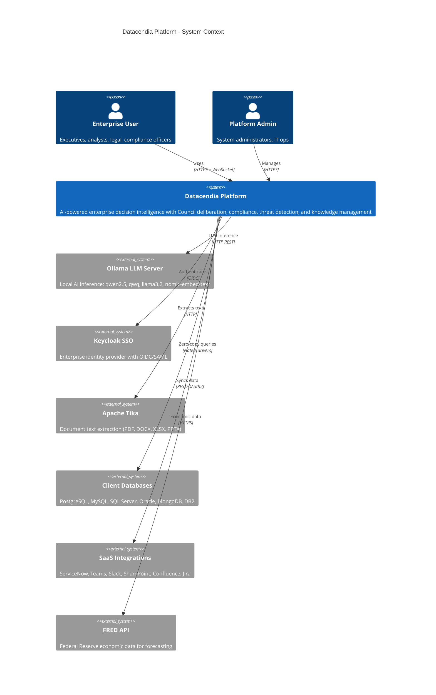
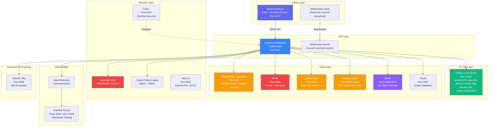
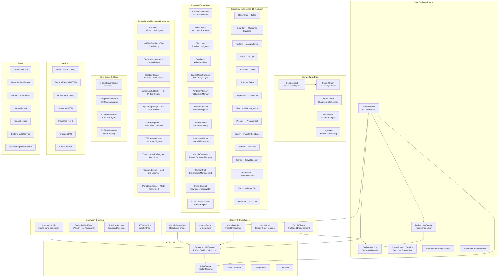
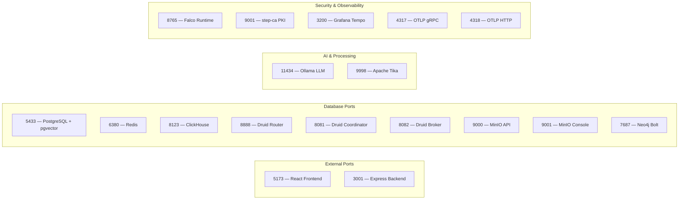
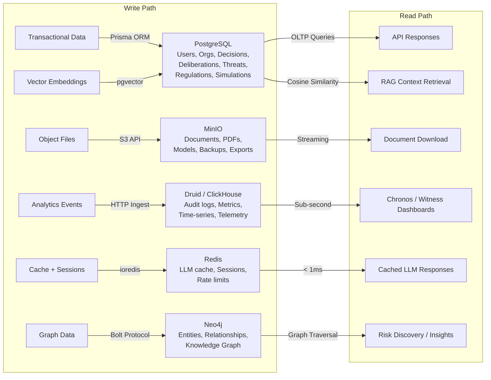
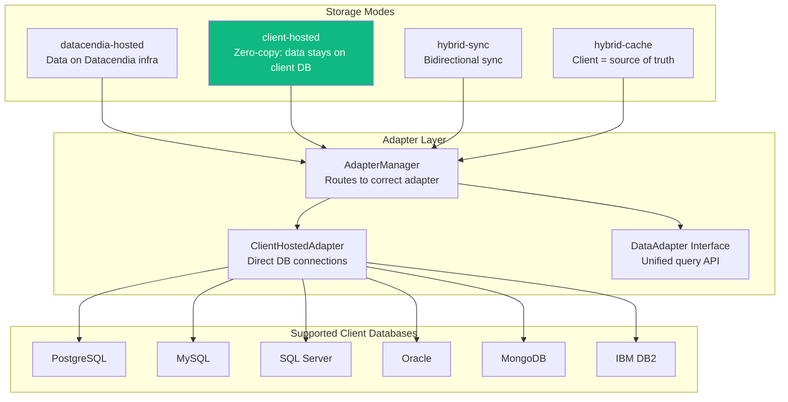

# Datacendia Platform — C4 Architecture Diagrams

> **Purpose:** System architecture at three levels of abstraction — Context, Container, and Component — for client and engineering audiences.

## Level 1: System Context

## Level 2: Container Diagram

## Level 3: Component Diagram — Backend Services

## Infrastructure Port Map

## Data Storage Strategy

## Client Database Integration (Zero-Copy)

## Key References

- **Config:** `backend/src/config/index.ts` — all connection strings and env vars
- **Database:** `backend/src/config/database.ts` — Prisma client
- **Redis:** `backend/src/config/redis.ts` — ioredis with retry
- **Cache:** `backend/src/services/cache.service.ts` — Redis with in-memory fallback
- **Storage:** `backend/src/services/storage/` — ClickHouse, Druid, MinIO, Vector services
- **Security:** `backend/src/security/KeycloakAuth.ts`, `PolicyEngine.ts` (Casbin)
- **Telemetry:** `backend/src/telemetry/tracing.ts` — OpenTelemetry → Tempo
- **Adapters:** `backend/src/adapters/` — ClientHostedAdapter, AdapterManager
- **Sovereign:** `backend/src/services/sovereign/` — 11 air-gap patterns
- **Verticals:** `backend/src/services/verticals/` — Legal, Financial, Healthcare, Insurance, Energy, Sports
