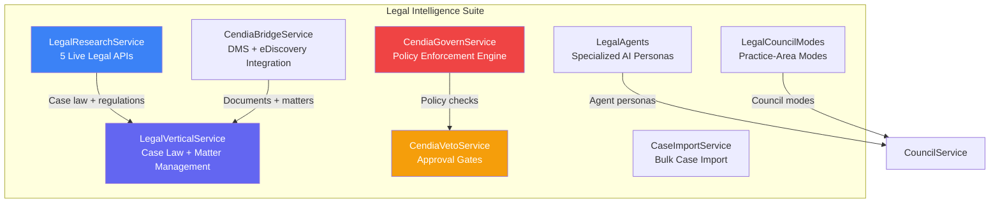
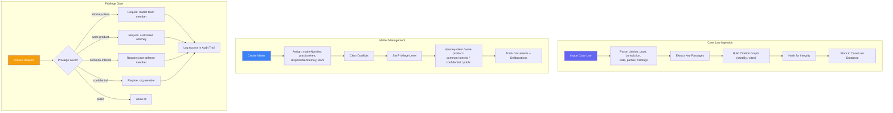
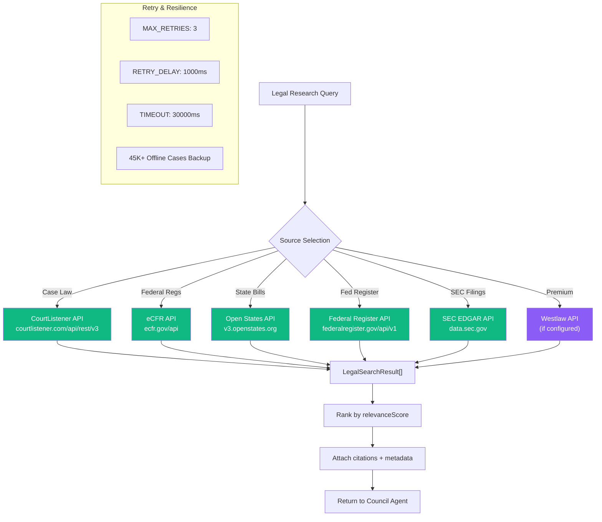
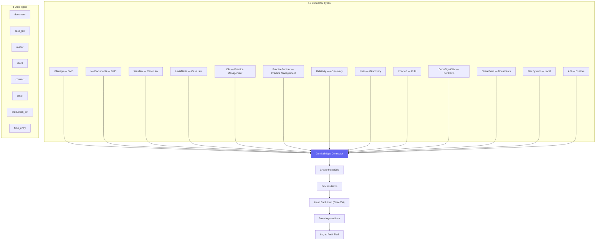
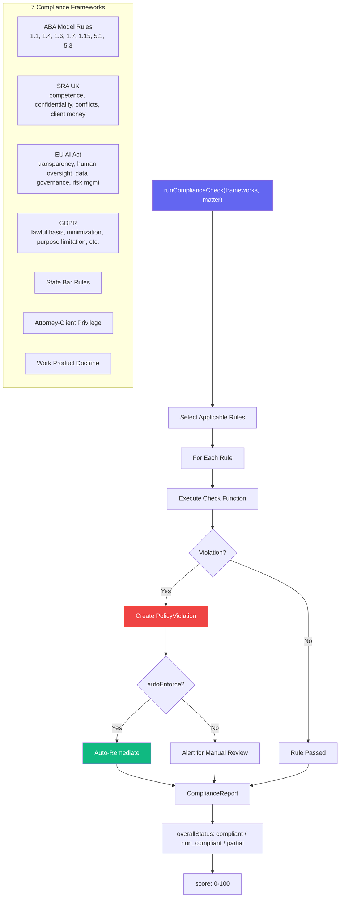
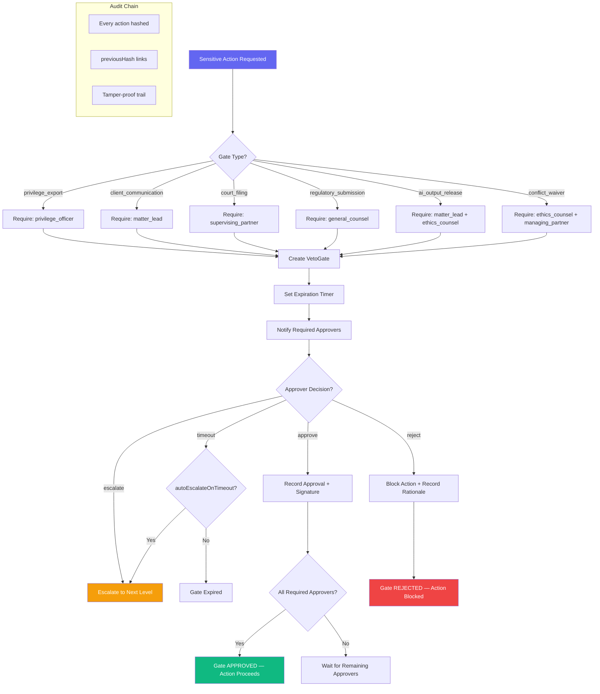

# Legal Services Suite Workflows

> **Directory:** `backend/src/services/legal/`
> **Purpose:** Enterprise Platinum legal vertical — case law ingestion, matter management, privilege enforcement, compliance gates, and real legal research APIs. **100% complete vertical.**

## Legal Suite Overview

---

## LegalVerticalService — Case Law & Matter Management

## LegalResearchService — Live Legal API Integration

## CendiaBridgeService — Legal System Integration

## CendiaGovernService — Policy Enforcement

## CendiaVetoService — Approval Gates

## Legal Council Agents & Modes

```mermaid
graph TD
    subgraph "Legal AI Agents"
        AG1["Legal Strategist<br/>Litigation strategy + case assessment"]
        AG2["Contract Analyst<br/>Deal structure + risk identification"]
        AG3["Compliance Auditor<br/>Regulatory alignment + gap analysis"]
        AG4["Research Associate<br/>Case law + statutory research"]
        AG5["Ethics Counsel<br/>Professional responsibility + conflicts"]
    end

    subgraph "Legal Council Modes"
        M1["Litigation Strategy<br/>Case assessment + win probability"]
        M2["Contract Review<br/>Risk identification + negotiation leverage"]
        M3["Regulatory Analysis<br/>Compliance gap + remediation"]
        M4["Ethics Review<br/>Conflict check + privilege analysis"]
        M5["Due Diligence<br/>M&A risk assessment"]
    end

    AG1 & AG2 & AG3 & AG4 & AG5 --> CS["CouncilService"]
    M1 & M2 & M3 & M4 & M5 --> CS
```

## Key Code References

| Service | File | Purpose |
|---------|------|---------|
| **LegalVertical** | `LegalVerticalService.ts` | Case law DB, matter management, privilege gates, citation enforcement |
| **LegalResearch** | `LegalResearchService.ts` | Live APIs: CourtListener, eCFR, Open States, Fed Register, SEC EDGAR, Westlaw |
| **CendiaBridge** | `CendiaBridgeService.ts` | 13 connector types: iManage, Relativity, Clio, DocuSign CLM, etc. |
| **CendiaGovern** | `CendiaGovernService.ts` | 7 compliance frameworks, 23 rule IDs, auto-enforcement, scoring |
| **CendiaVeto** | `CendiaVetoService.ts` | 9 gate types, 6 approver roles, escalation chains, hash-chained audit |
| **LegalAgents** | `LegalAgents.ts` | 5 specialized AI personas for legal deliberation |
| **LegalCouncilModes** | `LegalCouncilModes.ts` | 5 practice-area council configurations |
| **CaseImport** | `CaseImportService.ts` | Bulk case law import and processing |
