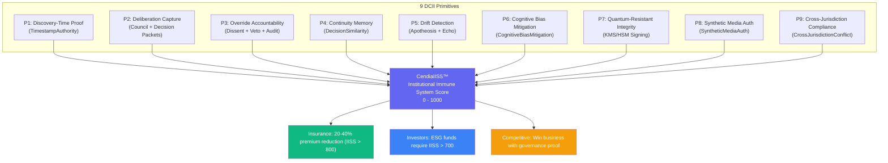
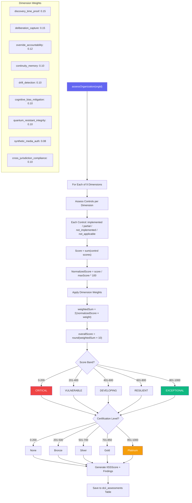
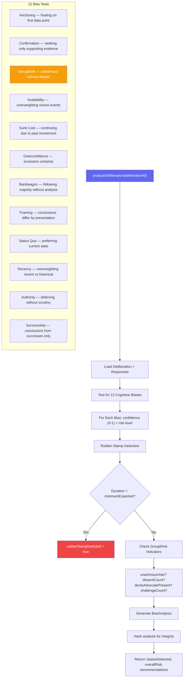
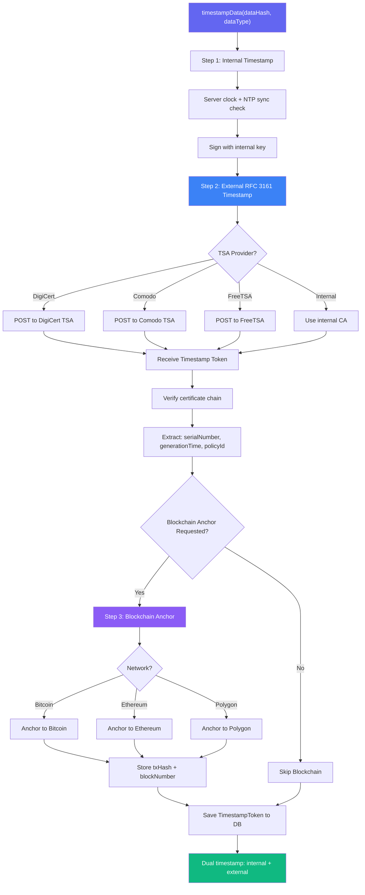
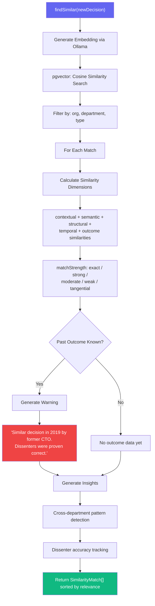
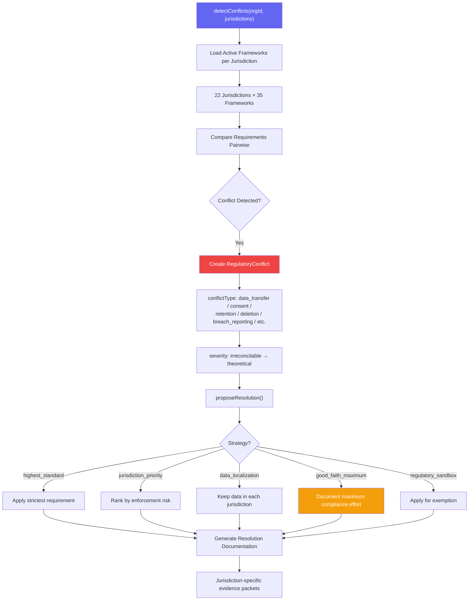
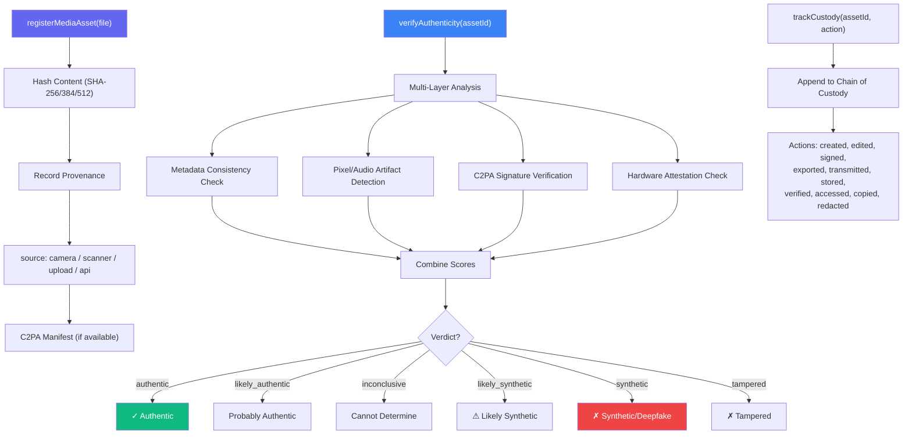

# DCII — Decision Crisis Immunization Infrastructure Workflows

> **Directory:** `backend/src/services/dcii/`
> **Purpose:** The category-defining framework that proves an organization's governance is real — 9 primitives measured by the IISS score (0-1000), with insurance pricing impact, investor requirements, and competitive advantage.

## DCII Suite Overview

---

## IISSService — Institutional Immune System Score

## CognitiveBiasMitigationService — Bias Detection

## TimestampAuthorityService — RFC 3161 Cryptographic Timestamps

## DecisionSimilarityService — Historical Decision Matching

## CrossJurisdictionConflictService — Regulatory Conflict Resolution

## SyntheticMediaAuthService — Deepfake & Evidence Authentication

## Key Code References

| Service | File | Purpose |
|---------|------|---------|
| **IISSService** | `IISSService.ts` | 9-dimension scoring, 0-1000 scale, certification levels, weighted assessment |
| **CognitiveBiasMitigation** | `CognitiveBiasMitigationService.ts` | 12 bias tests, rubber-stamp detection, groupthink indicators |
| **TimestampAuthority** | `TimestampAuthorityService.ts` | RFC 3161, 6 TSA providers, blockchain anchoring (BTC/ETH/Polygon) |
| **DecisionSimilarity** | `DecisionSimilarityService.ts` | Vector similarity search, outcome-aware warnings, dissenter tracking |
| **CrossJurisdictionConflict** | `CrossJurisdictionConflictService.ts` | 22 jurisdictions, 35 frameworks, 9 resolution strategies |
| **SyntheticMediaAuth** | `SyntheticMediaAuthService.ts` | C2PA compliance, deepfake detection, chain of custody, hardware attestation |
| **DB Tables:** | Prisma | `dcii_assessments`, `dcii_timestamp_tokens`, `dcii_media_assets` |
