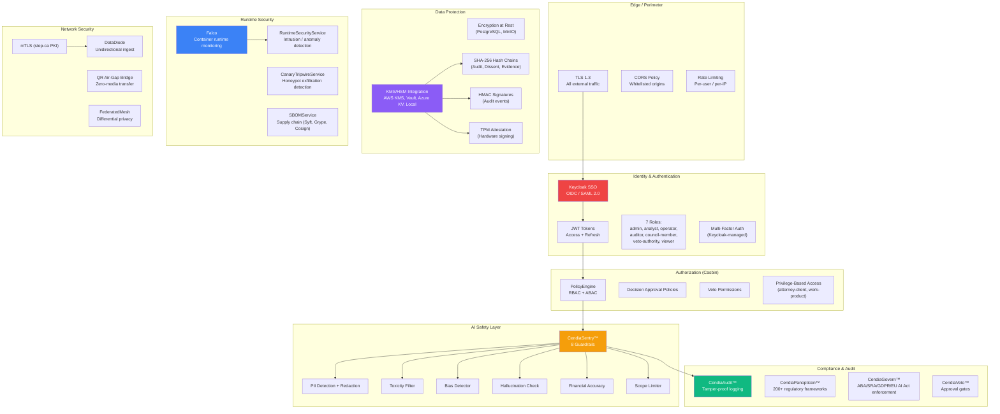
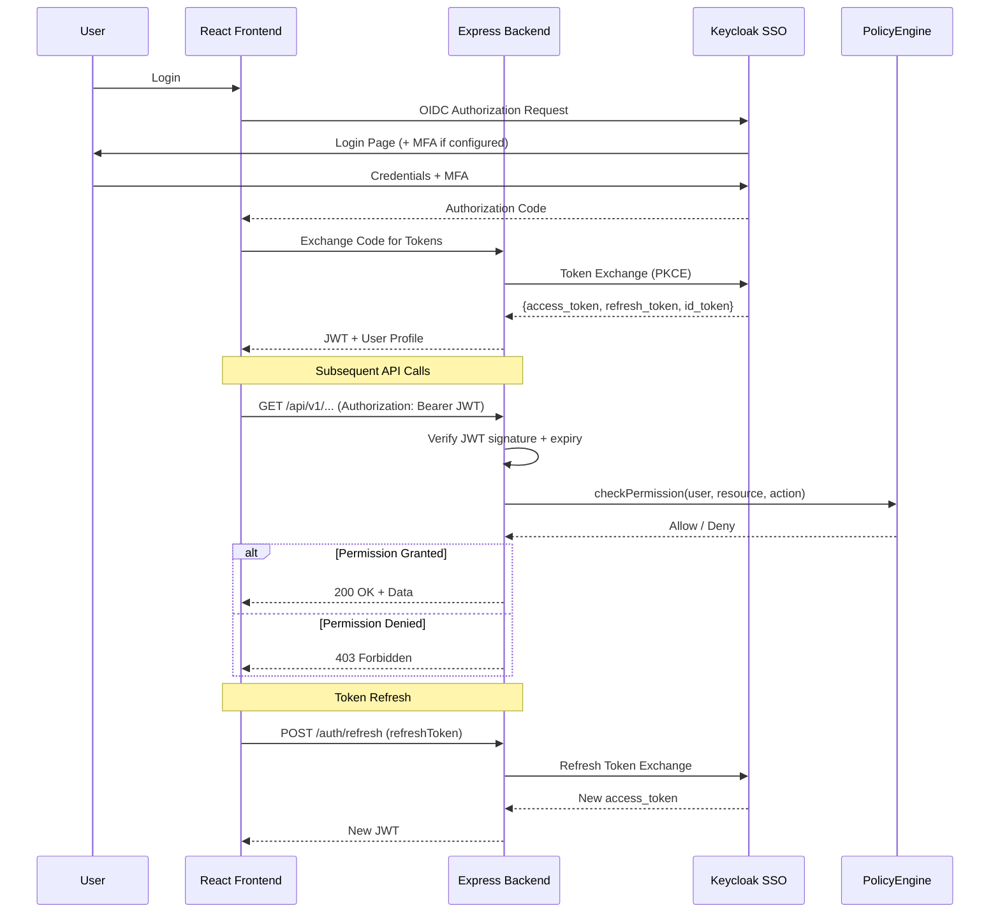
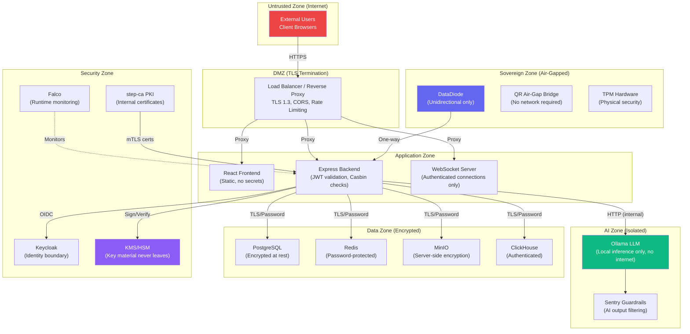
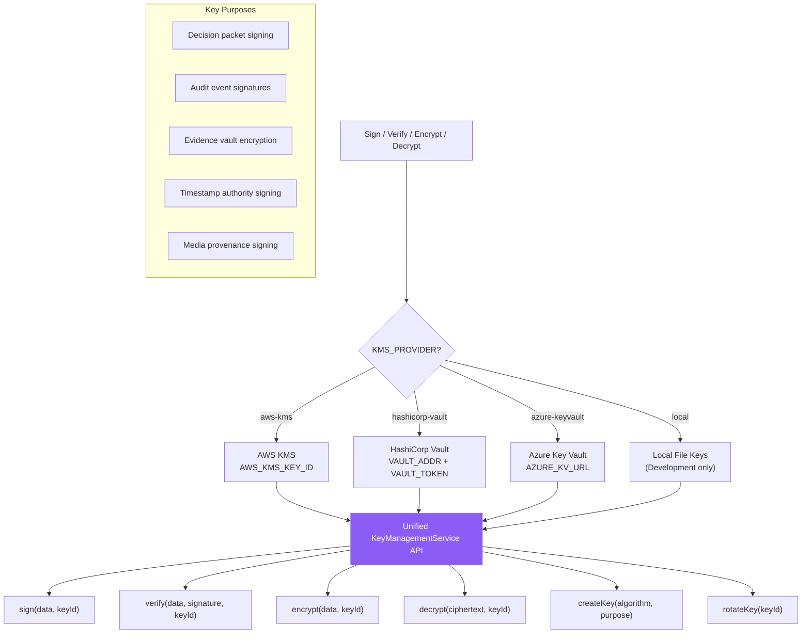
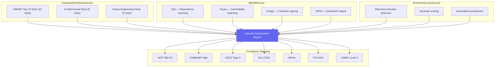
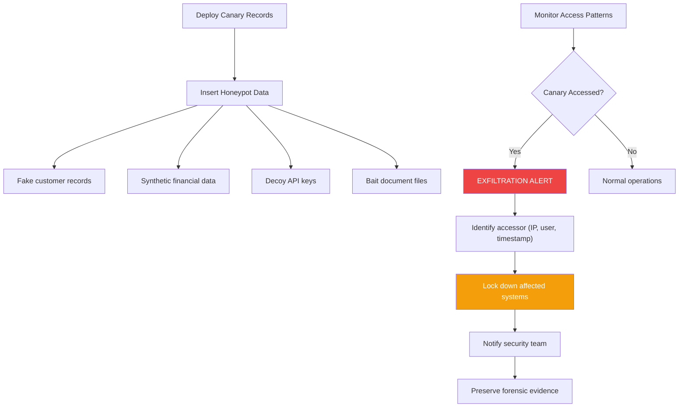

# Datacendia Platform — Security Architecture

> **Purpose:** Complete security posture — authentication, authorization, encryption, trust boundaries, runtime protection, and AI guardrails.

## Security Layer Overview

## Authentication Flow

## Trust Boundaries

## KMS/HSM Integration

## Red Team & Supply Chain Security

## Canary Tripwire System

## Key Code References

| Component | File | Purpose |
|-----------|------|---------|
| **Keycloak Auth** | `backend/src/security/KeycloakAuth.ts` | OIDC SSO, 7 roles, token validation |
| **Policy Engine** | `backend/src/security/PolicyEngine.ts` | Casbin RBAC/ABAC, decision + veto policies |
| **KMS** | `backend/src/services/security/KeyManagementService.ts` | AWS KMS, Vault, Azure KV, local keys |
| **Sentry** | `backend/src/services/CendiaSentryService.ts` | 8 guardrails, PII redaction, bias/hallucination |
| **Audit** | `backend/src/services/CendiaAuditService.ts` | Hash-chained logging, HMAC signatures |
| **Red Team** | `backend/src/services/crucible/EnterpriseRedTeamService.ts` | OWASP, AI adversarial, chaos |
| **SBOM** | `backend/src/services/crucible/SBOMService.ts` | Syft, Grype, Cosign |
| **Runtime** | `backend/src/services/crucible/RuntimeSecurityService.ts` | Intrusion/anomaly detection |
| **Canary** | `backend/src/services/sovereign/CanaryTripwireService.ts` | Honeypot exfiltration detection |
| **TPM** | `backend/src/services/sovereign/TPMAttestationService.ts` | Hardware-signed decisions |
| **TimeLock** | `backend/src/services/sovereign/TimeLockService.ts` | RSA time-lock puzzles for embargoes |
| **DataDiode** | `backend/src/services/sovereign/DataDiodeService.ts` | Unidirectional sovereign ingest |
| **PKI** | `infrastructure/config/` | step-ca for internal mTLS certificates |
| **Falco** | `infrastructure/config/falco/falco.yaml` | Container runtime security |
| **Tracing** | `backend/src/telemetry/tracing.ts` | OpenTelemetry → Grafana Tempo |
