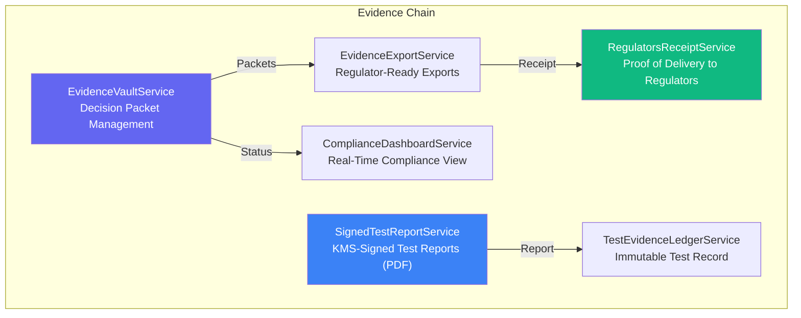
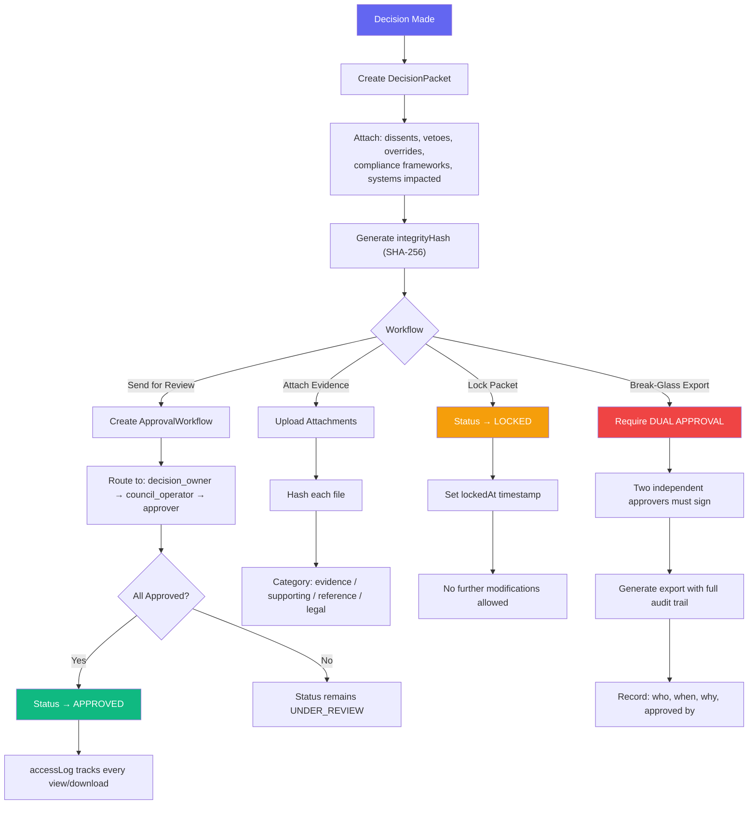
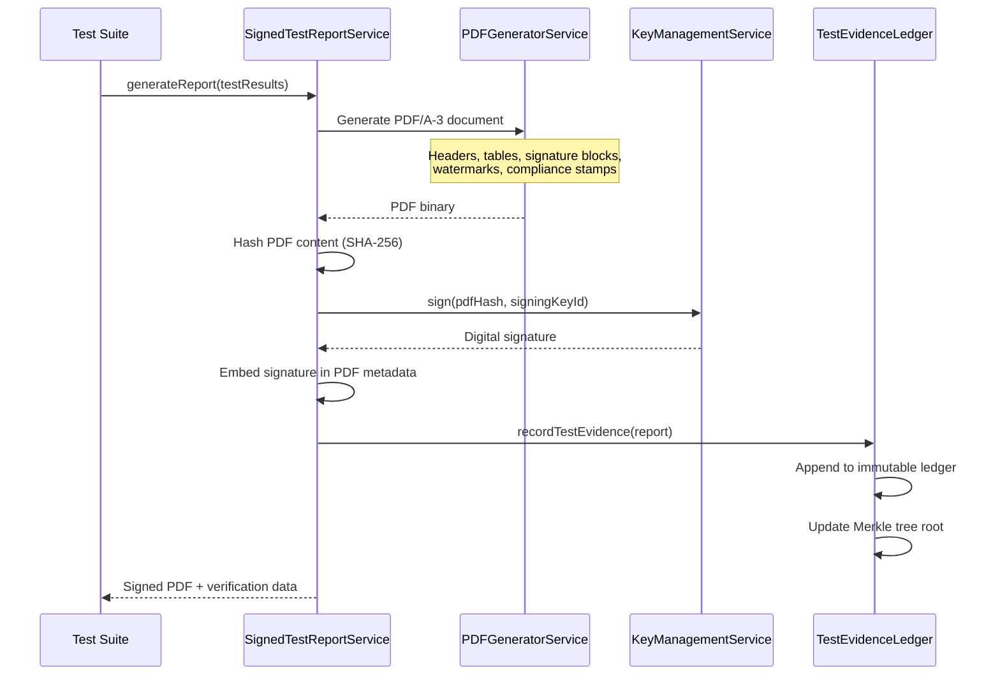
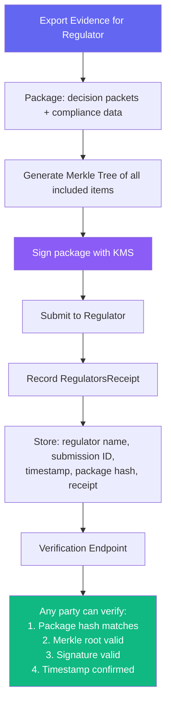

# Evidence Services Suite Workflows

> **Directory:** `backend/src/services/evidence/`
> **Purpose:** Cryptographically sealed evidence management — decision packets, compliance bundles, regulator receipts, and signed test reports for court/audit readiness.

## Evidence Suite Overview

## EvidenceVaultService — Decision Packet Management

## SignedTestReportService — KMS-Signed PDF Reports

## RegulatorsReceiptService — Proof of Submission

## Key Code References

| Service | File | Purpose |
|---------|------|---------|
| **EvidenceVault** | `EvidenceVaultService.ts` | RBAC packet management, approval workflows, break-glass export |
| **EvidenceExport** | `EvidenceExportService.ts` | Regulator-ready format exports |
| **ComplianceDashboard** | `ComplianceDashboardService.ts` | Real-time compliance status view |
| **RegulatorsReceipt** | `RegulatorsReceiptService.ts` | Proof of delivery with Merkle verification |
| **SignedTestReport** | `SignedTestReportService.ts` | KMS-signed PDF reports via PDFGeneratorService |
| **TestEvidenceLedger** | `TestEvidenceLedgerService.ts` | Immutable test record with Merkle tree |
