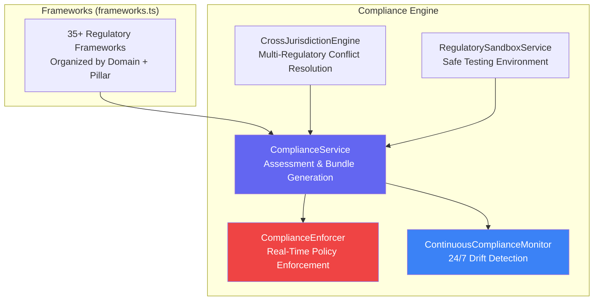
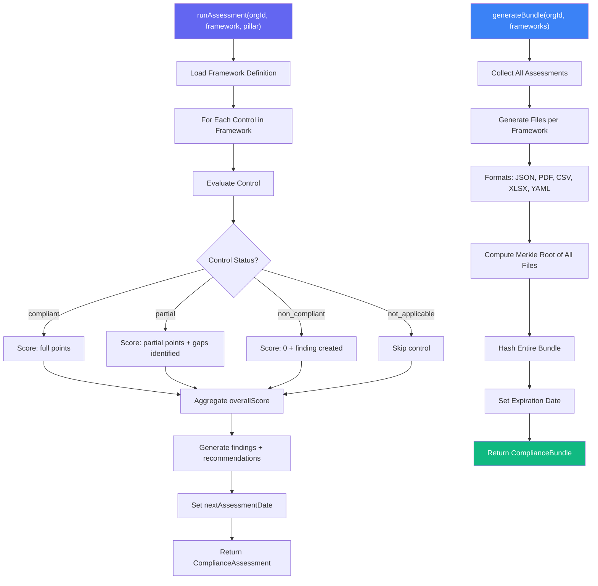
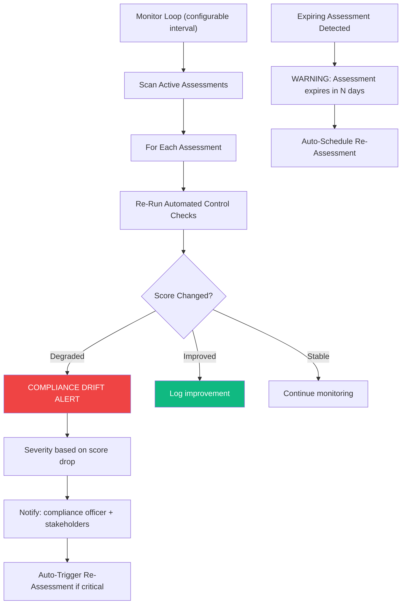
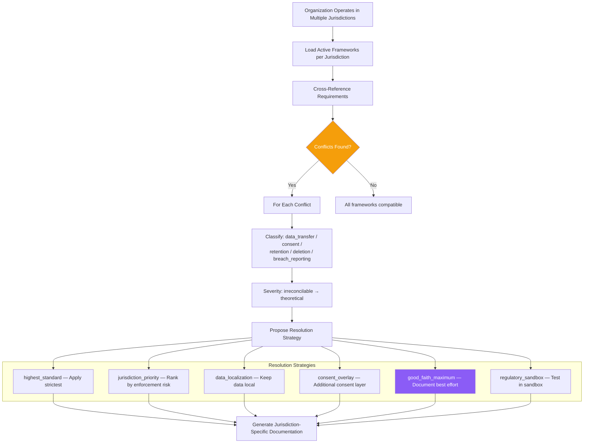
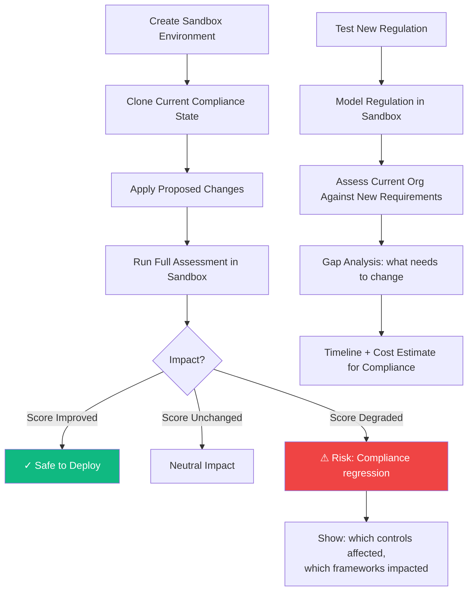

# Compliance Services Suite Workflows

> **Directory:** `backend/src/services/compliance/`
> **Purpose:** Automated compliance assessment, continuous monitoring, cross-jurisdiction conflict resolution, regulatory sandbox testing, and bundle generation for 35+ regulatory frameworks.

## Compliance Suite Overview

## ComplianceService — Assessment & Bundle Generation

## ContinuousComplianceMonitor — 24/7 Drift Detection

## CrossJurisdictionEngine — Multi-Regulatory Conflict Resolution

## RegulatorySandboxService — Safe Compliance Testing

## Key Code References

| Service | File | Purpose |
|---------|------|---------|
| **ComplianceService** | `ComplianceService.ts` | Assessment engine, bundle generation, Merkle-rooted exports |
| **ComplianceEnforcer** | `ComplianceEnforcer.ts` | Real-time policy enforcement, auto-block non-compliant actions |
| **ContinuousComplianceMonitor** | `ContinuousComplianceMonitorService.ts` | 24/7 drift detection, auto re-assessment |
| **CrossJurisdictionEngine** | `CrossJurisdictionEngineService.ts` | Multi-regulatory conflict detection + 6 resolution strategies |
| **RegulatorySandbox** | `RegulatorySandboxService.ts` | Safe testing, gap analysis, impact prediction |
| **Frameworks** | `frameworks.ts` | 35+ framework definitions, pillar mappings, domain organization |
