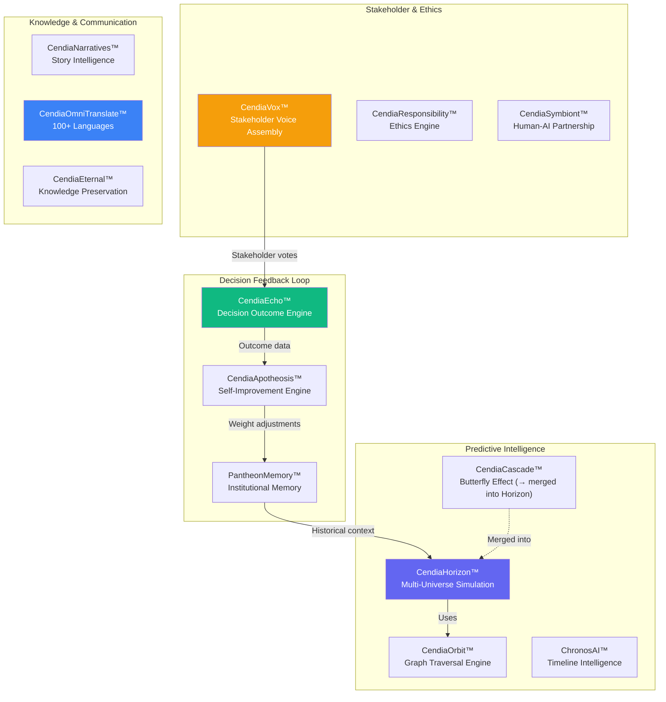
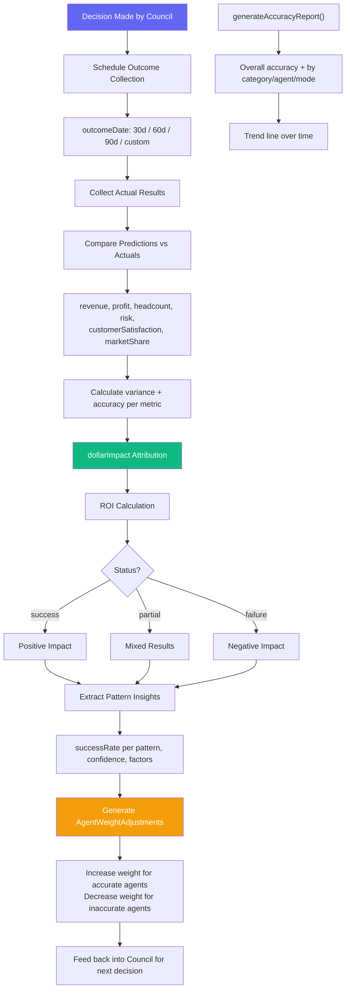
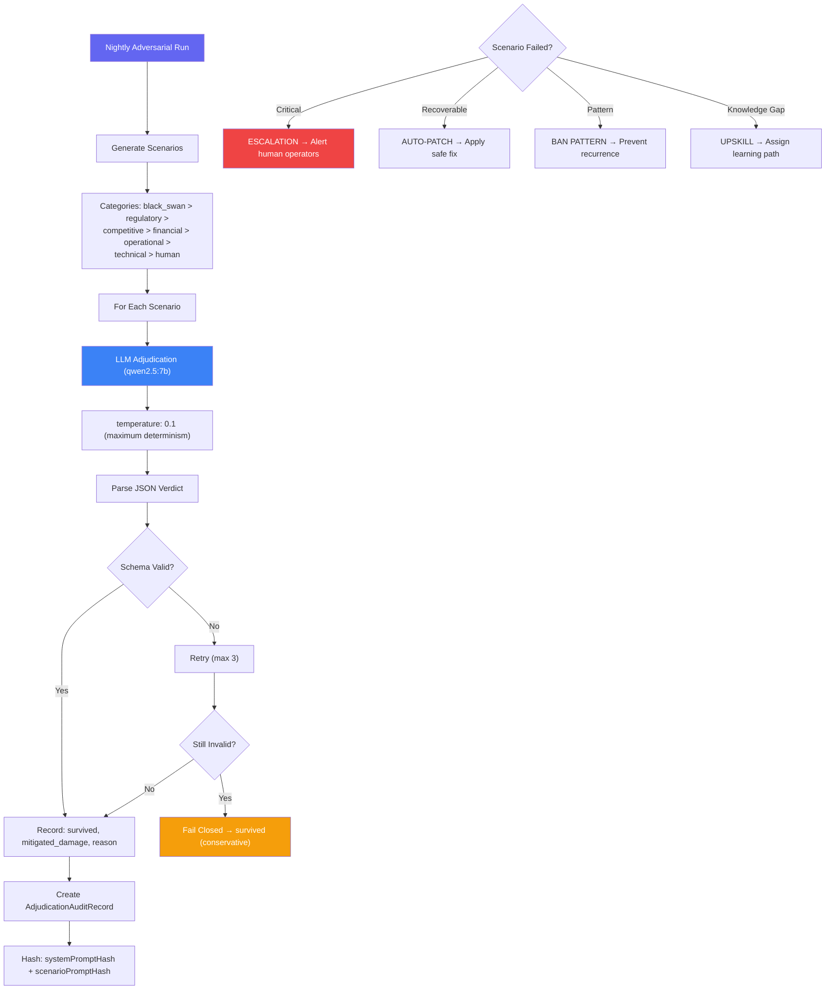
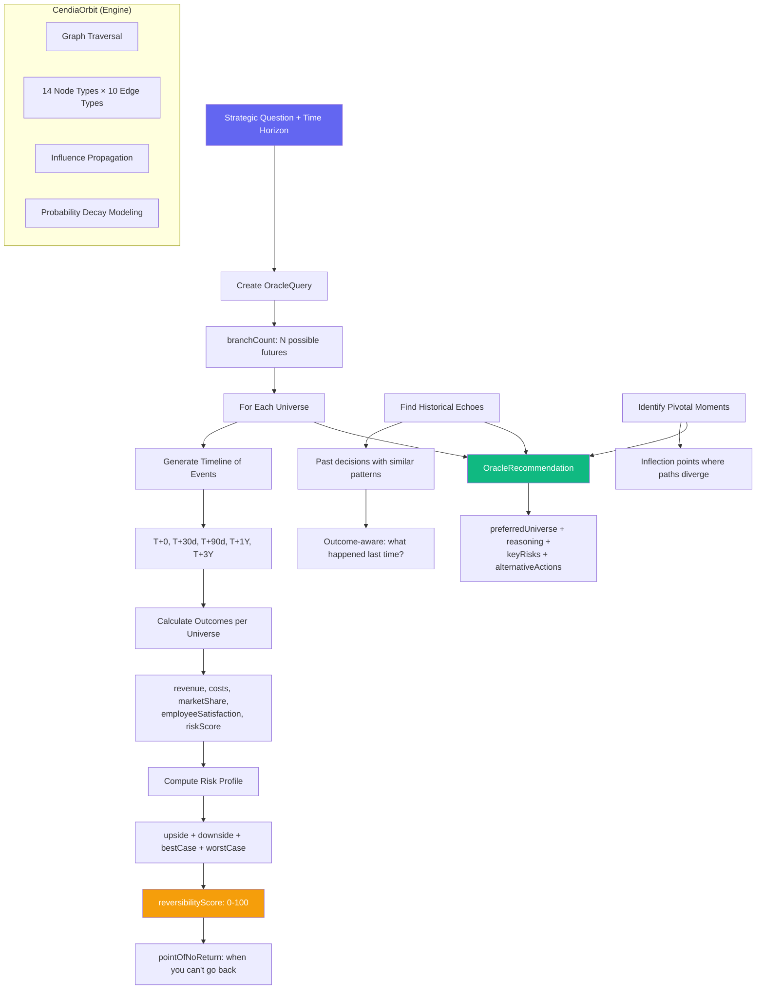
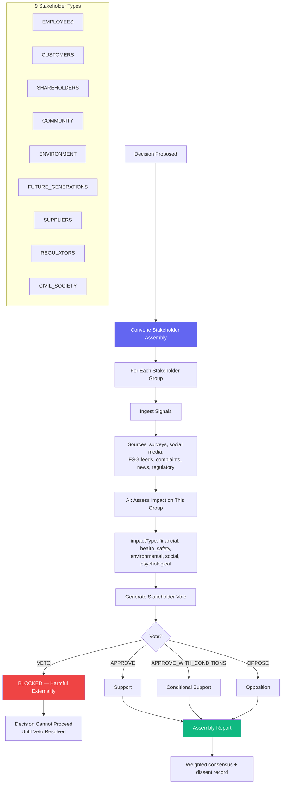
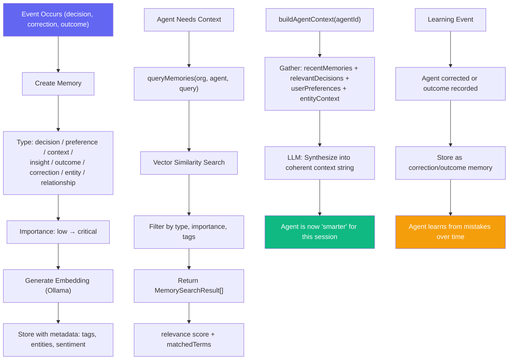
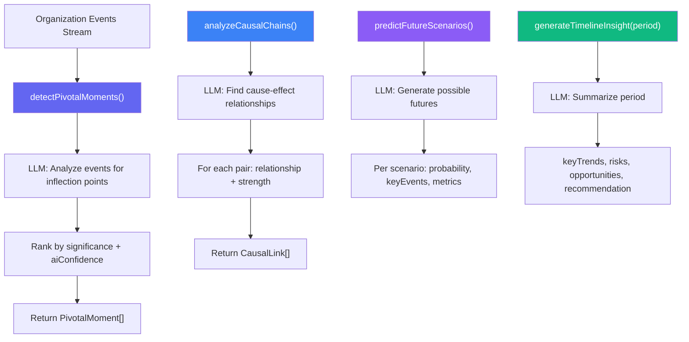
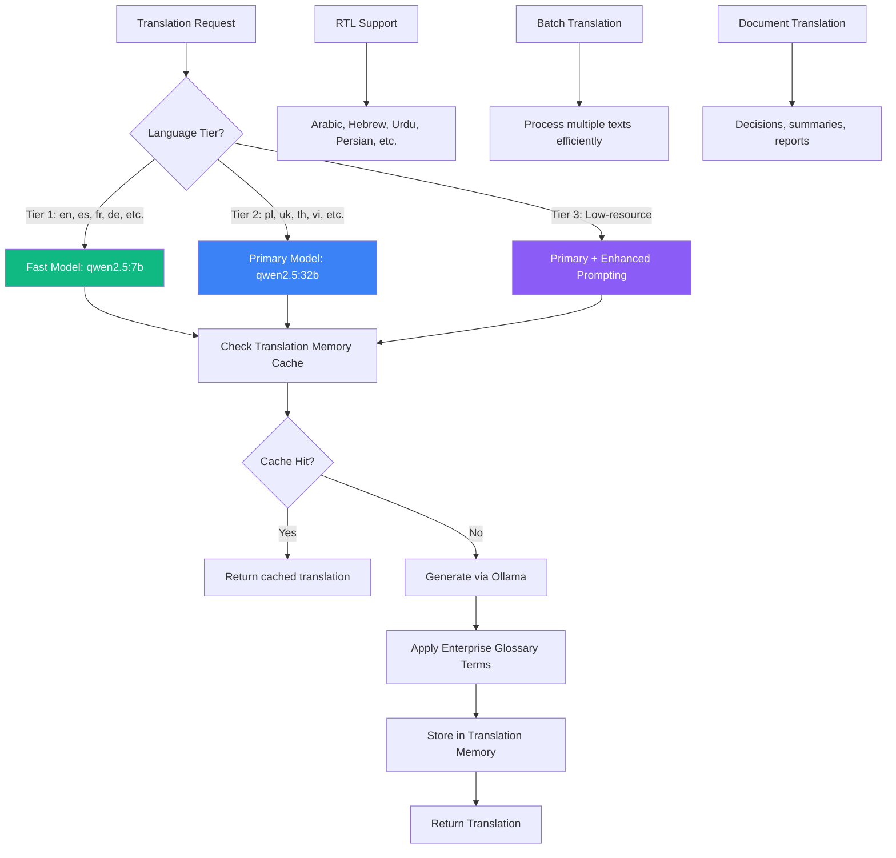

# Advanced Intelligence Services Workflows

> **Directory:** `backend/src/services/` (top-level)
> **Purpose:** Platform-wide intelligence capabilities — outcome tracking, timeline analysis, stakeholder voice, institutional memory, horizon planning, cascade analysis, and self-improvement.

## Advanced Intelligence Suite Overview

---

## CendiaEcho™ — Decision Outcome Engine

## CendiaApotheosis™ — Self-Improvement Engine

## CendiaHorizon™ — Multi-Universe Decision Simulation

## CendiaVox™ — Stakeholder Voice Assembly

## PantheonMemory™ — Institutional Memory

## ChronosAI™ — Timeline Intelligence

## CendiaOmniTranslate™ — 100+ Language Translation

## Key Code References

| Service | File | Key Capabilities |
|---------|------|-----------------|
| **Echo** | `echoService.ts` | Outcome collection, predictions vs actuals, dollar attribution, agent weight adjustment |
| **Apotheosis** | `CendiaApotheosisService.ts` | Nightly adversarial runs, LLM adjudication, auto-patch, escalation, pattern banning |
| **Horizon** | `CendiaHorizonService.ts` | Multi-universe simulation, reversibility scoring, historical echoes, CendiaCascade merged |
| **Cascade** | `CendiaCascadeService.ts` | **Deprecated** — merged into Horizon. Butterfly effect consequence engine |
| **Orbit** | `CendiaOrbitService.ts` | Graph traversal engine (14 node types, 10 edge types), influence propagation |
| **Vox** | `CendiaVoxService.ts` | 9 stakeholder types, signal integration, veto rights, impact assessment |
| **PantheonMemory** | `PantheonMemoryService.ts` | 8 memory types, vector similarity, agent context synthesis |
| **ChronosAI** | `ChronosAIService.ts` | Pivotal moments, causal chains, future scenarios, timeline insights |
| **OmniTranslate** | `CendiaOmniTranslateService.ts` | 100+ languages, 3-tier model selection, glossary, memory, RTL support |
| **Responsibility** | `CendiaResponsibilityService.ts` | Ethics engine for decision evaluation |
| **Symbiont** | `CendiaSymbiontService.ts` | Human-AI partnership measurement |
| **Narratives** | `CendiaNarrativesService.ts` | Story intelligence and narrative generation |
| **Eternal** | `CendiaEternalService.ts` | Knowledge preservation across leadership transitions |
