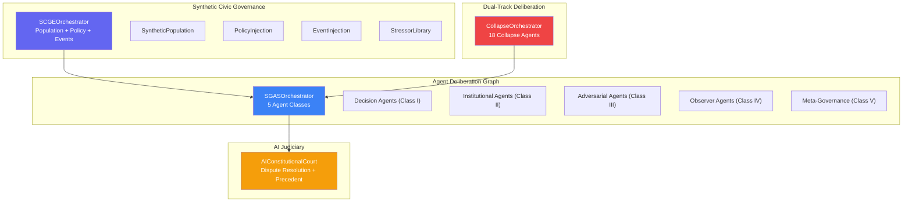
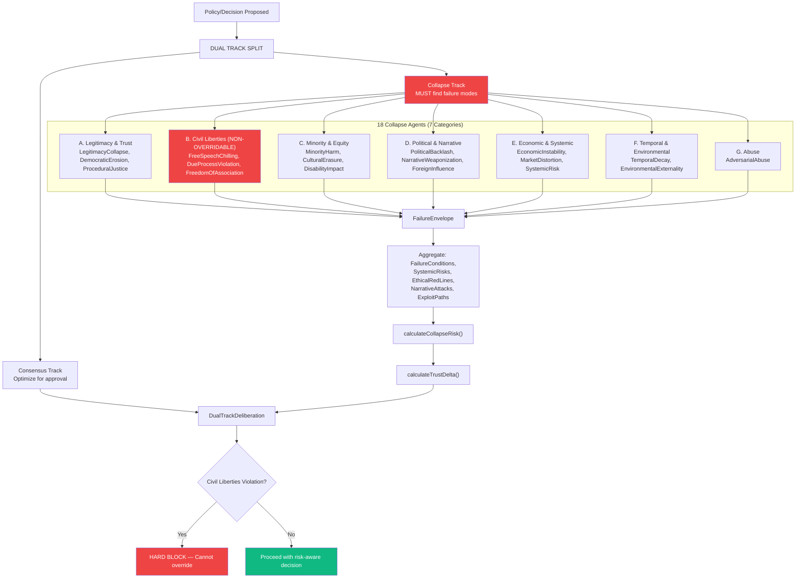
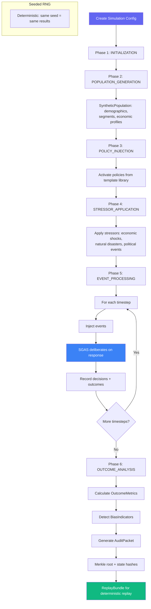
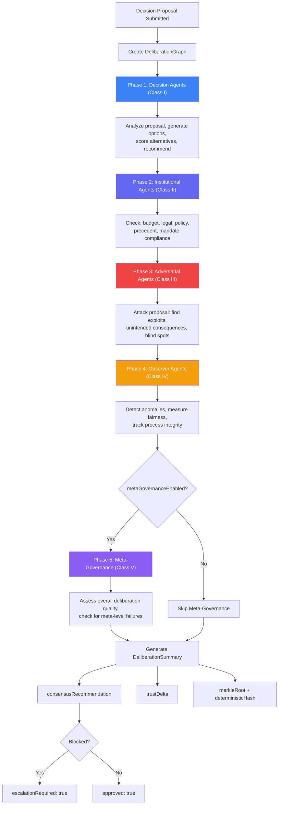
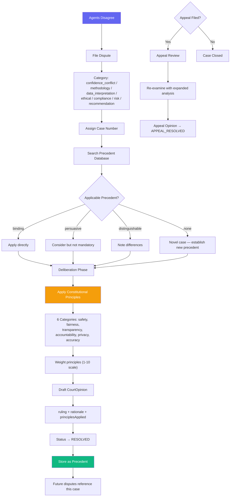

# Governance Simulation Services Workflows

> **Directories:** `backend/src/services/collapse/`, `backend/src/services/scge/`, `backend/src/services/sgas/`, `backend/src/services/governance/`
> **Purpose:** Dual-track deliberation (Collapse), synthetic civic governance simulation (SCGE), directed agent deliberation graphs (SGAS), and AI constitutional court for dispute resolution.

## Governance Simulation Overview

---

## CollapseOrchestrator — Dual-Track Deliberation

## SCGEOrchestrator — Synthetic Civic Governance Environment

## SGASOrchestrator — Directed Agent Deliberation Graph

## AIConstitutionalCourt — Dispute Resolution

## Key Code References

| Service | File | Purpose |
|---------|------|---------|
| **CollapseOrchestrator** | `collapse/CollapseOrchestrator.ts` | 18 agents across 7 categories, dual-track deliberation, hard blocks on civil liberties |
| **BaseCollapseAgent** | `collapse/agents/BaseCollapseAgent.ts` | Abstract base for all collapse agents |
| **SCGEOrchestrator** | `scge/SCGEOrchestrator.ts` | Seeded simulation, 6 phases, audit packets with Merkle roots |
| **SyntheticPopulation** | `scge/SyntheticPopulationService.ts` | Demographic generation for simulation |
| **PolicyInjection** | `scge/PolicyInjectionService.ts` | Policy templates and activation |
| **EventInjection** | `scge/EventInjectionService.ts` | Event triggers during simulation |
| **StressorLibrary** | `scge/StressorLibraryService.ts` | Predefined stress scenarios |
| **SGASOrchestrator** | `sgas/SGASOrchestrator.ts` | 5-class agent execution, directed graph, deterministic hashing |
| **DecisionAgents** | `sgas/DecisionAgentsService.ts` | Class I: Analysis and recommendation |
| **InstitutionalAgents** | `sgas/InstitutionalAgentsService.ts` | Class II: Compliance and mandate checks |
| **AdversarialAgents** | `sgas/AdversarialAgentsService.ts` | Class III: Attack and exploit finding |
| **ObserverAgents** | `sgas/ObserverAgentsService.ts` | Class IV: Anomaly and fairness detection |
| **MetaGovernanceAgents** | `sgas/MetaGovernanceAgentsService.ts` | Class V: Meta-level quality assessment |
| **AIConstitutionalCourt** | `governance/AIConstitutionalCourtService.ts` | Dispute filing, precedent DB, binding opinions, appeals |
