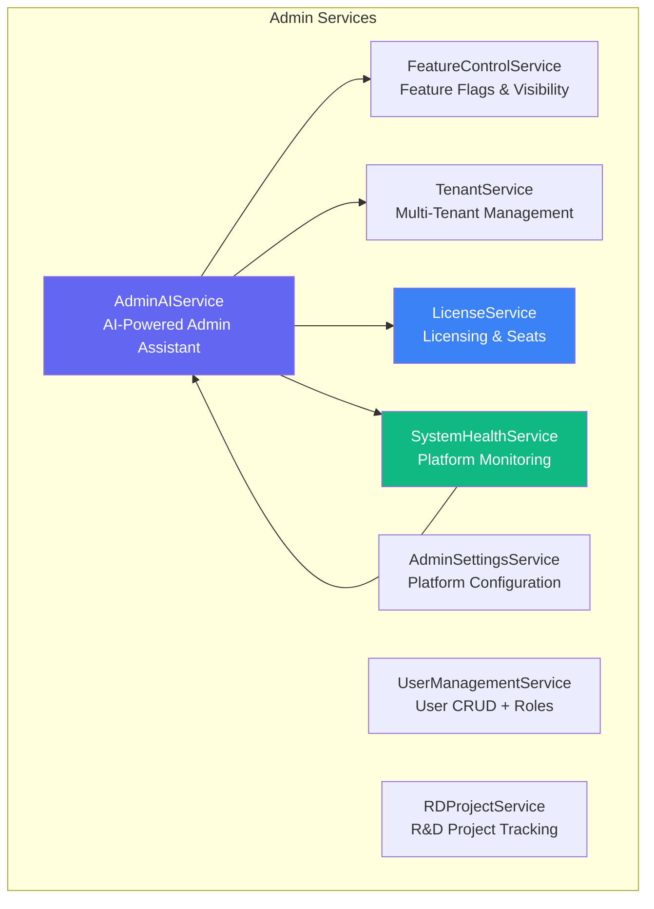
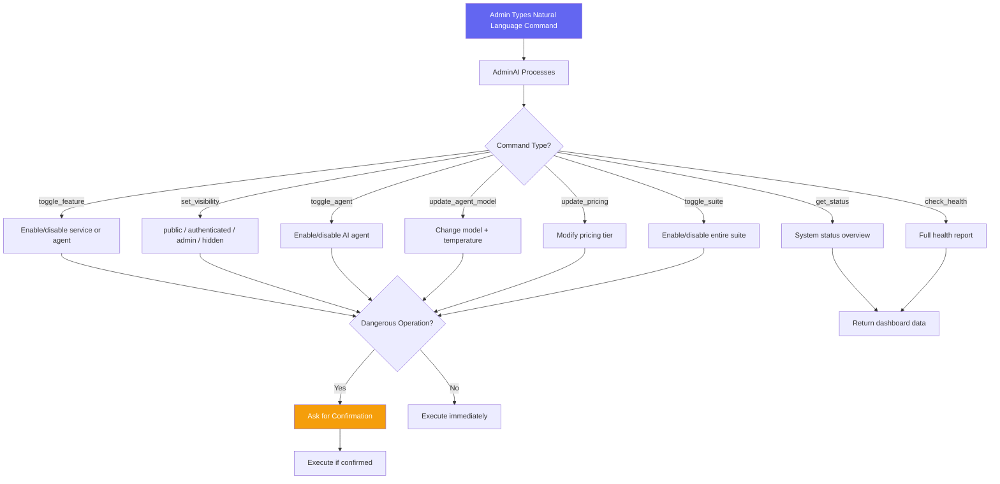
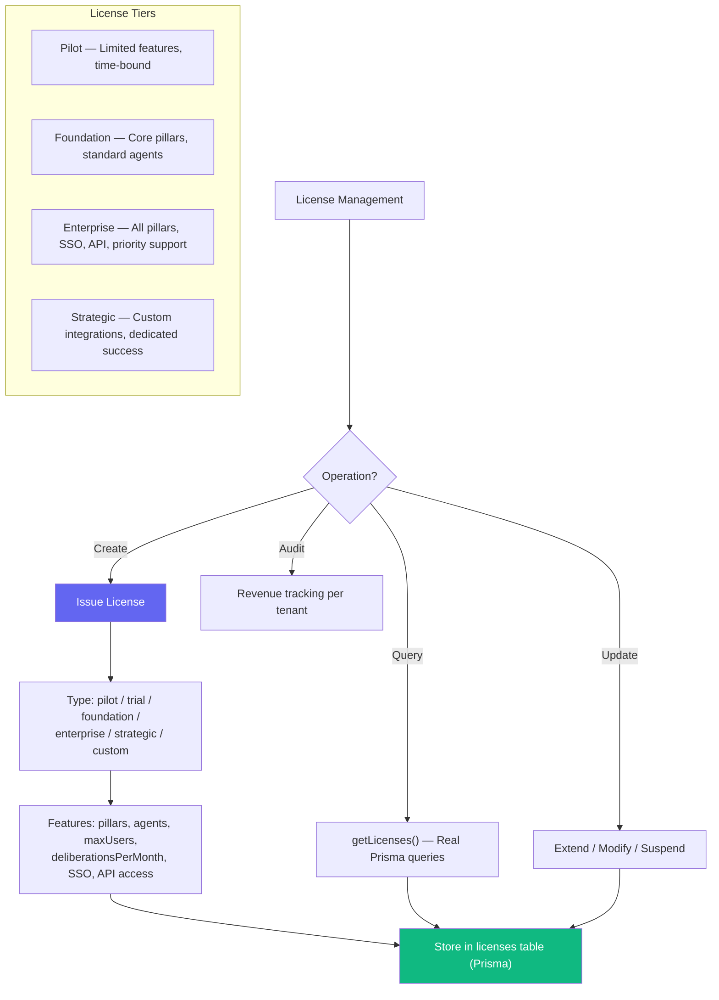
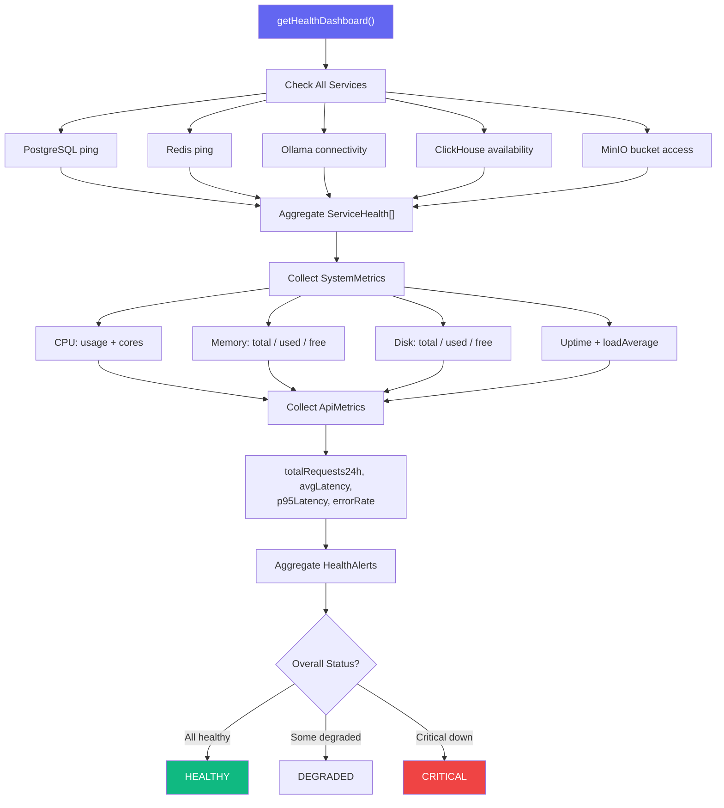
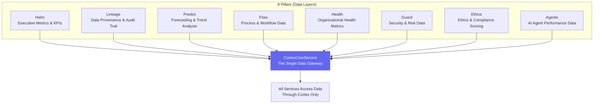
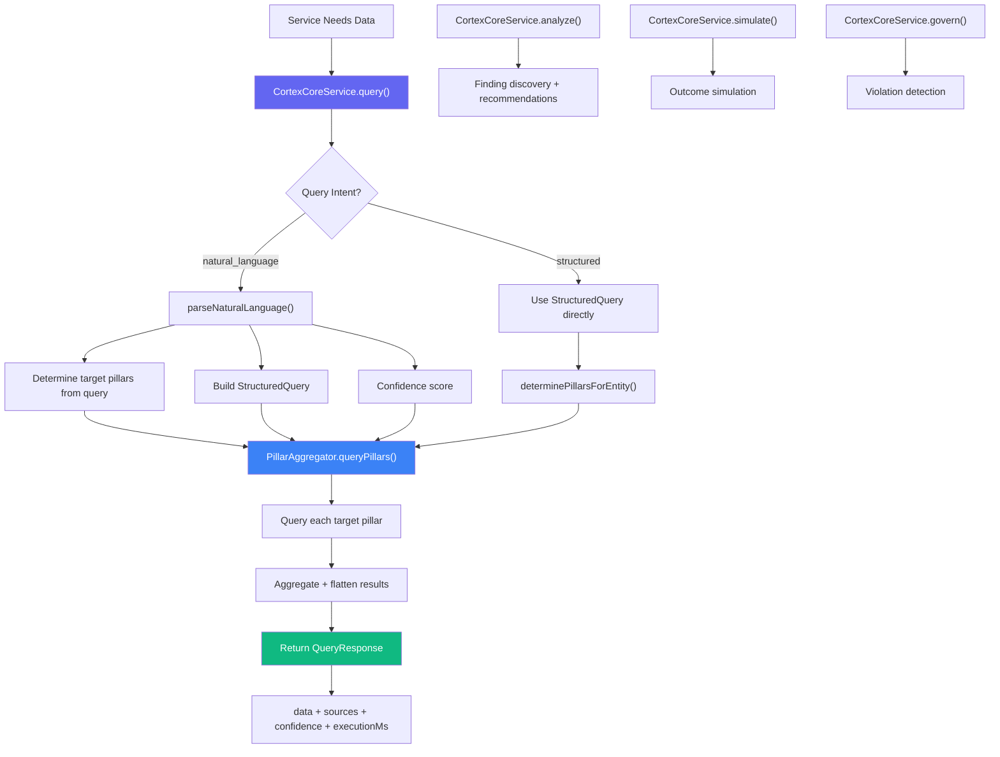
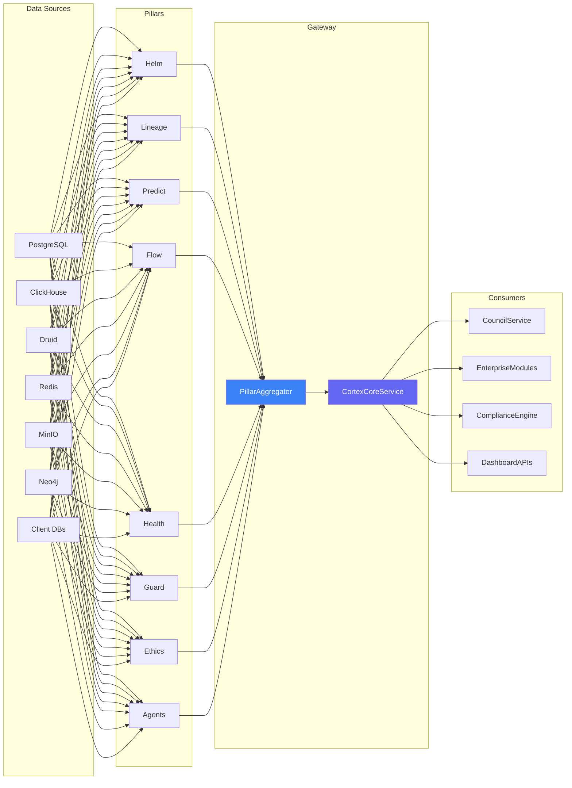

# Admin, Pillars & Cortex Services Workflows

> **Directories:** `backend/src/services/admin/`, `backend/src/services/pillars/`, `backend/src/services/cortex/`
> **Purpose:** Platform administration (AI assistant, licensing, tenants, health), 8 foundational data pillars, and the Cortex query gateway.

## Admin Suite Overview

## AdminAIService — AI-Powered Administration

## LicenseService — Enterprise Licensing

## SystemHealthService — Platform Monitoring

---

## 8 Foundational Data Pillars

## CortexCoreService — The Data Gateway

## Architecture: Sources → Pillars → Cortex → Services

## Key Code References

| Service | File | Purpose |
|---------|------|---------|
| **AdminAI** | `admin/AdminAIService.ts` | Natural language admin commands, 10 command types |
| **AdminSettings** | `admin/AdminSettingsService.ts` | Platform configuration management |
| **FeatureControl** | `admin/FeatureControlService.ts` | Feature flags, visibility levels, suite toggles |
| **License** | `admin/LicenseService.ts` | Real Prisma licensing: pilot→strategic tiers, seat management |
| **Tenant** | `admin/TenantService.ts` | Multi-tenant management |
| **SystemHealth** | `admin/SystemHealthService.ts` | Real health checks: CPU, memory, disk, service pings, alerts |
| **UserManagement** | `admin/UserManagementService.ts` | User CRUD + role assignment |
| **RDProject** | `admin/RDProjectService.ts` | R&D project tracking |
| **Pillars** | `pillars/index.ts` | 8 pillar services: Helm, Lineage, Predict, Flow, Health, Guard, Ethics, Agents |
| **CortexCore** | `cortex/CortexCoreService.ts` | Single data gateway, NL + structured query, pillar aggregation |
| **PillarAggregator** | `cortex/PillarAggregator.ts` | Cross-pillar data fusion |
