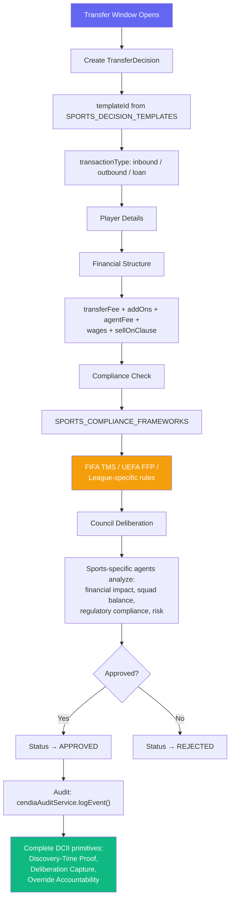
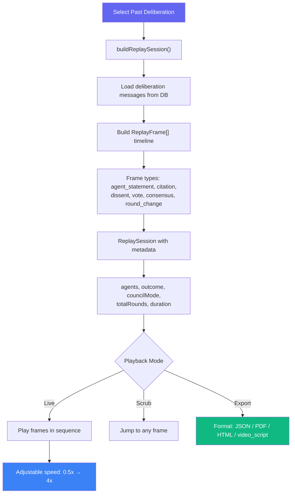
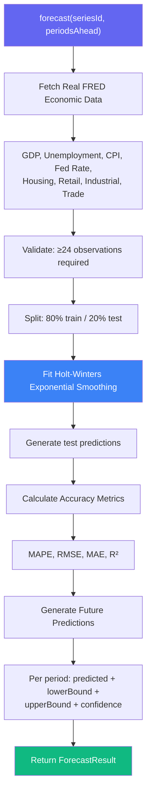
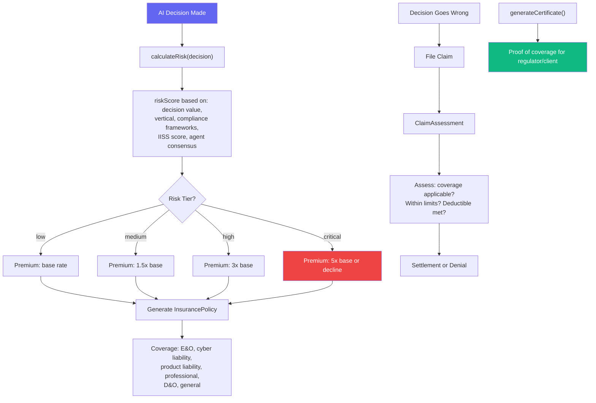
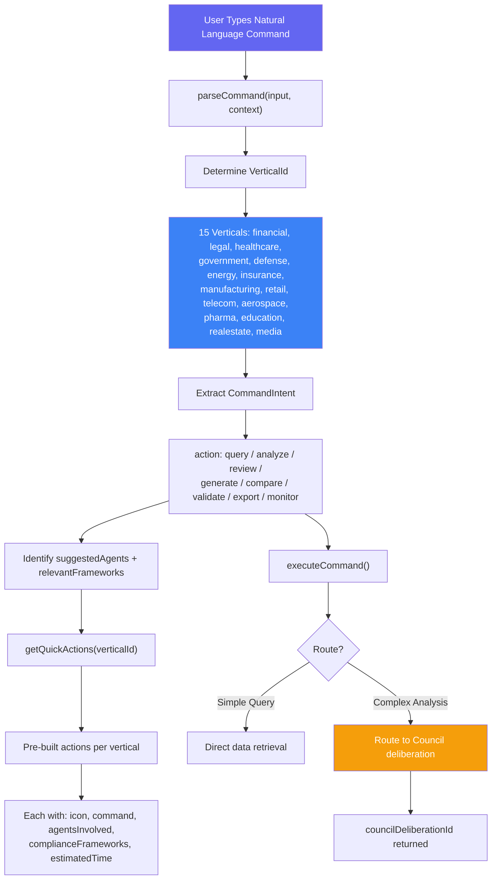

# Specialized Services Workflows

> **Directories:** `backend/src/services/sports/`, `visualization/`, `forecasting/`, `insurance/`, `command/`
> **Purpose:** Industry-specific, visualization, forecasting, insurance, and command interface services.

## Sports Vertical — Transfer Decision Governance

## Decision Replay Theater — Visual Deliberation Playback

## Time Series Forecasting — Real ML on FRED Data

## AI Insurance — Per-Decision Liability Coverage

## CendiaCommand — Vertical-Specific Command Interface

## Key Code References

| Service | File | Purpose |
|---------|------|---------|
| **SportsDecision** | `sports/SportsDecisionService.ts` | Transfer governance, FIFA/UEFA compliance, player/club/agent tracking |
| **SportsAgents** | `sports/SportsAgents.ts` | Sport-specific AI agent personas |
| **SportsKnowledgeBase** | `sports/SportsKnowledgeBase.ts` | Sport-specific RAG data |
| **DecisionReplayTheater** | `visualization/DecisionReplayTheaterService.ts` | Frame-by-frame deliberation playback, export to JSON/PDF/HTML |
| **DeliberationViz** | `visualization/DeliberationVisualizationService.ts` | Visual graph rendering of deliberations |
| **TimeSeriesForecaster** | `forecasting/TimeSeriesForecaster.ts` | Holt-Winters on real FRED data, accuracy metrics |
| **FREDDataService** | `forecasting/FREDDataService.ts` | Federal Reserve economic data API client |
| **AIInsurance** | `insurance/AIInsuranceService.ts` | Per-decision liability coverage, claims, certificates |
| **CendiaCommand** | `command/CendiaCommandService.ts` | NL command interface, 15 verticals, 8 action types |
| **CendiaCommandPlatinum** | `command/CendiaCommandPlatinumService.ts` | Enterprise platinum command features |
