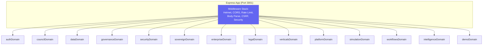
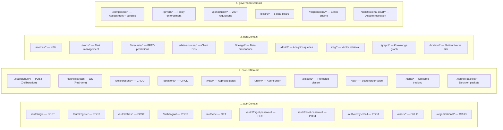
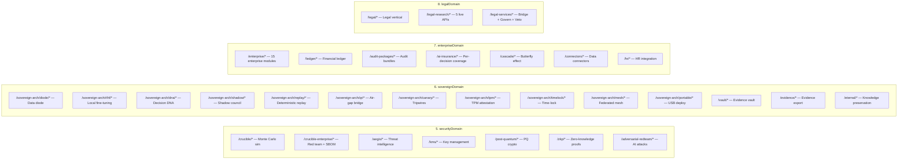
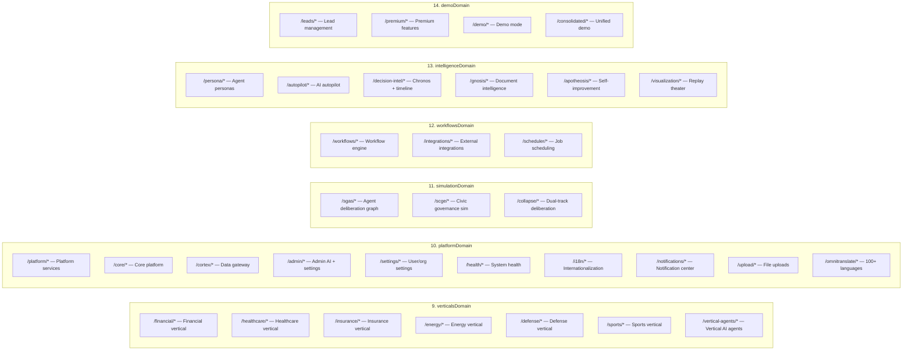
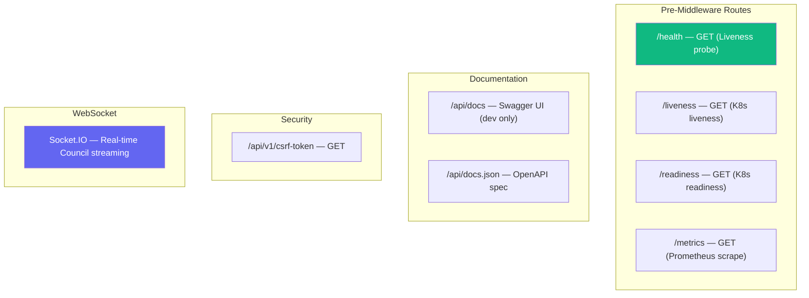
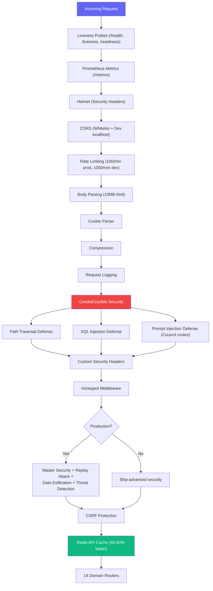

# Datacendia Platform — API Route Map

> **Source:** `backend/src/index.ts` + `backend/src/routes/domains/`
> **Base URL:** `/api/v1/`
> **Architecture:** 14 Domain Routers consolidating ~110 route modules

## Domain Router Architecture

## Complete API Route Map by Domain

## Special Routes (Outside Domain Routers)

## Middleware Pipeline

## Key References

| Domain | Route Files | Approximate Endpoints |
|--------|------------|----------------------|
| **authDomain** | `auth.ts`, `users.ts`, `organizations.ts` | ~20 |
| **councilDomain** | `council.ts`, `deliberations.ts`, `decisions.ts`, `veto.ts`, `dissent.ts`, `vox.ts`, `echo.ts`, `council-packets.ts` | ~35 |
| **dataDomain** | `metrics.ts`, `alerts.ts`, `forecasts.ts`, `data-sources.ts`, `lineage.ts`, `druid.ts`, `rag.ts`, `graph.ts`, `horizon.ts` | ~30 |
| **governanceDomain** | `compliance.ts`, `govern.ts`, `panopticon.ts`, `pillars.ts`, `responsibility.ts`, `constitutional-court.ts` | ~25 |
| **securityDomain** | `crucible.ts`, `crucible-enterprise.ts`, `aegis.ts`, `kms.ts`, `post-quantum.ts`, `zkp.ts` | ~25 |
| **sovereignDomain** | `sovereign-arch.ts`, `vault.ts`, `evidence.ts`, `eternal.ts` | ~40 |
| **enterpriseDomain** | `enterprise.ts`, `ledger.ts`, `audit-packages.ts`, `ai-insurance.ts`, `cascade.ts` | ~30 |
| **legalDomain** | `legal.ts`, `legal-research.ts`, `legal-services.ts` | ~20 |
| **verticalsDomain** | `financial.ts`, `healthcare.ts`, `insurance.ts`, `energy.ts`, `defense.ts`, `sports.ts` | ~25 |
| **platformDomain** | `platform.ts`, `core.ts`, `cortex.ts`, `admin.ts`, `health.ts`, `i18n.ts`, `omnitranslate.ts` | ~30 |
| **simulationDomain** | `sgas.ts`, `scge.ts`, `collapse.ts` | ~15 |
| **workflowsDomain** | `workflows.ts`, `integrations.ts`, `scheduler.ts` | ~10 |
| **intelligenceDomain** | `persona.ts`, `autopilot.ts`, `decision-intel.ts`, `gnosis.ts`, `apotheosis.ts`, `visualization.ts` | ~20 |
| **demoDomain** | `leads.ts`, `premium.ts`, `demo.ts` | ~10 |
| **TOTAL** | **~110 route modules** | **~335+ endpoints** |
