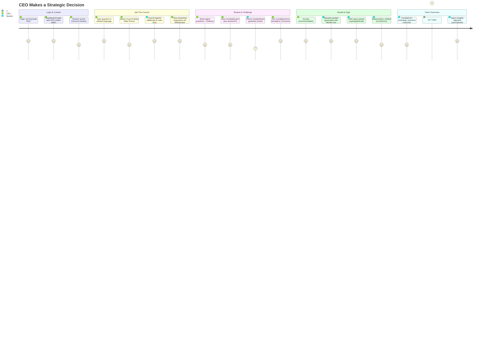
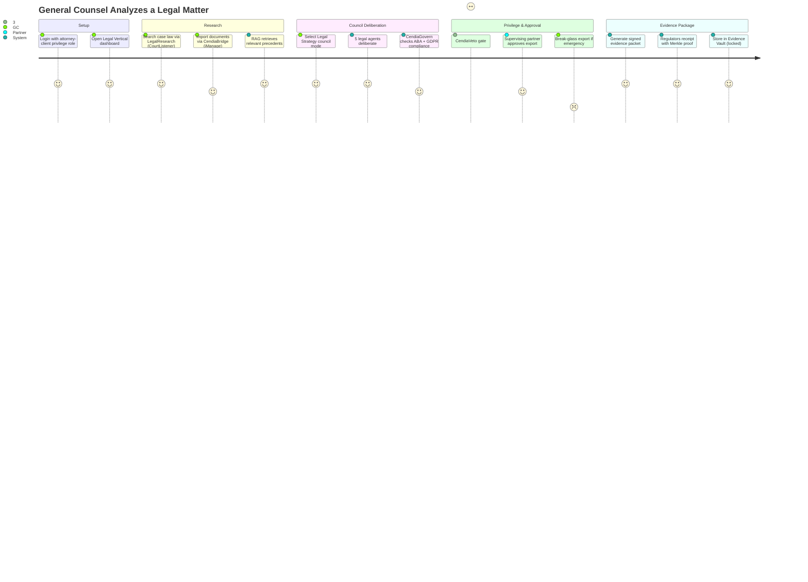
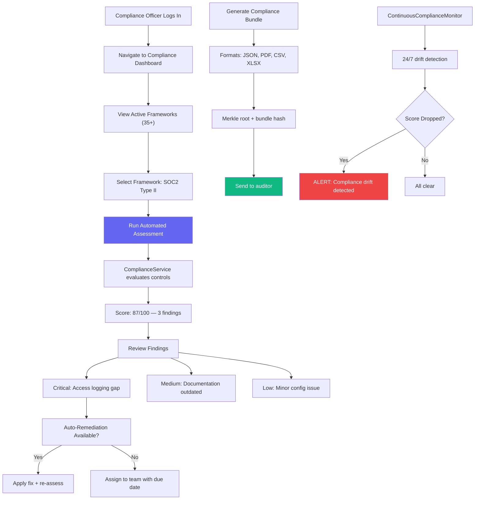
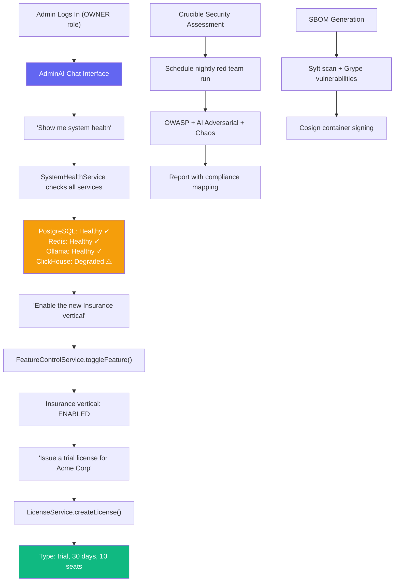
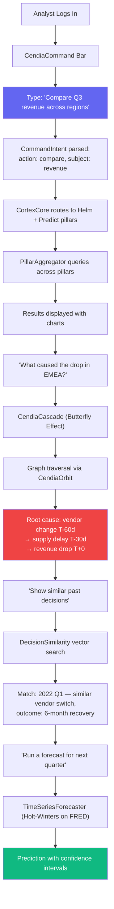
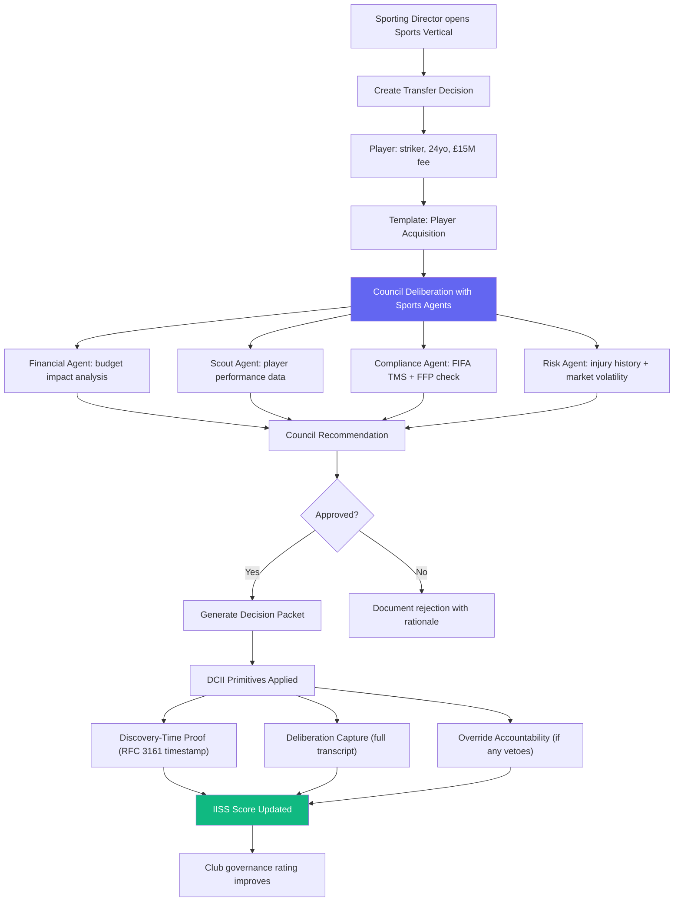
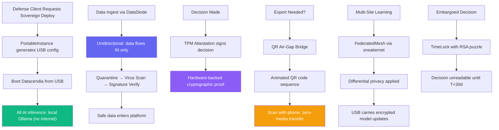

# Datacendia Platform — User Journey Maps

> **Purpose:** End-to-end user workflows for key personas — executives, legal teams, compliance officers, IT administrators, and analysts.

## Journey 1: Executive Decision-Making

## Journey 2: Legal Team — Matter Analysis

## Journey 3: Compliance Officer — Audit Preparation

## Journey 4: IT Administrator — Platform Management

## Journey 5: Analyst — Data Investigation

## Journey 6: Sports Club — Transfer Governance

## Journey 7: Sovereign Deployment — Air-Gapped Environment

