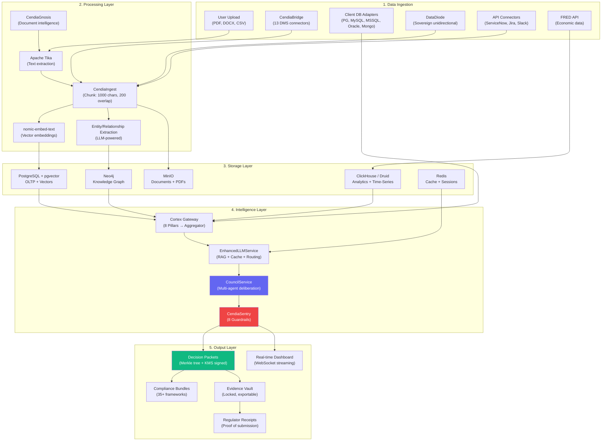
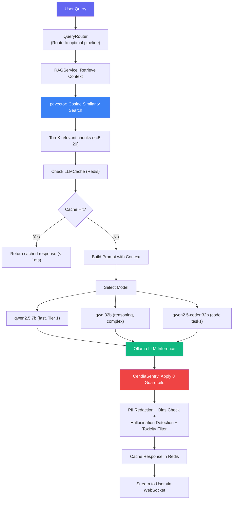
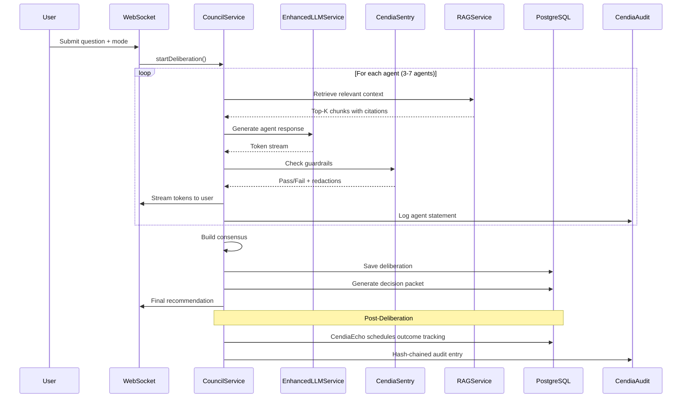
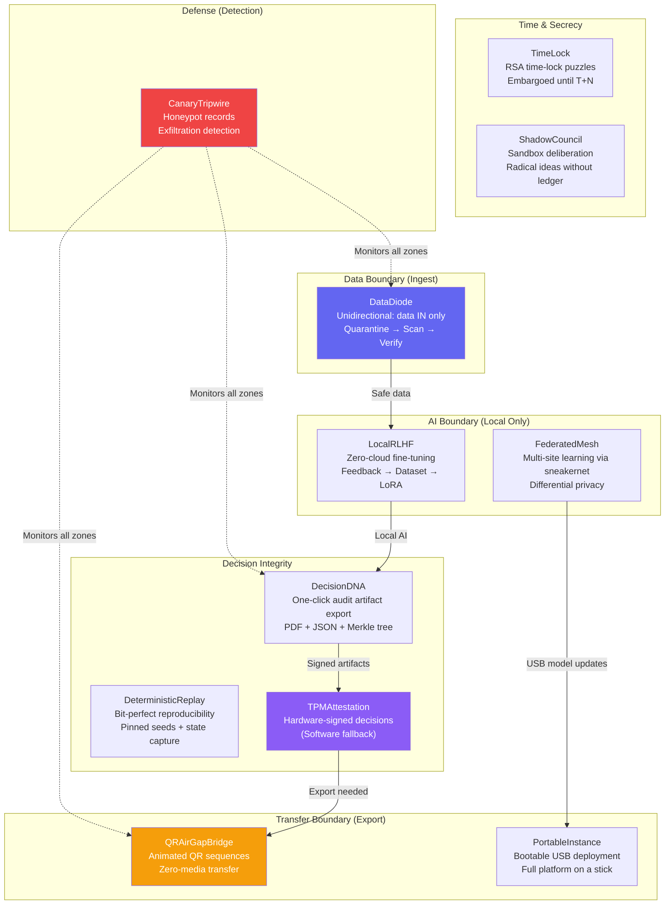
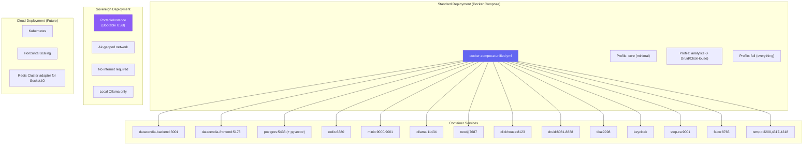
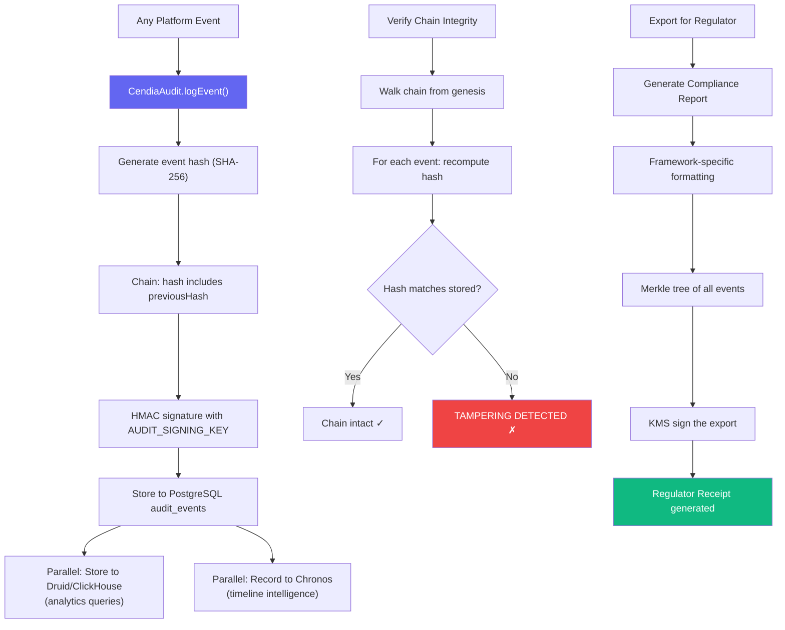

# Datacendia Platform — Data Flow & Sovereign Architecture Diagrams

> **Purpose:** End-to-end data pipelines, sovereign deployment patterns, and integration topology.

## End-to-End Data Flow Pipeline

## RAG (Retrieval-Augmented Generation) Pipeline

## Council Deliberation Data Flow

## Sovereign Architecture — 11 Air-Gap Patterns

## Integration Map — External Systems

```mermaid
flowchart TB
    subgraph "AI / ML"
        OL["Ollama LLM Server<br/>5 models: qwen2.5:7b, qwq:32b,<br/>qwen2.5-coder:32b, llama3.2:3b,<br/>nomic-embed-text"]
    end

    subgraph "Identity & Auth"
        KC["Keycloak SSO<br/>OIDC / SAML 2.0"]
    end

    subgraph "Legal Research APIs"
        LR1["CourtListener"]
        LR2["eCFR"]
        LR3["Open States"]
        LR4["Federal Register"]
        LR5["SEC EDGAR"]
        LR6["Westlaw (premium)"]
    end

    subgraph "Document Management"
        DM1["iManage"]
        DM2["NetDocuments"]
        DM3["SharePoint"]
    end

    subgraph "Practice Management"
        PM1["Clio"]
        PM2["PracticePanther"]
    end

    subgraph "eDiscovery"
        ED1["Relativity"]
        ED2["Nuix"]
    end

    subgraph "Contract Lifecycle"
        CL1["Ironclad"]
        CL2["DocuSign CLM"]
    end

    subgraph "Economic Data"
        FRED["FRED API<br/>Federal Reserve data"]
    end

    subgraph "Security / PKI"
        TSA["DigiCert / Comodo / FreeTSA<br/>(RFC 3161 timestamps)"]
        KMS2["AWS KMS / Vault / Azure KV"]
        BC["Bitcoin / Ethereum / Polygon<br/>(Blockchain anchoring)"]
        FALCO["Falco Runtime Security"]
        STEP["step-ca Internal PKI"]
    end

    subgraph "Client Databases"
        CDB1["PostgreSQL"]
        CDB2["MySQL"]
        CDB3["SQL Server"]
        CDB4["Oracle"]
        CDB5["MongoDB"]
        CDB6["IBM DB2"]
    end

    subgraph "Observability"
        TEMPO["Grafana Tempo<br/>(Distributed tracing)"]
        OTEL["OpenTelemetry"]
        PROM["Prometheus Metrics"]
    end

    CORE["Datacendia Platform"] --> OL
    CORE --> KC
    CORE --> LR1 & LR2 & LR3 & LR4 & LR5 & LR6
    CORE --> DM1 & DM2 & DM3
    CORE --> PM1 & PM2
    CORE --> ED1 & ED2
    CORE --> CL1 & CL2
    CORE --> FRED
    CORE --> TSA & KMS2 & BC
    CORE --> CDB1 & CDB2 & CDB3 & CDB4 & CDB5 & CDB6
    CORE --> FALCO & STEP
    CORE --> OTEL --> TEMPO
    CORE --> PROM

    style CORE fill:#6366f1,color:#fff
```

## Deployment Architecture

## Audit Trail Data Flow (Tamper-Proof)

