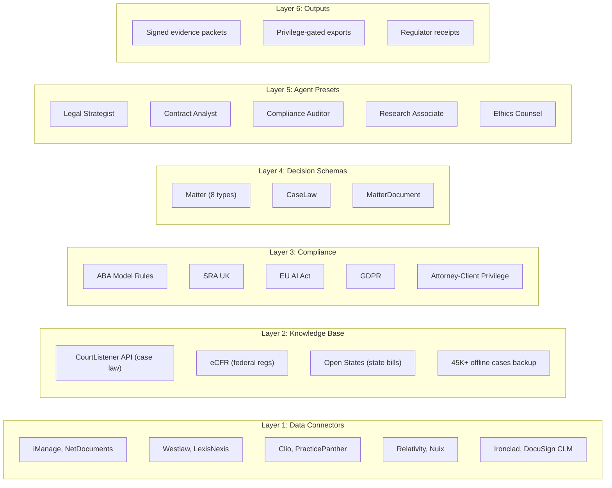
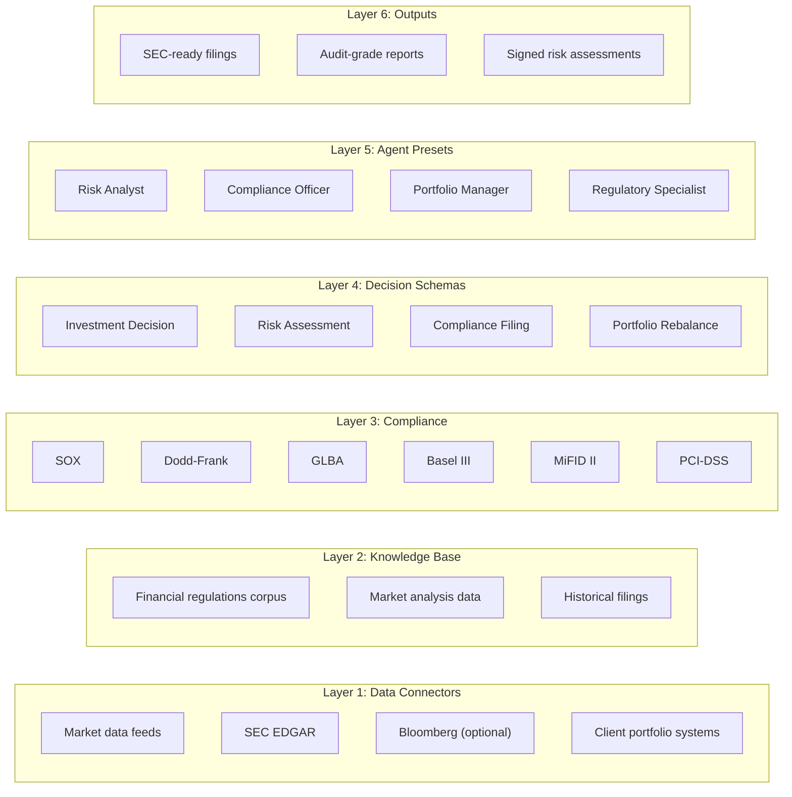
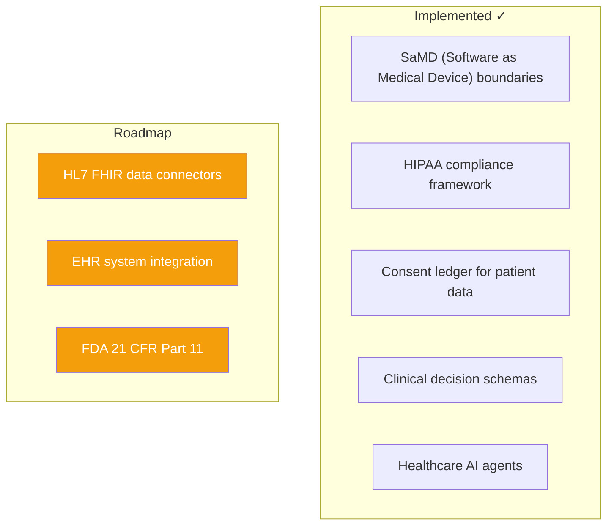
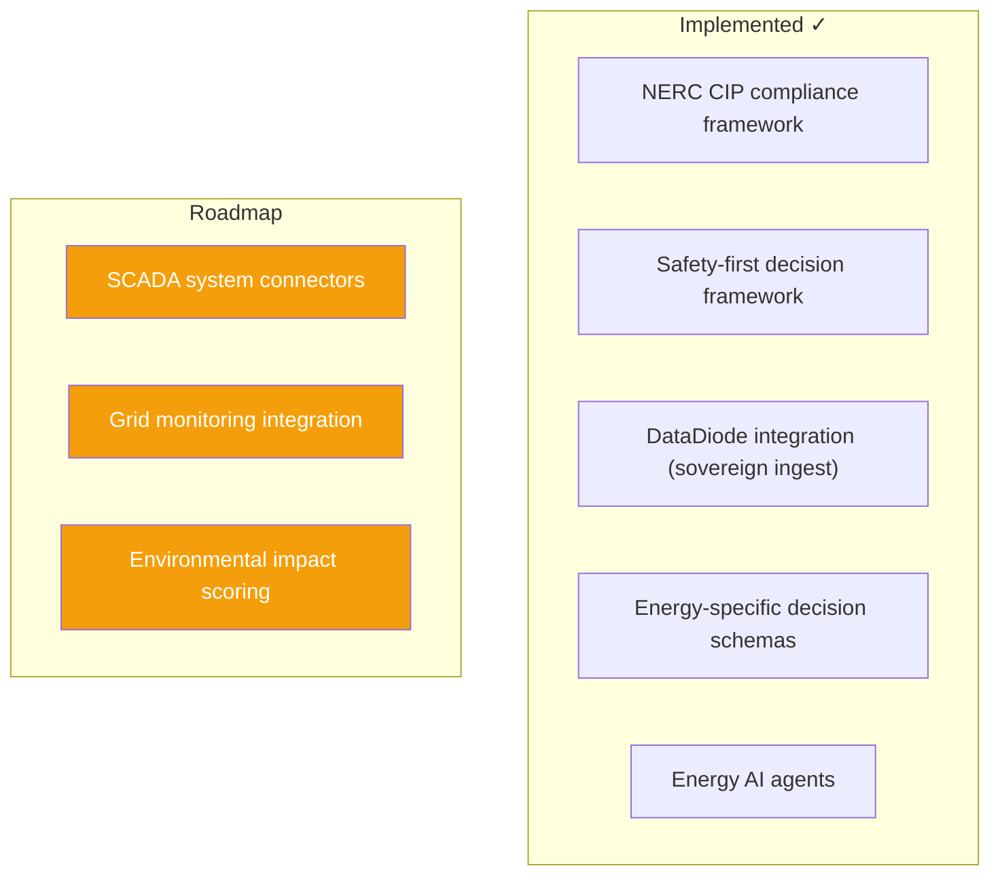
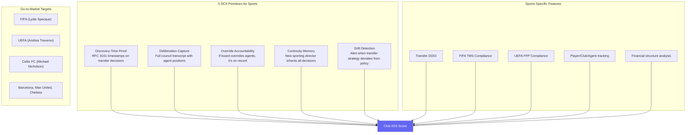
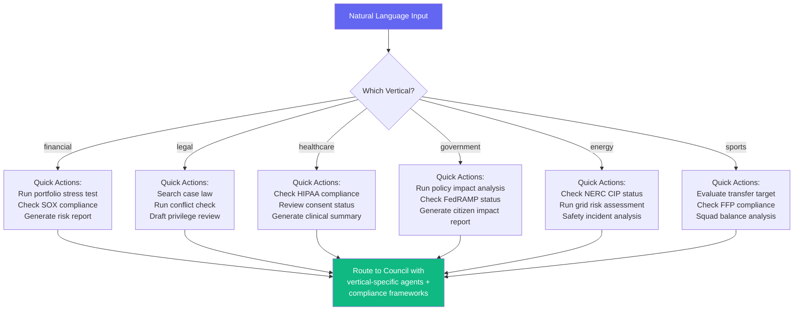
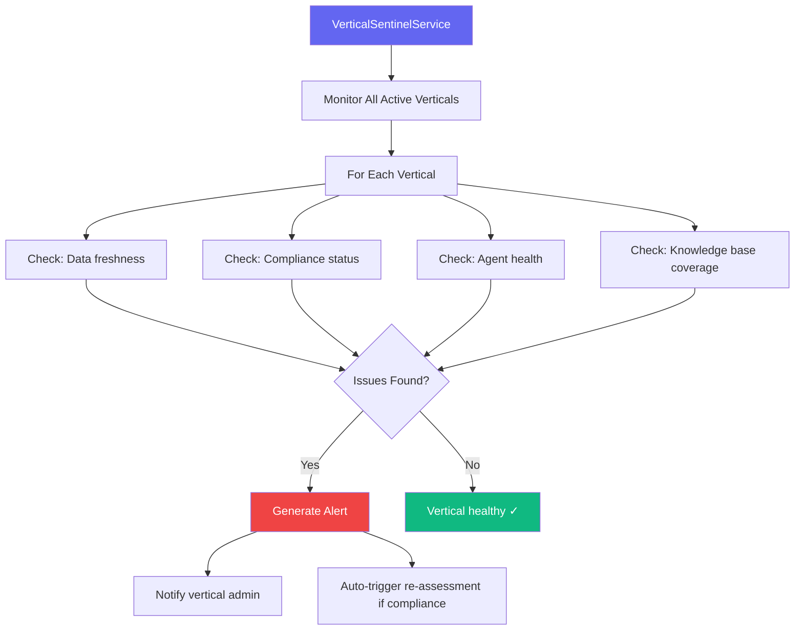

# Datacendia Platform — Vertical / Industry Customization Diagrams

> **Directories:** `backend/src/services/verticals/`, `backend/src/services/sports/`, `backend/src/services/command/`
> **Purpose:** Industry-specific deployments with 6-layer completeness standard — data connectors, RAG knowledge base, compliance mapping, decision schemas, agent presets, and defensible outputs.

## Vertical Completion Matrix

```mermaid
flowchart TB
    subgraph "6-Layer Completeness Standard"
        L1["Layer 1: Authoritative Data Connectors"]
        L2["Layer 2: Vertical Knowledge Base (RAG)"]
        L3["Layer 3: Compliance & Liability Mapping"]
        L4["Layer 4: Decision Schemas"]
        L5["Layer 5: Agent Presets"]
        L6["Layer 6: Externally Defensible Outputs"]
    end

    subgraph "Completion Status"
        V1["Legal: 100% ✅"]
        V2["Financial: 100% ✅"]
        V3["Government: 80%"]
        V4["Healthcare: 75%"]
        V5["Insurance: 75%"]
        V6["Energy: 75%"]
        V7["Sports: 60%"]
        V8["Defense: 50%"]
        V9["Manufacturing: 30%"]
        V10["Others: 20-30%"]
    end

    L1 & L2 & L3 & L4 & L5 & L6 --> V1
    L1 & L2 & L3 & L4 & L5 & L6 --> V2

    style V1 fill:#10b981,color:#fff
    style V2 fill:#10b981,color:#fff
    style V3 fill:#3b82f6,color:#fff
    style V4 fill:#f59e0b,color:#fff
    style V5 fill:#f59e0b,color:#fff
    style V6 fill:#f59e0b,color:#fff
```

## Vertical Architecture Pattern

```mermaid
flowchart TD
    A["VerticalPattern (Core Abstract)"] --> B["Concrete Vertical Implementation"]

    B --> C1["Data Connectors"]
    C1 --> C1a["Systems of record for this industry"]
    C1 --> C1b["API adapters + sync schedules"]

    B --> C2["Knowledge Base (RAG)"]
    C2 --> C2a["Industry-specific corpus"]
    C2 --> C2b["Provenance enforcement"]
    C2 --> C2c["Citation tracking"]

    B --> C3["Compliance Mapping"]
    C3 --> C3a["Industry regulations"]
    C3 --> C3b["Machine-enforced rules"]
    C3 --> C3c["Auto-remediation"]

    B --> C4["Decision Schemas"]
    C4 --> C4a["Industry-specific objects"]
    C4 --> C4b["Validation rules"]
    C4 --> C4c["Workflow templates"]

    B --> C5["Agent Presets"]
    C5 --> C5a["Specialized AI personas"]
    C5 --> C5b["Tied to workflows, not personas"]
    C5 --> C5c["Council mode configurations"]

    B --> C6["Defensible Outputs"]
    C6 --> C6a["Regulator-ready"]
    C6 --> C6b["forensic-grade, independently verifiable"]
    C6 --> C6c["Auditor-verifiable"]

    style A fill:#6366f1,color:#fff
```

## Legal Vertical (100% Complete)

## Financial Vertical (100% Complete)

## Healthcare Vertical (75% Complete)

## Energy Vertical (75% Complete)

## Sports Vertical — Crisis Immunization Framework

## CendiaCommand — Vertical Command Interface

## Vertical Sentinel Service — Cross-Vertical Monitoring

## Key Code References

| Component | File | Purpose |
|-----------|------|---------|
| **VerticalPattern** | `verticals/core/VerticalPattern.ts` | Abstract 6-layer pattern |
| **FinancialVertical** | `verticals/financial/FinancialVertical.ts` | 100% complete: 4 schemas, 6 frameworks, 4 agents |
| **HealthcareVertical** | `verticals/healthcare/HealthcareVertical.ts` | 75%: SaMD, consent, clinical schemas |
| **InsuranceVertical** | `verticals/insurance/InsuranceVertical.ts` | 75%: ACORD schemas, bias engine |
| **EnergyVertical** | `verticals/energy/EnergyVertical.ts` | 75%: NERC CIP, data diode |
| **VerticalAgents** | `VerticalAgentsService.ts` | AI agents for all verticals |
| **VerticalSentinel** | `verticals/meta/VerticalSentinelService.ts` | Cross-vertical monitoring |
| **SportsDecision** | `sports/SportsDecisionService.ts` | Transfer governance, FIFA/UEFA compliance |
| **CendiaCommand** | `command/CendiaCommandService.ts` | 15 vertical command interfaces |
| **Spec** | `docs/VERTICAL_COMPLETION_SPEC.md` | v1.1 completion standard |
