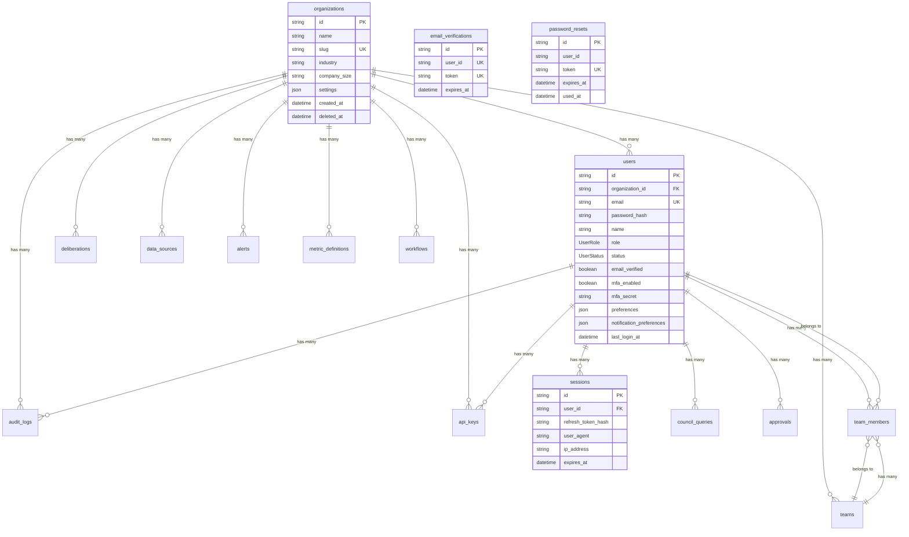
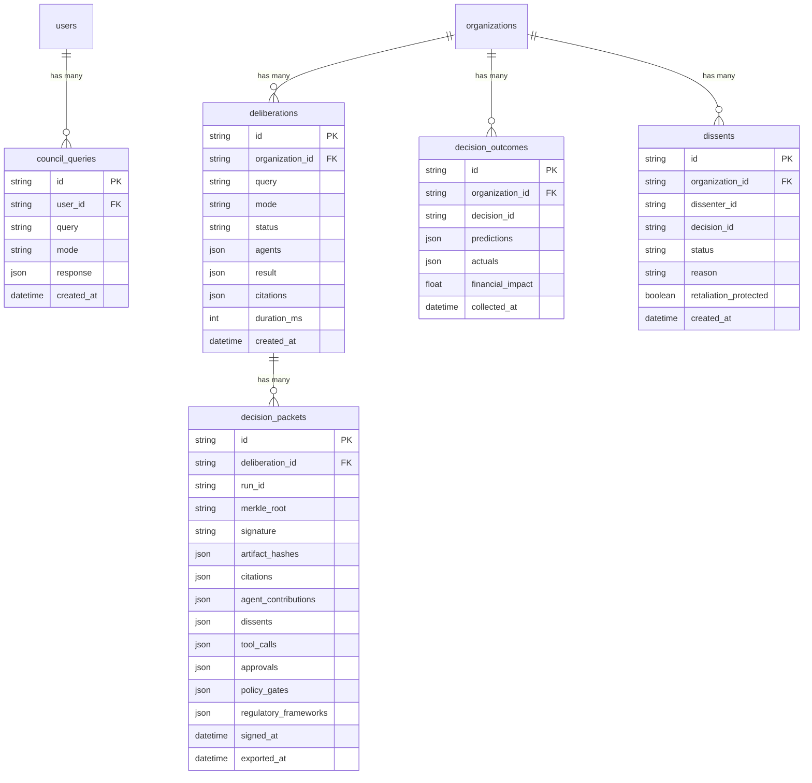
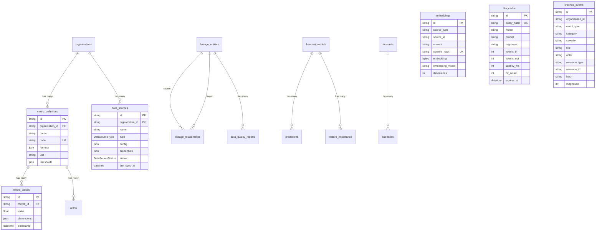
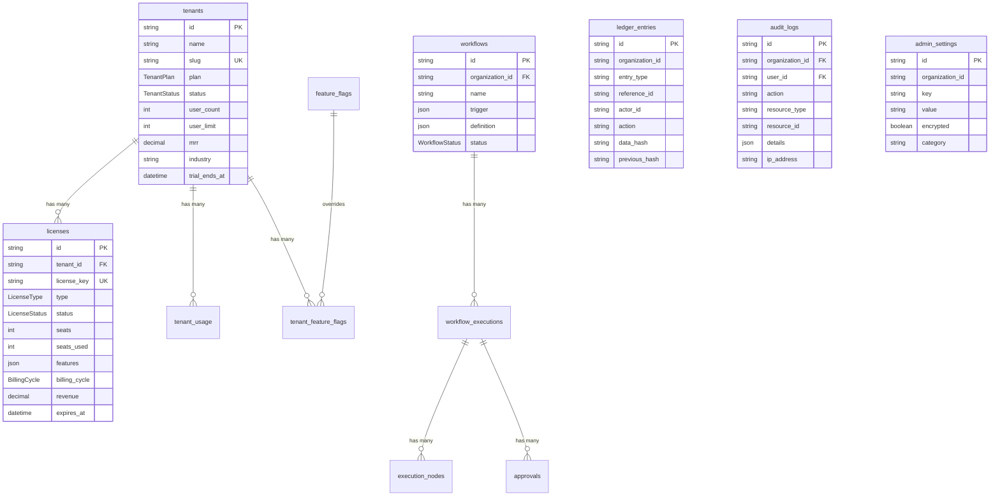
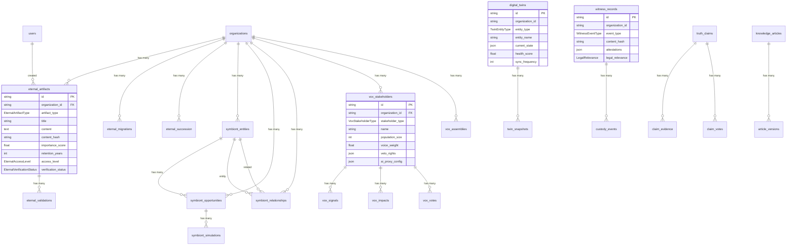
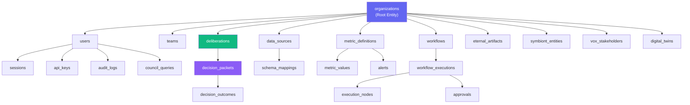

# Datacendia Platform — Database Entity Relationship Diagram

> **Source:** `backend/prisma/schema/` — 4 schema files: `base.prisma`, `data.prisma`, `platform.prisma`, `sovereign.prisma`
> **Database:** PostgreSQL 16 + pgvector extension
> **ORM:** Prisma Client with `prismaSchemaFolder` preview feature

## Core Identity & Auth Domain

## Council & Deliberation Domain

## Data & Analytics Domain

## Platform & Admin Domain

## Sovereign & Governance Domain

## Model Count Summary

| Schema File | Models | Enums | Key Domain |
|-------------|--------|-------|------------|
| **base.prisma** | 7 | 2 | Users, orgs, auth, teams |
| **data.prisma** | 14 | 16 | Metrics, alerts, forecasts, lineage, embeddings, health, chronos |
| **platform.prisma** | 15 | 8 | Workflows, tenants, licenses, feature flags, ledger, translations |
| **sovereign.prisma** | 20 | 38 | Eternal, Symbiont, Vox, Digital Twins, Witness, Truth Claims, Knowledge |
| **TOTAL** | **~56 models** | **~64 enums** | Full platform |

## Key Relationships

