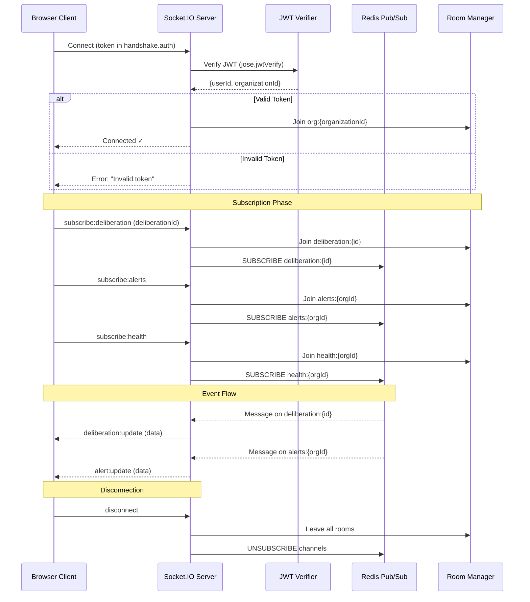
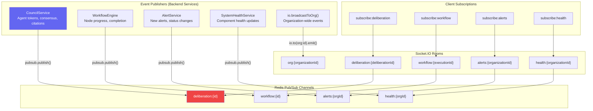
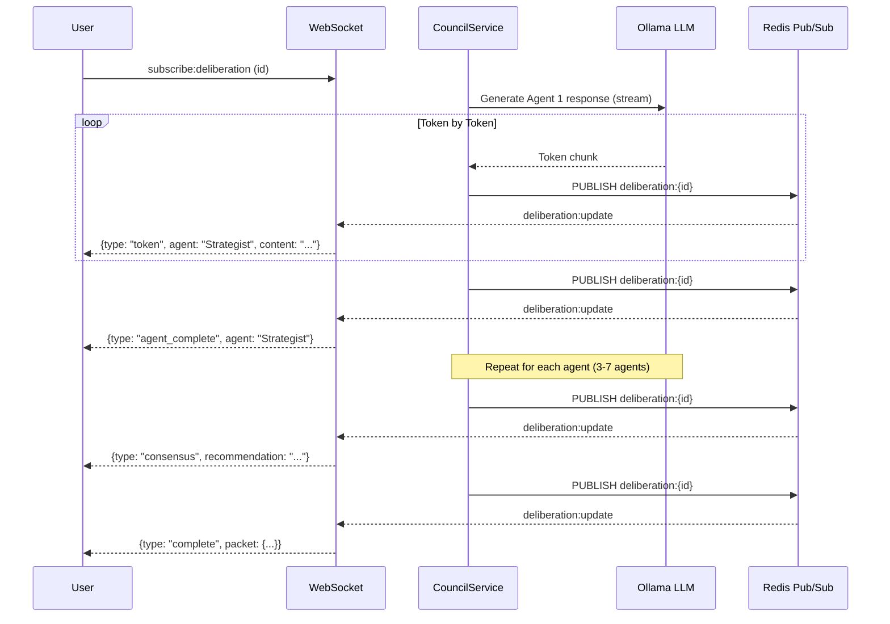
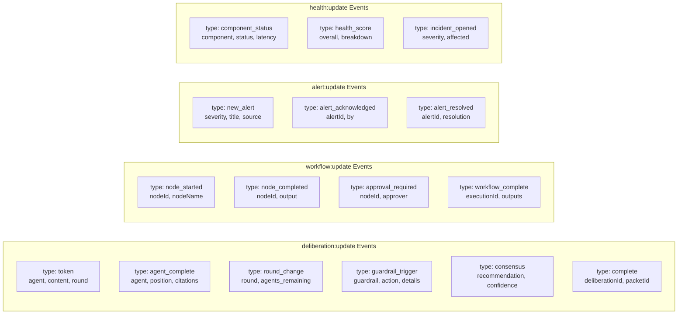
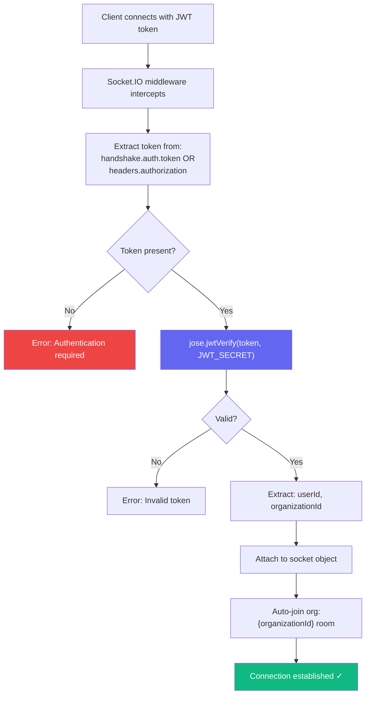
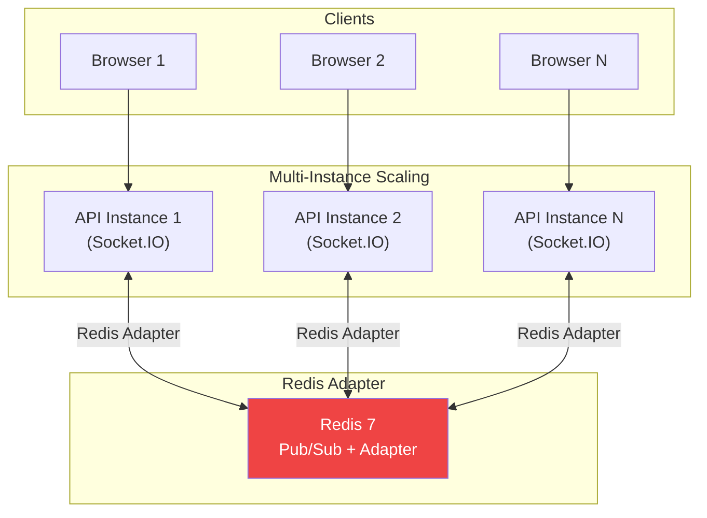

# Datacendia Platform — WebSocket & Real-time Event Flow

> **Source:** `backend/src/websocket/index.ts`, `backend/src/config/redis.ts`
> **Tech:** Socket.IO + Redis Pub/Sub adapter
> **Port:** Same as API (3001), upgraded connection

## WebSocket Connection Lifecycle

## Real-time Channel Architecture

## Council Deliberation Streaming Detail

## Event Types & Payloads

## Authentication Flow

## Scaling Architecture

## Key Code References

| Component | File | Purpose |
|-----------|------|---------|
| **WebSocket Setup** | `websocket/index.ts` | Auth middleware, room management, Redis subscriptions |
| **Redis Config** | `config/redis.ts` | `pubsub.subscribe()` / `pubsub.publish()` helpers |
| **Socket.IO Init** | `index.ts:97-105` | Server creation with CORS, ping config |
| **broadcastToOrg** | `websocket/index.ts:135` | Organization-wide broadcast utility |
