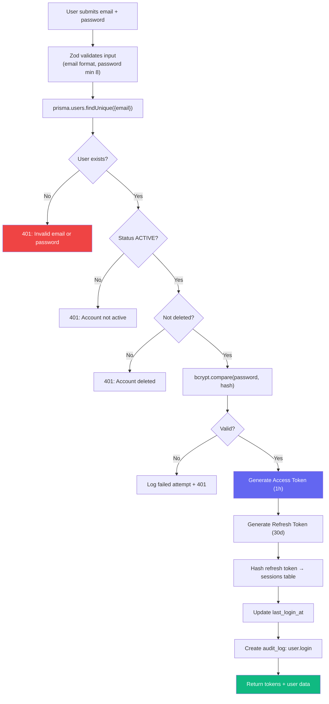
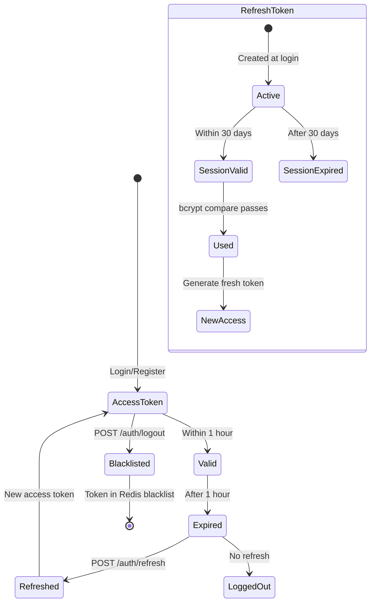
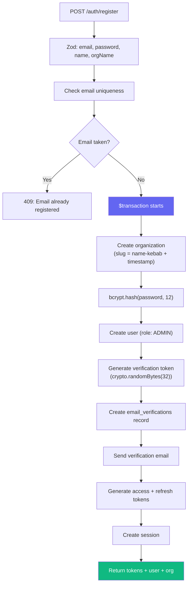
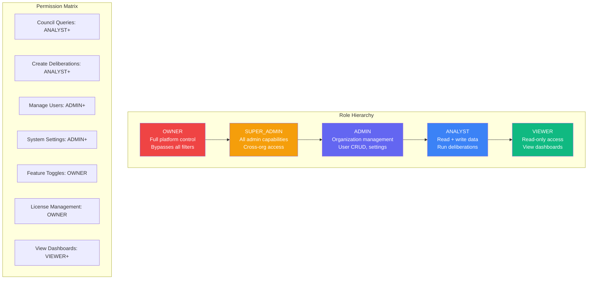
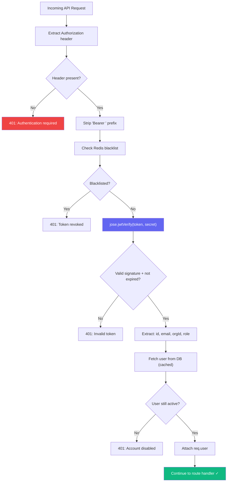
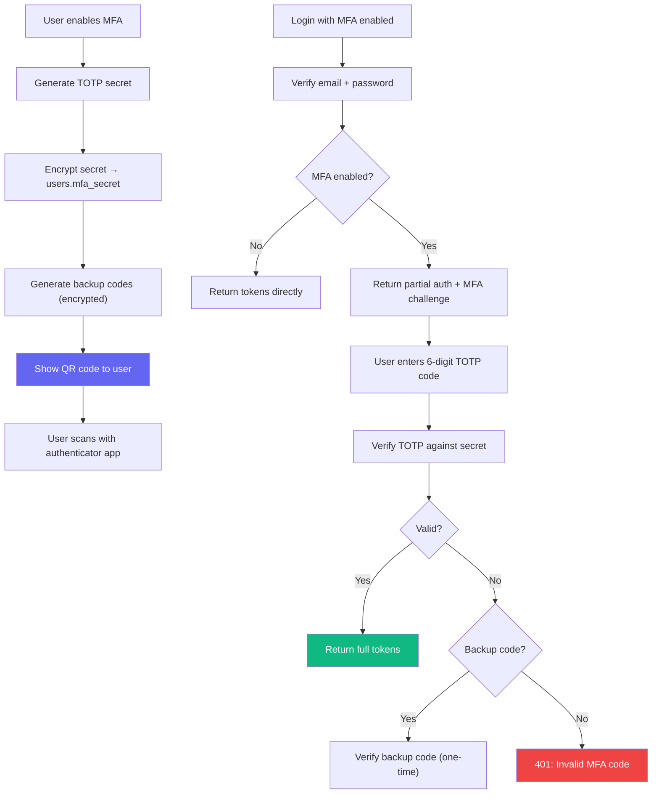
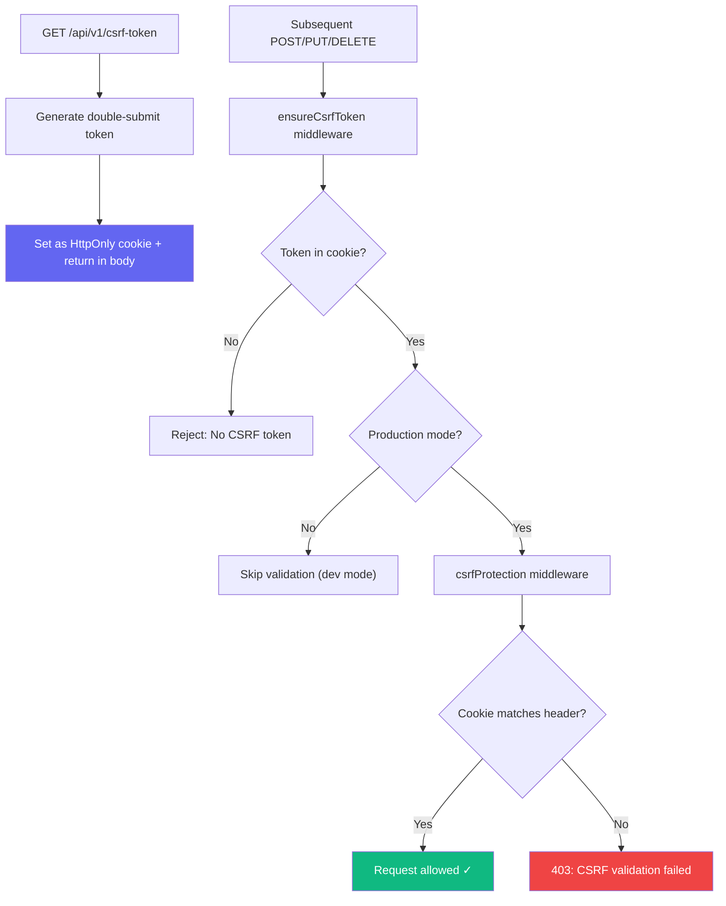
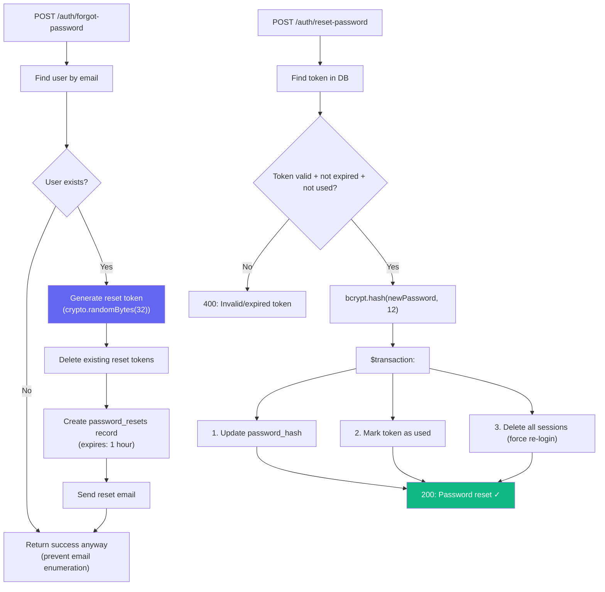

# Datacendia Platform — Authentication & Authorization Flow

> **Source:** `backend/src/middleware/auth.ts`, `backend/src/routes/auth.ts`, `backend/src/websocket/index.ts`
> **Tech:** JWT (jose), bcrypt, Redis token blacklist, Zod validation
> **Roles:** OWNER → SUPER_ADMIN → ADMIN → ANALYST → VIEWER

## Complete Authentication Pipeline

## Token Lifecycle

## Registration Flow

## Role-Based Access Control (RBAC)

## Request Authentication Middleware

## MFA (Multi-Factor Authentication) Flow

## CSRF Protection Pipeline

## Password Reset Flow

