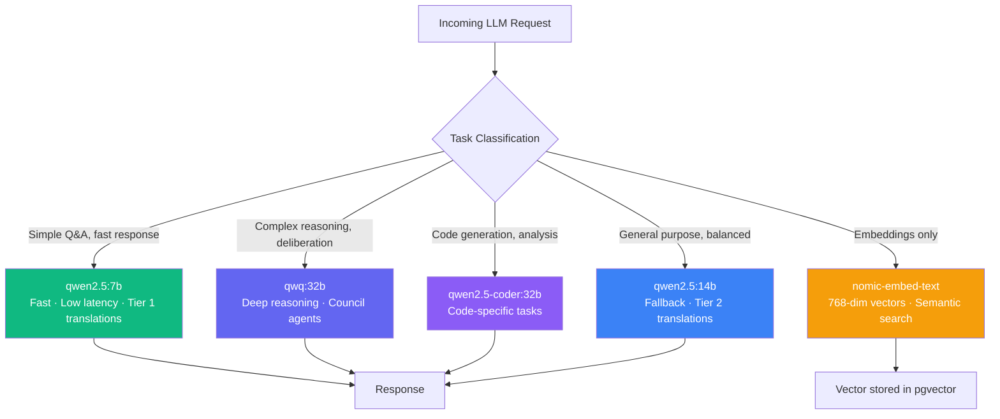
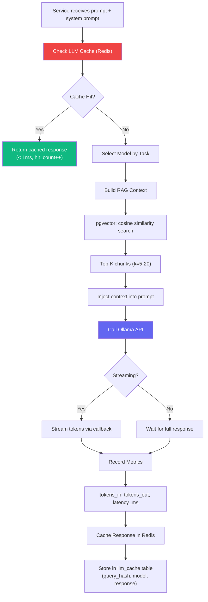
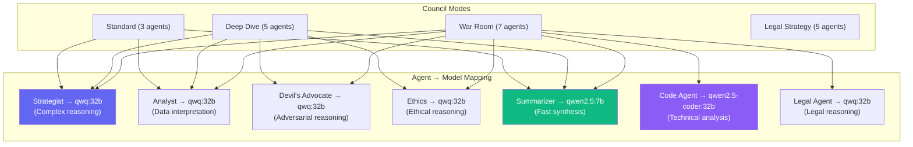
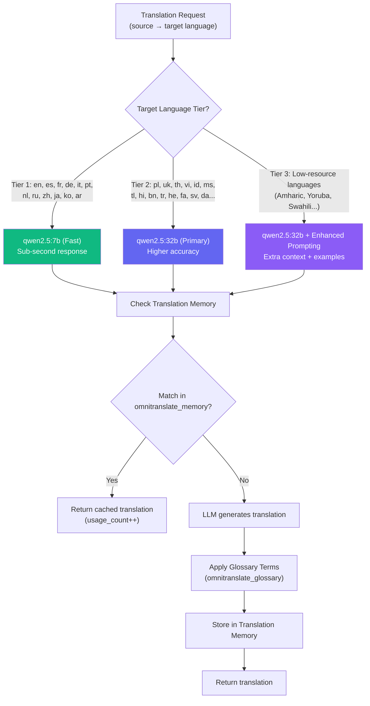
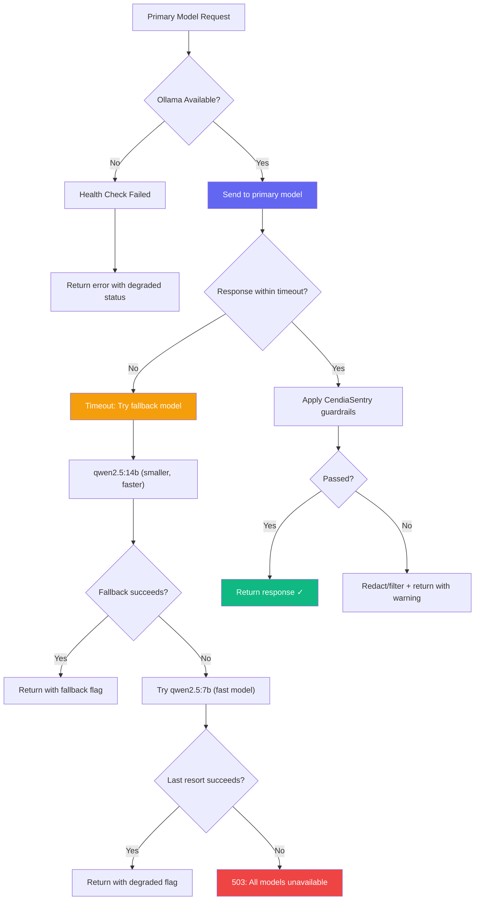
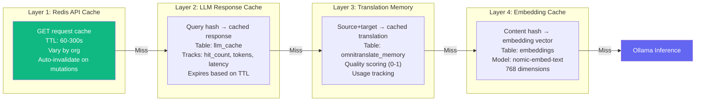

# Datacendia Platform — LLM Model Selection & Routing

> **Source:** `backend/src/services/EnhancedLLMService.ts`, `backend/src/services/CendiaOmniTranslateService.ts`
> **Endpoint:** Ollama at `http://localhost:11434`
> **Models:** 5 models with tiered routing by task complexity

## Model Inventory & Selection

## EnhancedLLMService Pipeline

## Council Agent Model Assignment

## OmniTranslate Model Tiering

## Fallback & Error Handling

## Caching Strategy

## Key Environment Variables

| Variable | Default | Purpose |
|----------|---------|---------|
| `OLLAMA_BASE_URL` | `http://localhost:11434` | Ollama API endpoint |
| `LLM_MODEL` | `qwq:32b` | Primary reasoning model |
| `LLM_FAST_MODEL` | `qwen2.5:7b` | Fast response model |
| `LLM_CODE_MODEL` | `qwen2.5-coder:32b` | Code analysis model |
| `LLM_EMBED_MODEL` | `nomic-embed-text` | Embedding model |
| `OMNITRANSLATE_MODEL` | `qwen2.5:32b` | Translation primary |
| `OMNITRANSLATE_FALLBACK_MODEL` | `qwen2.5:14b` | Translation fallback |
| `OMNITRANSLATE_FAST_MODEL` | `qwen2.5:7b` | Translation fast (Tier 1) |
