# Datacendia Platform — State Machine Diagrams

> **Purpose:** Lifecycle state transitions for key entities — deliberations, decisions, workflows, alerts, compliance, tenants, licenses, disputes, and evidence.

## Deliberation Lifecycle

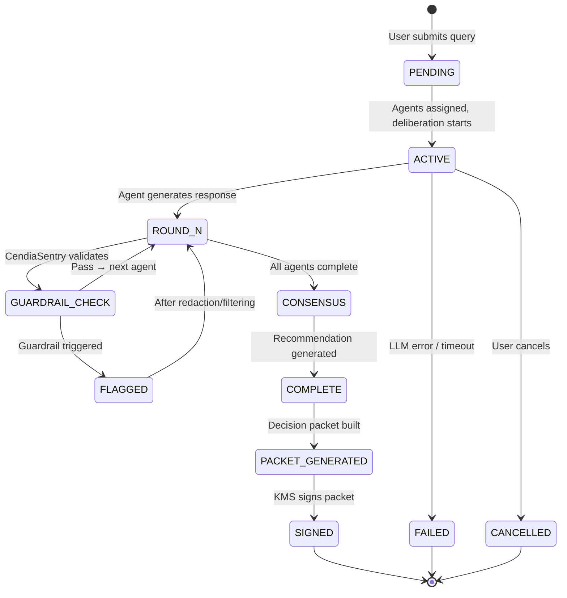

## Decision Packet Lifecycle

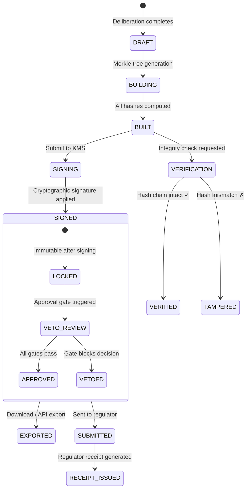

## Workflow Execution Lifecycle

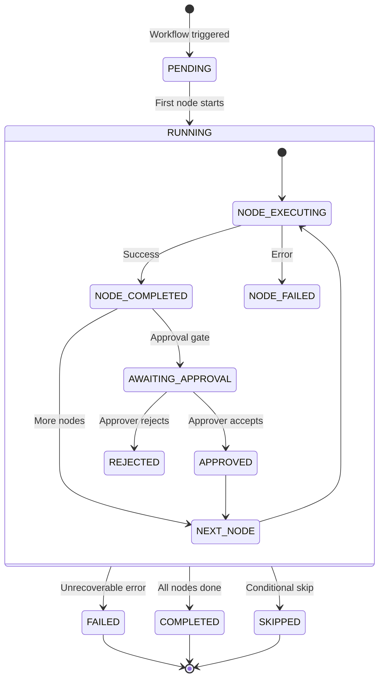

## Alert Lifecycle

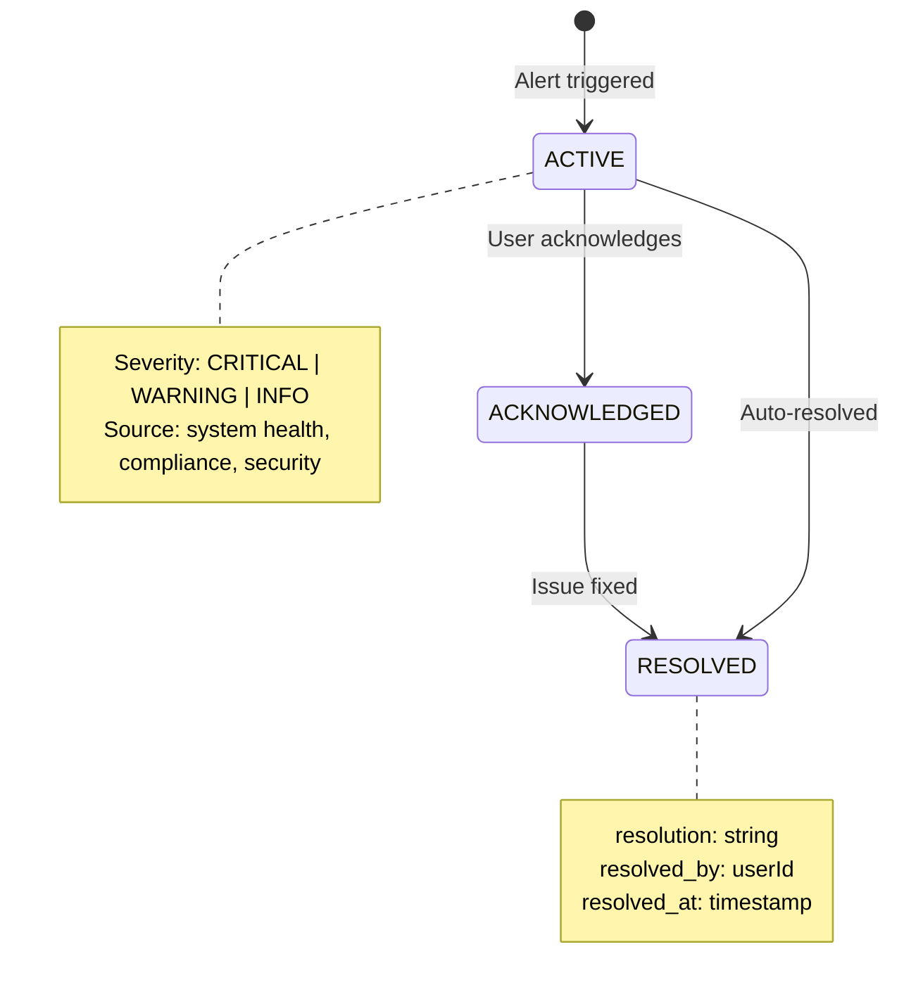

## Tenant Lifecycle

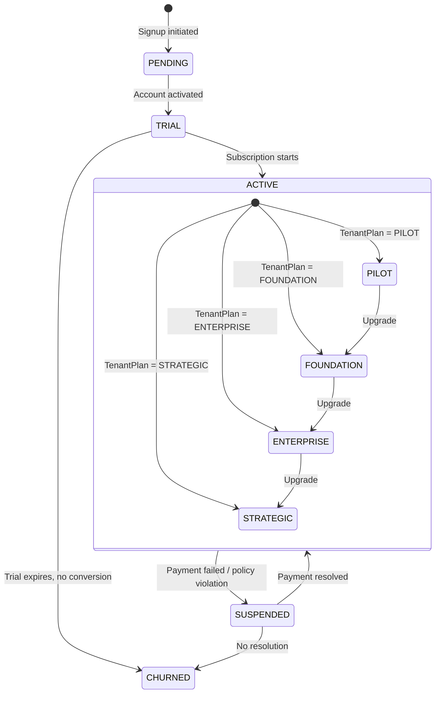

## License Lifecycle

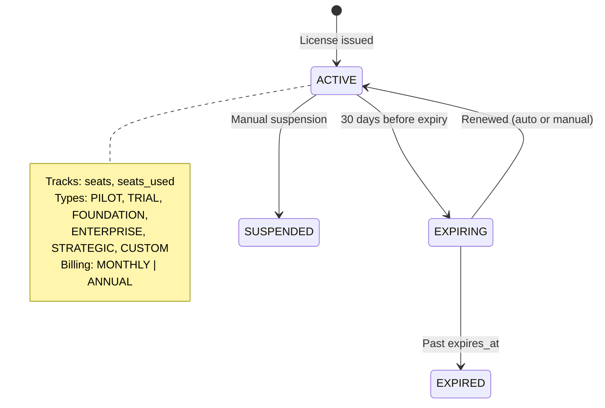

## Compliance Assessment Lifecycle

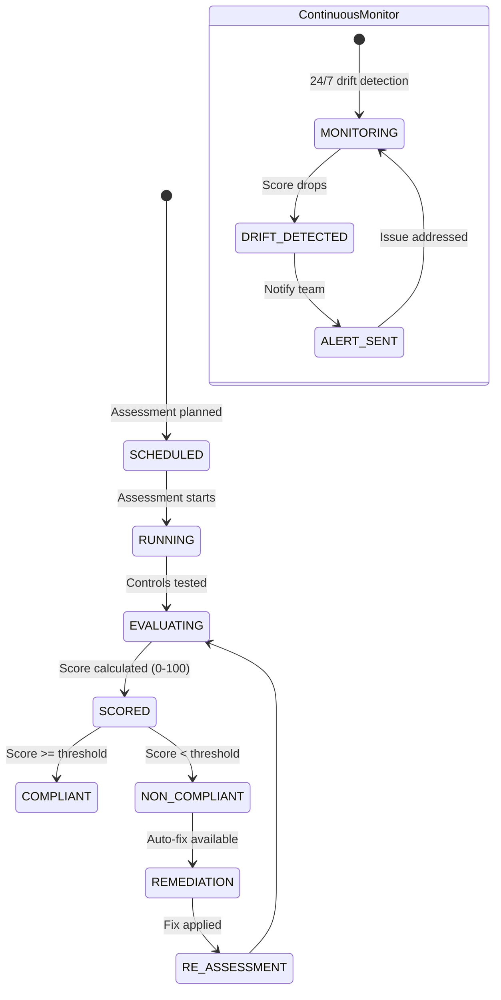

## Dissent Lifecycle

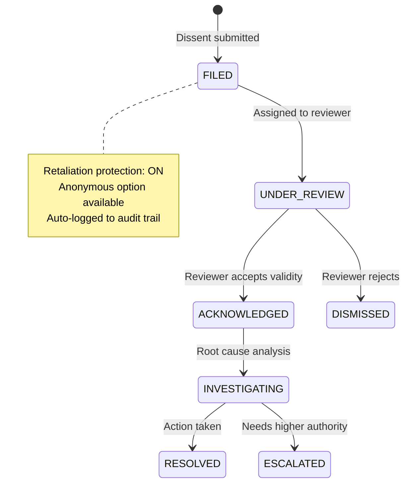

## Data Source Sync Lifecycle

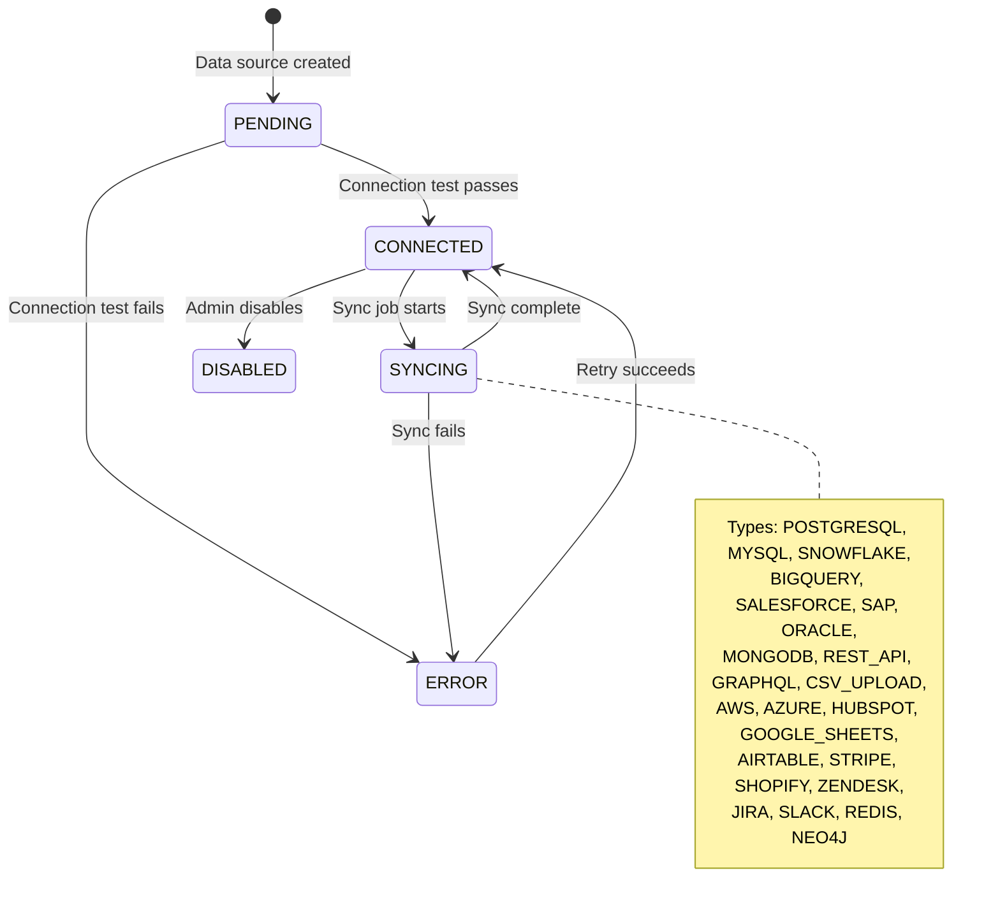

## Eternal Artifact Verification Lifecycle

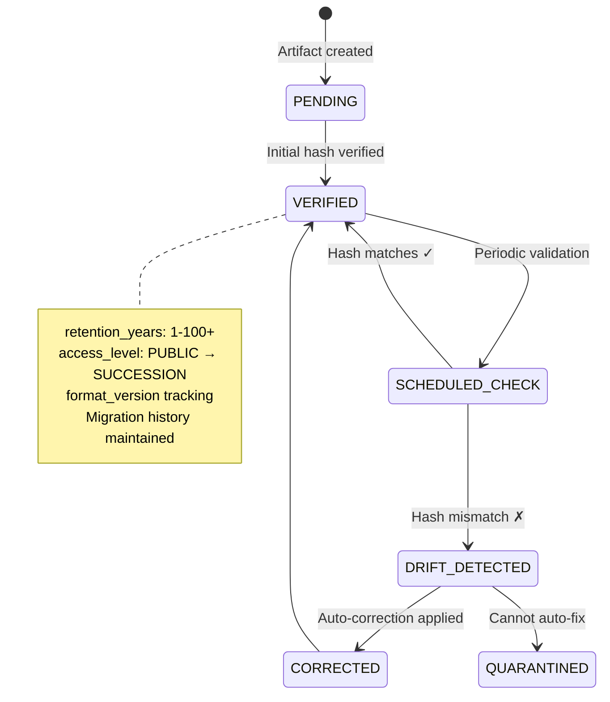

## AI Constitutional Court — Dispute Lifecycle

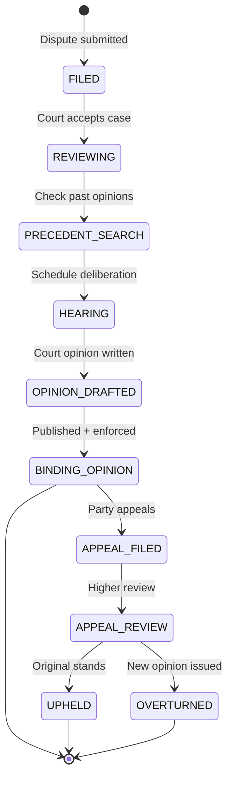

## Feature Flag Lifecycle

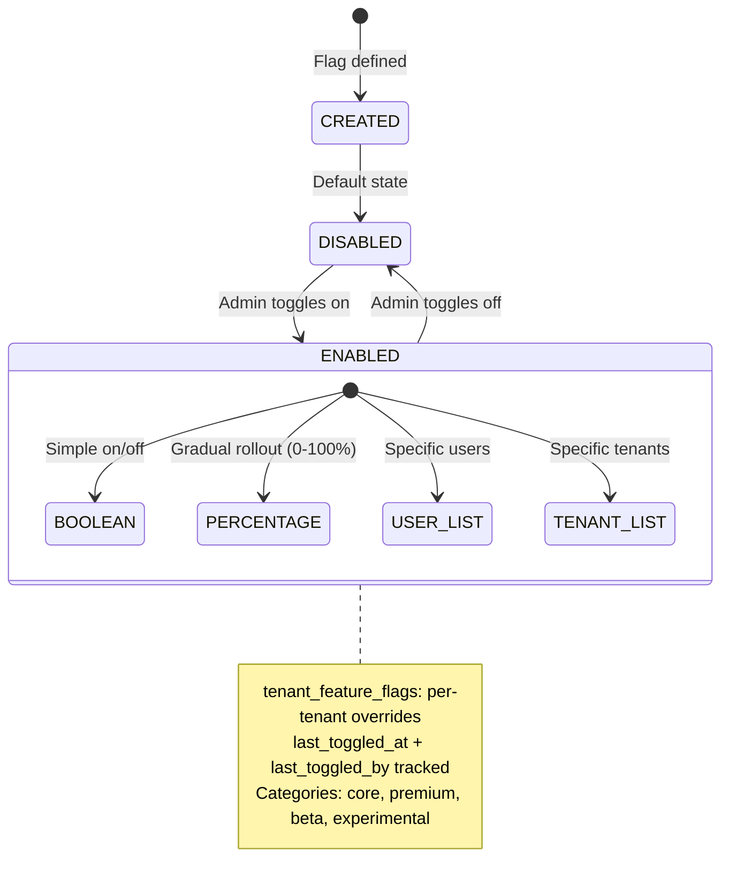
