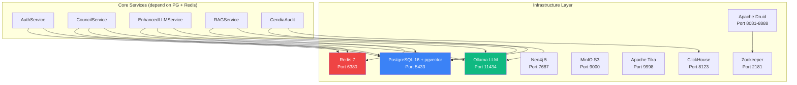
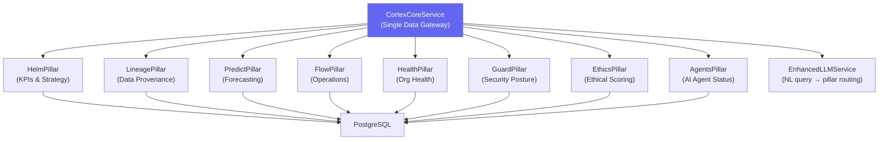
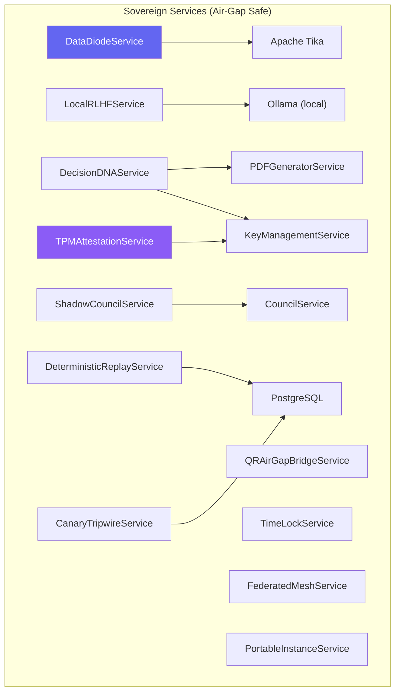
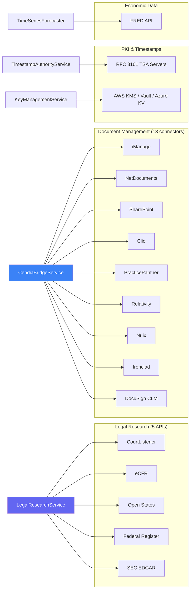
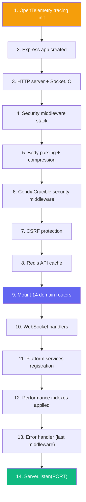

# Datacendia Platform — Service Dependency Graph

> **Purpose:** How backend services depend on each other, infrastructure, and external systems.

## Core Infrastructure Dependencies

## Service-to-Service Dependency Map

```mermaid
flowchart TD
    subgraph "Entry Points"
        API["Express API (3001)"]
        WS["Socket.IO WebSocket"]
    end

    subgraph "Council Ecosystem"
        CS["CouncilService"]
        DP["CouncilDecisionPacketService"]
        SENTRY["CendiaSentryService (8 guardrails)"]
        ECHO["EchoService (outcome tracking)"]
        DISSENT["DissentService"]
        VOX["VoxService (stakeholder voice)"]
        VETO["ApprovalGateService"]
    end

    subgraph "Intelligence Layer"
        ELLM["EnhancedLLMService"]
        RAG["RAGService"]
        GNOSIS["GnosisService (document intel)"]
        CHRONOS["ChronosAIService (timeline)"]
        HORIZON["HorizonService (multi-universe)"]
        ORBIT["OrbitService (influence graph)"]
        CASCADE["CascadeService (butterfly effect)"]
    end

    subgraph "Data Layer"
        CORTEX["CortexCoreService (gateway)"]
        PILLARS["8 Pillar Services"]
        LINEAGE["LineageService"]
        FORECAST["TimeSeriesForecaster"]
    end

    subgraph "Security Layer"
        KMS["KeyManagementService"]
        CRUCIBLE["CrucibleService"]
        AEGIS["AegisService"]
        PQ["PostQuantumService"]
    end

    subgraph "Evidence Layer"
        VAULT["EvidenceVaultService"]
        SIGNED["SignedTestReportService"]
        PDF["PDFGeneratorService"]
        RECEIPT["RegulatorsReceiptService"]
    end

    subgraph "Compliance Layer"
        COMPLY["ComplianceService"]
        MONITOR["ContinuousComplianceMonitor"]
        CROSS["CrossJurisdictionEngine"]
        PANOP["PanopticonService"]
    end

    subgraph "Governance Simulation"
        COLLAPSE["CollapseOrchestrator"]
        SCGE["SCGEOrchestrator"]
        SGAS["SGASOrchestrator"]
        COURT["AIConstitutionalCourt"]
    end

    %% Entry point flows
    API --> CS & CORTEX & COMPLY & VAULT
    WS --> CS

    %% Council dependencies
    CS --> ELLM & SENTRY & RAG
    CS --> DP
    CS --> ECHO & VOX
    DP --> KMS & VAULT

    %% Intelligence dependencies
    ELLM --> RAG
    HORIZON --> ORBIT
    CASCADE --> ORBIT
    CHRONOS --> ELLM
    GNOSIS --> ELLM & RAG

    %% Data dependencies
    CORTEX --> PILLARS
    FORECAST --> ELLM

    %% Evidence dependencies
    SIGNED --> PDF & KMS
    VAULT --> KMS
    RECEIPT --> VAULT & KMS

    %% Compliance dependencies
    MONITOR --> COMPLY
    CROSS --> COMPLY & PANOP
    COMPLY --> ELLM

    %% Governance dependencies
    COLLAPSE --> ELLM & SENTRY
    SCGE --> ELLM
    SGAS --> ELLM
    COURT --> ELLM

    %% Security dependencies
    CRUCIBLE --> ELLM
    AEGIS --> ELLM

    style CS fill:#6366f1,color:#fff
    style ELLM fill:#10b981,color:#fff
    style KMS fill:#8b5cf6,color:#fff
    style CORTEX fill:#3b82f6,color:#fff
```

## Pillar Service Dependencies

## Sovereign Service Dependencies

## External System Dependencies

## Startup Initialization Order

