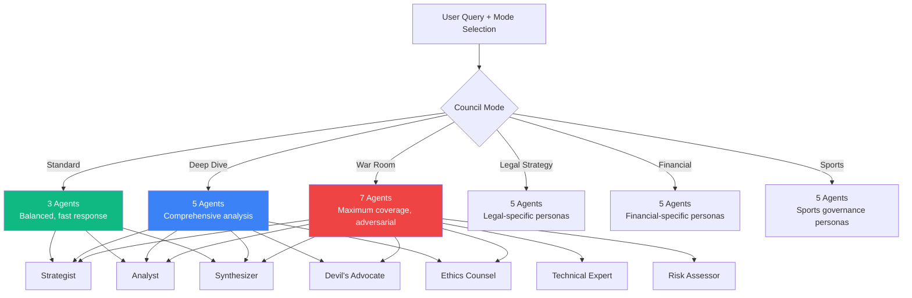
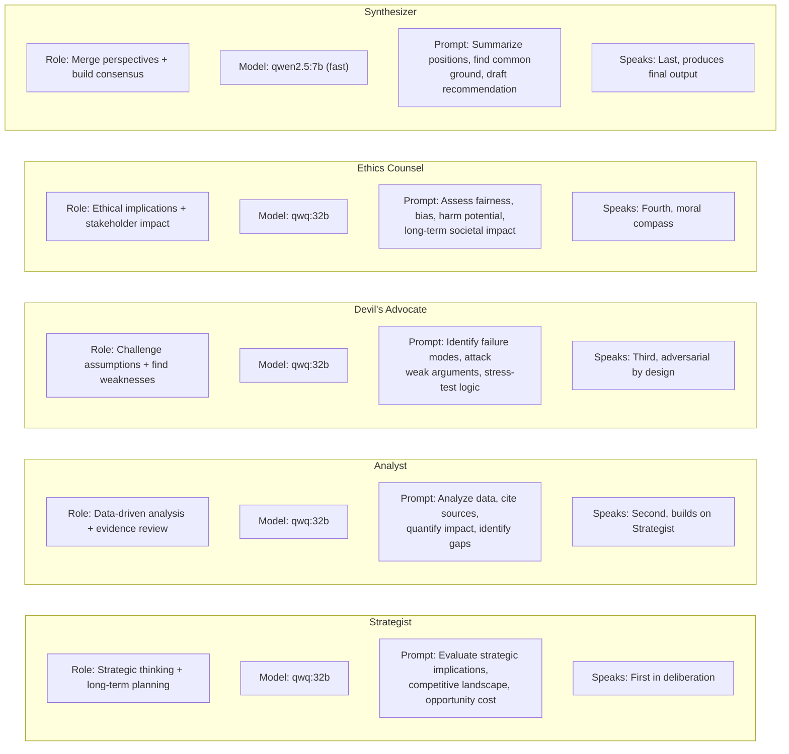
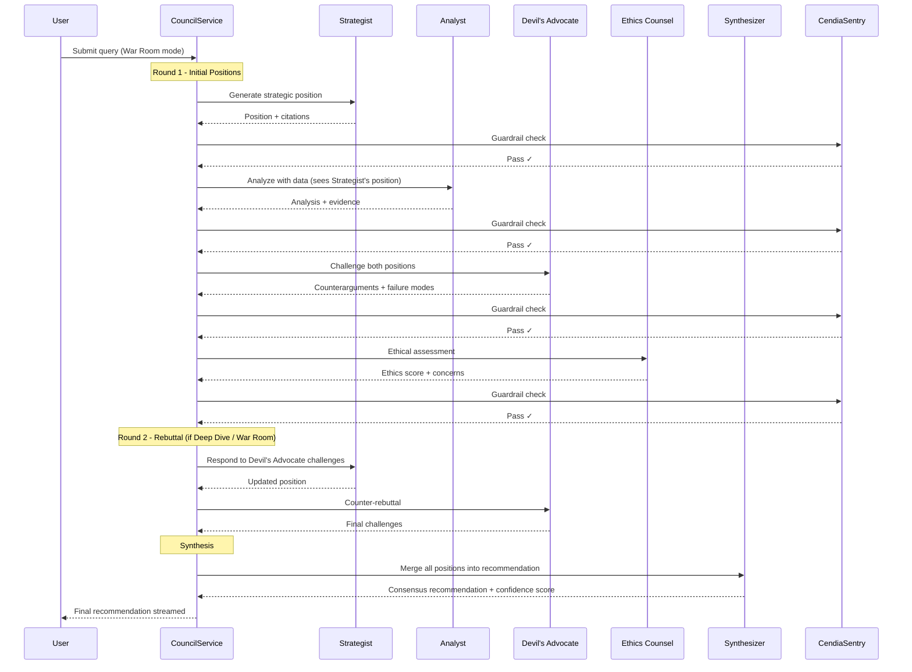
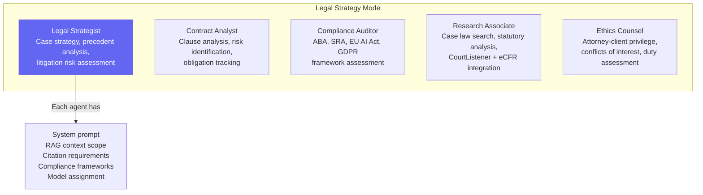
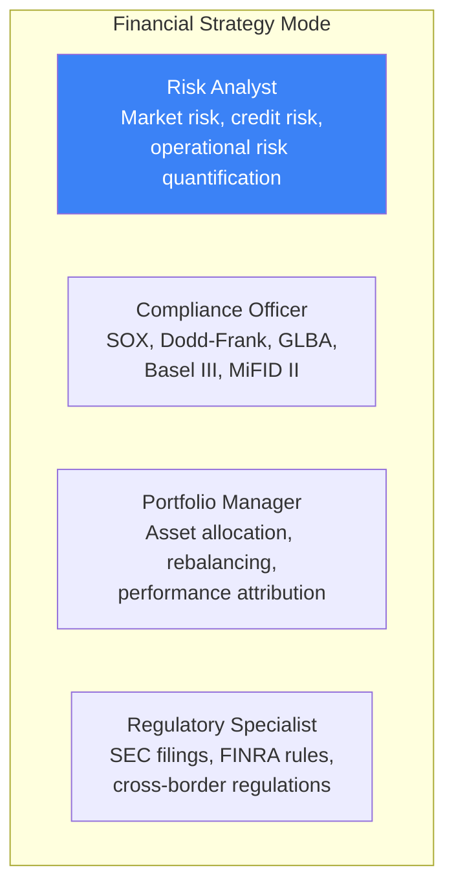
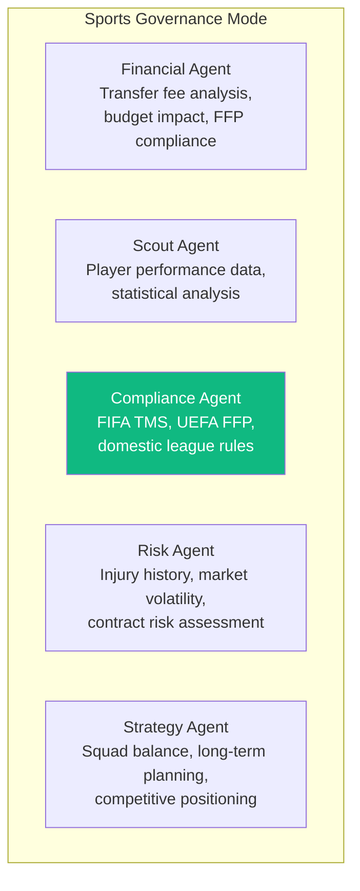
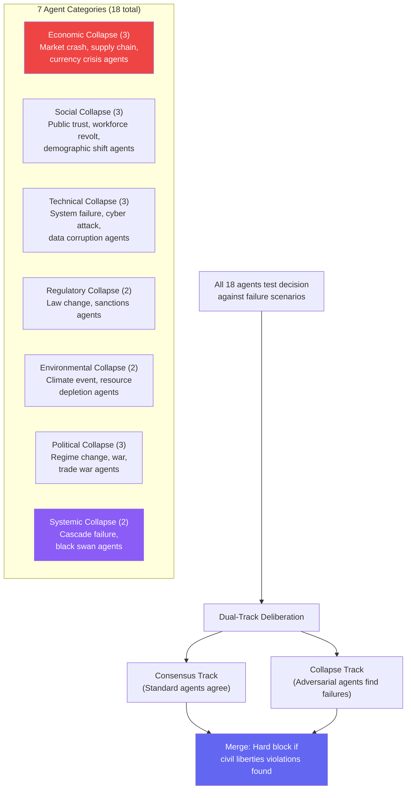
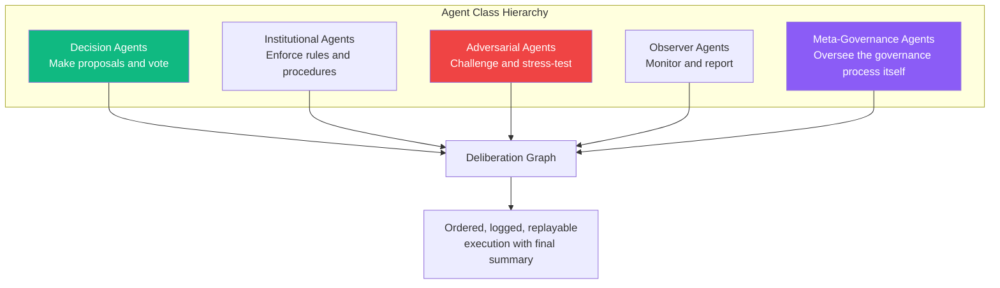
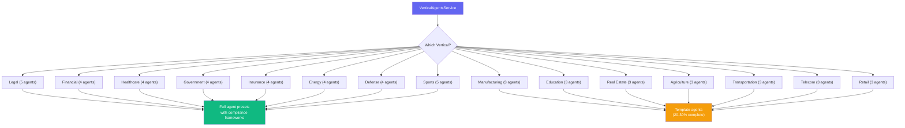
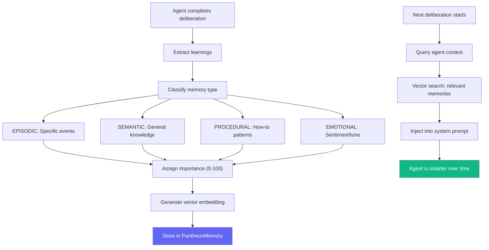

# Datacendia Platform — Agent Personas & Council Composition

> **Source:** `backend/src/services/council/`, `backend/src/services/VerticalAgentsService.ts`
> **Purpose:** How AI agents are configured, assigned to council modes, and how deliberation composition works.

## Council Mode Composition

## Core Agent Personas

## Agent Deliberation Flow

## Legal Vertical Agent Presets

## Financial Vertical Agent Presets

## Sports Vertical Agent Presets

## Collapse Orchestrator — 18 Adversarial Agents

## SGAS — 5 Agent Classes

## Vertical Agent Service — Universal Agent Factory

## Agent Memory (PantheonMemoryService)

