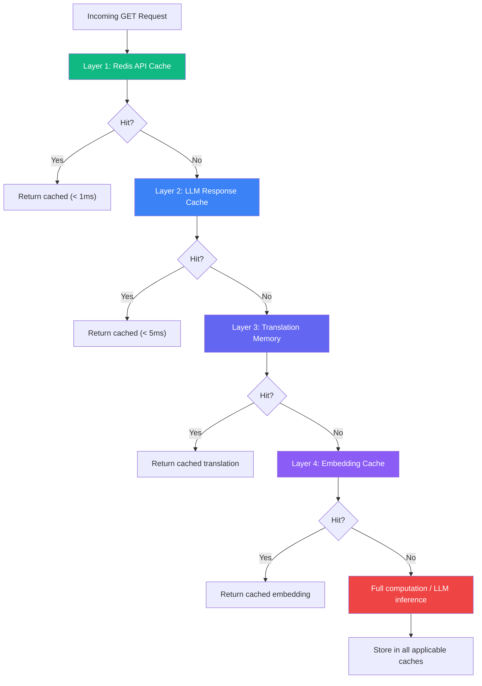
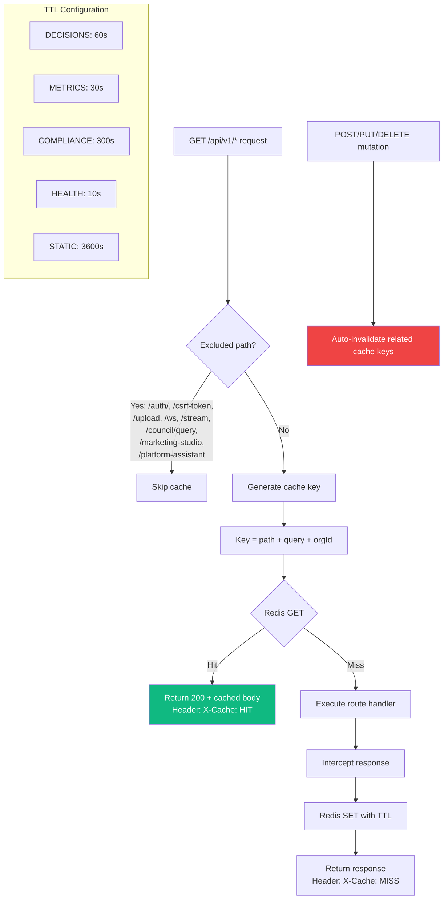
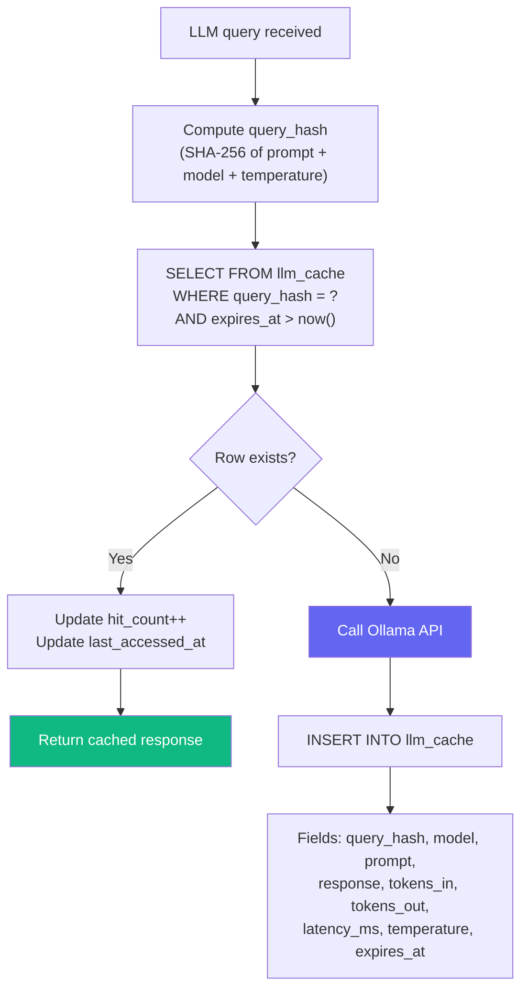
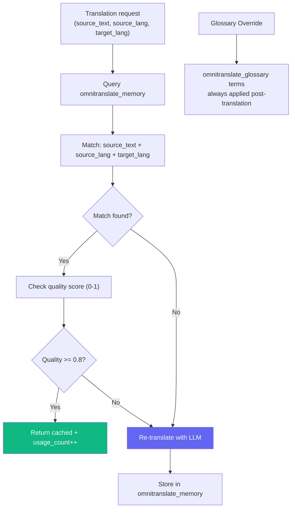
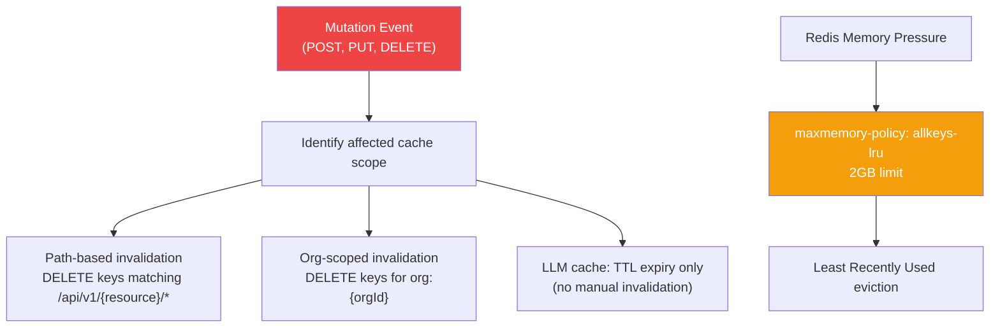
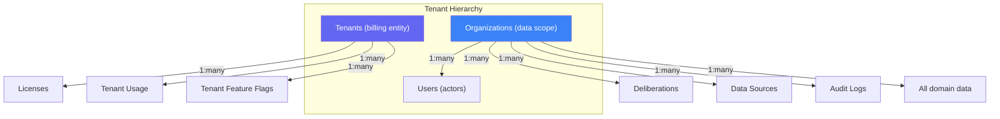
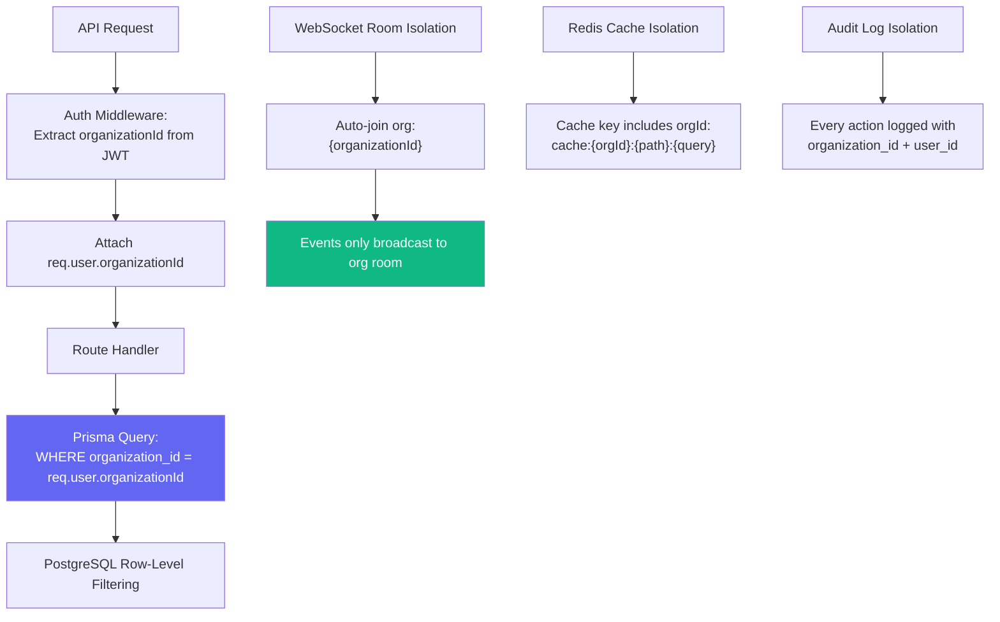
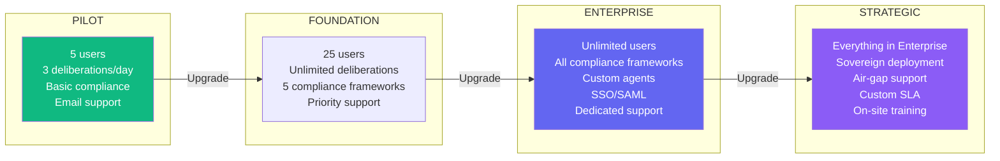
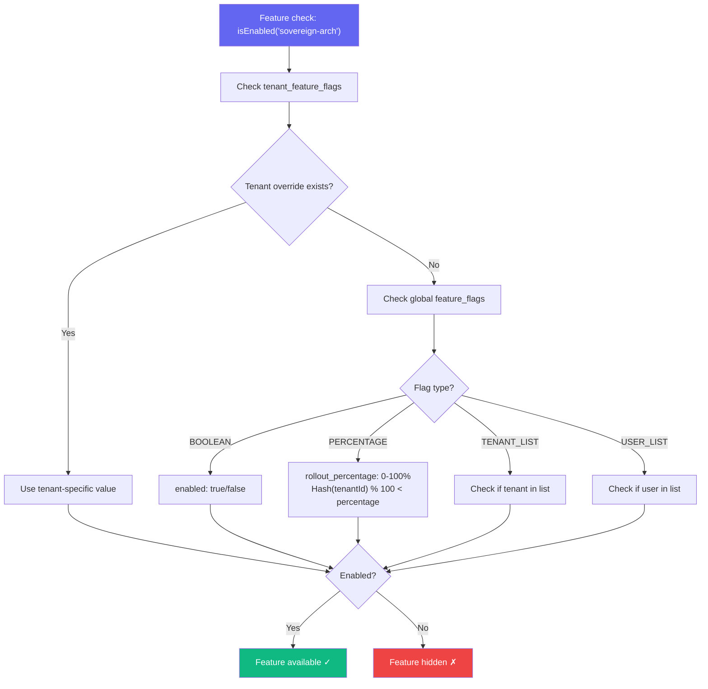
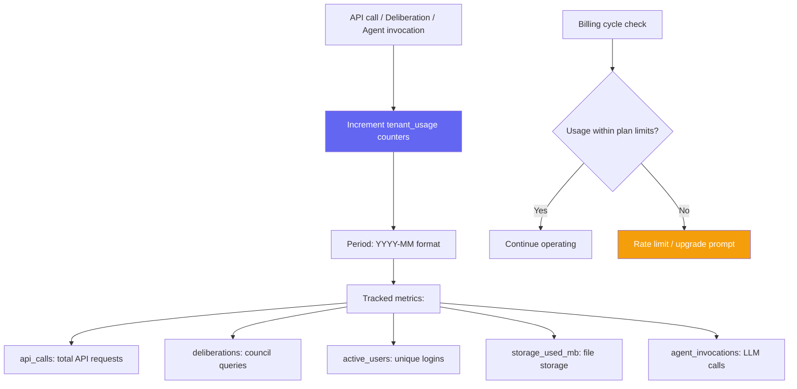

# Datacendia Platform — Caching Strategy & Multi-Tenancy Isolation

> **Source:** `backend/src/middleware/cacheMiddleware.ts`, `backend/src/config/redis.ts`, `backend/src/services/EnhancedLLMService.ts`

## 4-Layer Caching Architecture

## Layer 1: Redis API Cache (Universal)

## Layer 2: LLM Response Cache

## Layer 3: Translation Memory (OmniTranslate)

## Cache Invalidation Strategy

---

## Multi-Tenancy & Organization Isolation

## Data Isolation Architecture

## Tenant Plan Feature Matrix

## Feature Flag Isolation per Tenant

## Usage Metering per Tenant

