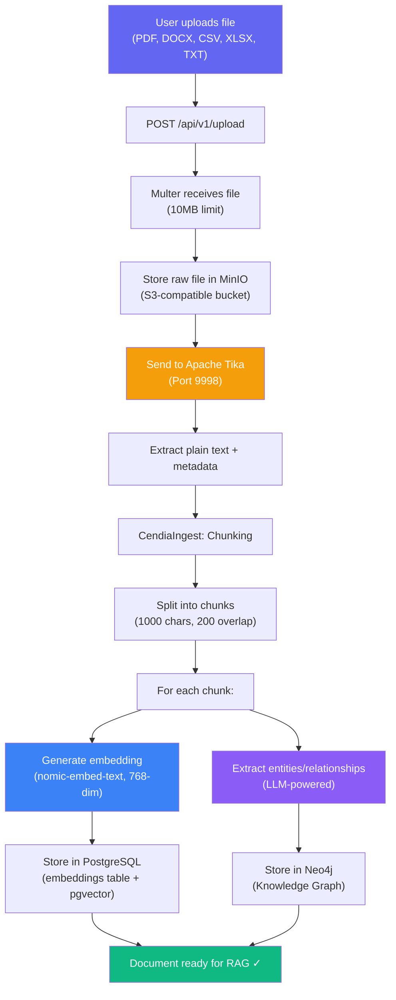
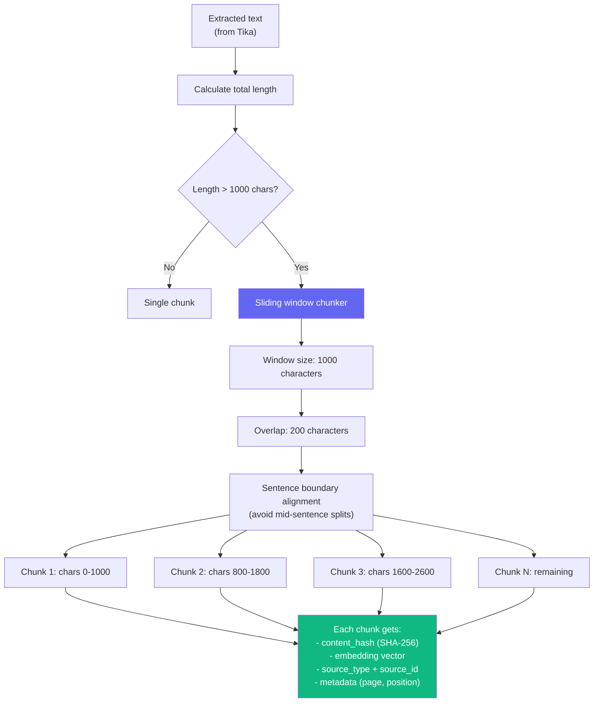
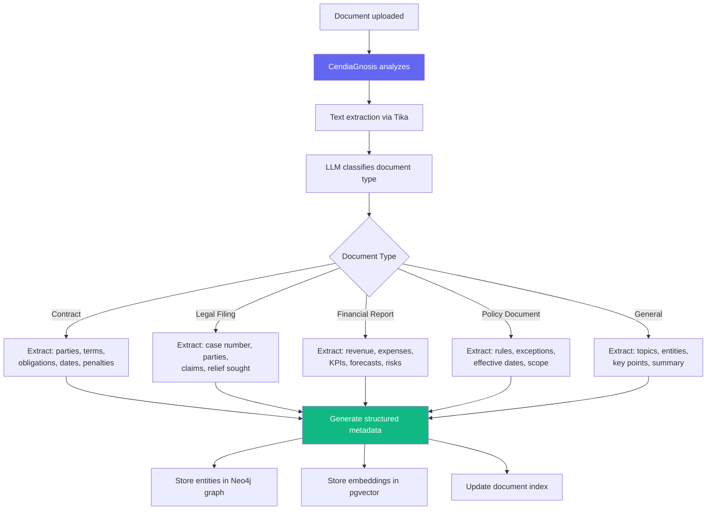
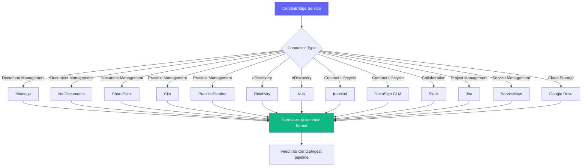
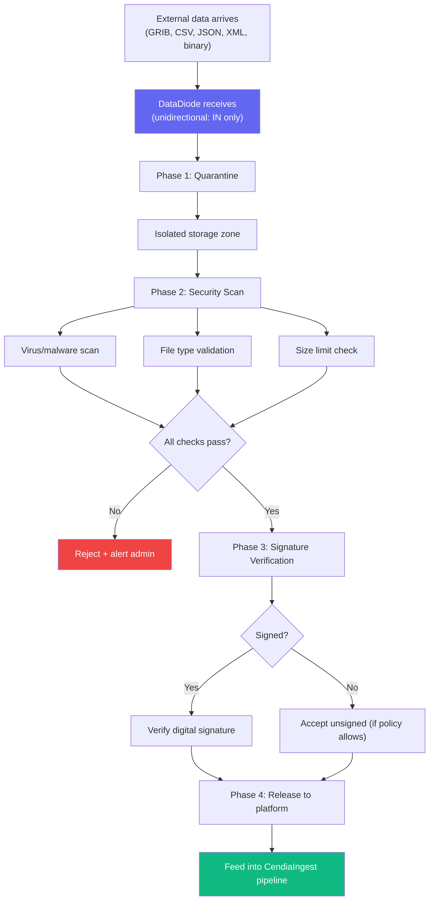
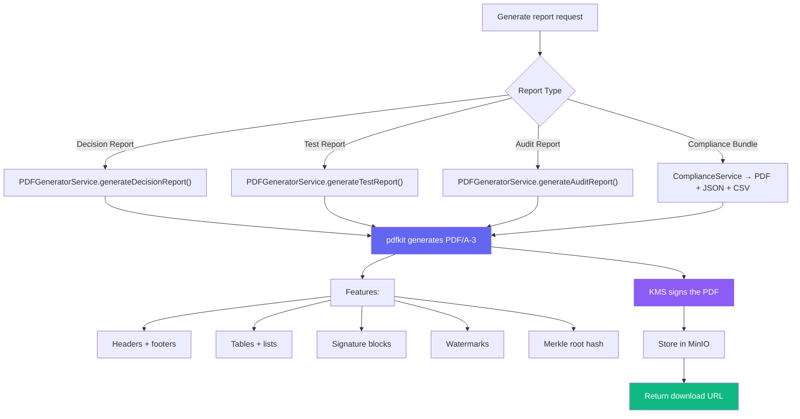
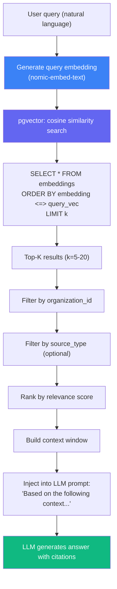
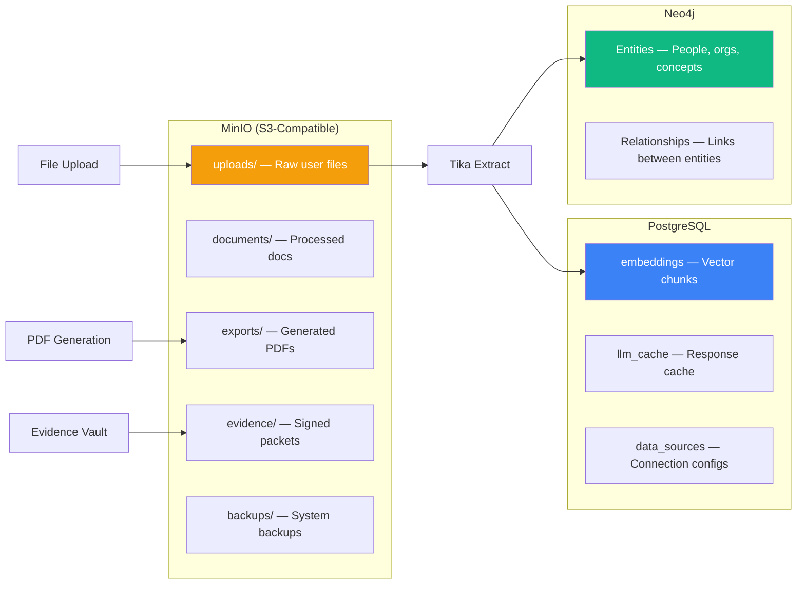

# Datacendia Platform — File Upload & Document Processing Pipeline

> **Source:** `backend/src/services/CendiaIngestService.ts`, `backend/src/services/CendiaGnosisService.ts`, `backend/src/services/document/PDFGeneratorService.ts`
> **Tech:** Apache Tika (text extraction), pgvector (embeddings), MinIO (file storage), Ollama (entity extraction)

## End-to-End Document Processing

## Chunking Strategy

## CendiaGnosis — Document Intelligence

## CendiaBridge — 13 DMS Connectors

## DataDiode — Sovereign Document Ingest

## PDF Generation — Output Pipeline

## RAG Query Pipeline (Retrieval)

## File Storage Architecture

